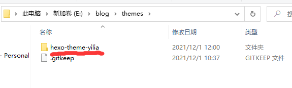

# 修改hexo博客的主题

第一步、GitHub上找到心仪的主题并克隆到博客目录下的`themes`文件夹下

第二步、修改hexo目录中的`_config.yml`

将`theme:`修改为刚刚下载在themes文件夹中主题的文件夹名字

所以修改为：`theme: hexo-theme-yilia`

第三步、执行`hexo clean`清除下缓存

执行`hexo g`重新生成一下

执行`hexo s`重启一下

执行`hexo d`推送到远端GitHub上

最后：如果推送给成功了就可以打开自己的小博客了

