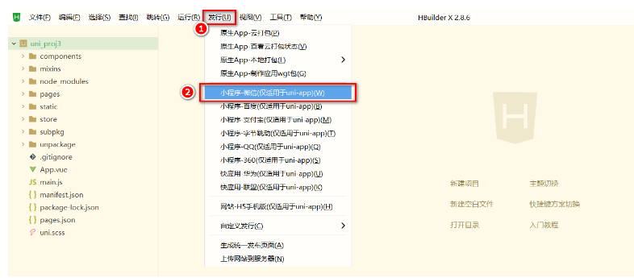
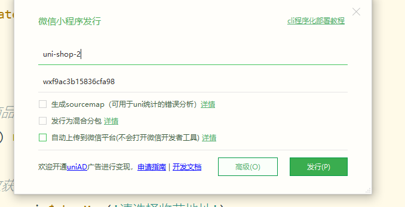
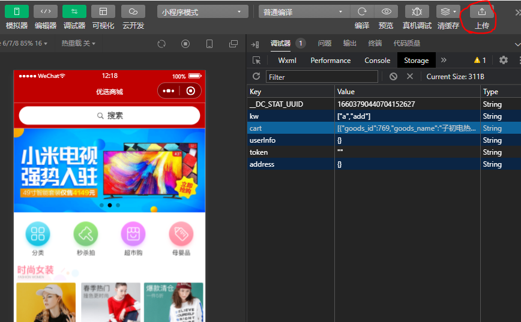
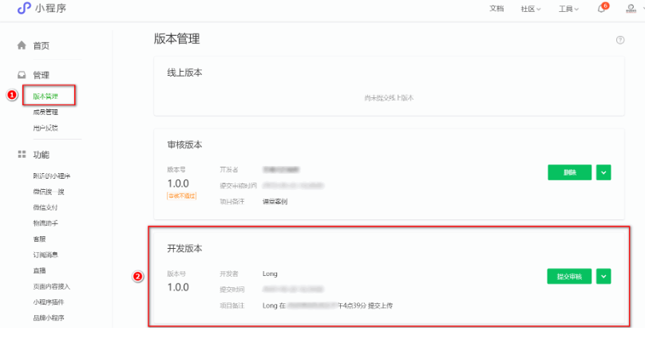
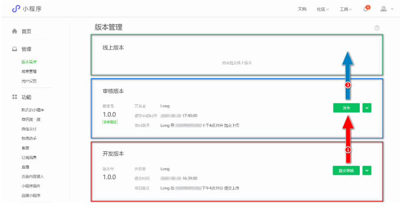

# 小程序发布流程

第一步：

点击HBuilderX菜单栏上的**发行** ->**小程序-微信(仅适于uni-app)**

第二步：

在弹出框中填写小程序名称，和小程序ID（小程序ID可以去小程序官网去看）

并点击发行

第三步：

等运行结束，会自动打开微信开发者工具界面。

点击**上传**按钮，点击确定。

第四步：

再到弹出框中填写内容，点击上传。

第五步：

看到上传代码成功的提示后，登录小程序官方管理后台。点击管理—>版本管理。

可以看到刚刚上传的**开发版本的小程序**

第六步：

点击提交审核，将开发版本转换为审核版本，如果审核成功了，然后再点击发布即可。

