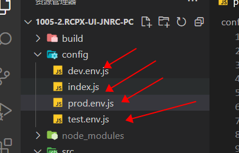

# 01-cross-env插件

该插件可以分开管理各个环节的**对应变量**，例如接口请求名称


>提示：
>
>该插件比较老了，一般都是配合vue-cli@2.0版本使用的，以下也是讲解的2.0版本的使用方法


## 安装

cmd运行：

```
npm install --save-dev cross-env
```


## 使用及配置相关

### 1. 修改package.json文件，自定义打包命令


示例：

```js
"scripts": {
  "dev": "webpack-dev-server --inline --progress --config build/webpack.dev.conf.js",
  "start": "npm run dev",
  "build": "cross-env NODE_ENV=testing env_config=test node build/build.js",
  "build:test": "cross-env NODE_ENV=testing env_config=test node build/build.js",
  "build:prod": "cross-env NODE_ENV=production env_config=prod node build/build.js"
},

// 主要看build，build是我们需要自定义的，运行时，根据不同环节进行运行
// 示例：npm run build--prod 打包生成环境
// 上面关键有两个 1.NODE_ENV=testing 2.env_config=test
// 这两个都是到时候在配置文件中配置的名称
```


### 2. 修改config文件夹，添加对应配置

一：一般我们会创建下面几个文件，对应不同环境上的内容，具体含义名字上有体现：




`prod.env.js`:（生产环境相关变量）

```js
'use strict';
module.exports = {
  NODE_ENV: '"production"', // 对应生成
  ENV_CONFIG: '"prod"', // 名称
  BASE_URL: '"https://nbjn.rcpx.net"', // prod
  TRANSIT_URL: '"https://transit.xlylai.com"',  // 中转服务接口
  CER_URL: '"https://nbjn.rcpx.net/sign/#/pages/certificate/index"',  // 学时证明地址
  FACE_URL: '"https://nbjn.rcpx.net/sign/#/pages/face/index"',  // 人脸验证地址
  UPLOAD_URL: '"https://nbjn.rcpx.net"'   // 上传接口
};
```

>tips：
>
>NODE_ENV，ENV_CONFIG就是对应在package.json文件中命令对应的那两项内容


`test.env.js`：

```js
'use strict'
module.exports = {
  NODE_ENV: '"testing"',
  ENV_CONFIG: '"test"', // 新增
  BASE_URL: '"http://server.xlylai.com:19087"', // prod
  TRANSIT_URL: '"http://server.xlylai.com:19087"',  // 中转服务接口
  CER_URL: '"http://server.xlylai.com:19087/sign/#/pages/certificate/index"',  // 学时证明地址
  FACE_URL: '"http://server.xlylai.com:19087/sign/#/pages/face/index"',  // 人脸验证地址
  UPLOAD_URL: '"http://server.xlylai.com:19087"'   // 上传接口
}

```


`dev.env.js`：

```js
'use strict'
const merge = require('webpack-merge')
const prodEnv = require('./prod.env')

module.exports = merge(prodEnv, {
  NODE_ENV: '"development"',
  OPEN_PROXY: true,
  BASE_URL: '"http://server.xlylai.com:19087"', // 新增 DEV
  TRANSIT_URL: '"http://server.xlylai.com:19087"',  // 中转服务接口
  CER_URL: '"http://server.xlylai.com:19087/sign/#/pages/certificate/index"',  // 学时证明地址
  FACE_URL: '"http://server.xlylai.com:19087/sign/#/pages/face/index"',  // 人脸验证地址
  UPLOAD_URL: '"http://server.xlylai.com:19087"'   // 上传接口
})

```


二：**要在index.js中的build模块下添加下面内容**

```
prodEnv: require('./prod.env'), //新增
testEnv: require('./test.env'),//新增
```


### 3. 修改build文件夹内相关内容

一：打开build/webpack.prod.conf.js文件，添加下面内容

```js
// const env = require('../config/prod.env')
const env = config.build[process.env.env_config + 'Env'] // 新增
```


二：在build/build.js文件中添加下面内容

```js
const spinner = ora('building for' + process.env.NODE_ENV + 'of' + process.env.env_config + 'mode...') // 新增
spinner.start()
```


### 4.使用

此时，在整体环境中，就可以通过`process.env.变量名来`获取指定内容

运行不同的build时，就会加载不同的`env.xx.js`文件，从而获取到文件中对应的变量


例如：我们可以在`axios`中通过不同打包方式，获取到不同的请求url：

```js
axios.defaults.baseURL = process.env.OPEN_PROXY ? '/proxyApi' : process.env.BASE_URL
// 我们这里写/proxyApi是配置了代理，用来跨域的
```

