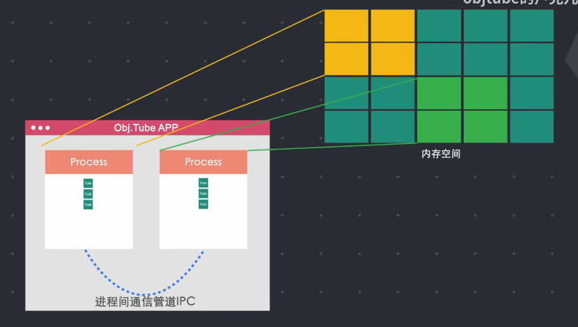
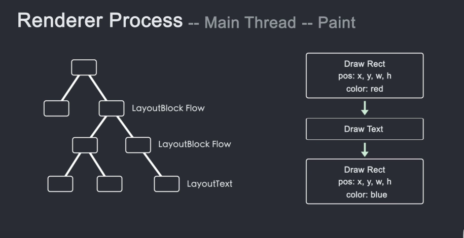

# 浏览器的工作流程

b站视频：https://www.bilibili.com/video/BV1x54y1B7RE

## 浏览器中的进程与线程

进程：一个应用程序可以有多个进程，多个进程之间通过ipc来进行通讯

线程：一个进程又能分解成多个线程，这多个线程之间可以直接进行通信。

## 浏览器中的进程

## 浏览器的工作流程

1）首先通过html生成dom树

2）然后进行样式计算解析style

3）然后需要知道每个节点的位置、大小信息，计算固定坐标，计算每个节点需要占用的区域等进行layout布局，然后主线程通过遍历dom和计算好的css一起生成一个layout树（layout树上的每个节点都是计算过的位置大小等信息）

4）之后主线程遍历layout树生成一个记录绘制表（这个表记录了渲染的顺序）这个阶段是paint

5）然后主线程遍历绘制表和layout树生成一个layer树，然后主线程将这些信息传递给合成器线程，然后合成器线程将这些信息栅格化

6）合成器将栅格化信息分散给每个栅格线程，栅格线程将这些信息传送给GPU存储处理，返回DrawQuads(图块信息)

7）合成器线程通过返回的这些DrawQuads生成一个合成器帧(frame)通过`ipc`管道发送给浏览器进程

8）浏览器进程再将合成器帧传送给GPU进行渲染，渲染到页面上，这样一整套流程就走完啦

9）每次滚动一下，就会重新走7，8这两步，就是生成一个新的合成器帧，然后渲染等等...

## 重排和重绘

**重排**：当修改元素大小，位置信息等，会影响到整个布局，会重新进行样式计算(style)，布局(layout)，绘制(paint)等这就是重排。

**重绘**：当修改元素颜色等不会影响布局的样式时，会触发样式计算(style)和绘制(paint)这个就是重绘

关键就是：重排和重绘都是会占用主线程的，还有一个东西JavaScript也是在主线程上，那么就会有一个问题产生（会抢占执行时间）

## 动画卡顿问题

如果反复重排和重绘就会使动画掉帧。

动画是一帧一帧进行渲染的，如果在渲染动画帧有空余时间，就会将空余时间交给JavaScript进行运行，但是在再动画下一帧开始渲染时，JavaScript并没有归还主线程(种种原因)，就会即将渲染的帧没有及时渲染，就会造成卡顿问题。

### 动画卡顿的解决办法

#### 方法一： requestAnimationFrame()这个API

这个api会在每一帧调用，会将JavaScript分成多个小块，在每一帧结束时就暂停JavaScript的执行归还主线程，这样就不会有卡顿问题了

#### 方法二：就是利用css中Transform

css中Transform并不会经过重绘和重排，也就是不会占用主线程（并不是在主线程中运行），这样就不会产生所谓的抢占时间而产生的画面卡顿啦

## 第一步Dom树的生成

## 第二步样式的计算和解析style

## 第三步通过dom和style生成layout位置信息

## 第四步：生成绘制表paint阶段

## 第五步综合位置信息，style等生成layer树

## 第六步合成器线程切割图块tiles

## 第七步栅格线程栅格化Raster和返回DrawQuads图块信息

## 第八步渲染

