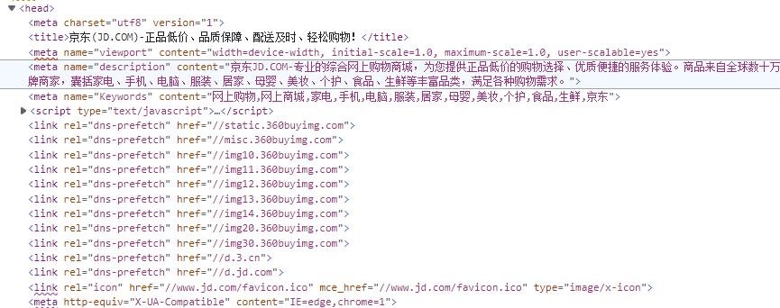

# DNS优化

前提：针对于一些需要域名解析服务器的项目

由于DNS服务器也有性能瓶颈，所以我们可以通过减少DNS发送请求次数来优化DNS，


## 优化方式

DNS预解析： 

```js
<meta http-equiv="x-dns-prefetch-control" content="on">
<link rel="dns-prefetch" href="//static.360buyimg.com"/>
<link rel="dns-prefetch" href="//misc.360buyimg.com"/>
<link rel="dns-prefetch" href="//img10.360buyimg.com"/>
<link rel="dns-prefetch" href="//d.3.cn"/>
<link rel="dns-prefetch" href="//d.jd.com"/>
```

京东官方的预解析：

