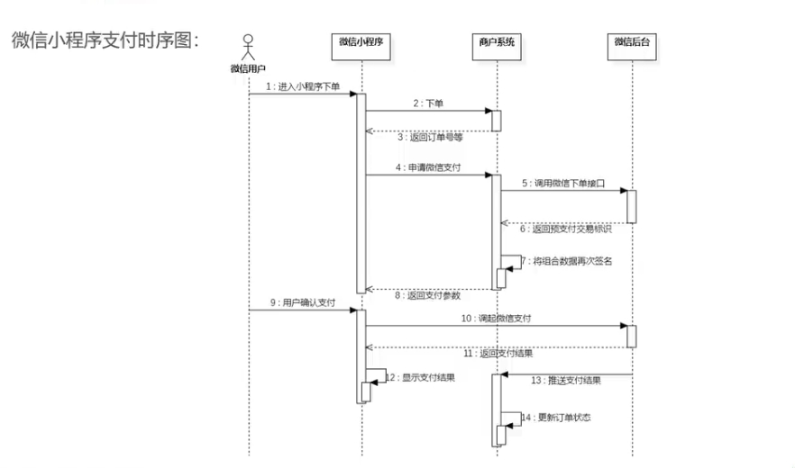

# 微信支付基本业务逻辑

**小程序的支付方式很多，这里我们介绍的是`JSAPI`下单方式**

细节可以参考地址：

https://pay.weixin.qq.com/wiki/doc/apiv3/apis/chapter3_1_1.shtml

示例：

## 一：微信小程序支付的时序图

**核心步骤**

1. 第五步：调用微信下单接口获取预支付标识
2. 第十步：小程序端调起微信支付