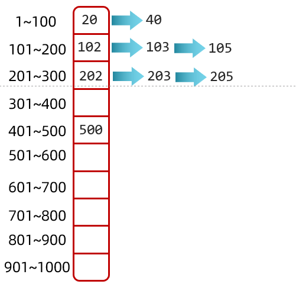

# 常见的七种查找算法：

​	数据结构是数据存储的方式，算法是数据计算的方式。所以在开发中，算法和数据结构息息相关。今天的讲义中会涉及部分数据结构的专业名词，如果各位铁粉有疑惑，可以先看一下哥们后面录制的数据结构，再回头看算法。

## 1. 基本查找 

​	也叫做顺序查找

​        说明：顺序查找适合于存储结构为数组或者链表。

**基本思想**：顺序查找也称为线形查找，属于无序查找算法。从数据结构线的一端开始，顺序扫描，依次将遍历到的结点与要查找的值相比较，若相等则表示查找成功；若遍历结束仍没有找到相同的，表示查找失败。

示例代码：

```java
public class A01_BasicSearchDemo1 {
    public static void main(String[] args) {
        //基本查找/顺序查找
        //核心：
        //从0索引开始挨个往后查找

        //需求：定义一个方法利用基本查找，查询某个元素是否存在
        //数据如下：{131, 127, 147, 81, 103, 23, 7, 79}


        int[] arr = {131, 127, 147, 81, 103, 23, 7, 79};
        int number = 82;
        System.out.println(basicSearch(arr, number));

    }

    //参数：
    //一：数组
    //二：要查找的元素

    //返回值：
    //元素是否存在
    public static boolean basicSearch(int[] arr, int number){
        //利用基本查找来查找number在数组中是否存在
        for (int i = 0; i < arr.length; i++) {
            if(arr[i] == number){
                return true;
            }
        }
        return false;
    }
}
```

## 2. 二分查找

​	也叫做折半查找

优势：相比于基本查找，**二分查找的效率是更高的**

说明：**元素必须是有序的，从小到大，或者从大到小都是可以的。**

如果是无序的，也可以先进行排序。但是排序之后，会改变原有数据的顺序，查找出来元素位置跟原来的元素可能是不一样的，所以排序之后再查找只能判断当前数据是否在容器当中，返回的索引无实际的意义。

　　**基本思想**：也称为是折半查找，属于有序查找算法。用给定值先与中间结点比较。比较完之后有三种情况：

* min表示最小索引0，max表示最大索引xxx.length-1，mid为( mix + max ) / 2即可

* 相等（xxx[mid] == 目标值）

  说明找到了

* 要查找的数据比中间节点小（目标值 < xxx[mid]）

  说明要查找的数字在中间节点左边 =>` max = mid -1;`

* 要查找的数据比中间节点大（目标值 > xxx[mid]）

  说明要查找的数字在中间节点右边 => `min = mid + 1;`

**相关问题**：

1.为什么上面的值会有`-1`操作呢？

因为我`mid`位置数据我们已经比较过了，所以进行`-1`操作，防止重复判断


2.如果数据是乱的，先排序再用二分查找可以吗？

这个问题需要看需求，如果只是判断当前查找目标值是否在数据中，是可以这样操作的，但是如果要求获取**目标值的索引值**，那么这种做法就不行，因为排过序索引就被打乱了已经不是原来


代码示例：

```java
package com.itheima.search;

public class A02_BinarySearchDemo1 {
    public static void main(String[] args) {
        //二分查找/折半查找
        //核心：
        //每次排除一半的查找范围

        //需求：定义一个方法利用二分查找，查询某个元素在数组中的索引
        //数据如下：{7, 23, 79, 81, 103, 127, 131, 147}

        int[] arr = {7, 23, 79, 81, 103, 127, 131, 147};
        System.out.println(binarySearch(arr, 150));
    }

    public static int binarySearch(int[] arr, int num) {
        int min = 0; // 最大值
        int max = arr.length - 1; // 最小值

        while (true) {
            // 1.情况一：max比min值都小了说明没找到
            if(max < min) {
                return -1;
            }

            // 获取中间值
            int mid = (min + max) / 2;

            if(arr[mid] > num) {
                // 2.情况二：mid位置值大于目标值num
                // 所以说目标值再mid的左边 - 1
                max = mid - 1;
            } else if(arr[mid] < num) {
                // 3.情况三：mid位置的值小于目标值num
                // 说明目标值在mid的右边 + 1
                min = mid + 1;
            } else {
                // 上面两种都不是说明找到了
                return mid;
            }
        }
    }
}
```

## 3. 插值查找（二分法的改进版）

在介绍插值查找之前，先考虑一个问题：

​	为什么二分查找算法一定要是折半，而不是折四分之一或者折更多呢？

其实就是因为方便，简单，但是如果我能在二分查找的基础上，让中间的mid点，尽可能靠近想要查找的元素，那不就能提高查找的效率了吗？

二分查找中查找点计算如下：

　　mid=(low+high)/2, 即mid=low+1/2*(high-low);

我们可以将查找的点改进为如下：

　　mid=low+(key-a[low])/(a[high]-a[low])*(high-low)，

这样，让mid值的变化更靠近关键字key，这样也就间接地减少了比较次数。

　　基本思想：基于二分查找算法，将查找点的选择改进为自适应选择，可以提高查找效率。当然，差值查找也属于有序查找。


原理：是通过一种比例来计算的，例如`key(3)-arr[minx]`然后占`arr[max]-arr[min]`的一定比例，然后*总长度(max - min)再加上原来min，即可获得一个比较靠近key值的mid

>tips:
>
>min、max、mid都是索引，别弄混了


**细节：**对于**表长较大，而关键字分布又比较均匀**的查找表来说，插值查找算法的平均性能比折半查找要好的多。反之，数组中如果**分布非常不均匀**，那么插值查找未必是很合适的选择。

代码跟二分查找类似，只要修改一下mid的计算方式即可。


代码示例：

```java
public class A02_InterpolationSearchDemo1 {
    public static void main(String[] args) {
        int[] arr = {7, 23, 79, 81, 103, 127, 131, 147};
        System.out.println(InterpolationSearch(arr, 150));
    }


    public static int InterpolationSearch(int[] arr, int num) {
        int min = 0; // 最大值
        int max = arr.length - 1; // 最小值

        while (true) {
            // 1.情况一：max比min值都小了说明没找到
            if(max < min) {
                return -1;
            }

            // 获取中间值(插值查找方式)
            int mid = min + (num - min) / (max-min) * (max - min);

            if(arr[mid] > num) {
                // 2.情况二：mid位置值大于目标值num
                // 所以说目标值再mid的左边 - 1
                max = mid - 1;
            } else if(arr[mid] < num) {
                // 3.情况三：mid位置的值小于目标值num
                // 说明目标值在mid的右边 + 1
                min = mid + 1;
            } else {
                // 上面两种都不是说明找到了
                return mid;
            }
        }
    }
}
```


## 4. 斐波那契查找(二分的改进版)

在介绍斐波那契查找算法之前，我们先介绍一下很它紧密相连并且大家都熟知的一个概念——黄金分割。

　　黄金比例又称黄金分割，是指事物各部分间一定的数学比例关系，即将整体一分为二，较大部分与较小部分之比等于整体与较大部分之比，其比值约为1:0.618或1.618:1。

　　0.618被公认为最具有审美意义的比例数字，这个数值的作用不仅仅体现在诸如绘画、雕塑、音乐、建筑等艺术领域，而且在管理、工程设计等方面也有着不可忽视的作用。因此被称为黄金分割。

　　在数学中有一个非常有名的数学规律：斐波那契数列：1, 1, 2, 3, 5, 8, 13, 21, 34, 55, 89…….

（从第三个数开始，后边每一个数都是前两个数的和）。

然后我们会发现，随着斐波那契数列的递增，前后两个数的比值会越来越接近0.618，利用这个特性，我们就可以将黄金比例运用到查找技术中。

 

基本思想：也是二分查找的一种提升算法，通过运用黄金比例的概念在数列中选择查找点进行查找，提高查找效率。同样地，斐波那契查找也属于一种**有序查找算法。**

斐波那契查找也是在二分查找的基础上进行了优化，优化中间点mid的计算方式即可

代码示例：

```java
public class FeiBoSearchDemo {
    public static int maxSize = 20;

    public static void main(String[] args) {
        int[] arr = {1, 8, 10, 89, 1000, 1234};
        System.out.println(search(arr, 1234));
    }

    public static int[] getFeiBo() {
        int[] arr = new int[maxSize];
        arr[0] = 1;
        arr[1] = 1;
        for (int i = 2; i < maxSize; i++) {
            arr[i] = arr[i - 1] + arr[i - 2];
        }
        return arr;
    }

    public static int search(int[] arr, int key) {
        int low = 0;
        int high = arr.length - 1;
        //表示斐波那契数分割数的下标值
        int index = 0;
        int mid = 0;
        //调用斐波那契数列
        int[] f = getFeiBo();
        //获取斐波那契分割数值的下标
        while (high > (f[index] - 1)) {
            index++;
        }
        //因为f[k]值可能大于a的长度，因此需要使用Arrays工具类，构造一个新法数组，并指向temp[],不足的部分会使用0补齐
        int[] temp = Arrays.copyOf(arr, f[index]);
        //实际需要使用arr数组的最后一个数来填充不足的部分
        for (int i = high + 1; i < temp.length; i++) {
            temp[i] = arr[high];
        }
        //使用while循环处理，找到key值
        while (low <= high) {
            mid = low + f[index - 1] - 1;
            if (key < temp[mid]) {//向数组的前面部分进行查找
                high = mid - 1;
                /*
                  对k--进行理解
                  1.全部元素=前面的元素+后面的元素
                  2.f[k]=k[k-1]+f[k-2]
                  因为前面有k-1个元素没所以可以继续分为f[k-1]=f[k-2]+f[k-3]
                  即在f[k-1]的前面继续查找k--
                  即下次循环,mid=f[k-1-1]-1
                 */
                index--;
            } else if (key > temp[mid]) {//向数组的后面的部分进行查找
                low = mid + 1;
                index -= 2;
            } else {//找到了
                //需要确定返回的是哪个下标
                if (mid <= high) {
                    return mid;
                } else {
                    return high;
                }
            }
        }
        return -1;
    }
}

```

## 5. 分块查找 

当数据表中的数据元素很多时，可以采用分块查找。

汲取了顺序查找和折半查找各自的优点，既有动态结构，又适于快速查找

分块查找适用于**数据较多，但是数据不会发生变化的情况**，如果需要一边添加一边查找，建议使用哈希查找

分块查找的过程：

1. 需要把数据分成N多小块，块与块之间不能有数据重复的交集。
2. 给每一块创建对象单独存储到数组当中
3. 查找数据的时候，先在数组查，当前数据属于哪一块
4. 再到这一块中顺序查找


分块原则：

1. 块内无需，块间有序（**前一块中的最大数据，小于后一块中的所有数据**）
2. 块数的数量，一般等于数字的个数开根号，例如：16个数字会分成4块左右
3. 数据源本身的大方向还是要有一定顺序的，**不能特别乱完全没有规律的就不行了**


核心思路：

首先查找key值在那个块，然后再到块内遍历查找即可


代码示例：

```java
package com.itheima.search;

public class A03_BlockSearchDemo {
    public static void main(String[] args) {
         /*
            分块查找
            核心思想：
                块内无序，块间有序
            实现步骤：
                1.创建数组blockArr存放每一个块对象的信息
                2.先查找blockArr确定要查找的数据属于哪一块
                3.再单独遍历这一块数据即可
        */
        int[] arr = {16, 5, 9, 12, 21, 18,
                32, 23, 37, 26, 45, 34,
                50, 48, 61, 52, 73, 66};


        // 1.把数据进行分块(18开根号 4.24 由于我们为了数据大小差不多就分了3块儿)
        Block b1 = new Block(21, 0, 5);
        Block b2 = new Block(45, 6, 11);
        Block b3 = new Block(73, 12, 17);

        // 2.定义目标值
        int key = 28;
        // 3.放入数组中存储
        Block[] blockArr = {b1, b2, b3};

        int index = getIndex(blockArr, arr, key);
        System.out.println("索引值：" + index);
    }


    // 获取key值在数组arr中的index
    public static int getIndex(Block[] blockArr, int[] arr, int key) {
        Block b = getBlock(blockArr, key);

        // 如果b是null则不在块数组中
        if(b == null) {
            return -1;
        }
        int startIndex = b.getStartIndex();
        int endIndex = b.getEndIndex();
        int index = -1;
        
        // 遍历查找获取key值的索引
        for (int i = startIndex; i <= endIndex; i++) {
            if(arr[i] == key) {
                index = i;
                break;
            }
        }

        return index;
    }


    // 获取key值在哪一个块中
    public static Block getBlock(Block[] blockArr, int key) {
        Block target = null;

        // 基本查找方式
//        for (int i = 0; i < blockArr.length; i++) {
//            Block b = blockArr[i];
//            if(b.getMax() > key) {
//                target = blockArr[i];
//                break;
//            }
//        }

        // 二分查找（注意我们只用找到一个大概的范围而不是准确的值）
        int min = 0;
        int max = blockArr.length - 1;
        while(true) {
            if(max < min) {
                break;
            }

            int mid = (min + max) / 2;

            // 注意这个二分比较特殊，只要mid索引的值大于key值了，就认为是找到了
            if(blockArr[mid].getMax() < key) {
                min = mid + 1;
            } else {
                target = blockArr[mid];
                break;
            }
        }


        return target;
    }
}


// 声明一个块类，保存最大值，开始索引和结束索引
class Block {
    private int max; // 最大值
    private int startIndex; // 起始索引
    private int endIndex; // 结束索引


    public Block() {
    }

    public Block(int max, int startIndex, int endIndex) {
        this.max = max;
        this.startIndex = startIndex;
        this.endIndex = endIndex;
    }

    /**
     * 获取
     * @return max
     */
    public int getMax() {
        return max;
    }

    /**
     * 设置
     * @param max
     */
    public void setMax(int max) {
        this.max = max;
    }

    /**
     * 获取
     * @return startIndex
     */
    public int getStartIndex() {
        return startIndex;
    }

    /**
     * 设置
     * @param startIndex
     */
    public void setStartIndex(int startIndex) {
        this.startIndex = startIndex;
    }

    /**
     * 获取
     * @return endIndex
     */
    public int getEndIndex() {
        return endIndex;
    }

    /**
     * 设置
     * @param endIndex
     */
    public void setEndIndex(int endIndex) {
        this.endIndex = endIndex;
    }

    public String toString() {
        return "Block{max = " + max + ", startIndex = " + startIndex + ", endIndex = " + endIndex + "}";
    }
}
```

## 5.5 分块查找(改进版)

上面那种分块查找方式，总体来说，数据源的大致顺序还是有一定的要求的，但是如果一个数据源真的非常非常乱，数据值大大小小乱飞，这样的就不能用上面👆那种方式了，不过可以考虑现在这种分块查找方法

核心：

1. 根据**最大值最小值**来进行分块
2. 每个块之间的数据不能有交集（就是每个块中的最大值到最小值不能交叉）


示例：


代码示例：

```java
package test;

public class A04_BlockSearchImproveDemo {
    public static void main(String[] args) {

        // 数据源(一个比较混乱的)
        int[] arr = {27, 22, 30, 40, 36,
                13, 19, 16, 20,
                7, 10,
                43, 50, 48};

        // 1.按照数据范围进行分块（范围不能有交集）
        Block b1 = new Block(22, 40, 0, 4);
        Block b2 = new Block(13, 20, 5, 8);
        Block b3 = new Block(7, 10, 9, 10);
        Block b4 = new Block(43, 50, 11, 13);

        int key = 48;
        Block[] blockArr = {b1, b2, b3, b4};

        int index = getIndex(blockArr, arr, key);

        System.out.println("查找到的索引：" + index);
    }

    // 查找key值索引
    public static int getIndex(Block[] blockArr, int[] arr, int key) {
        Block b = getBlock(blockArr, key);
        // 如果不在Block中直接返回-1没找到
        if(b == null) {
            return -1;
        }

        int startIndex = b.getStartIndex();
        int endIndex = b.getEndIndex();
        int index = -1;
        for (int i = startIndex; i <= endIndex; i++) {
            if(arr[i] == key) {
                index = i;
                break;
            }
        }

        return index;
    }

    // 查找指定key在哪一个Block中
    public static Block getBlock(Block[] blockArr,int key) {
        Block result = null;
        for (int i = 0; i < blockArr.length; i++) {
            if(key >= blockArr[i].getMin() && key <= blockArr[i].getMax()) {
                result = blockArr[i];
                break;
            }
        }

        return result;
    }
}

// Block表示每个块
class Block {
    private int min;
    private int max;
    private int startIndex;
    private int endIndex;


    public Block() {
    }

    public Block(int min, int max, int startIndex, int endIndex) {
        this.min = min;
        this.max = max;
        this.startIndex = startIndex;
        this.endIndex = endIndex;
    }

    /**
     * 获取
     * @return min
     */
    public int getMin() {
        return min;
    }

    /**
     * 设置
     * @param min
     */
    public void setMin(int min) {
        this.min = min;
    }

    /**
     * 获取
     * @return max
     */
    public int getMax() {
        return max;
    }

    /**
     * 设置
     * @param max
     */
    public void setMax(int max) {
        this.max = max;
    }

    /**
     * 获取
     * @return startIndex
     */
    public int getStartIndex() {
        return startIndex;
    }

    /**
     * 设置
     * @param startIndex
     */
    public void setStartIndex(int startIndex) {
        this.startIndex = startIndex;
    }

    /**
     * 获取
     * @return endIndex
     */
    public int getEndIndex() {
        return endIndex;
    }

    /**
     * 设置
     * @param endIndex
     */
    public void setEndIndex(int endIndex) {
        this.endIndex = endIndex;
    }

    public String toString() {
        return "Block{min = " + min + ", max = " + max + ", startIndex = " + startIndex + ", endIndex = " + endIndex + "}";
    }
}
```


## 6. 哈希查找(分块进阶版)

哈希查找是分块查找的进阶版，适用于数据一边添加一边查找的情况。

一般是数组 + 链表的结合体或者是数组+链表 + 红黑树的结合体

在课程中，为了让大家方便理解，所以规定：

- 数组的0索引处存储1~100
- 数组的1索引处存储101~200
- 数组的2索引处存储201~300
- 以此类推

但是实际上，我们一般不会采取这种方式，因为这种方式容易导致一块区域添加的元素过多，导致效率偏低。

更多的是先计算出当前数据的哈希值，用哈希值跟数组的长度进行计算，计算出应存入的位置，再挂在数组的后面形成链表，如果挂的元素太多而且数组长度过长，我们也会把链表转化为红黑树，进一步提高效率。

具体的过程，大家可以参见B站阿玮讲解课程：从入门到起飞。在集合章节详细讲解了哈希表的数据结构。全程采取动画形式讲解，让大家一目了然。

在此不多做阐述。




## 7. 树表查找 

本知识点涉及到数据结构：树。

建议先看一下后面阿玮讲解的数据结构，再回头理解。

基本思想：二叉查找树是先对待查找的数据进行生成树，确保树的左分支的值小于右分支的值，然后在就行和每个节点的父节点比较大小，查找最适合的范围。 这个算法的查找效率很高，但是如果使用这种查找方法要首先创建树。 

　　二叉查找树（BinarySearch Tree，也叫二叉搜索树，或称二叉排序树Binary Sort Tree），具有下列性质的二叉树：

　　1）若任意节点左子树上所有的数据，均小于本身；

　　2）若任意节点右子树上所有的数据，均大于本身；

　　二叉查找树性质：对二叉查找树进行中序遍历，即可得到有序的数列。

​        不同形态的二叉查找树如下图所示：

  


　　基于二叉查找树进行优化，进而可以得到其他的树表查找算法，如平衡树、红黑树等高效算法。

具体细节大家可以参见B站阿玮讲解课程：从入门到起飞。在集合章节详细讲解了树数据结构。全程采取动画形式讲解，让大家一目了然。

在此不多做阐述。

​	不管是二叉查找树，还是平衡二叉树，还是红黑树，查找的性能都比较高


# 十大排序算法：

## 1. 冒泡排序

冒泡排序（Bubble Sort）也是一种简单直观的排序算法。

它重复的遍历过要排序的数列，一次比较相邻的两个元素，如果他们的顺序错误就把他们交换过来。

这个算法的名字由来是因为越大的元素会经由交换慢慢"浮"到最后面。

当然，大家可以按照从大到小的方式进行排列。

### 1.1 算法步骤

1. 相邻的元素两两比较，大的放右边，小的放左边
2. 第一轮比较完毕之后，最大值就已经确定，第二轮可以少循环一次，后面以此类推
3. 如果数组中有n个数据，总共我们只要执行n-1轮的代码就可以

### 1.2 动图演示


### 1.3 代码示例

```java
public class A01_BubbleDemo {
    public static void main(String[] args) {
        /*
            冒泡排序：
            核心思想：
            1，相邻的元素两两比较，大的放右边，小的放左边。
            2，第一轮比较完毕之后，最大值就已经确定，第二轮可以少循环一次，后面以此类推。
            3，如果数组中有n个数据，总共我们只要执行n-1轮的代码就可以。
        */


        //1.定义数组
        int[] arr = {2, 4, 5, 3, 1};

        //2.利用冒泡排序将数组中的数据变成 1 2 3 4 5

        //外循环：表示我要执行多少轮。 如果有n个数据，那么执行n - 1 轮
        for (int i = 0; i < arr.length - 1; i++) {
            //内循环：每一轮中我如何比较数据并找到当前的最大值，并进行交换操作
            //-1：为了防止索引越界
            //-i：提高效率，每一轮执行的次数应该比上一轮少一次。
            for (int j = 0; j < arr.length - 1 - i; j++) {
                //i 依次表示数组中的每一个索引：0 1 2 3 4
                if(arr[j] > arr[j + 1]){
                    int temp = arr[j];
                    arr[j] = arr[j + 1];
                    arr[j + 1] = temp;
                }
            }
        }

        printArr(arr);
    }

    private static void printArr(int[] arr) {
        //3.遍历数组
        for (int i = 0; i < arr.length; i++) {
            System.out.print(arr[i] + " ");
        }
        System.out.println();
    }
}
```


## 2. 选择排序

### 2.1 算法步骤

1. 从0索引开始，跟后面的元素一一比较
2. 小的放前面，大的放后面
3. 第一次循环结束后，最小的数据已经确定
4. 第二次循环从1索引开始以此类推
5. 第三轮循环从2索引开始以此类推
6. 第四轮循环从3索引开始以此类推。 

### 2.2 动图演示


 

```java
public class A02_SelectionDemo {
    public static void main(String[] args) {

        /*
            选择排序：
                1，从0索引开始，跟后面的元素一一比较。
                2，小的放前面，大的放后面。
                3，第一次循环结束后，最小的数据已经确定。
                4，第二次循环从1索引开始以此类推。

         */


        //1.定义数组
        int[] arr = {2, 4, 5, 3, 1};


        //2.利用选择排序让数组变成 1 2 3 4 5
       /* //第一轮：
        //从0索引开始，跟后面的元素一一比较。
        for (int i = 0 + 1; i < arr.length; i++) {
            //拿着0索引跟后面的数据进行比较
            if(arr[0] > arr[i]){
                int temp = arr[0];
                arr[0] = arr[i];
                arr[i] = temp;
            }
        }*/

        //最终代码：
        //外循环：几轮
        //i:表示这一轮中，我拿着哪个索引上的数据跟后面的数据进行比较并交换(我们进行交换的值只需要到length -1不需要到最后一个元素，所以条件是arr.length - 1)
        for (int i = 0; i < arr.length -1; i++) {
            //内循环：每一轮我要干什么事情？
            //拿着i跟i后面的数据进行比较交换（每次都要对比到最后一个元素，所以循环条件是到arr.length）
            for (int j = i + 1; j < arr.length; j++) {
                if(arr[i] > arr[j]){
                    int temp = arr[i];
                    arr[i] = arr[j];
                    arr[j] = temp;
                }
            }
        }


        printArr(arr);


    }
    private static void printArr(int[] arr) {
        //3.遍历数组
        for (int i = 0; i < arr.length; i++) {
            System.out.print(arr[i] + " ");
        }
        System.out.println();
    }

}

```


## 3. 插入排序

插入排序的代码实现虽然没有冒泡排序和选择排序那么简单粗暴，但它的原理应该是最容易理解的了，因为只要打过扑克牌的人都应该能够秒懂。插入排序是一种最简单直观的排序算法，它的工作原理是通过创建有序序列和无序序列，然后再遍历无序序列得到里面每一个数字，把每一个数字插入到有序序列中正确的位置。

插入排序在插入的时候，有优化算法，在遍历有序序列找正确位置时，可以采取二分查找

### 3.1 算法步骤

将0索引的元素到N索引的元素看做是有序的，把N+1索引的元素到最后一个当成是无序的。

示例：

```java
int[] arr = {3, 44, 38, 5, 47, 15, 36, 26, 27, 2, 46, 4, 19, 50, 48};
// 0~1是有序的(3, 44)
// 2~14是无序的
```


遍历无序的数据，将遍历到的元素插入有序序列中适当的位置（倒着遍历有序数组并插入），如遇到相同数据，插在后面。

N的范围：0~最大索引

### 3.2 动图演示


代码示例：

```java
package com.itheima.mysort;


public class A03_InsertDemo {
    public static void main(String[] args) {
        /*
            插入排序：
                将0索引的元素到N索引的元素看做是有序的，把N+1索引的元素到最后一个当成是无序的。
                遍历无序的数据，将遍历到的元素插入有序序列中适当的位置，如遇到相同数据，插在后面。
                N的范围：0~最大索引

        */
        int[] arr = {3, 44, 38, 5, 47, 15, 36, 26, 27, 2, 46, 4, 19, 50, 48};

        //1.找到无序的哪一组数组是从哪个索引开始的。
        int startIndex = -1;
        for (int i = 0; i < arr.length; i++) {
            if(arr[i] > arr[i + 1]){
                startIndex = i + 1;
                break;
            }
        }

        //2.遍历从startIndex开始到最后一个元素，依次得到无序的哪一组数据中的每一个元素
        for (int i = startIndex; i < arr.length; i++) {
            //问题：如何把遍历到的数据，插入到前面有序的这一组当中

            // 记录一下当前要插入数据的索引
            int j = i;

            // 判断条件：当j索引大于0且，j索引数值要小于j-1索引数值时，两个值就交换
            while (j > 0 && arr[j] < arr[j - 1]) {
                int temp = arr[j];
                arr[j] = arr[j - 1];
                arr[j - 1] = temp;

                // 交换后，j整体向前移动，比较下一轮
                j--;
            }

        }
        printArr(arr);
    }

    private static void printArr(int[] arr) {
        //3.遍历数组
        for (int i = 0; i < arr.length; i++) {
            System.out.print(arr[i] + " ");
        }
        System.out.println();
    }

}

```


## 4. 快速排序 

快速排序是由东尼·霍尔所发展的一种排序算法。

快速排序又是一种分而治之思想在排序算法上的典型应用。

快速排序的名字起的是简单粗暴，因为一听到这个名字你就知道它存在的意义，就是快，而且效率高！

**它是处理大数据最快的排序算法之一了。**

### 4.1 算法步骤

1. 从数列中挑出一个元素，一般都是左边第一个数字，称为 "基准数";
2. 创建两个指针，一个从前往后走，一个从后往前走。
3. 先执行后面的指针，找出第一个比基准数小的数字
4. 再执行前面的指针，找出第一个比基准数大的数字
5. 交换两个指针指向的数字
6. 直到两个指针相遇
7. 将基准数跟指针指向位置的数字交换位置，称之为：**基准数归位**。
8. 第一轮结束之后，基准数左边的数字都是比基准数小的，基准数右边的数字都是比基准数大的。
9. 把基准数左边看做一个序列，把基准数右边看做一个序列，按照刚刚的规则递归排序

### 4.2 动图演示


代码示例：

快速排序的第一轮排序代码(理解了第一轮，后面**递归**起来就简单多了)：

```java
public class A05_QuickSortDemo {
    public static void main(String[] args) {
        /*
        快速排序：
            第一轮：以0索引的数字为基准数，确定基准数在数组中正确的位置。
            比基准数小的全部在左边，比基准数大的全部在右边。
            后面以此类推。
      */

        int[] arr = {6, 1, 2, 7, 9, 3, 4, 5, 10, 8, 11};

        quickSort(arr, 0, arr.length - 1);

        printArr(arr);
    }

    /**
     *
     * @param arr 要排序的数组
     * @param i 开始索引
     * @param j 结束索引
     */
    public static void quickSort(int[] arr, int i, int j) {

        int start = i;
        int end = j;

        // 基准数
        //int baseNum = arr[0]; // 默认是索引第一个的值
      	// 错误点❌ 1.不要认为基准数是第一个值就写成上面这种写法，我们在函数中了，第一个索引，就是我们传进来的参数i，所以应该使用参数i，修改为👇
      	int baseNum = arr[i];

        while (start != end) {

            // end从后往前找，找到比基准数小的值
            while (true) {
                // 判断条件解释：start值大于等end时说明已经重合，不用再找了，直接break
                if(end <= start || arr[end] < baseNum) {
                    break;
                }
                // 否则，就让end往前挪一位，判断下一个值
                end--;
            }

            // start从前往后找，找比基准数大的值
            while (true) {
                // 判断条件解释：start值大于等end时说明已经重合，不用再找了，直接break
                if(start >= end || arr[start] > baseNum) {
                    break;
                }

                // 否则，就让start往后挪一位，判断下一个值
                start++;
            }

            // 上面两个循环都出来时，然后交换start和end的值
            int temp = arr[start];
            arr[start] = arr[end];
            arr[end] = temp;
        }

        // 上面大循环走完时，说明除了基准数其它数字已经排好
        // 进行基准数归位操作（让基准数索引值i，和start或者end的值交换）
        int temp = arr[start]; // 这里start或者end都可以 应为已经相等了
        arr[start] = baseNum;
        //arr[0] = temp;	
      	// ❌错误点2.上面还是那个问题，开始索引不是0,而是i,修改为👇
      	arr[i] = temp;
    }


    public static void printArr(int[] arr) {
        for (int i = 0; i < arr.length; i++) {
            System.out.print(arr[i] + " ");
        }
    }
}
```


完整的快速排序代码：

递归核心：

1. 找到规律（基准数左右两边的数组，重复上面第一轮代码的操作一直分）
2. 找到递归结束出口（`end < start`时结束递归）

 ```java
package com.itheima.sort;

public class A05_QuickSortDemo {
    public static void main(String[] args) {
        /*
        快速排序：
            第一轮：以0索引的数字为基准数，确定基准数在数组中正确的位置。
            比基准数小的全部在左边，比基准数大的全部在右边。
            后面以此类推。
      */

        int[] arr = {6, 1, 2, 7, 9, 3, 4, 5, 10, 8, 11};

        quickSort(arr, 0, arr.length - 1);

        printArr(arr);
    }

    /**
     *
     * @param arr 要排序的数组
     * @param i 开始索引
     * @param j 结束索引
     */
    public static void quickSort(int[] arr, int i, int j) {

        int start = i;
        int end = j;

        // 递归出口
        if(start > end) {
            return;
        }


        // 基准数
        int baseNum = arr[0]; // 默认是索引第一个的值

        while (start != end) {

            // end从后往前找，找到比基准数小的值
            while (true) {
                // 判断条件解释：start值大于等end时说明已经重合，不用再找了，直接break
                if(end <= start || arr[end] < baseNum) {
                    break;
                }
                // 否则，就让end往前挪一位，判断下一个值
                end--;
            }

            // start从前往后找，找比基准数大的值
            while (true) {
                // 判断条件解释：start值大于等end时说明已经重合，不用再找了，直接break
                if(start >= end || arr[start] > baseNum) {
                    break;
                }

                // 否则，就让start往后挪一位，判断下一个值
                start++;
            }

            // 上面两个循环都出来时，然后交换start和end的值
            int temp = arr[start];
            arr[start] = arr[end];
            arr[end] = temp;
        }

        // 上面大循环走完时，说明除了基准数其它数字已经排好
        // 进行基准数归位操作（让基准数索引值i，和start或者end的值交换）
        int temp = arr[start]; // 这里start或者end都可以 应为已经相等了
        arr[start] = baseNum;
        arr[i] = temp;


        // 基准数左边的数组重复上面的操作(左边数组：开始索引i，到基准数索引 - 1)
        quickSort(arr, i, start - 1);

        // 注意：这里已经start和end相等了

        // 基准数右边的数组也重复上面的操作(右边数组位置：基准数索引+1，一直到结束索引j)
        quickSort(arr, start + 1, j);
    }


    public static void printArr(int[] arr) {
        for (int i = 0; i < arr.length; i++) {
            System.out.print(arr[i] + " ");
        }
    }
}

 ```


#### 易错点：

1. **千万不要把开始索引值就认为是`arr[0]`，结束索引值就是`arr[arr.length - 1]`**，这样理解可能在第一轮是没有问题的，但是递归起来就会有误，进入函数中，起始索引就是传递的`i`，结束索引就是传如的`j`
2. 在第一层循环中如果**把索引`0`当基准数**，**必须要先找end，在找start**，如果反过来会有严重错误，下面的**基准数归为操作会有问题**

问题2示例图：


start和end会移动到一个比基准数大的值，然后进行基准数归为操作后，就不满足比基准数小的在左边，比基准数大的在左边了

示例：❌


其他排序方式待更新~


