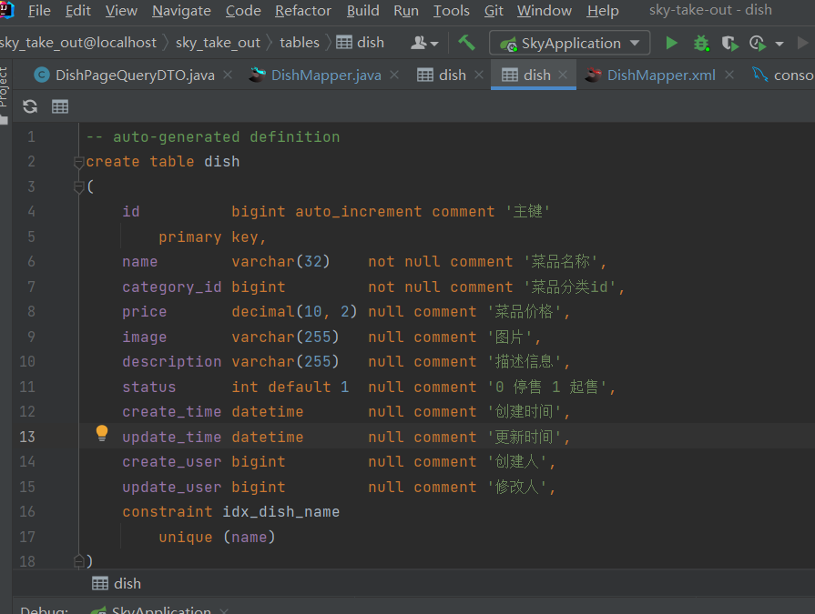
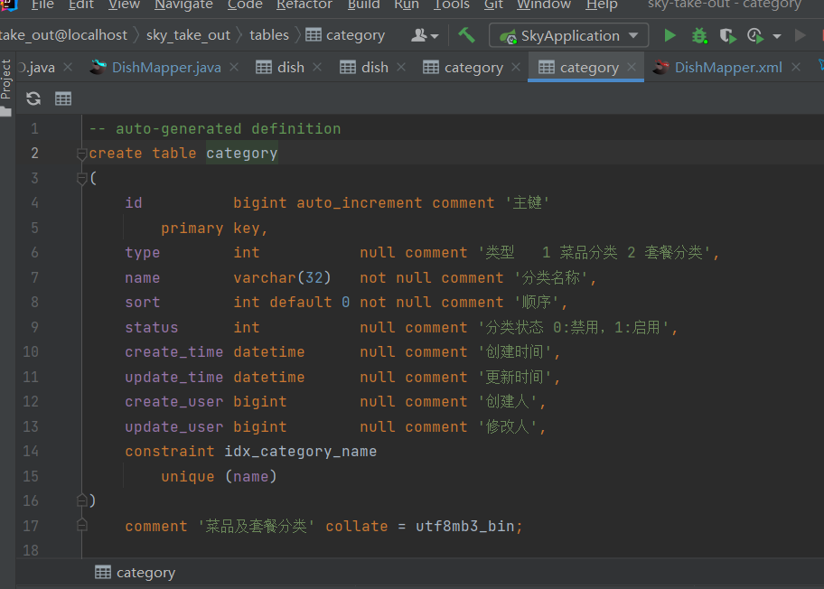

# Mybatis多表联查

多表联查一般我们都正常写在XML文件中，就和写SQL一毛一样(不能说是一样，只能说是一模一样)，就是要有一个注意点

核心注意点：

1. **就是要指定查询的字段名要和Entity或者VO中的属性名保持一致**


## 示例一：

例如当前我们有两张表，一张`dish`表(菜品表)，一张`category`表分类表，他们通过`dish`表中的`category_id`进行逻辑外键关联（分类和菜品是一对多关系）


`dish`表：



`category`表：




现在有一个需求：

要求出查询出所有的菜品(dish)，同时还要包含分类名称`categoryName`字段

**要求查出数据的`VO`：**

```java
package com.sky.vo;

import com.sky.entity.DishFlavor;
import lombok.AllArgsConstructor;
import lombok.Builder;
import lombok.Data;
import lombok.NoArgsConstructor;
import java.io.Serializable;
import java.math.BigDecimal;
import java.time.LocalDateTime;
import java.util.ArrayList;
import java.util.List;

@Data
@Builder
@NoArgsConstructor
@AllArgsConstructor
public class DishVO implements Serializable {

    private Long id;
    //菜品名称
    private String name;
    //菜品分类id
    private Long categoryId;
    //菜品价格
    private BigDecimal price;
    //图片
    private String image;
    //描述信息
    private String description;
    //0 停售 1 起售
    private Integer status;
    //更新时间
    private LocalDateTime updateTime;
    //分类名称
    private String categoryName; // 关键在这里
}

```


分析：

dish表中，只有通过`category_id`来关联到`category`分类表，如果我们想要查询出分类名称，那么就需要在`category`表中查询，所以我们可以使用外连接


先来写`sql`：

```sql
select d.*, c.name from dish d left join category c on d.category_id = c.id;
```

>很简单的一个外连接就搞定了


**然后我们再来写`xml`:**

```xml
<?xml version="1.0" encoding="UTF-8" ?>
<!DOCTYPE mapper PUBLIC "-//mybatis.org//DTD Mapper 3.0//EN" "http://mybatis.org/dtd/mybatis-3-mapper.dtd" >
<mapper namespace="com.sky.mapper.DishMapper">
    <select id="pageQuery" resultType="com.sky.vo.DishVO">
        select d.*, c.name as categoryName  from dish d left join category c on d.category_id = c.id
        <where>
            <if test="name != null">
                and d.name like concat('%', #{name}, '%')
            </if>
            <if test="categoryId != null">
                and d.category_id = #{categoryId}
            </if>
            <if test="status != null">
                and d.status = #{status}
            </if>
        </where>
        order by d.create_time desc
    </select>
</mapper>
```

>核心：在字段部分，我们用了as关键字将c.name替换为categoryName，这样就能保持和要求的VO保持一，mybatis就能帮我们处理掉

