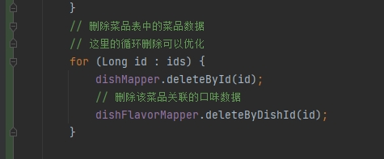

# 删除优化

有时候我们对数据库进行删除操作时，遇到批量数据，往往会选择使用`for`+单个删除，来操作，例如下面的代码：




优化的核心思路：

**多条`sql`操作，优化为一条`sql`操作**


例如上面的例子：我们用for循环就会产生多条sql出来：

```sql
delete from xxx where id = #{id}
# 循环多少次就会有多少句该sql被发出
```


我们可以通过优化sql语句，直接批量删除：

```sql
delete from xxx where id in (xxx, xx, xx)
# 传入数组，只需要一条语句就能删除
```


## mybatis的实现方式

mybatis实现上述的语句方式就是通过动态sql来实现：

直接上例子：

```xml
<?xml version="1.0" encoding="UTF-8" ?>
<!DOCTYPE mapper PUBLIC "-//mybatis.org//DTD Mapper 3.0//EN" "http://mybatis.org/dtd/mybatis-3-mapper.dtd" >
<mapper namespace="com.sky.mapper.DishFlavorMapper">
    <insert id="insertBatch">
        insert into dish_flavor (dish_id, name, value) VALUES
        <foreach collection="flavors" item="df" separator=",">
            (#{df.dishId}, #{df.name}, #{df.value})
        </foreach>
    </insert>
    <delete id="deleteByDishIds">
        delete from dish_flavor where dish_id in
        <foreach collection="dishIds" item="dishId" separator="," open="(" close=")">
            #{dishId}
        </foreach>
    </delete>
</mapper>
```

>这就是一个很典型的批量删除的xml