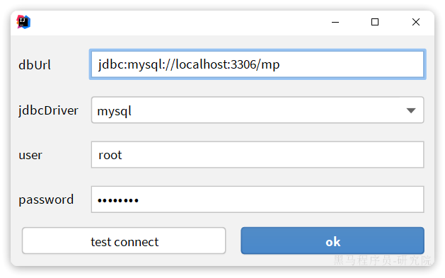
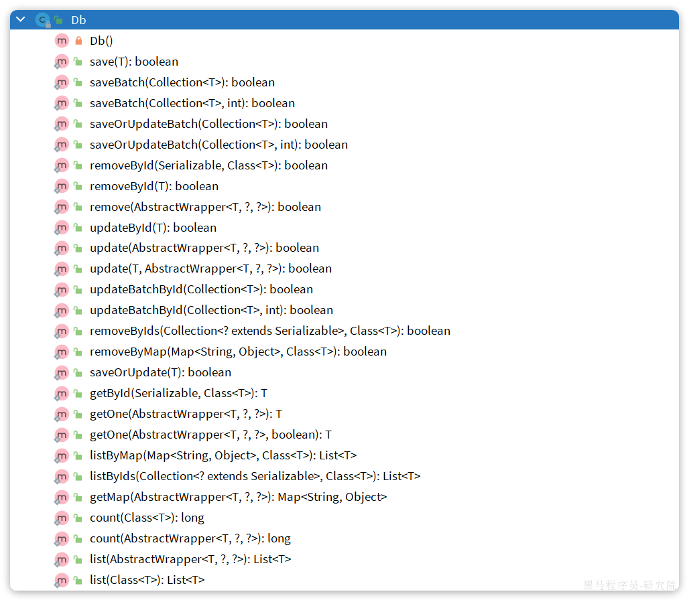
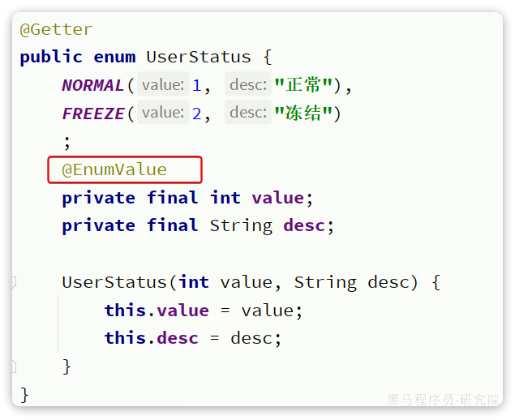
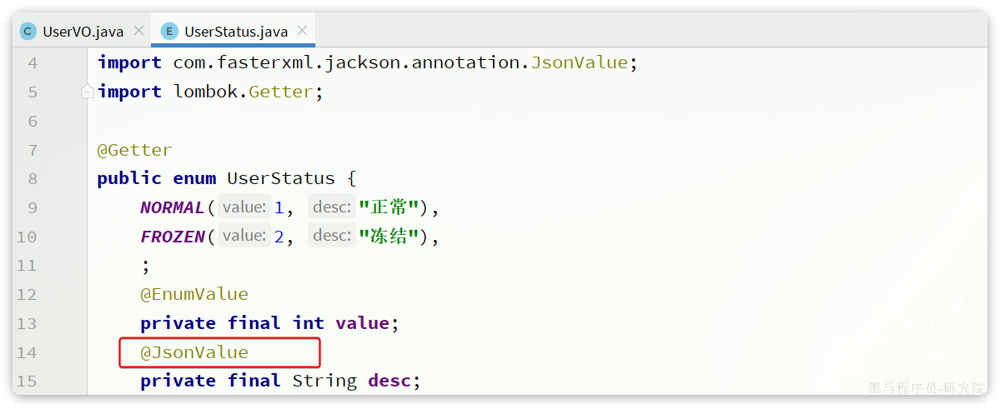
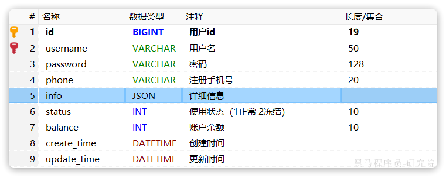

# Mybatis-Plus快速入门-02

这是快速入门的第二部分


## 5: 扩展功能


### 5.1 代码生成

在使用MybatisPlus以后，基础的`Mapper`、`Service`、`PO`代码相对固定，重复编写也比较麻烦。因此MybatisPlus官方提供了代码生成器根据数据库表结构生成`PO`、`Mapper`、`Service`等相关代码。只不过代码生成器同样要编码使用，也很麻烦。

这里推荐大家使用一款`MybatisPlus`的插件，它可以基于图形化界面完成`MybatisPlus`的代码生成，非常简单。

也可以使用MP官网推荐的MybatisX插件来生成


#### 5.1.1 安装插件

在`Idea`的plugins市场中搜索并安装`MyBatisPlus`插件：


>蛙趣，初音
>
>然后重启你的Idea即可使用。


#### 5.1.22 基本使用

刚好数据库中还有一张address表尚未生成对应的实体和mapper等基础代码。我们利用插件生成一下。 首先需要配置数据库地址，在Idea顶部菜单中，找到`other`，选择`Config Database`：


在弹出的窗口中填写数据库连接的基本信息：

>注意：如果报错，请在dbUrl后面加上时区（也可以直接把yaml文件里的jdbc配置直接copy过来）
>
>`serverTimezone=Asia/Shanghai`

点击OK保存。

然后再次点击Idea顶部菜单中的other，然后选择`Code Generator`:


再在弹出的表单中填写信息：


最最最后点击code generatro 即可


### 5.2 静态工具

>注意：静态工具类DB只有最新版本的MP才有
>
>

有的时候Service之间也会相互调用，为了避免出现循环依赖问题，**MybatisPlus提供一个静态工具类：`Db`**，其中的一些静态方法与`IService`中方法签名基本一致，也可以帮助我们实现CRUD功能：



示例：

```java
@Test
void testDbGet() {
    User user = Db.getById(1L, User.class);
    System.out.println(user);
}

@Test
void testDbList() {
    // 利用Db实现复杂条件查询
    List<User> list = Db.lambdaQuery(User.class)
            .like(User::getUsername, "o")
            .ge(User::getBalance, 1000)
            .list();
    list.forEach(System.out::println);
}

@Test
void testDbUpdate() {
    Db.lambdaUpdate(User.class)
            .set(User::getBalance, 2000)
            .eq(User::getUsername, "Rose");
}
```


然后再来个小栗子开开胃：

需求：改造根据id用户查询的接口，查询用户的同时返回用户收货地址列表

首先，我们要添加一个收货地址的VO对象：

```java
package com.itheima.mp.domain.vo;

import io.swagger.annotations.ApiModel;
import io.swagger.annotations.ApiModelProperty;
import lombok.Data;

@Data
@ApiModel(description = "收货地址VO")
public class AddressVO{

    @ApiModelProperty("id")
    private Long id;

    @ApiModelProperty("用户ID")
    private Long userId;

    @ApiModelProperty("省")
    private String province;

    @ApiModelProperty("市")
    private String city;

    @ApiModelProperty("县/区")
    private String town;

    @ApiModelProperty("手机")
    private String mobile;

    @ApiModelProperty("详细地址")
    private String street;

    @ApiModelProperty("联系人")
    private String contact;

    @ApiModelProperty("是否是默认 1默认 0否")
    private Boolean isDefault;

    @ApiModelProperty("备注")
    private String notes;
}
```


然后，改造原来的UserVO，添加一个地址属性：


接下来，修改UserController中根据id查询用户的业务接口：

```java
@GetMapping("/{id}")
@ApiOperation("根据id查询用户")
public UserVO queryUserById(@PathVariable("id") Long userId){
    // 基于自定义service方法查询
    return userService.queryUserAndAddressById(userId);
}
```

由于查询业务复杂，所以要在service层来实现。首先在IUserService中定义方法：

```java
package com.itheima.mp.service;

import com.baomidou.mybatisplus.extension.service.IService;
import com.itheima.mp.domain.po.User;
import com.itheima.mp.domain.vo.UserVO;

public interface IUserService extends IService<User> {
    void deduct(Long id, Integer money);

    UserVO queryUserAndAddressById(Long userId);
}
```

然后，在UserServiceImpl中实现该方法：

```java
@Override
public UserVO queryUserAndAddressById(Long userId) {
    // 1.查询用户
    User user = getById(userId);
    if (user == null) {
        return null;
    }
  	
  	// 这里地址表的查询操作我们使用工具类DB来帮我们实现，否则我们就需要注入一下地址表的mapper/service了
  
    // 2.查询收货地址
    List<Address> addresses = Db.lambdaQuery(Address.class)
            .eq(Address::getUserId, userId)
            .list();
    // 3.处理vo
    UserVO userVO = BeanUtil.copyProperties(user, UserVO.class);
    userVO.setAddresses(BeanUtil.copyToList(addresses, AddressVO.class));
    return userVO;
}
```

在查询地址时，我们采用了Db的静态方法，因此避免了注入AddressService，减少了循环依赖的风险。


### 5.3 逻辑删除

对于一些比较重要的数据，我们往往会采用**逻辑删除的方案**，即：

- 在表中添加一个字段标记数据是否被删除
- 当删除数据时把标记置为true
- 查询时过滤掉标记为true的数据

一旦采用了逻辑删除，所有的查询和删除逻辑都要跟着变化，非常麻烦。

为了解决这个问题，MybatisPlus就添加了对逻辑删除的支持。

**注意：**<b style="color: red">只有MybatisPlus生成的SQL语句才支持自动的逻辑删除，自定义SQL需要自己手动处理逻辑删除。</b>


例如，我们给`address`表添加一个逻辑删除字段：

```sql
alter table address add deleted bit default '0' null comment '逻辑删除';
```

然后给`Address`实体添加`deleted`字段：


接下来，我们要在`application.yml`中配置逻辑删除字段：

```YAML
mybatis-plus:
  global-config:
    db-config:
      logic-delete-field: deleted # 全局逻辑删除的实体字段名(since 3.3.0,配置后可以忽略不配置步骤2)
      logic-delete-value: 1 # 逻辑已删除值(默认为 1)
      logic-not-delete-value: 0 # 逻辑未删除值(默认为 0)
```


**测试：**

首先，我们执行一个删除操作：

```java
@Test
void testDeleteByLogic() {
    // 删除方法与以前没有区别
    addressService.removeById(59L);
}
```

方法与普通删除一模一样，但是底层的SQL逻辑变了：


然后我们再查询一下试试：

```java
@Test
void testQuery() {
    List<Address> list = addressService.list();
    list.forEach(System.out::println);
}
```

会发现id为59的确实没有查询出来，而且SQL中也对逻辑删除字段做了判断：


综上， 开启了逻辑删除功能以后，我们就可以像普通删除一样做CRUD，基本不用考虑代码逻辑问题。还是非常方便的。


**注意：**

逻辑删除本身也有自己的问题，比如：

- 会导致数据库表垃圾数据越来越多，从而影响查询效率
- SQL中全都需要对逻辑删除字段做判断，影响查询效率

因此，我不太推荐采用逻辑删除功能，如果数据不能删除，可以采用把数据迁移到其它表的办法。


### 5.4 通用枚举

User类中有一个用户状态字段：


像这种字段我们一般会定义一个枚举，做业务判断的时候就可以直接基于枚举做比较。但是我们数据库采用的是`int`类型，对应的PO也是`Integer`。因此业务操作时必须手动把`枚举`与`Integer`转换，非常麻烦。

因此，MybatisPlus提供了一个处理枚举的类型转换器，可以帮我们**把枚举类型与数据库类型自动转换**。


#### 5.4.1 **定义枚举**

我们定义一个用户状态的枚举：


代码如下：

```JAVA
package com.itheima.mp.enums;

import com.baomidou.mybatisplus.annotation.EnumValue;
import lombok.Getter;

@Getter
public enum UserStatus {
  	// 可以理解为下面的构造函数，第一个是value，第二个是desc
    NORMAL(1, "正常"),
    FREEZE(2, "冻结")
    ;
    private final int value;
    private final String desc;

    UserStatus(int value, String desc) {
        this.value = value;
        this.desc = desc;
    }
}
```

然后把`User`类中的`status`字段改为`UserStatus` 类型：


要让`MybatisPlus`处理枚举与数据库类型自动转换，我们必须告诉`MybatisPlus`，枚举中的哪个字段的值作为数据库值。 `MybatisPlus`提供了`@EnumValue`注解来标记枚举属性：



这里标记value是枚举类中和数据对应的值

**注意：这里映射的值的类型要和数据库对应，由于数据库中这里存的是一个int类型，所以我们标记的枚举值也要是int类型**


#### 5.4.2 配置枚举处理器

在application.yaml文件中添加配置：

```yaml
mybatis-plus:
  configuration:
    default-enum-type-handler: com.baomidou.mybatisplus.core.handlers.MybatisEnumTypeHandler
```


#### 5.4.3 测试

```java
@Test
void testService() {
    List<User> list = userService.list();
    list.forEach(System.out::println);
}
```

最终，查询出的`User`类的`status`字段会是枚举类型：


同时，为了使页面查询结果也是枚举格式，我们需要修改UserVO中的status属性：


并且，在UserStatus枚举中通过`@JsonValue`注解标记JSON序列化时展示的字段：



**注意：这里有时前端需要的值就是对应的value值，我们就可以把@JsonValue加在value上**

最后，在页面查询，结果如下：


### 5.5 JSON类型处理器

数据库的user表中有一个`info`字段，是JSON类型：



格式像这样：

```json
{"age": 20, "intro": "佛系青年", "gender": "male"}
```


而目前`User`实体类中却是`String`类型：


这样一来，我们要读取info中的属性时就非常不方便。如果要方便获取，info的类型最好是一个`Map`或者实体类。

而一旦我们把`info`改为`对象`类型，就需要在写入数据库时手动转为`String`，再读取数据库时，手动转换为`对象`，这会非常麻烦。

因此MybatisPlus提供了很多特殊类型字段的类型处理器，解决特殊字段类型与数据库类型转换的问题。例如处理JSON就可以使用`JacksonTypeHandler`处理器。


#### 5.5.1 定义实体

首先，我们定义一个单独实体类来与info字段的属性匹配：


代码如下：

```java
package com.itheima.mp.domain.po;

import lombok.Data;

@Data
public class UserInfo {
    private Integer age;
    private String intro;
    private String gender;
}
```


#### 5.5.2 使用类型处理器

接下来，将User类(PO类)的info字段修改为UserInfo类型，并声明类型处理器：


>注意：还要再`@TableName(value = "tb_user", autoResultMap = true)`添加autoResultMap = true

代码示例：

```java
package com.itheima.mp.domain.po;

import com.baomidou.mybatisplus.annotation.IdType;
import com.baomidou.mybatisplus.annotation.TableField;
import com.baomidou.mybatisplus.annotation.TableId;
import com.baomidou.mybatisplus.annotation.TableName;
import com.baomidou.mybatisplus.extension.handlers.JacksonTypeHandler;
import com.itheima.mp.enums.UserStatus;
import lombok.Data;

import java.time.LocalDateTime;

@Data
@TableName(value = "tb_user", autoResultMap = true)
public class User {

    /**
     * 用户id
     */
//    @TableId(type = IdType.AUTO) // id主键自增长
    private Long id;

    /**
     * 用户名
     */
    private String username;

    /**
     * 密码
     */
    private String password;

    /**
     * 注册手机号
     */
    private String phone;

    /**
     * 详细信息
     */
    @TableField(typeHandler = JacksonTypeHandler.class)
    private UserInfo info;

    /**
     * 使用状态（1正常 2冻结）
     */
    private UserStatus status;

    /**
     * 账户余额
     */
    private Integer balance;

    /**
     * 创建时间
     */
    private LocalDateTime createTime;

    /**
     * 更新时间
     */
    private LocalDateTime updateTime;
}

```


测试可以发现，所有数据都正确封装到UserInfo当中了：


同时，为了让页面返回的结果也以对象格式返回，我们要修改UserVO(VO类)中的info字段：


此时，在页面查询结果如下：


## 6：插件功能

MybatisPlus提供了很多的插件功能，进一步拓展其功能。目前已有的插件有：

- `PaginationInnerInterceptor`：自动分页
- `TenantLineInnerInterceptor`：多租户
- `DynamicTableNameInnerInterceptor`：动态表名
- `OptimisticLockerInnerInterceptor`：乐观锁
- `IllegalSQLInnerInterceptor`：sql 性能规范
- `BlockAttackInnerInterceptor`：防止全表更新与删除


**:warning:注意：** 使用多个分页插件的时候需要注意插件定义顺序，建议使用顺序如下：

- 多租户,动态表名
- 分页,乐观锁
- sql 性能规范,防止全表更新与删除


### 6.1 分页插件

在未引入分页插件的情况下，`MybatisPlus`是不支持分页功能的，`IService`和`BaseMapper`中的分页方法都无法正常起效。 所以，我们必须配置分页插件。


#### 6.1.1 配置分页插件

在项目中新建一个配置类：


其代码如下：

```java
package com.itheima.mp.config;

import com.baomidou.mybatisplus.annotation.DbType;
import com.baomidou.mybatisplus.extension.plugins.MybatisPlusInterceptor;
import com.baomidou.mybatisplus.extension.plugins.inner.PaginationInnerInterceptor;
import org.springframework.context.annotation.Bean;
import org.springframework.context.annotation.Configuration;

@Configuration
public class MybatisConfig {

    @Bean
    public MybatisPlusInterceptor mybatisPlusInterceptor() {
        // 初始化核心插件
        MybatisPlusInterceptor interceptor = new MybatisPlusInterceptor();
        // 添加分页插件
        interceptor.addInnerInterceptor(new PaginationInnerInterceptor(DbType.MYSQL));
        return interceptor;
    }
}
```


#### 6.1.2 分页API

编写一个分页查询的测试：

```java
@Test
void testPageQuery() {
    // 1.分页查询，new Page()的两个参数分别是：页码、每页大小
    Page<User> p = userService.page(new Page<>(2, 2));
    // 2.总条数
    System.out.println("total = " + p.getTotal());
    // 3.总页数
    System.out.println("pages = " + p.getPages());
    // 4.数据
    List<User> records = p.getRecords();
    records.forEach(System.out::println);
}
```

运行的SQL如下：


这里用到了分页参数，**Page**，即可以支持分页参数，也可以支持排序参数。常见的API如下：

第一种：
>把查询条件构建在分页对象中(例如排序条件)

```java
int pageNo = 1, pageSize = 5;
// 分页参数
Page<User> page = Page.of(pageNo, pageSize);
// 排序参数, 通过OrderItem来指定
page.addOrder(new OrderItem("balance", false));

userService.page(page);
```

第二种写法：

>把查询条件构建在wrapper中(例如排序条件)

```java
// 构造分页构造器
Page pageInfo = new Page(page, pageSize);
// 构造条件构造器
LambdaQueryWrapper<Employee> queryWrapper = new LambdaQueryWrapper();
// 添加一个构造条件
queryWrapper.like(StrUtil.isNotEmpty(name), Employee::getUsername, name);
// 再添加一个排序条件
queryWrapper.orderByDesc(Employee::getUpdateTime);

// 执行查询
employeeService.page(pageInfo, queryWrapper);// 会直接处理好，将内容封装进pageInfo

```


### 6.2 通用分页实体

现在要实现一个用户分页查询的接口，接口规范如下：

请求方式：`GET`

请求路径：`/users/page`

请求参数：

```json
{
    "pageNo": 1,
    "pageSize": 5,
    "sortBy": "balance",
    "isAsc": false,
    "name": "o",
    "status": 1
}
```

返回值：

```json
{
    "total": 100006,
    "pages": 50003,
    "list": [
        {
            "id": 1685100878975279298,
            "username": "user_9****",
            "info": {
                "age": 24,
                "intro": "英文老师",
                "gender": "female"
            },
            "status": "正常",
            "balance": 2000
        }
    ]
}
```

特殊说明：

1. 如果排序字段为空，默认按照更新时间排序
2. 排序字段不为空，则按照排序字段排序


从上述说明分析，这里需要定义三个实体：

- `UserQuery`：分页查询条件的实体，包含分页、排序参数、过滤条件
- `PageDTO`：分页结果实体，包含总条数、总页数、当前页数据
- `UserVO`：用户页面视图实体


#### 6.2.1 创建实体

由于UserQuery之前已经定义过了，并且其中已经包含了过滤条件，具体代码如下：

```java
package com.itheima.mp.domain.query;

import io.swagger.annotations.ApiModel;
import io.swagger.annotations.ApiModelProperty;
import lombok.Data;

@Data
@ApiModel(description = "用户查询条件实体")
public class UserQuery {
    @ApiModelProperty("用户名关键字")
    private String name;
    @ApiModelProperty("用户状态：1-正常，2-冻结")
    private Integer status;
    @ApiModelProperty("余额最小值")
    private Integer minBalance;
    @ApiModelProperty("余额最大值")
    private Integer maxBalance;
}
```

其中缺少的仅仅是分页条件，而分页条件不仅仅用户分页查询需要，以后其它业务也都有分页查询的需求。因此建议将分页查询条件单独定义为一个`PageQuery`实体：


`PageQuery`是前端提交的查询参数，一般包含四个属性：

- `pageNo`：页码
- `pageSize`：每页数据条数
- `sortBy`：排序字段
- `isAsc`：是否升序

```java
@Data
@ApiModel(description = "分页查询实体")
public class PageQuery {
    @ApiModelProperty("页码")
    private Integer pageNo;
    @ApiModelProperty("页码")
    private Integer pageSize;
    @ApiModelProperty("排序字段")
    private String sortBy;
    @ApiModelProperty("是否升序")
    private Boolean isAsc;
}
```


然后，让我们的UserQuery继承这个实体：

```java
package com.itheima.mp.domain.query;

import io.swagger.annotations.ApiModel;
import io.swagger.annotations.ApiModelProperty;
import lombok.Data;
import lombok.EqualsAndHashCode;

@EqualsAndHashCode(callSuper = true)
@Data
@ApiModel(description = "用户查询条件实体")
public class UserQuery extends PageQuery {
    @ApiModelProperty("用户名关键字")
    private String name;
    @ApiModelProperty("用户状态：1-正常，2-冻结")
    private Integer status;
    @ApiModelProperty("余额最小值")
    private Integer minBalance;
    @ApiModelProperty("余额最大值")
    private Integer maxBalance;
}
```

返回值的用户实体沿用之前定一个`UserVO`实体：


最后，则是分页实体PageDTO:


代码如下：

```java
package com.itheima.mp.domain.dto;

import io.swagger.annotations.ApiModel;
import io.swagger.annotations.ApiModelProperty;
import lombok.Data;

import java.util.List;

@Data
@ApiModel(description = "分页结果")
public class PageDTO<T> {
    @ApiModelProperty("总条数")
    private Long total;
    @ApiModelProperty("总页数")
    private Long pages;
    @ApiModelProperty("集合")
    private List<T> list;
}
```


#### 6.2.2 开发接口

我们在`UserController`中定义分页查询用户的接口：

```java
package com.itheima.mp.controller;

import com.itheima.mp.domain.dto.PageDTO;
import com.itheima.mp.domain.query.PageQuery;
import com.itheima.mp.domain.vo.UserVO;
import com.itheima.mp.service.UserService;
import lombok.RequiredArgsConstructor;
import org.springframework.web.bind.annotation.GetMapping;
import org.springframework.web.bind.annotation.RequestMapping;
import org.springframework.web.bind.annotation.RestController;

@RestController
@RequestMapping("users")
@RequiredArgsConstructor
public class UserController {

    private final UserService userService;

    @GetMapping("/page")
    public PageDTO<UserVO> queryUsersPage(UserQuery query){
        return userService.queryUsersPage(query);
    }

    // 。。。 略
}
```

然后在`IUserService`中创建`queryUsersPage`方法：

```java
package com.itheima.mp.service;

import com.baomidou.mybatisplus.extension.service.IService;
import com.itheima.mp.domain.dto.PageDTO;
import com.itheima.mp.domain.po.User;
import com.itheima.mp.domain.vo.UserVO;
import com.itheima.mp.query.UserQuery;
import org.springframework.stereotype.Service;

import java.util.List;

public interface IUserService extends IService<User> {
    PageDTO<UserVO> queryUsersPage(UserQuery query);
}

```

接下来，在UserServiceImpl中实现该方法：

```java
@Override
public PageDTO<UserVO> queryUsersPage(UserQuery query) {
    String name = query.getName();
    Integer status = query.getStatus();
    // 1.构建查询条件
    // 1.1分页条件
    Page<User> page = Page.of(query.getPageNo(), query.getPageSize());
    // 1.2排序条件
    if(StrUtil.isBlankIfStr(query.getSortBy())) {
        // 如果是空字符串，就按创建时间降序排序
        page.addOrder(new OrderItem("create_time", false));
    } else {
        page.addOrder(new OrderItem(query.getSortBy(), query.getIsAsc()));
    }


    // 2.分页查询
    Page<User> p = lambdaQuery()
            .like(name != null, User::getUsername, name)
            .eq(status != null, User::getStatus, status)
            .page(page); // 这里调用page方法，直接传递上面组装好的page分页参数
  

    // 3.封装VO结果
    PageDTO<UserVO> dto = new PageDTO<>();
    // 3.1准备总条数，总页数
    dto.setTotal(p.getTotal());
    dto.setPages(p.getPages());

    // 3.2 当前页数据
    List<User> records = p.getRecords();
    // 3.3 将查到的list数据PO转换成VO
    if(CollUtil.isNotEmpty(records)) {
        dto.setList(BeanUtil.copyToList(records, UserVO.class));
    } else {
        // 如果分页数据没查到，就直接放一个空的list即可
        dto.setList(Collections.emptyList());
    }
    // 4.返回
    return dto;
}
```

启动项目，在页面查看：

>请求参数：
>
>pageNo为1，pageSize为2


#### 6.2.3 改造PageQuery实体

在刚才的代码中，从`PageQuery`到`MybatisPlus`的`Page`之间转换的过程还是比较麻烦的。

我们完全可以在`PageQuery`这个实体中定义一个工具方法，简化开发。

例如：

```java
package com.itheima.mp.query;

import cn.hutool.core.util.StrUtil;
import com.baomidou.mybatisplus.core.metadata.OrderItem;
import com.baomidou.mybatisplus.extension.plugins.pagination.Page;
import com.itheima.mp.domain.po.User;
import io.swagger.annotations.ApiModel;
import io.swagger.annotations.ApiModelProperty;
import lombok.Data;

@Data
@ApiModel(description = "分页查询条件实体")
public class PageQuery {

    @ApiModelProperty("是否升序")
    private Boolean isAsc = true;

    @ApiModelProperty("页码")
    private Integer pageNo = 1;

    @ApiModelProperty("条数")
    private Integer pageSize = 5;

    @ApiModelProperty("排序字段")
    private String sortBy;

    public <T> Page<T> toMpPage(OrderItem ... items) {
        // 1.1分页条件
        Page<T> page = Page.of(pageNo, pageSize);
        // 1.2排序条件
        if(StrUtil.isBlankIfStr(sortBy)) {
            // 如果是空字符串，
            if(items.length != 0) {
                // 且传入的默认字段不为空时，使用默认字段进行排序
                page.addOrder(items);
            }
        } else {
            page.addOrder(new OrderItem(sortBy, isAsc));
        }

        return page;
    }

    // 默认按照创建时间进行排序
    public <T> Page<T> toMpPageDefaultSortByCreateTime() {
        return toMpPage(new OrderItem("create_time", false));
    }

    // 重写一个简化方法，不需要new OrderItem
    public <T> Page<T> toMpPage(String defaultSortBy, Boolean defaultAsc) {
     	// 直接传递字符串
      return toMpPage(new OrderItem(defaultSortBy, defaultAsc));
    }
}

```

这样我们在开发也时就可以省去对从`PageQuery`到`Page`的的转换：

上面的`UserServiceImpl`中的代码的第二个版本：

```java
@Override
public PageDTO<UserVO> queryUsersPage(UserQuery query) {
    String name = query.getName();
    Integer status = query.getStatus();
    // 1.构建查询条件
    // 1.1分页条件
//        Page<User> page = Page.of(query.getPageNo(), query.getPageSize());
//        // 1.2排序条件
//        if(StrUtil.isBlankIfStr(query.getSortBy())) {
//            // 如果是空字符串，就按创建时间降序排序
//            page.addOrder(new OrderItem("create_time", false));
//        } else {
//            page.addOrder(new OrderItem(query.getSortBy(), query.getIsAsc()));
//        }
    Page<User> page = query.toMpPage("create_time", false);


    // 2.分页查询
    Page<User> p = lambdaQuery()
            .like(name != null, User::getUsername, name)
            .eq(status != null, User::getStatus, status)
            .page(page);

    // 3.封装VO结果
        PageDTO<UserVO> dto = new PageDTO<>();
        // 3.1准备总条数，总页数
        dto.setTotal(p.getTotal());
        dto.setPages(p.getPages());

        // 3.2 当前页数据
        List<User> records = p.getRecords();
        // 3.3 将查到的list数据PO转换成VO
        if(CollUtil.isNotEmpty(records)) {
            dto.setList(BeanUtil.copyToList(records, UserVO.class));
        } else {
            // 如果分页数据没查到，就直接放一个空的list即可
            dto.setList(Collections.emptyList());
        }
        // 4.返回
        return dto;
}
```


#### 6.2.4 改造PageDto实体

在查询出分页结果后，数据的非空校验，数据的vo转换都是模板代码，编写起来很麻烦。

我们完全可以将其封装到PageDTO的工具方法中，简化整个过程：

```java
package com.itheima.mp.domain.dto;

import cn.hutool.core.bean.BeanUtil;
import com.baomidou.mybatisplus.extension.plugins.pagination.Page;
import lombok.AllArgsConstructor;
import lombok.Data;
import lombok.NoArgsConstructor;

import java.util.Collections;
import java.util.List;
import java.util.function.Function;
import java.util.stream.Collectors;

@Data
@NoArgsConstructor
@AllArgsConstructor
public class PageDTO<V> {
    private Long total;
    private Long pages;
    private List<V> list;

    /**
     * 返回空分页结果
     * @param p MybatisPlus的分页结果
     * @param <V> 目标VO类型
     * @param <P> 原始PO类型
     * @return VO的分页对象
     */
    public static <V, P> PageDTO<V> empty(Page<P> p){
        return new PageDTO<>(p.getTotal(), p.getPages(), Collections.emptyList());
    }

    /**
     * 将MybatisPlus分页结果转为 VO分页结果
     * @param p MybatisPlus的分页结果
     * @param voClass 目标VO类型的字节码
     * @param <V> 目标VO类型
     * @param <P> 原始PO类型
     * @return VO的分页对象
     */
    public static <V, P> PageDTO<V> of(Page<P> p, Class<V> voClass) {
        // 1.非空校验
        List<P> records = p.getRecords();
        if (records == null || records.size() <= 0) {
            // 无数据，返回空结果
            return empty(p);
        }
        // 2.数据转换
        List<V> vos = BeanUtil.copyToList(records, voClass);
        // 3.封装返回
        return new PageDTO<>(p.getTotal(), p.getPages(), vos);
    }

    /**
     * 将MybatisPlus分页结果转为 VO分页结果，允许用户自定义PO到VO的转换方式
     * @param p MybatisPlus的分页结果
     * @param convertor PO到VO的转换函数
     * @param <V> 目标VO类型
     * @param <P> 原始PO类型
     * @return VO的分页对象
     */
    public static <V, P> PageDTO<V> of(Page<P> p, Function<P, V> convertor) {
        // 1.非空校验
        List<P> records = p.getRecords();
        if (records == null || records.size() <= 0) {
            // 无数据，返回空结果
            return empty(p);
        }
        // 2.数据转换
        List<V> vos = records.stream().map(convertor).collect(Collectors.toList());
        // 3.封装返回
        return new PageDTO<>(p.getTotal(), p.getPages(), vos);
    }
}
```

最终，业务层的代码可以简化为：

```java
@Override
public PageDTO<UserVO> queryUsersPage(UserQuery query) {
    String name = query.getName();
    Integer status = query.getStatus();
    // 1.构建查询条件
    // 1.1分页条件
//        Page<User> page = Page.of(query.getPageNo(), query.getPageSize());
//        // 1.2排序条件
//        if(StrUtil.isBlankIfStr(query.getSortBy())) {
//            // 如果是空字符串，就按创建时间降序排序
//            page.addOrder(new OrderItem("create_time", false));
//        } else {
//            page.addOrder(new OrderItem(query.getSortBy(), query.getIsAsc()));
//        }
    Page<User> page = query.toMpPage("create_time", false);


    // 2.分页查询
    Page<User> p = lambdaQuery()
            .like(name != null, User::getUsername, name)
            .eq(status != null, User::getStatus, status)
            .page(page);

    // 3.封装VO结果
//        PageDTO<UserVO> dto = new PageDTO<>();
//        // 3.1准备总条数，总页数
//        dto.setTotal(p.getTotal());
//        dto.setPages(p.getPages());
//
//        // 3.2 当前页数据
//        List<User> records = p.getRecords();
//        // 3.3 将查到的list数据PO转换成VO
//        if(CollUtil.isNotEmpty(records)) {
//            dto.setList(BeanUtil.copyToList(records, UserVO.class));
//        } else {
//            // 如果分页数据没查到，就直接放一个空的list即可
//            dto.setList(Collections.emptyList());
//        }
//        // 4.返回
//        return dto;

    // 上面的3，4两步已经封装到PageDTO的of静态方法里了
  	// 自定义拷贝方式
    return PageDTO.of(p, user -> {
        return BeanUtil.copyProperties(user, UserVO.class);
    });
}
```

