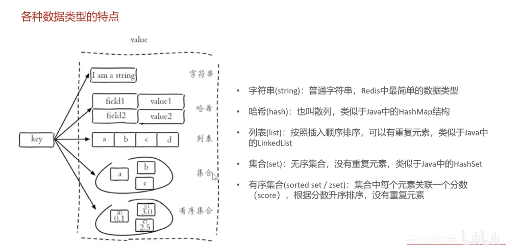
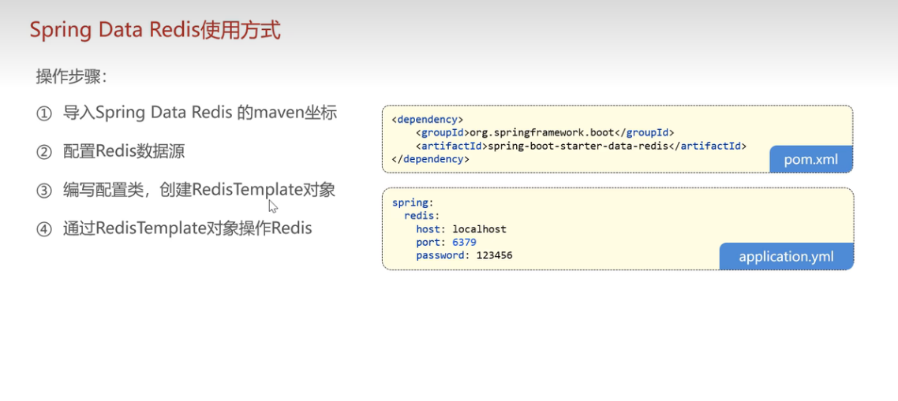

# `redis`入门介绍


##  简介

一个可以将数据存储在内存中，以键值对的方式存储的数据库。


## 5种常用数据类型介绍

`Redis`存储的是key-value结构的数据，其中key是字符串类型，value有5种常用的数据类型：

* 字符串 `string`
* 哈希 `hash`
* 列表 `list`
* 集合` set`
* 有序集合 `sorted set / zset`


**各自的特点：**




## `Redis`常用命令

### 字符串操作命令

Redis字符串类型常用命令：

| 语句                    | 作用                                            |
| ----------------------- | ----------------------------------------------- |
| SET key value           | 设置指定key的值                                 |
| GET key                 | 获取指定key的值                                 |
| SETEX key seconds value | 设置指定key的值，并将key的过期时间设为seconds秒 |
| SETNX key value         | 只有再key不存在时设置key的值(返回1成功，0失败)  |

>注意：
>
>语句各个单词中间是用空格隔开的


### 哈希操作命令

Redis hash 是一个string类型的field和value的映射表，**hash特别适合用于存储对象**，常用命令：

| 语句                 | 作用                                    |
| -------------------- | --------------------------------------- |
| HSET key field value | 将哈希表key中的字段field的值设置为value |
| HGET key field       | 获取存储在哈希表中指定字段的值          |
| HDEL key field       | 删除存储在哈希表中的指定字段            |
| HKEYS key            | 获取哈希表中所有字段(field)             |
| HVALS key            | 获取哈希表中所有的值(value)             |


### 列表操作命令

Redis 列表是简单的**字符串列表**，按照插入顺序排序，常用命令：

| 语句                      | 作用                                                    |
| ------------------------- | ------------------------------------------------------- |
| LPUSH key value1 [value2] | 将一个或多个值插入到**列表头部**                        |
| RPUSH key value1 [value2] | 将一个或多个值插入到**列表尾部**                        |
| LRANGE key start stop     | 获取列表指定范围内的元素(start -1 表示取出列表所有元素) |
| RPOP key                  | 移除并获取列表最后一个元素                              |
| LPOP key                  | 移除并获取列表第一个元素                                |
| LLEN key                  | 获取列表长度                                            |

>注意：
>
>语句开头的L和R是left和right的意思，从左侧查出，从右侧删除
>
>小技巧：
>
>取出列表所有元素：`LRANGE key start -1`


### 集合操作命令

Redis set是**string类型的无需集合**。集合成员是唯一的，集合中不能出现重复数据，常用命令：

| 语句                       | 作用                     |
| -------------------------- | ------------------------ |
| SADD key member1 [member2] | 向集合添加一个或多个成员 |
| SMEMBERS key               | 返回集合中的所有成员     |
| SCARD key                  | 获取集合的成员数         |
| SINTER key1 [key2]         | 返回给定所有集合的交集   |
| SUNION key1 [key2]         | 返回所有给定集合的并集   |
| SREM key member1 [member2] | 删除集合中一个或多个成员 |


### 有序集合操作命令

Redis 有序集合也是**string类型元素的集合，且不允许有重复成员。每个元素都会关联一个double类型的分数**。常用命令：

| 语句                                        | 作用                                                   |
| ------------------------------------------- | ------------------------------------------------------ |
| ZADD key score1 member1 [score2 member2]... | 向有序集合添加一个或多个元素                           |
| ZRANGE key start stop [WITHSCORES]          | 通过索引区间返回有序集合(WITHSCORES：是否需要返回分数) |
| ZINCREBY key increment member               | 有序集合中对指定成员的分数加上增量increment            |
| ZREM key member [member...]                 | 移除有序集合中的一个或多个成员                         |


### 通用命令

Redis的通用命令是不分数据类型的，都可以使用的命令：

| 语句              | 作用                               |
| ----------------- | ---------------------------------- |
| KEYS pattern      | 查找所有符合给定模式(pattern)的key |
| EXISTS key        | 检查给定key是否存在                |
| TYPE key          | 返回key所存储的值的类型            |
| DEL key [key2...] | 该命令用于仔key存在时删除key       |

>都是操作key相关的(●'◡'●)


查询所有set的key：

```
keys set*
```

查询所有的key：

```
keys *
```


## 在Java中操作Redis

### Redis的Java客户端

Redis的Java客户端很多，常见的几种：

* Jedis
* Lettuce
* Spring Data Redis

`Spring Data Redis`是`Spring`的一部分，对`Redis`底层开发包进行了高度封装。在Spring项目中，建议使用这个


## Spring Data Redis使用方式

### 操作步骤：



一：导入

`pom.xml`

```xml
<dependency>
    <groupId>org.springframework.boot</groupId>
    <artifactId>spring-boot-starter-data-redis</artifactId>
</dependency>
```


二：配置数据源

`application.yml`

```yaml
spring:
  redis:
    host: localhost
    port: 6379
    password: 1234
    database: 0 # redis默认启动就会创建16个数据库 0~15，不同数据库数据完全隔离
```

>注意：主要是要配置在spring下第一级


三：编写配置类，创建RedisTemplate对象

`config/RedisConfiguration.class`

```java
package com.sky.config;

import lombok.extern.slf4j.Slf4j;
import org.springframework.boot.autoconfigure.condition.ConditionalOnSingleCandidate;
import org.springframework.context.annotation.Bean;
import org.springframework.context.annotation.Configuration;
import org.springframework.data.redis.connection.RedisConnectionFactory;
import org.springframework.data.redis.core.RedisTemplate;
import org.springframework.data.redis.serializer.StringRedisSerializer;

@Configuration
@Slf4j
public class RedisConfiguration {

    @Bean // 加上bean注解，后面参数中的redisConnectionFactory就会被注入进来
    public RedisTemplate redisTemplate(RedisConnectionFactory redisConnectionFactory){
        log.info("开始创建Redis模板对象...");

        RedisTemplate<Object, Object> redisTemplate = new RedisTemplate<>();
        // 设置Redis的连接工厂对象
        redisTemplate.setConnectionFactory(redisConnectionFactory);
        // 设置Redis key的序列化器（string类型序列化器）
        redisTemplate.setKeySerializer(new StringRedisSerializer());

        return redisTemplate;
    }
}

```

>如果报红，可能是springboot版本过高，不会影响功能的


四：通过`RedisTemplate`对象来操作Redis

```java
// 5种类型的对象
ValueOperations valueOperations = redisTemplate.opsForValue();
SetOperations setOperations = redisTemplate.opsForSet();
HashOperations hashOperations = redisTemplate.opsForHash();
ListOperations listOperations = redisTemplate.opsForList();
ZSetOperations zSetOperations = redisTemplate.opsForZSet();
```

