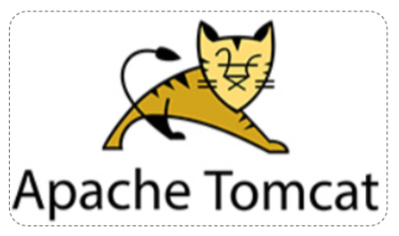
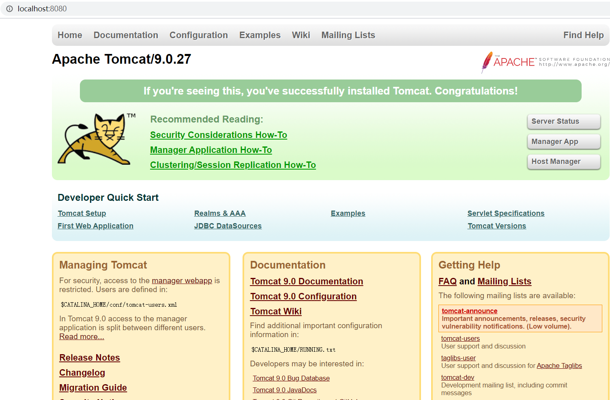

# 3. WEB服务器-Tomcat

## 3.1 简介

### 3.1.1 服务器概述

**服务器硬件**

- 指的也是计算机，只不过服务器要比我们日常使用的计算机大很多。

 

服务器，也称伺服器。是提供计算服务的设备。由于服务器需要响应服务请求，并进行处理，因此一般来说服务器应具备承担服务并且保障服务的能力。

服务器的构成包括处理器、硬盘、内存、系统总线等，和通用的计算机架构类似，但是由于需要提供高可靠的服务，因此在处理能力、稳定性、可靠性、安全性、可扩展性、可管理性等方面要求较高。

在网络环境下，根据服务器提供的服务类型不同，可分为：文件服务器，数据库服务器，应用程序服务器，WEB服务器等。

服务器只是一台设备，必须安装服务器软件才能提供相应的服务。

**服务器软件**

服务器软件：基于ServerSocket编写的程序

- 服务器软件本质是一个运行在服务器设备上的应用程序
- 能够接收客户端请求，并根据请求给客户端响应数据

### 3.1.2 Web服务器

Web服务器是一个应用程序(软件)，对HTTP协议的操作进行封装，使得程序员不必直接对协议进行操作(不用程序员自己写代码去解析http协议规则)，让Web开发更加便捷。主要功能是"提供网上信息浏览服务"。

Web服务器是安装在服务器端的一款软件，将来我们把自己写的Web项目部署到Tomcat服务器软件中，当Web服务器软件启动后，部署在Web服务器软件中的页面就可以直接通过浏览器来访问了。

**Web服务器软件使用步骤**

* 准备静态资源
* 下载安装Web服务器软件
* 将静态资源部署到Web服务器上
* 启动Web服务器使用浏览器访问对应的资源

第1步：准备静态资源

- 在提供的资料中找到静态资源文件

 

第2步：下载安装Web服务器软件

第3步：将静态资源部署到Web服务器上

第4步：启动Web服务器使用浏览器访问对应的资源

浏览器输入：`http://localhost:8080/demo/index.html`

上述内容在演示的时候，使用的是Apache下的Tomcat软件，至于Tomcat软件如何使用，后面会详细的讲到。而对于Web服务器来说，实现的方案有很多，Tomcat只是其中的一种，而除了Tomcat以外，还有很多优秀的Web服务器，比如:

 

Tomcat就是一款软件，我们主要是以学习如何去使用为主。具体我们会从以下这些方向去学习:

1. 简介：初步认识下Tomcat

2. 基本使用: 安装、卸载、启动、关闭、配置和项目部署，这些都是对Tomcat的基本操作

3. IDEA中如何创建Maven Web项目

4. IDEA中如何使用Tomcat,后面这两个都是我们以后开发经常会用到的方式

首选我们来认识下Tomcat。

### 3.1.3 Tomcat

Tomcat服务器软件是一个免费的开源的web应用服务器。是Apache软件基金会的一个核心项目。由Apache，Sun和其他一些公司及个人共同开发而成。

由于Tomcat只支持Servlet/JSP少量JavaEE规范，所以是一个开源免费的轻量级Web服务器。

> JavaEE规范：   JavaEE => Java Enterprise Edition(Java企业版)
>
> avaEE规范就是指Java企业级开发的技术规范总和。包含13项技术规范：JDBC、JNDI、EJB、RMI、JSP、Servlet、XML、JMS、Java IDL、JTS、JTA、JavaMail、JAF

因为Tomcat支持Servlet/JSP规范，所以Tomcat也被称为Web容器、Servlet容器。JavaWeb程序需要依赖Tomcat才能运行。

Tomcat的官网: https://tomcat.apache.org/ 

 

## 3.2 基本使用

### 3.2.1 下载

直接从官方网站下载：https://tomcat.apache.org/download-90.cgi

> Tomcat软件类型说明：
>
> - tar.gz文件，是linux和mac操作系统下的压缩版本
> - zip文件，是window操作系统下压缩版本（我们选择zip文件）

大家可以自行下载，也可以直接使用资料中已经下载好的资源，

Tomcat的软件程序  ：/资料/SpringbootWeb/apache-tomcat-9.0.27-windows-x64.zip

 

 

### 3.2.2 安装与卸载

**安装:** Tomcat是绿色版，直接解压即安装

> 在E盘的develop目录下，将`apache-tomcat-9.0.27-windows-x64.zip`进行解压缩，会得到一个`apache-tomcat-9.0.27`的目录，Tomcat就已经安装成功。

==注意，Tomcat在解压缩的时候，解压所在的目录可以任意，但最好解压到一个不包含中文和空格的目录，因为后期在部署项目的时候，如果路径有中文或者空格可能会导致程序部署失败。==

打开`apache-tomcat-9.0.27`目录就能看到如下目录结构，每个目录中包含的内容需要认识下

  

bin：目录下有两类文件，一种是以`.bat`结尾的，是Windows系统的可执行文件，一种是以`.sh`结尾的，是Linux系统的可执行文件。

webapps：就是以后项目部署的目录

**卸载：**卸载比较简单，可以直接删除目录即可

### 3.2.3 启动与关闭

**启动Tomcat** 

- 双击tomcat解压目录/bin/**startup.bat**文件即可启动tomcat

==注意: tomcat服务器启动后,黑窗口不会关闭,只要黑窗口不关闭,就证明tomcat服务器正在运行==

Tomcat的默认端口为8080，所以在浏览器的地址栏输入：`http://127.0.0.1:8080` 即可访问tomcat服务器

> 127.0.0.1 也可以使用localhost代替。如：`http://localhost:8080`

- 能看到以上图片中Apache Tomcat的内容就说明Tomcat已经启动成功

==注意事项== ：Tomcat启动的过程中，遇到控制台有中文乱码时，可以通常修改conf/logging.prooperties文件解决

 

**关闭:**  关闭有三种方式 

1、强制关闭：直接x掉Tomcat窗口（不建议）

2、正常关闭：bin\shutdown.bat

3、正常关闭：在Tomcat启动窗口中按下 Ctrl+C

- 说明：如果按下Ctrl+C没有反映，可以多按几次

### 3.2.4 常见问题

**问题1：Tomcat启动时，窗口一闪而过**

- 检查JAVA_HOME环境变量是否正确配置

**问题2：端口号冲突**

- 发生问题的原因：Tomcat使用的端口被占用了。

- 解决方案：换Tomcat端口号
  - 要想修改Tomcat启动的端口号，需要修改 conf/server.xml文件

 

> 注: HTTP协议默认端口号为80，如果将Tomcat端口号改为80，则将来访问Tomcat时，将不用输入端口号。

