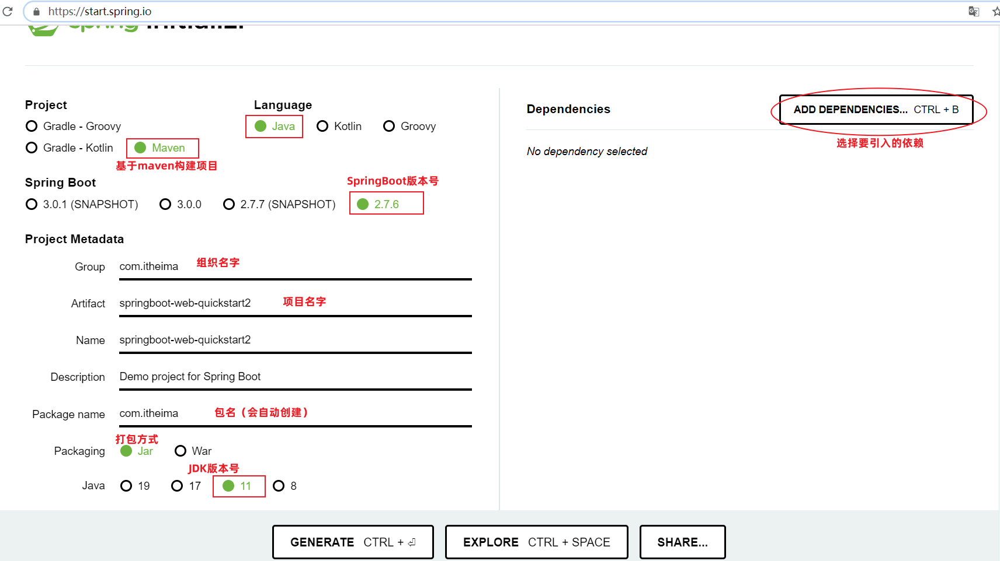
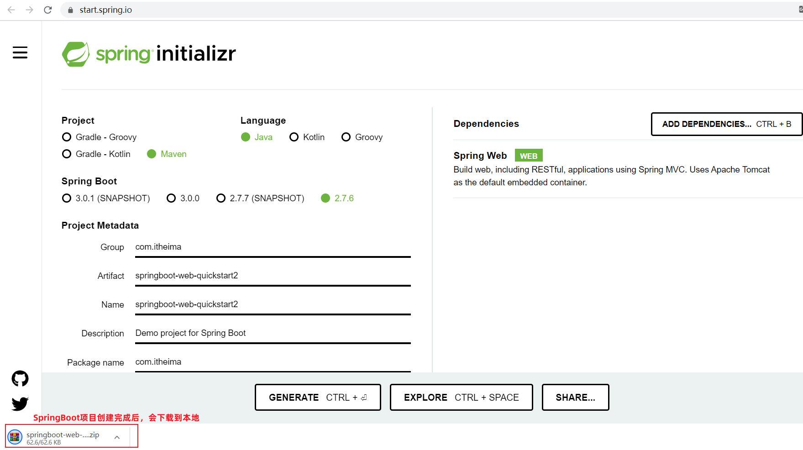

# 3.3 入门程序解析

关于web开发的基础知识，我们可以告一段落了。下面呢，我们在基于今天的核心技术点SpringBoot快速入门案例进行分析。

## 3.3.1 Spring官方骨架

之前我们创建的SpringBoot入门案例，是基于Spring官方提供的骨架实现的。

Spring官方骨架，可以理解为Spring官方为程序员提供一个搭建项目的模板。

我们可以通过访问：https://start.spring.io/ ，进入到官方骨架页面

Spring官方生成的SpringBoot项目，怎么使用呢？

- 解压缩后，就会得到一个SpringBoot项目工程

打开pom.xml文件，我们可以看到springboot项目中引入了web依赖和test依赖

> **结论：不论使用IDEA创建SpringBoot项目，还是直接在官方网站利用骨架生成SpringBoot项目，项目的结构和pom.xml文件中内容是相似的。**

## 3.3.2 起步依赖

在我们之前讲解的SpringBoot快速入门案例中，同样也引用了：web依赖和test依赖

spring-boot-starter-web和spring-boot-starter-test，在SpringBoot中又称为：起步依赖

而在SpringBoot的项目中，有很多的起步依赖，他们有一个共同的特征：就是以`spring-boot-starter-`作为开头。在以后大家遇到spring-boot-starter-xxx这类的依赖，都为起步依赖。

起步依赖有什么特殊之处呢，这里我们以入门案例中引入的起步依赖做为讲解：

- spring-boot-starter-web：包含了web应用开发所需要的常见依赖
- spring-boot-starter-test：包含了单元测试所需要的常见依赖

> **spring-boot-starter-web**内部把关于Web开发所有的依赖都已经导入并且指定了版本，只需引入 `spring-boot-starter-web` 依赖就可以实现Web开发的需要的功能
>
> 

Spring的官方提供了很多现成的starter(起步依赖)，我们在开发相关应用时，只需要引入对应的starter即可。

官方地址：https://docs.spring.io/spring-boot/docs/2.7.2/reference/htmlsingle/#using.build-systems.starters

每一个起步依赖，都用于开发一个特定的功能。

> 举例：当我们开发中需要使用redis数据库时，只需要在SpringBoot项目中，引入：spring-boot-starter-redis ，即可导入redis开发所需要的依赖。

## 3.3.2 SpringBoot父工程

在我们之前开发的SpringBoot入门案例中，我们通过maven引入的依赖，是没有指定具体的依赖版本号的。

为什么没有指定<version>版本号，可以正常使用呢？

- 因为每一个SpringBoot工程，都有一个父工程。依赖的版本号，在父工程中统一管理。

## 3.3.3 内嵌Tomcat

问题：为什么我们之前书写的SpringBoot入门程序中，并没有把程序部署到Tomcat的webapps目录下，也可以运行呢？

原因呢，是因为在我们的SpringBoot中，引入了web运行环境(也就是引入spring-boot-starter-web起步依赖)，其内部已经集成了内置的Tomcat服务器。

我们可以通过IDEA开发工具右侧的maven面板中，就可以看到当前工程引入的依赖。其中已经将Tomcat的相关依赖传递下来了，也就是说在SpringBoot中可以直接使用Tomcat服务器。

 

当我们运行SpringBoot的引导类时(运行main方法)，就会看到命令行输出的日志，其中占用8080端口的就是Tomcat。

 

