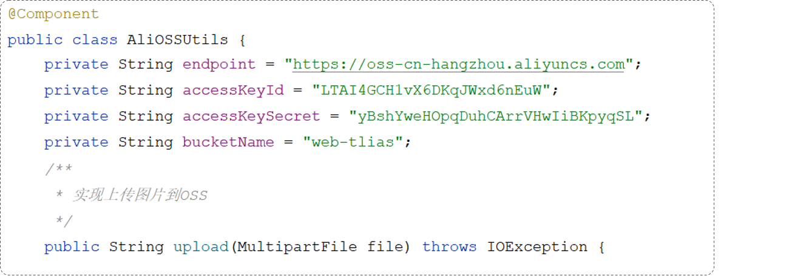
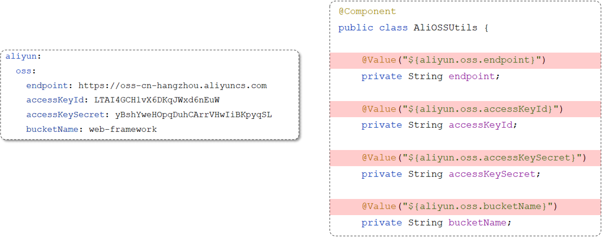

# 配置文件properties和yml

## 2. 配置文件

员工管理的增删改查功能我们已开发完成，但在我们所开发的程序中还一些小问题，下面我们就来分析一下当前案例中存在的问题以及如何优化解决。

### 2.1 参数配置化



在我们之前编写的程序中进行文件上传时，需要调用AliOSSUtils工具类，将文件上传到阿里云OSS对象存储服务当中。而在调用工具类进行文件上传时，需要一些参数：

- endpoint       //阿里云OSS域名
- accessKeyID    //用户身份ID
- accessKeySecret   //用户密钥
- bucketName      //存储空间的名字


关于以上的这些阿里云相关配置信息，我们是直接写死在java代码中了(硬编码)，如果我们在做项目时每涉及到一个第三方技术服务，就将其参数硬编码，那么在Java程序中会存在两个问题：

1. 如果这些参数发生变化了，就必须在源程序代码中改动这些参数，然后需要重新进行代码的编译，将Java代码编译成class字节码文件再重新运行程序。（比较繁琐）
2. 如果我们开发的是一个真实的企业级项目， Java类可能会有很多，如果将这些参数分散的定义在各个Java类当中，我们要修改一个参数值，我们就需要在众多的Java代码当中来定位到对应的位置，再来修改参数，修改完毕之后再重新编译再运行。（参数配置过于分散，是不方便集中的管理和维护）


为了解决以上分析的问题，我们可以将参数配置在配置文件中。如下：

~~~properties
#自定义的阿里云OSS配置信息
aliyun.oss.endpoint=https://oss-cn-hangzhou.aliyuncs.com
aliyun.oss.accessKeyId=LTAI4GCH1vX6DKqJWxd6nEuW
aliyun.oss.accessKeySecret=yBshYweHOpqDuhCArrVHwIiBKpyqSL
aliyun.oss.bucketName=web-tlias
~~~


在将阿里云OSS配置参数交给properties配置文件来管理之后，我们的AliOSSUtils工具类就变为以下形式：

~~~java
@Component
public class AliOSSUtils {
    /*以下4个参数没有指定值（默认值：null）*/
    private String endpoint;
    private String accessKeyId;
    private String accessKeySecret;
    private String bucketName;

    //省略其他代码...
}
~~~

> 而此时如果直接调用AliOSSUtils类当中的upload方法进行文件上传时，这4项参数全部为null，原因是因为并没有给它赋值。
>
> 此时我们是不是需要将配置文件当中所配置的属性值读取出来，并分别赋值给AliOSSUtils工具类当中的各个属性呢？那应该怎么做呢？


因为application.properties是springboot项目默认的配置文件，所以springboot程序在启动时会默认读取application.properties配置文件，而我们可以使用一个现成的注解：**@Value，获取配置文件中的数据。**

@Value 注解通常用于外部配置的属性注入，具体用法为： @Value("${配置文件中的key}")

~~~java
@Component
public class AliOSSUtils {
		// 注意别导错包了，是spring框架的，别导成lombok的了	
  
    @Value("${aliyun.oss.endpoint}")
    private String endpoint;
    
    @Value("${aliyun.oss.accessKeyId}")
    private String accessKeyId;
    
    @Value("${aliyun.oss.accessKeySecret}")
    private String accessKeySecret;
    
    @Value("${aliyun.oss.bucketName}")
    private String bucketName;
 	
 	//省略其他代码...
 }   
~~~


使用postman测试：


### 2.2 yml配置文件

前面我们一直使用springboot项目创建完毕后自带的application.properties进行属性的配置，那其实呢，在springboot项目当中是支持多种配置方式的，除了支持properties配置文件以外，还支持另外一种类型的配置文件，就是我们接下来要讲解的yml格式的配置文件。

- application.properties

  ```properties
  server.port=8080
  server.address=127.0.0.1
  ```

- application.yml 

  ```yml
  server:
    port: 8080
    address: 127.0.0.1
  ```

- application.yaml 

  ```yml
  server:
    port: 8080
    address: 127.0.0.1
  ```


> yml 格式的配置文件，后缀名有两种：
>
> - yml （推荐）
> - yaml

常见配置文件格式对比：


我们可以看到配置同样的数据信息，yml格式的数据有以下特点：

- 容易阅读
- 容易与脚本语言交互
- 以数据为核心，重数据轻格式


简单的了解过springboot所支持的配置文件，以及不同类型配置文件之间的优缺点之后，接下来我们就来了解下yml配置文件的基本语法：

- 大小写敏感
- 数值前边必须有空格，作为分隔符
- 使用缩进表示层级关系，缩进时，不允许使用Tab键，只能用空格（idea中会自动将Tab转换为空格）
- 缩进的空格数目不重要，只要相同层级的元素左侧对齐即可
- `#`表示注释，从这个字符一直到行尾，都会被解析器忽略


了解完yml格式配置文件的基本语法之后，接下来我们再来看下yml文件中常见的数据格式。在这里我们主要介绍最为常见的两类：

1. 定义对象或Map集合
2. 定义数组、list或set集合

对象/Map集合

```yml
user:
  name: zhangsan
  age: 18
  password: 123456
```

数组/List/Set集合

```yml
hobby: 
  - java
  - game
  - sport
```


熟悉完了yml文件的基本语法后，我们修改下之前案例中使用的配置文件，变更为application.yml配置方式：

1. 修改application.properties名字为：`_application.properties`（名字随便更换，只要加载不到即可）
2. 创建新的配置文件： `application.yml`

原有application.properties文件：


新建的application.yml文件：

~~~yaml
spring:
  datasource:
    driver-class-name: com.mysql.cj.jdbc.Driver
    url: jdbc:mysql://localhost:3306/tlias
    username: root
    password: 1234
  servlet:
    multipart:
      max-file-size: 10MB
      max-request-size: 100MB
      
mybatis:
  configuration:
    log-impl: org.apache.ibatis.logging.stdout.StdOutImpl
    map-underscore-to-camel-case: true
	
aliyun:
  oss:
    endpoint: https://oss-cn-hangzhou.aliyuncs.com
    accessKeyId: LTAI4GCH1vX6DKqJWxd6nEuW
    accessKeySecret: yBshYweHOpqDuhCArrVHwIiBKpyqSL
    bucketName: web-397
~~~


### 2.3 `@ConfigurationProperties`

讲解完了yml配置文件之后，最后再来介绍一个注解`@ConfigurationProperties`。在介绍注解之前，我们先来看一个场景，分析下代码当中可能存在的问题：



我们在application.properties或者application.yml中配置了阿里云OSS的四项参数之后，如果java程序中需要这四项参数数据，我们直接通过@Value注解来进行注入。这种方式本身没有什么问题问题，但是如果说需要注入的属性较多(例：需要20多个参数数据)，我们写起来就会比较繁琐。

那么有没有一种方式可以简化这些配置参数的注入呢？答案是肯定有，在Spring中给我们提供了一种简化方式，可以直接将配置文件中配置项的值自动的注入到对象的属性中。


**Spring提供的简化方式套路：**

1. 需要创建一个实现类，且实体类中的属性名和配置文件当中key的名字必须要一致

   > 比如：配置文件当中叫endpoints，实体类当中的属性也得叫endpoints，另外实体类当中的属性还需要提供 getter / setter方法

2. 需要将实体类交给Spring的IOC容器管理，成为IOC容器当中的bean对象

3. 在实体类上添加`@ConfigurationProperties`注解，并通过perfect属性来指定配置参数项的前缀


实体类：AliOSSProperties

~~~java
import lombok.Data;
import org.springframework.boot.context.properties.ConfigurationProperties;
import org.springframework.stereotype.Component;

/*阿里云OSS相关配置*/
@Data
@Component
@ConfigurationProperties(prefix = "aliyun.oss")
public class AliOSSProperties {
    //区域
    private String endpoint;
    //身份ID
    private String accessKeyId ;
    //身份密钥
    private String accessKeySecret ;
    //存储空间
    private String bucketName;
}
~~~


AliOSSUtils工具类：

~~~java
import com.aliyun.oss.OSS;
import com.aliyun.oss.OSSClientBuilder;
import org.springframework.beans.factory.annotation.Autowired;
import org.springframework.stereotype.Component;
import org.springframework.web.multipart.MultipartFile;
import java.io.IOException;
import java.io.InputStream;
import java.util.UUID;

@Component //当前类对象由Spring创建和管理
public class AliOSSUtils {

    //注入配置参数实体类对象
    @Autowired
    private AliOSSProperties aliOSSProperties;
   
    
    /**
     * 实现上传图片到OSS
     */
    public String upload(MultipartFile multipartFile) throws IOException {
        // 获取上传的文件的输入流
        InputStream inputStream = multipartFile.getInputStream();

        // 避免文件覆盖
        String originalFilename = multipartFile.getOriginalFilename();
        String fileName = UUID.randomUUID().toString() + originalFilename.substring(originalFilename.lastIndexOf("."));

        //上传文件到 OSS
        OSS ossClient = new OSSClientBuilder().build(aliOSSProperties.getEndpoint(),
                aliOSSProperties.getAccessKeyId(), aliOSSProperties.getAccessKeySecret());
        ossClient.putObject(aliOSSProperties.getBucketName(), fileName, inputStream);

        //文件访问路径
        String url =aliOSSProperties.getEndpoint().split("//")[0] + "//" + aliOSSProperties.getBucketName() + "." + aliOSSProperties.getEndpoint().split("//")[1] + "/" + fileName;

        // 关闭ossClient
        ossClient.shutdown();
        return url;// 把上传到oss的路径返回
    }
}

~~~


在我们添加上注解后，会发现idea窗口上面出现一个红色警告：

 

这个警告提示是告知我们还需要引入一个依赖：

~~~xml
<dependency>
    <groupId>org.springframework.boot</groupId>
    <artifactId>spring-boot-configuration-processor</artifactId>
</dependency>
~~~

当我们在pom.xml文件当中配置了这项依赖之后，我们重新启动服务，大家就会看到在properties或者是yml配置文件当中，就会提示阿里云 OSS 相关的配置项。所以这项依赖它的作用就是会自动的识别被`@Configuration Properties`注解标识的bean对象。


> 刚才的红色警告，已经变成了一个灰色的提示，提示我们需要重新运行springboot服务

@ConfigurationProperties注解我们已经介绍完了，接下来我们就来区分一下@ConfigurationProperties注解以及我们前面所介绍的另外一个@Value注解：

相同点：都是用来注入外部配置的属性的。

不同点：

- @Value注解只能一个一个的进行外部属性的注入。

- @ConfigurationProperties可以**批量**的将外部的属性配置注入到bean对象的属性中。


如果要注入的属性非常的多，并且还想做到复用，就可以定义这么一个bean对象。通过 configuration properties 批量的将外部的属性配置直接注入到 bin 对象的属性当中。在其他的类当中，我要想获取到注入进来的属性，我直接注入 bin 对象，然后调用 get 方法，就可以获取到对应的属性值了


**更加细致步骤可以看本文件夹索引13**


