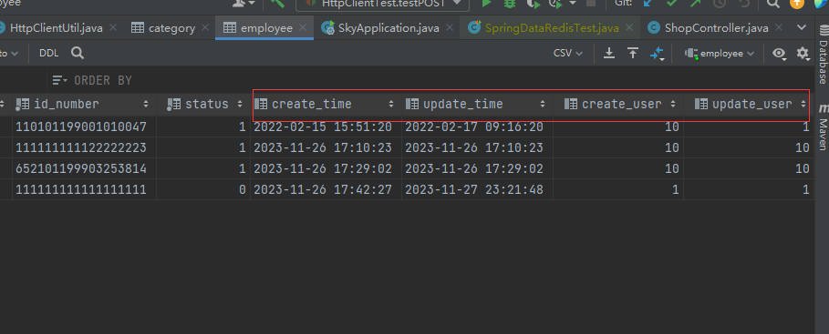
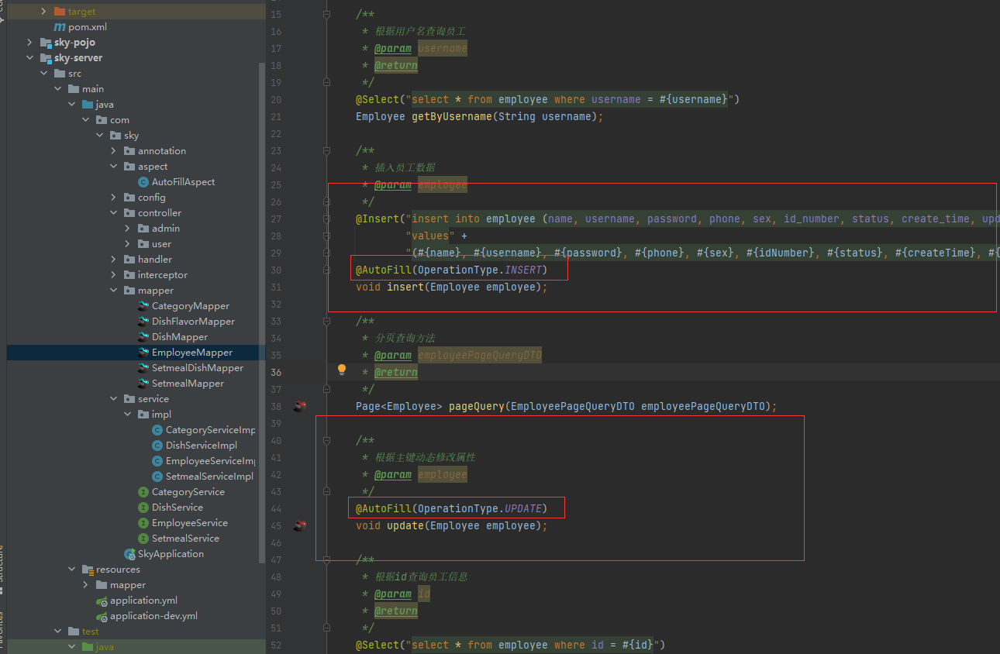

# AOP示例-自动填充公共字段

## 需求介绍

在我们的数据库设计中，我们常常会为表设计以下4个甚至更多字段来记录该条记录的操作信息：



`create_time`：记录该条记录的创建时间

`create_user`：用于记录该条记录的创建人

`update_time`：记录该条记录的修改时间

`update_user`：用于记录该条记录的修改人

拥有以上4个字段的表，在修改和创建时，常常会重复性操作这四个字段，那我们有没有什么办法能够通过代码实现来帮助我们填写这四个公共字段呢？

答案时肯定有的，接下来请看后续


重复性代码示例：

```java
// 例如，我们进行保存操作时，就会重复行操作以上四个字段，将其手动赋值
@Override
public void save(EmployeeDTO employeeDTO) {
    Employee employee = new Employee();

    // 对象属性拷贝（DTO 和实体类的属性名一致，所以直接拷贝过来就行了不用一个一个赋值）
    // 拷贝前提：属性名保持一致
    BeanUtils.copyProperties(employeeDTO, employee);

    // 设置DTO中没有的属性
    // 设置账号状态
    employee.setStatus(StatusConstant.ENABLE); // 使用自定义的常量

    // 设置密码 默认密码123456
    employee.setPassword(DigestUtils.md5DigestAsHex(PasswordConstant.DEFAULT_PASSWORD.getBytes()));

	// 4个公共字段进行赋值
    // 设置当前记录的创建时间和修改事件
        employee.setCreateTime(LocalDateTime.now());
        employee.setUpdateTime(LocalDateTime.now());

    // 设置当前记录的创建人id和修改人id
    // 通过ThreadLocal获取对应用户登录的id
        employee.setCreateUser(BaseContext.getCurrentId());
       	employee.setUpdateUser(BaseContext.getCurrentId());

    employeeMapper.insert(employee);
}
```


## `AOP`编程自动填充公共字段

首先我们要分析，我们填充的4个公共字段一般是用在**更新**，和**插入**两个操作上，**更新操作**需要手动填充`update`相关的**两个字段**，**插入操作**需要手动赋值**4个字段**，所以这里我们需要一种手段能够区分这两个操作。

第二步我们一般都是在service层进行赋值操作，一般都是将对应的entity实体的4个公共字段手动赋值完成后，交给`mybatis`来帮助我们插入或更新进数据库中，所以我们这里的简化操作就是，有什么手段能够帮助我们在将实体交给`mybatis`之前能够统一赋值好，就可以了。


上面两步的解决办法：

第一步的解决办法：

区分：通过创建一个**枚举类**就能区分两种操作，标识不同操作：我们用**自定义注释**+枚举类


第二步的解决方式:

通过spring的AOP编程，**拦截mapper层**对应的**插入**和**更新**方法，通过反射统一对公共字段进行填充


**反射的功能十分强大**


## 具体实现


### 第一步：自定义枚举类

作用：区分不同的操作

`enumeration/OperationType.class`

```java
package com.sky.enumeration;

/**
 * 数据库操作类型
 */
public enum OperationType {

    /**
     * 更新操作
     */
    UPDATE,

    /**
     * 插入操作
     */
    INSERT

}

```


### 第二步：创建自定义注释

作用：方便标识和区分service层方法

`annotation/AutoFill`

```java
package com.sky.annotation;

import com.sky.enumeration.OperationType;

import java.lang.annotation.ElementType;
import java.lang.annotation.Retention;
import java.lang.annotation.RetentionPolicy;
import java.lang.annotation.Target;

/**
 * 自定义注解：用于标识某个方法是否需要进行功能字段自动处理
 */
@Target(ElementType.METHOD)
@Retention(RetentionPolicy.RUNTIME)
public @interface AutoFill {
    // 用来指定数据库操作类型：UPDATE INSERT
    OperationType value();
}

```


### 第三步：自定义切面类

作用：拦截对应方法，并通过反射添加公共字段

`aspect/AutoFillAspect.class`

```java
package com.sky.aspect;

import com.sky.annotation.AutoFill;
import com.sky.constant.AutoFillConstant;
import com.sky.context.BaseContext;
import com.sky.enumeration.OperationType;
import lombok.extern.slf4j.Slf4j;
import org.aspectj.lang.JoinPoint;
import org.aspectj.lang.Signature;
import org.aspectj.lang.annotation.Aspect;
import org.aspectj.lang.annotation.Before;
import org.aspectj.lang.annotation.Pointcut;
import org.aspectj.lang.reflect.MethodSignature;
import org.springframework.stereotype.Component;

import java.lang.reflect.Method;
import java.time.LocalDateTime;

/**
 * 自定义切面类，实现公共字段自动填充逻辑
 */
@Aspect // 指定为切面类
@Component
@Slf4j
public class AutoFillAspect {
    /**
     * 指定切入点
     */
    @Pointcut("execution(* com.sky.mapper.*.*(..)) && @annotation(com.sky.annotation.AutoFill)")
    public void autoFillPointCut() {}


    // 前置通知(应为我们需要在方法之前去执行)
    @Before("autoFillPointCut()") // 拦截切入点对应的方法
    public void autoFill(JoinPoint joinPoint) {
        log.info("开始进行公共字段的自动填充...");

        // 第一步：获取当前被拦截方法的数据库操作类型 是insert还是update
        MethodSignature signature = (MethodSignature) joinPoint.getSignature(); // 向下转型，获取方法签名
        AutoFill autoFill = signature.getMethod().getAnnotation(AutoFill.class);// 获取拦截方法上的注解

        OperationType operationType = autoFill.value(); // 获取当前方法的操作类型的枚举

        // 第二步：获取被拦截方法的参数 --- 实体对象
        Object[] args = joinPoint.getArgs();
        if(args == null || args.length == 0) {
            // 特殊情况，没有获取到参数,直接return就行
            return;
        }

        // 注意这里接收参数实体时，一定要用Object类型，因为我们这里是一个通用的方法，要用在所有mapper上的
        Object entity = args[0]; // 注意这里我们要规定update和insert相关mapper方法必须第一个参数传对应实体
        // 第三步：准备统一的赋值数据
        LocalDateTime now = LocalDateTime.now();
        Long currentId = BaseContext.getCurrentId();

        // 第四步：根据当前被拦截方法的类型，为对应的属性通过反射来进行赋值
        // 判读当前拦截到的方法属于那种数据库操作类型
        if(operationType == OperationType.INSERT) {
            // 如果是插入操作，为4个公共字段赋值
            // 通过反射拿到对应实体对象身上对应的4个setter方法
            try {
                Method setCreateTime = entity.getClass().getDeclaredMethod(AutoFillConstant.SET_CREATE_TIME, LocalDateTime.class);
                Method setUpdateTime = entity.getClass().getDeclaredMethod(AutoFillConstant.SET_UPDATE_TIME, LocalDateTime.class);
                Method setCreateUser = entity.getClass().getDeclaredMethod(AutoFillConstant.SET_CREATE_USER, Long.class);
                Method setUpdateUser = entity.getClass().getDeclaredMethod(AutoFillConstant.SET_UPDATE_USER, Long.class);


                // 通过反射来进行赋值
                setCreateTime.invoke(entity, now);
                setUpdateTime.invoke(entity, now);
                setCreateUser.invoke(entity, currentId);
                setUpdateUser.invoke(entity, currentId);
            } catch (Exception e) {
                e.printStackTrace();
            }

        }else if(operationType == OperationType.UPDATE) {
            // 如果是更新操作，只用为2个公共字段赋值
            // 通过反射获取2个setter方法
            try {
                Method setUpdateTime = entity.getClass().getDeclaredMethod(AutoFillConstant.SET_UPDATE_TIME, LocalDateTime.class);
                Method setUpdateUser = entity.getClass().getDeclaredMethod(AutoFillConstant.SET_UPDATE_USER, Long.class);

                // 通过反射来进行赋值
                setUpdateTime.invoke(entity, now);
                setUpdateUser.invoke(entity, currentId);
            } catch (Exception e) {
                e.printStackTrace();
            }
        }
    }
}

```


### 第四步：使用

在mapper层，插入操作的方法上写上`AutoFill(OperationType.INSERT)`就能帮我们添加4个公共字段。

更新的方法上写入`@AutoFill(OperationType.UPDATE)`注解，就能帮助我们添加2个更新相关的公共字段


示例图：

