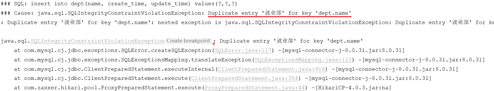

# 异常处理

## 3. 异常处理

### 3.1 当前问题

登录功能和登录校验功能我们都实现了，下面我们学习下今天最后一块技术点：异常处理。首先我们先来看一下系统出现异常之后会发生什么现象，再来介绍异常处理的方案。


我们打开浏览器，访问系统中的新增部门操作，系统中已经有了 "就业部" 这个部门，我们再来增加一个就业部，看看会发生什么现象。

   

点击确定之后，窗口关闭了，页面没有任何反应，就业部也没有添加上。 而此时，大家会发现，网络请求报错了。

 

状态码为500，表示服务器端异常，我们打开idea，来看一下，服务器端出了什么问题。

 

上述错误信息的含义是，dept部门表的name字段的值 就业部 重复了，因为在数据库表dept中已经有了就业部，我们之前设计这张表时，为name字段建议了唯一约束，所以该字段的值是不能重复的。

而当我们再添加就业部，这个部门时，就违反了唯一约束，此时就会报错。


我们来看一下出现异常之后，最终服务端给前端响应回来的数据长什么样。

 

响应回来的数据是一个JSON格式的数据。但这种JSON格式的数据还是我们开发规范当中所提到的统一响应结果Result吗？显然并不是。由于返回的数据不符合开发规范，所以前端并不能解析出响应的JSON数据。

接下来我们需要思考的是出现异常之后，当前案例项目的异常是怎么处理的？

- 答案：没有做任何的异常处理


当我们没有做任何的异常处理时，我们三层架构处理异常的方案：

- Mapper接口在操作数据库的时候出错了，此时异常会往上抛(谁调用Mapper就抛给谁)，会抛给service。 
- service 中也存在异常了，会抛给controller。
- 而在controller当中，我们也没有做任何的异常处理，所以最终异常会再往上抛。最终抛给框架之后，框架就会返回一个JSON格式的数据，里面封装的就是错误的信息，但是框架返回的JSON格式的数据并不符合我们的开发规范。


### 3.2 解决方案

那么在三层构架项目中，出现了异常，该如何处理?

- 方案一：在所有Controller的所有方法中进行try…catch处理
  - 缺点：代码臃肿（不推荐）
- 方案二：**全局异常处理器**
  - 好处：简单、优雅（推荐）


### 3.3 全局异常处理器

我们该怎么样定义全局异常处理器？

- 定义全局异常处理器非常简单，就是定义一个类，在类上加上一个注解`@RestControllerAdvice`，加上这个注解就代表我们定义了一个全局异常处理器。
- 在全局异常处理器当中，需要定义一个方法来捕获异常，在这个方法上需要加上注解`@ExceptionHandler`。通过`@ExceptionHandler`注解当中的value属性来指定我们要捕获的是哪一类型的异常。

创建`exception/GlobalExceptionHandler.class`

~~~java
@RestControllerAdvice
public class GlobalExceptionHandler {

    //处理异常（这里捕获所有异常）
    @ExceptionHandler(Exception.class) //指定能够处理的异常类型
    public Result ex(Exception e){
        e.printStackTrace();//打印堆栈中的异常信息

        //捕获到异常之后，响应一个标准的Result
        return Result.error("对不起,操作失败,请联系管理员");
    }
}
~~~

> @RestControllerAdvice = @ControllerAdvice + @ResponseBody
>
> 处理异常的方法返回值会转换为json后再响应给前端


重新启动SpringBoot服务，打开浏览器，再来测试一下添加部门这个操作，我们依然添加已存在的 "就业部" 这个部门：

 

 

此时，我们可以看到，出现异常之后，异常已经被全局异常处理器捕获了。然后返回的错误信息，被前端程序正常解析，然后提示出了对应的错误提示信息。


以上就是全局异常处理器的使用，主要涉及到两个注解：

- @RestControllerAdvice  //表示当前类为全局异常处理器
- @ExceptionHandler  //指定可以捕获哪种类型的异常进行处理


### 3.4 第二种写法

使用这三个注解：

* `@ControllerAdvice(annotations = {RestController.class, Controller.class})`：这个注解需要手动指定一下那些注解标记的需要被拦截下来，上面这种写法指有`RestController`和`Controller`的注解类会被拦截
* `@ResponseBody`为了返回JSON格式数据要加这个注解
* `@ExceptionHandler`  //指定可以捕获哪种类型的异常进行处理

示例：

```java
package com.itheima.reggie.common;

import lombok.extern.slf4j.Slf4j;
import org.springframework.stereotype.Controller;
import org.springframework.web.bind.annotation.ControllerAdvice;
import org.springframework.web.bind.annotation.ExceptionHandler;
import org.springframework.web.bind.annotation.RestController;
import 
import java.sql.SQLIntegrityConstraintViolationException;

/**
 * 全局异常处理
 */

@ControllerAdvice(annotations = {RestController.class, Controller.class})
@ResponseBody
@Slf4j
public class GlobalExceptionHandler {
    /**
     * 异常处理，
     * @return
     */
    @ExceptionHandler(SQLIntegrityConstraintViolationException.class)
    public R<String> exceptionHandler(SQLIntegrityConstraintViolationException ex) {
        log.error(ex.getMessage());
        if(ex.getMessage().contains("Duplicate entry")) {
            // 如果有重复的，就直接这样返回
            String[] str = ex.getMessage().split(" ");
            String msg = str[2] + "已存在";
            return R.error(msg);
          	// 这里截取了一下SQL返回的异常信息，然后组织了一下响应数据
        }
        return R.error("未知错误");
    }
}

```


