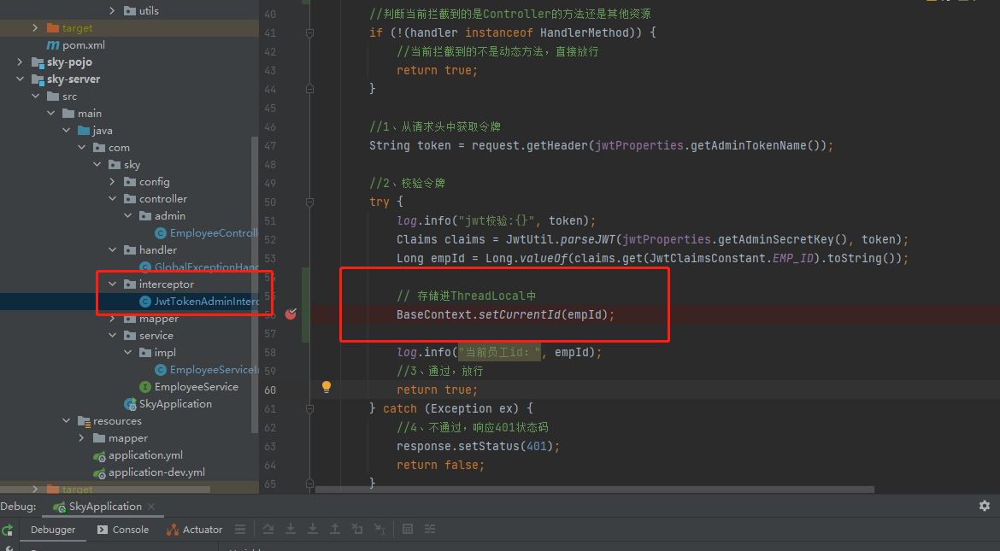

# ThreadLocal线程局部变量


## 简介

`ThreadLocal`并不是一个Thread，而是Thread的局部变量。

`ThreadLocal`为每一个线程提供一个**单独的一份存储空间**，具有线程隔离效果，只有在线程内才能获取对应的值，线程外则不能访问


## 使用地方

再javaWeb项目中，每次发起的一个请求，tomcat服务器都会为我们开启一个独立的线程。所以当我们想要再这个独立的线程中存点儿东西的时候，就可以使用这个局部变量

例如：

1. 存储用户登录的ID


## 常用方法

`ThreadLocal`常用方法：

* public void set(T value) 设置当前线程的线程局部变量的值
* public T get() 返回当前线程所对应的线程局部变量的值
* public void remove() 移除当前线程的线程局部变量


## 常用方式

我们一般会直接将这个ThreadLocal封装成工具类来使用，封装如下：

`context/BaseContext.class`

```java
package com.sky.context;

public class BaseContext {

    public static ThreadLocal<Long> threadLocal = new ThreadLocal<>();

    public static void setCurrentId(Long id) {
        threadLocal.set(id);
    }

    public static Long getCurrentId() {
        return threadLocal.get();
    }

    public static void removeCurrentId() {
        threadLocal.remove();
    }

}

```

>注意：这个是针对用户登录ID的


### 登录使用ThreadLocal

一般正常情况下，我们都会在拦截器中拦截请求，并通过JWT解析当前发送请求的token，解析出当前登录用户ID，然后调用set方法将用户id存入ThreadLocal

例如下面：（存入）




取出就不用多说了吧，直接在想要取出id的地方调用：

```java
BaseContext.getCurrentId()
```

