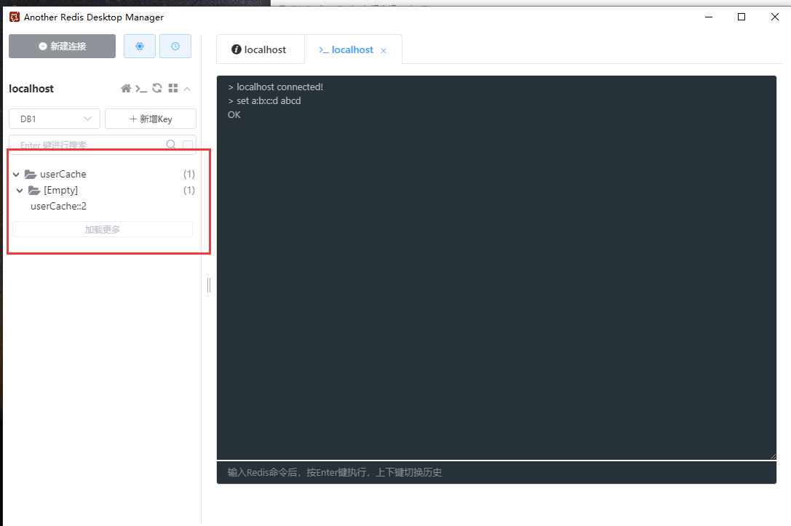

# Spring Cache


## 介绍

Spring Cache是一个框架，实现了基于**注解**的缓存功能，只需要简单地添加一个注解，即可实现缓存功能。


Spring Cache 提供了一层抽象，底层可以切换不同地缓存实现，例如：

* EHCache
* Caffeine
* **Redis**

>注意：
>
>我们在springboot项目中，如果使用的是redis客户端，也就是`Spring Data Redis`，spring cache的底层实现就会使用redis


坐标信息：

```xml
<dependency>
  <groupId>org.springframework.boot</groupId>
  <artifactId>spring-boot-starter-cache</artifactId>
  <version>2.7.3</version>
</dependency>
```


## 常用注解(重要)


| 注解           | 说明                                                         |
| -------------- | ------------------------------------------------------------ |
| @EnableCaching | 开启缓存注解功能，通常加在启动类上                           |
| @Cacheable     | 在方法执行前闲检查缓存中是否有数据，如果有数据，则会直接返回缓存数据，如果没有缓存数据，调用方法将方法返回值放入缓存中(**又取又放**) |
| @CachePut      | 将方法的返回值放入缓存中（**只放**）                         |
| @CacheEvict    | 将一条或多条数据从缓存中**删除**                             |


### `@CachePut`

基本用法：

```java
@PostMapping
// redis中的key的格式 cacheNames::key
@CachePut(cacheNames = "userCache", key = "#user.id") // key这样写，这里是拿到user的id 保证和形参user名称一致
// @CachePut(cacheNames = "userCache", key = "#result.id") // 对象导航，获取的是返回值的user
// @CachePut(cacheNames = "userCache", key = "#p0.id"); // 获取第一个形参也就是还是user
public User save(@RequestBody User user){
    userMapper.insert(user);
    return user;
}
```

>注意点1：
>
>为什么第一种写法拿到的是形参的user，却也能得到存储进数据库的id呢？
>
>第一：是应为我们在mapper或xml中设置了id返回，返回了存储进msql后的id，并赋值给了user.id
>
>第二：形参user和最后返回值的user是同一个引用，他们都指向一个user所以是一致的，mybatis将id赋值的user就是形参的那个user

>注意点2：
>
>一定要注意cacheNames，相关业务的名字要保持一致，例如我们现在是user相关的取名为userCache，那么后续的操作也需要将cacheNames取名为userCache（和user业务相关的）


调用`save`方法后：




###　`@Cacheable`

基本用法：

```java
@GetMapping
// 缓存逻辑：先查缓存，如果缓存有直接返回，如果没有查询数据库返回，并将返回值放入缓存中
@Cacheable(cacheNames = "userCache", key = "#id")
public User getById(Long id){
    User user = userMapper.getById(id);
    return user;
}
```

>注意点：
>
>该注解会在方法执行前就去操作，本质使用代理对象
