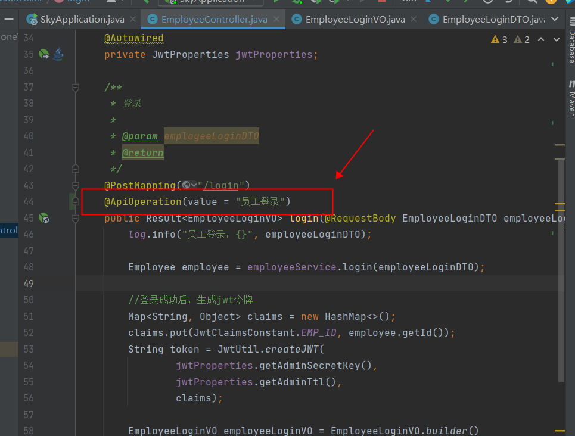

# Swagger


## 介绍

使用Swagger只需要按照规范去定义接口以及接口相关信息，就可以做到直接生成接口文档，以及**在线的接口调试页面**

官网：https://swagger.io/


`Knife4j`是为Java MVC框架集成的Swagger生成Api文档的增强解决方案，所以我们项目中一般使用`knife4j`


## 使用方式

### 1. 导入knife4j的maven坐标

具体pom.xml文件：

```
<properties>
    <knife4j>3.0.2</knife4j>
</properties>
<dependency>
    <groupId>com.github.xiaoymin</groupId>
    <artifactId>knife4j-spring-boot-starter</artifactId>
    <version>${knife4j}</version>
</dependency>
```


### 2. 在配置类中加如knife4j的相关配置


`config/WebMvcConfiguration.class`

```java
package com.sky.config;

import com.sky.interceptor.JwtTokenAdminInterceptor;
import lombok.extern.slf4j.Slf4j;
import org.springframework.beans.factory.annotation.Autowired;
import org.springframework.context.annotation.Bean;
import org.springframework.context.annotation.Configuration;
import org.springframework.web.servlet.config.annotation.InterceptorRegistry;
import org.springframework.web.servlet.config.annotation.ResourceHandlerRegistry;
import org.springframework.web.servlet.config.annotation.WebMvcConfigurationSupport;
import springfox.documentation.builders.ApiInfoBuilder;
import springfox.documentation.builders.PathSelectors;
import springfox.documentation.builders.RequestHandlerSelectors;
import springfox.documentation.service.ApiInfo;
import springfox.documentation.spi.DocumentationType;
import springfox.documentation.spring.web.plugins.Docket;

/**
 * 配置类，注册web层相关组件
 */
@Configuration
@Slf4j
public class WebMvcConfiguration extends WebMvcConfigurationSupport {

    @Autowired
    private JwtTokenAdminInterceptor jwtTokenAdminInterceptor;

    /**
     * 注册自定义拦截器
     *
     * @param registry
     */
    protected void addInterceptors(InterceptorRegistry registry) {
        log.info("开始注册自定义拦截器...");
        registry.addInterceptor(jwtTokenAdminInterceptor)
                .addPathPatterns("/admin/**")
                .excludePathPatterns("/admin/employee/login");
    }

    /**
     * 通过knife4j生成接口文档
     * @return
     */
    @Bean
    public Docket docket() {
        ApiInfo apiInfo = new ApiInfoBuilder()
                .title("苍穹外卖项目接口文档")
                .version("2.0")
                .description("苍穹外卖项目接口文档")
                .build();
        Docket docket = new Docket(DocumentationType.SWAGGER_2)
                .apiInfo(apiInfo)
                .select()
          			// 关键是这里，要指定生成接口需要扫描的包(具体就是controller包,设置最外层controller就行，会自动扫描子包)
                .apis(RequestHandlerSelectors.basePackage("com.sky.controller"))
                .paths(PathSelectors.any())
                .build();
        return docket;
    }

    /**
     * 设置静态资源映射
     * @param registry
     */
    protected void addResourceHandlers(ResourceHandlerRegistry registry) {
        registry.addResourceHandler("/doc.html").addResourceLocations("classpath:/META-INF/resources/");
        registry.addResourceHandler("/webjars/**").addResourceLocations("classpath:/META-INF/resources/webjars/");
    }
}

```


### 3. 设置静态资源映射，否则接口文档页面无法正确访问

具体的配置也在第二步代码里已经配置了

```java
protected void addResourceHandlers(ResourceHandlerRegistry registry) {
  	log.info("开始设置静态资源映射...");
    registry.addResourceHandler("/doc.html").addResourceLocations("classpath:/META-INF/resources/");
    registry.addResourceHandler("/webjars/**").addResourceLocations("classpath:/META-INF/resources/webjars/");
}
```


>注意：
>
>如果配置好发现网页打不开，那说明静态资源映射有问题，如果能打开网页但是看不到接口，说明上面扫描包的路径配置错误


## 常用注解

通过注解可以控制生成的接口文档，使文档拥有更好的**可读性**，常用注解如下：


**这四个注解在使用Swagger开发过程中都必须要使用！！！**


### @Api

用在类上，例如Controller，表示对类的说明，一般我们都会使用里面的`tags`参数，用来描述类

使用示例：


我们在员工的`EmployeeController`上加上一个`@Api`注解并给相关描述，产生的效果就是如下：


### @ApiOperation

用在方法上，一般是使用在controller下面的方法上，用来描述一下方法的作用，一般使用`value`参数

使用示例：




产生的效果就是给接口添加了一个描述，value可以不用写：


### @ApiModel

用在DTO,VO,Entity上的，用来描述这些信息，一般使用`description`参数


使用实例：如下我们在DTO上添加了相关的描述：


产生的效果：


### @ApiModelProperty

添加在DTO,VO对应的属性上的，为属性添加描述信息，一般使用`value`参数


例如我们在VO中添加一些该注解：


在接口文档中的表现形式：

