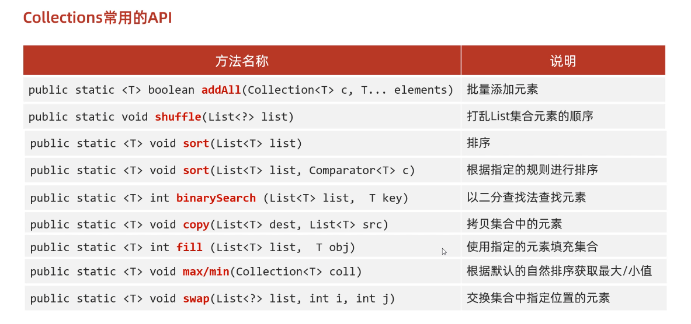

# 03-Collections集合工具类


Collections是集合的一个工具类，里面有很多操作集合的方法。

可以去翻阅一下JDK文档里面内容更详细哟(＾Ｕ＾)ノ~ＹＯ


## API




代码示例：

```java
package a05_collections;

import java.util.ArrayList;
import java.util.Collections;
import java.util.Comparator;

public class A01_CollectionsDemo1 {
    public static void main(String[] args) {

        ArrayList<String> strList = new ArrayList<>();


        // 1.批量添加数据 addAll

        Collections.addAll(strList, "abc", "edf", "ghi");

        System.out.println(strList);
        System.out.println("-----------");
        // 2.打乱集合 shuffle
        Collections.shuffle(strList);
        System.out.println(strList);
        System.out.println("-----------");


        // 3.排序 sort
        Collections.sort(strList);
        System.out.println(strList);
        System.out.println("-----------");

        // 4.排序 sort 带比较器的
        Collections.sort(strList, new Comparator<String>() {
            @Override
            public int compare(String o1, String o2) {
                return o1.compareTo(o2);
            }
        }); // 注意这里还可以用lambda表达式简写
        System.out.println(strList);
        System.out.println("-----------");


        // 5.获取最大值/最小值 max/min
        String max = Collections.max(strList);
        String min = Collections.min(strList);
        System.out.println(max);
        System.out.println(min);
        System.out.println("-----------");


        // 6.交换两个元素位置 swap
        Collections.swap(strList, 0, 1); // 0和1位置交换
        System.out.println(strList); // 交换后： [edf, abc, ghi] 原来：[abc, edf, ghi]
        System.out.println("-----------");
    }
}

```

