# Collection集合


## 简述

首先：Collection属于单列集合

Collection集合概述

- 是单例集合的顶层接口,它表示一组对象,这些对象也称为Collection的元素
- JDK 不提供此接口的任何直接实现.它提供更具体的子接口(如Set和List)实现


具体构成：

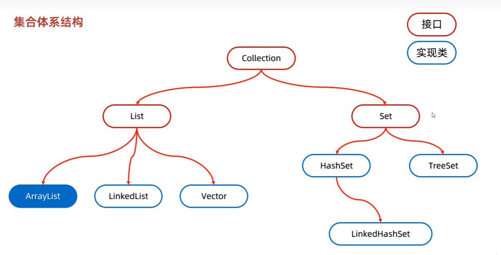


## 常见的相关方法：

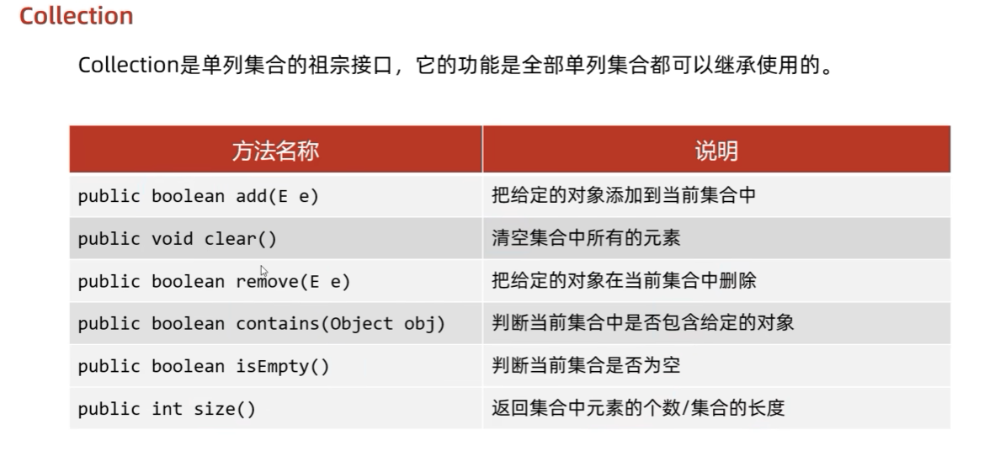

小细节：

1. `add()`细节：首先我们可以看到add方法的返回值是一个布尔型，但是其实List集合，add方法永远都返回的是true，应为List系列是可以允许有重复元素的，但是Set集合会有false返回值，当添加元素重复时就会返回false
2. `remove()`细节：**remove必须指定对象去删除**，这里为什么不用索引呢？应为Set是无序的不能直接用索引
3. `contains()`细节：底层是通过equals方法进行判断的，如果**存储自定义的对象**，想要使用contains方法，就必须要**重写`equals`方法**,否则使用的是`Object`初始的equals方法


代码示例：

```java
package com.itheima.mycollection;

import java.util.ArrayList;
import java.util.Collection;

public class A02_CollectionDemo2 {
    public static void main(String[] args) {
        // 1.创建集合对象
        Collection<Student> coll = new ArrayList<>();


        Student s1 = new Student("张三", 21);
        Student s2 = new Student("李四", 22);
        Student s3 = new Student("王五", 23);


        coll.add(s1);
        coll.add(s2);
        coll.add(s3);


        // 2.判断是否包含
        Student s4 = new Student("张三", 21);

        // contains本质，使用的是equals方法进行比较，如果没有重写，就会使用Object身上的equals，但是这个方法是比较地址值的
        System.out.println(coll.contains(s4));


        // 3.empty
        System.out.println(coll.isEmpty()); // false


        // 4.size
        System.out.println(coll.size()); // 3

        
        // 5.remove

        coll.remove(s1);
        System.out.println(coll); // 只剩下李四(s2)和王五(s3)了
    }
}

```


## Collection通用的遍历方式

### 迭代器遍历

迭代器在Java种类是Iterator，迭代器是集合的专用遍历方式

特点：

1. 迭代器遍历集合时，不依赖于索引


常用方法：

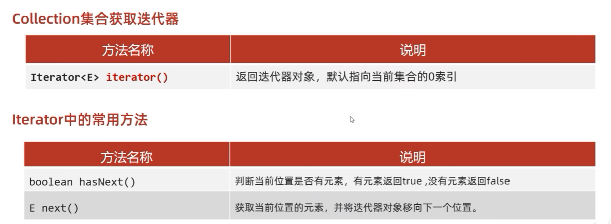

遍历图解：

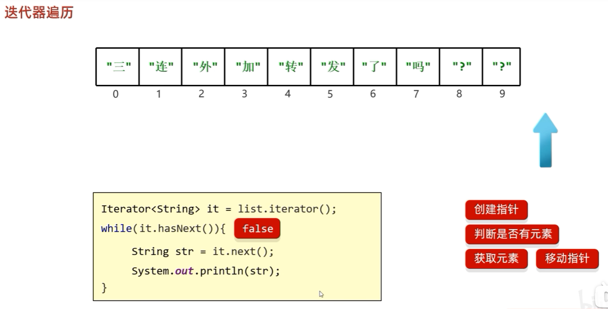

代码示例：

```java
package com.itheima.mycollection;

import java.util.ArrayList;
import java.util.Collection;
import java.util.Iterator;

public class A03_CollectionDemo3 {
    public static void main(String[] args) {
        // 1.创建集合对象
        Collection<Student> coll = new ArrayList<>();


        Student s1 = new Student("张三", 21);
        Student s2 = new Student("李四", 22);
        Student s3 = new Student("王五", 23);


        coll.add(s1);
        coll.add(s2);
        coll.add(s3);


        /*
            迭代器遍历相关的三个方法
            Iterator<E> iterator(): 获取一个迭代器对象
            boolean hasNext():      判断当前元素是否指向元素
            E next():               获取当前元素并移动指针
         */

        // 2.获取迭代器对象
        Iterator<Student> it = coll.iterator();
        

        // 3.循环遍历
        while (it.hasNext()) {
            Student s = it.next();

            System.out.println(s);
        }

    }
}

```


迭代器遍历的注意点：

1. 如果it.hasNext返回false了(指向最后没有元素的位置了)，再通过next获取元素时，就会报NoSuchElementException异常
2. **迭代器遍历完毕后，指针不会复位**（如果要第二次遍历的话，就必须再次获取一个迭代器注意，这是一个**新的迭代器了**）
3. 循环中只能调用一次`next`方法，这个不用说了吧，调用一次就移动一次，你多调用就会出问题的
4. **迭代器遍历时(注意是遍历这个过程中)**，不能用**集合的方法**进行增加或删除（如果调用add方法或remove方法，会有ConcurrentModificationException异常）**如果非要删除，需要调用迭代器自带的remove方法**，暂时还没有能添加的办法


### 增强for遍历

概述：

- 它是JDK5之后出现的,其内部原理是一个Iterator迭代器
- 实现Iterable接口的类才可以使用迭代器和增强for
- 简化数组和Collection集合的遍历

注意：

**所有的单列集合和数组才能用增强for进行遍历**


格式：

```java
for(集合/数组中元素的数据类型 变量名 :  集合/数组名) {

	// 已经将当前遍历到的元素封装到变量中了,直接使用变量即可

}
```


代码示例：

```java
public class MyCollectonDemo1 {
    public static void main(String[] args) {
        ArrayList<String> list =  new ArrayList<>();
        list.add("a");
        list.add("b");
        list.add("c");
        list.add("d");
        list.add("e");
        list.add("f");

        //1,数据类型一定是集合或者数组中元素的类型
        //2,str仅仅是一个变量名而已,在循环的过程中,依次表示集合或者数组中的每一个元素
        //3,list就是要遍历的集合或者数组
        for(String str : list){
            System.out.println(str);
        }
        
        // idea快捷生成方式   集合名.for + 回车
    }
}
```


小细节：

1. 修改增强for中的变量，不会改变集合中原本的数据

   ```java
   for(String str : list){
       System.out.println(str);
       // 注意这里str，是一个完全独立的第三方变量，和原本的元素完全是两个不一样的东西，可以理解为深拷贝出来的一份
   }
   ```

   


### Lambda表达式遍历

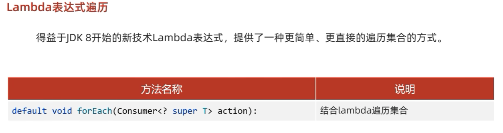

代码示例：

```java
package com.itheima.mycollection;

import java.util.ArrayList;
import java.util.Collection;
import java.util.function.Consumer;

public class A05_CollectionDemo5 {
    public static void main(String[] args) {
        // 1.创建集合对象
        Collection<Student> coll = new ArrayList<>();


        Student s1 = new Student("张三", 21);
        Student s2 = new Student("李四", 22);
        Student s3 = new Student("王五", 23);


        coll.add(s1);
        coll.add(s2);
        coll.add(s3);


        /*
          利用lambda表达式遍历

           底层：
           也就是自己遍历元素集合，依次得到每一元素，然后交给accept方法
         */


        // 先用匿名内部类方式写一下
        coll.forEach(new Consumer<Student>() {
            @Override
            public void accept(Student student) {
                // 打印
                System.out.println(student);
            }
        });

        System.out.println("-----------------------------");

        // 使用lambda表达式简化

        coll.forEach((s) -> {
            // 打印
            System.out.println(s);
        });
    }
}

```


### 三种遍历的使用时机

如果在删除过程中想要删除元素，那么请使用`iterator`遍历

如果只是想遍历一下，那么可以使用增强for或者lambda表达式遍历


## 集合的选择时机(重要)

默认使用`ArrayList`，如果想要唯一可以使用`HashSet`，唯一的同时还想要排序可以选择`TreeSet`

总结：

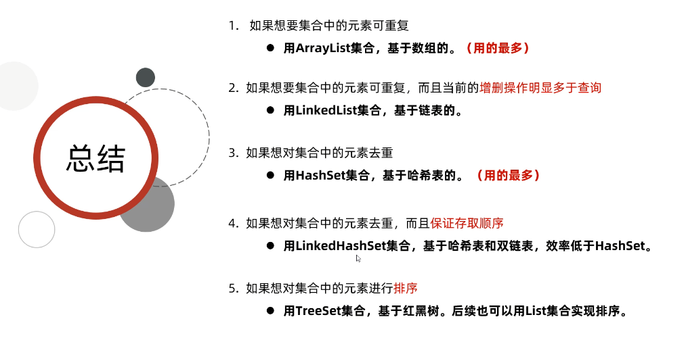

## List系列

### 简述

特点：

1. 添加的元素时**有序、可重复、有索引**


>tips:
>
>有序：指的是存和取是有序的，例如存的是"张三"，"李四"，"王五"。取出来还是"张三"，"李四"，"王五"
>
>有索引：指可以通过索引操作元素
>
>可重复：可以存重复元素


List集合实现了Collection接口所以拥有Collection接口的方法，但自己由于拥有索引的存在，自己也拥有一些特殊方法：

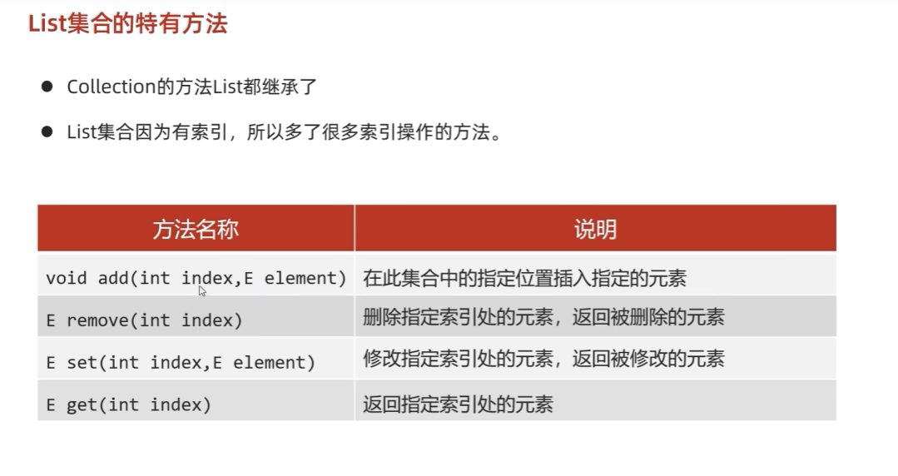

代码示例：

```java
package com.itheima.mycollection.a02mylist;

import java.util.ArrayList;
import java.util.List;

public class A01_ListDemo1 {
    public static void main(String[] args) {

        /*
            List独有的方法：
            void add(int index, E element)
            E remove(int index)
            E set(int index, E element)
            E get(int index)
         */


        // 1.创建一个集合 通过多态方式创建一个
        List<String> list = new ArrayList<>();

        list.add("111");
        list.add("222");
        list.add("333");


        // 2.add方法，
        // 细节：在指定索引index位置添加元素，位置上原来元素自动向后移动
        list.add(1, "AAA");


        // 3.remove方法
        String l = list.remove(1);
        System.out.println(l); // 返回被删除的元素 AAA

        System.out.println(list);


        // 4.set方法 设置元素
 
        String l2 = list.set(0, "000");
        System.out.println(l2); // 返回被修改的元素 111
        System.out.println(list); // [000, 222, 333]


        // 5.get方法 得到元素
        System.out.println(list.get(0)); // 000
    }
}

```


remove方法的小细节：

核心：**如果调用方法时，有重载现象，会优先调用，实参和形参一致的那个方法**

```java
package com.itheima.mycollection.a02mylist;

import java.util.ArrayList;
import java.util.List;

public class A02_ListDemo2 {
    public static void main(String[] args) {

        /*
            remove的小细节
         */

        List<Integer> list = new ArrayList<>();

        list.add(1);
        list.add(2);
        list.add(3);


        /*
            问题：remove是删除1索引上的元素，还是删除1这个元素呢？
            答案：会调用重写的remove删除1索引上的元素，

            原因：如果调用方法时，有重载现象，会优先调用，实参和形参一致的那个方法
         */
        list.remove(1);
        System.out.println(list); // [1, 3]

        /*
            那如何删除元素1呢？
            创建一个integer 1 对象，然后调用remove即可
         */

        Integer i = Integer.valueOf(1);

        list.remove(i);
        System.out.println(list); // [3]
    }
}

```


### List集合的遍历方式

#### 迭代器遍历

和Collection的一致

#### 列表迭代器遍历（特有）

列表迭代器接口：`ListIterator<E>`

和iterator几乎一模一样，有一个非常关键的add方法特有

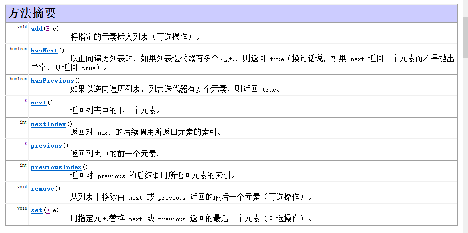

这里有几个比较有意思的方法，想previous和previousIndex和next，nextIndex刚好相反


特点：

1. iterator迭代器遍历中，时不允许在遍历过程中添加元素的，但是列表遍历器自带了一个add方法，它时可以进行添加元素的（在遍历过程中）


#### 增强for遍历

和Collection一致


#### lambda表达式

和Collection一致


#### 普通的for.i遍历

核心：

1. size方法
2. get方法
3. for循环

代码示例：

```java
package com.itheima.mycollection.a02mylist;

import java.util.ArrayList;
import java.util.List;

public class A03_ListDemo3 {
    public static void main(String[] args) {


        List<String> list = new ArrayList<>();

        list.add("aaa");
        list.add("bbb");
        list.add("ccc");


        // 普通for.i遍历

        for (int i = 0; i < list.size(); i++) {
            System.out.println(list.get(i));
        }
    }
}

```


#### 五种遍历使用时机

如果在遍历过程中要**删除元素**，请使用迭代器遍历

如果在遍历过程中要**添加元素**，请使用列表迭代器遍历

如果只是简单遍历请使用增强for或者lambda表达式

如果遍历时想要操作索引，可以使用普通for遍历


### ArrayList

本质基于数组

数组的特点：

1. 存储内存空间连续，通过地址确定数组，再通过索引就能够获得元素
2. **查找快，删除新增较慢**


ArrayList的具体内容可以看一下外面`03-ArrayList.md`


### LinkedList

本质基于链表

链表的特点：

1. 链表中每个结点都是独立的对象，在内存中是不连续的，每个结点包含数据值和下一个结点的地址
2. 链表**查询慢**（相对于数组，因为无论查哪一个都要从头开始找），但是**新增删除相对快，查询首位元素时极快**
3. 双向链表针对查询第几个元素时的情况，查询效率有一定提升（相对于单向链表）


LinkedList独有的API：

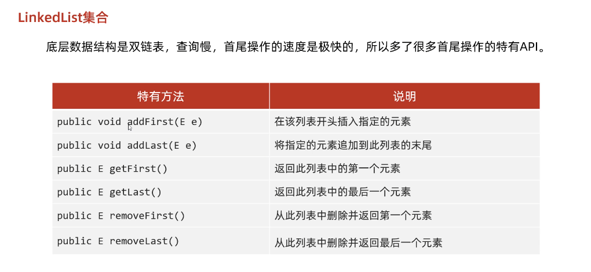

>tips:
>
>其实上面的方法用的较少，一般都会使用Collection集合和List上的方法


添加结点的底层：

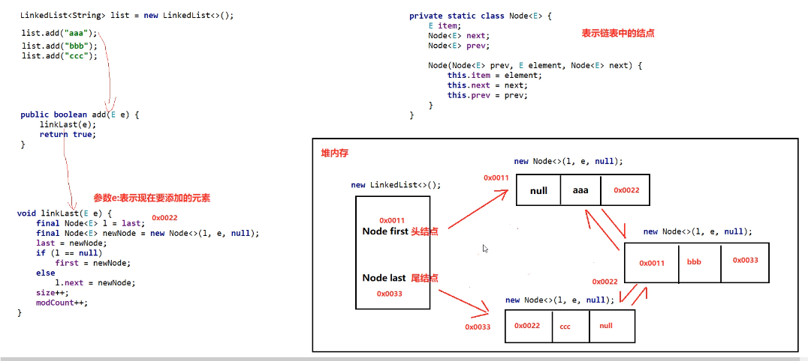


## Set集合

特点：

1. 添加的元素是无序、**不重复**、无索引

无序：存取顺序不一致

不重复：可以用来去重操作

无索引：没有带索引的方法，所以不能使用不同for循环遍历，也不能通过索引获取


**Set是一个接口，其中的方法都是继承与Collection，所以基本与Collection的API一致**


**注意点：**

1. 注意add方法是有个boolean的返回值的，由于list集合中可以添加重复元素，所以我们都没有在意，但是在set中会出现添加失败的情况


### 迭代器、增强for、Lambda表达式遍历

和上面collection一样

示例：

```java
package a02set;

import java.util.HashSet;
import java.util.Iterator;
import java.util.Set;

public class SetDemo1 {
    public static void main(String[] args) {
				
      	// 这里先用多态创建了一个 Set对象
        Set<String> s = new HashSet<>();

        s.add("张三");
        s.add("李四");

        s.add("王五");

//        System.out.println(s); // [李四, 张三, 王五] 结果无序


        // 1.利用迭代器进行遍历
        Iterator<String> it = s.iterator();
        while (it.hasNext()) {
            String str = it.next();
            System.out.println(str);
        }

        System.out.println("-----------------------");
        // 2.使用增强for遍历
        for (String s1 : s) {
            System.out.println(s1);
        }


        System.out.println("-----------------------");
        // 3.使用Lambda表达式遍历
        s.forEach(s1 -> {
            System.out.println(s1);
        });
    }
}

```


### HashSet

特点：

* 无序
* 不重复
* 无索引

简述：

底层数据结构是哈希表，哈希表是一种存储效率较高的数据结构


哈希表组成：

* JDK8之前：数组+链表
* JDK8之后：数组+链表+红黑树

哈希表中有一个很重要的概念**“哈希值”**：

* 哈希值更具hasCode方法计算出来的int类型的整数
* 该方法定义在Object类中，所有对象都可调用，默认使用地址值进行计算
* 一般情况下，都会重写hasCode方法，利用对象内部属性值去计算哈希值


**哈希值的特点：**

1. **如果没有重写hasCode方法**，不同对象计算出来的哈希值是不同的
2. **如果已经重写hasCode方法**，不同对象只要属性值相同，计算出来的哈希值是一致的
3. 在小部分情况下，不同属性值或者不同地址值就算出来的哈希值也有可能一致（**哈希碰撞**）

代码示例：

```java
package a02set;

public class A02_HashSetDemo1 {
    public static void main(String[] args) {
        /*
        **哈希值的特点：**

            1. **如果没有重写hasCode方法**，不同对象计算出来的哈希值是不同的
            2. **如果已经重写hasCode方法**，不同对象只要属性值相同，计算出来的哈希值是一致的
            3. 在小部分情况下，不同属性值或者不同地址值就算出来的哈希值也有可能一致（**哈希碰撞**）
         */
				
      	// 学生类的代码我就没贴上来了，自己写吧
	
        // 1.创建学生对象
        Student s1 = new Student("张三", 18);
        Student s2 = new Student("张三", 18);


        // 一. **如果没有重写hasCode方法**，不同对象计算出来的哈希值是不同的
        System.out.println(s1.hashCode()); // 990368553
        System.out.println(s2.hashCode()); // 1096979270

        // 刚刚在Studen类中重写了hasCode方法
        // 二：**如果已经重写hasCode方法**，不同对象只要属性值相同，计算出来的哈希值是一致的
        System.out.println(s1.hashCode()); // 24022538
        System.out.println(s2.hashCode()); // 24022538


        // 注意：String类型 底层已经重写过了hasCode方法
        // 三：在小部分情况下，不同属性值或者不同地址值就算出来的哈希值也有可能一致（**哈希碰撞**）
        System.out.println("abc".hashCode()); // 96354
        System.out.println("acD".hashCode()); // 96354
    }
}

```


**HashSet底层原理**

一：JDK8之前

**数组**+**链表**


>tips:
>
>加载因是0.75的意思：当数组中元素的长度超过16*0.75 = 12时，就会扩容数组容量，将数组容量翻倍


**JDK8之前和之后版本不一样的就是第五点：元素怎么插入的不一样**


二：JDK8之后

**数组**+**链表**+**红黑树**


>tips:
>
>在JDK8版本，当链表长度大于8且数组长度大于64后，链表就会转成红黑树


#### HashSet注意点

1. 如果集合中存储的时**自定义对象**(非自定义的官方已经重写过了)，必须要重写`hashCode`和`equals`方法（because 默认的方法都是根据地址值进行计算的，我们一般情况下都想要对比属性值的方法）


总结：

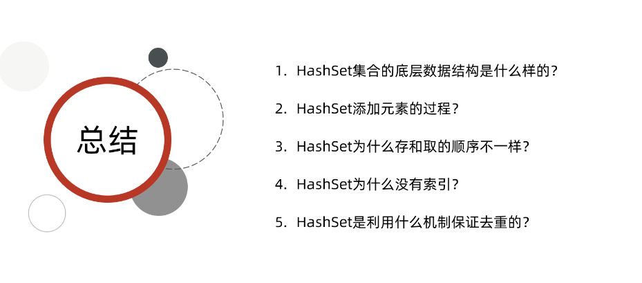


### LinkedHashSet

特点：

* **有序**
* 不重复
* 无索引


注意：

有序：**指的是会保证存储和取出的元素顺序一致**


缺点：

由于多添加了双向链表，效率肯定不如HashSet的


**linkedHashSet底层机制**

底层数据结构依然是哈希表，只是每个元素又额外多了一个**双向链表**的机制来记录存储的顺序

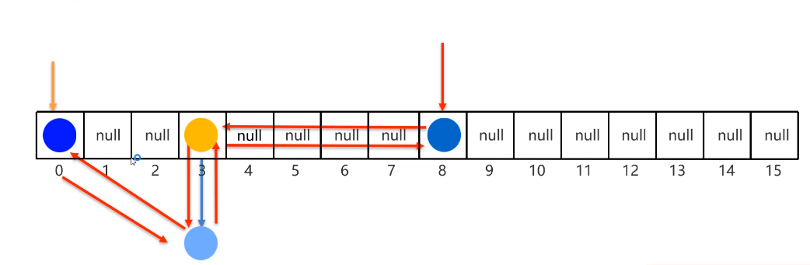


代码示例：

```java
package a02set;

import java.util.Iterator;
import java.util.LinkedHashSet;

public class A04_LinkedHashSetDemo04 {
    public static void main(String[] args) {

				/*
					注意：Student我们已经重写了hasCode和equals方法
				*/
      
        // 1.创建学生对象
        Student s1 = new Student("张三", 18);
        Student s2 = new Student("李四", 19);
        Student s3 = new Student("王五", 20);
        Student s4 = new Student("张三", 18);

        // 2.创建集合

        LinkedHashSet<Student> lhs = new LinkedHashSet<>();

        System.out.println(lhs.add(s1));
        System.out.println(lhs.add(s2));
        System.out.println(lhs.add(s3));
        System.out.println(lhs.add(s4)); // false 重复元素添加失败


        System.out.println(lhs);
        // 3.遍历输出

        Iterator<Student> it = lhs.iterator();
        while (it.hasNext()) {
            Student s = it.next();
            System.out.println(s);
        }

        /*
            遍历会保证顺序一致：
            Student{name = 张三, age = 18}
            Student{name = 李四, age = 19}
            Student{name = 王五, age = 20}
         */
    }
}

```


### TreeSet

特点：

* **可排序**
* 不重复
* 无索引


**可排序**：按照元素的默认规则（由小到大）排序。

>tips:
>
>对于数值类型：Integer，Double，默认按照从小到大顺序进行排序，获取时就已经排好序了
>
>对于字符、字符串类型：按照字符在ASCII码中的数字升序进行排序
>
>'a', 'b', 'c'这样的顺序（96，97，98）


**TreeSet底层：**

底层基于红黑树进行实现，曾删改差效率都很高


#### TreeSet的两种比较方式

使用原则：

**默认使用方式一**，如果第一种不满足当前需求时，再使用方式二


方式一：

默认排序/自然排序：JavaBean类实现Comparable接口重写指定方法，指定比较规则


示例：

```java
	// compareTo方法会多次调用  

	@Override
  public int compareTo(Student o) {
      /*
          this：当前元素
          o：为红黑树中已存在的元素

          返回结果：
             负数：认为要添加的元素是小的，放在左边
             正数：认为要添加的元素是大的，放在右边
             0  ：认为要添加的元素已存在，不存
       */
      System.out.println("----------------");
      System.out.println("this:" + this);
      System.out.println("o   :" + o);
      // 指定排序规则
      // 只看年龄，按照年龄的升序进行排列
      int result = this.getAge() - o.getAge();
      return result;
  }
```


方式二：

**比较器排序：**在创建TreeSet对象时，传递比较器Comparator来指定规则


代码示例：

```java
package a03treeset;

import java.util.TreeSet;

public class A01_TreeSetDemo1 {
    public static void main(String[] args) {
        /*
            需求：请自学选择比较器排序和自然排序两种方式
            要求：存入四个字符串"c", "ab", "df", "qwer"
            按照长度排序，如果一样长则按照首字母进行排序
         */


        // 1.创建集合（有比较器）
//        TreeSet<String> ts = new TreeSet<>(new Comparator<String>() {
//            /**
//             *
//             * @param o1: 当前要添加的元素
//             * @param o2: 红黑树中已经存在的元素
//             * @return 返回值规则和方式一一致
//             */
//            @Override
//            public int compare(String o1, String o2) {
//                int i = o1.length() - o2.length();
//
//                /*
//                    解释一下下面的代码：
//                    1.判断了两个长度是否一样长
//                    2.如果一样长了，我们就调用自然排序方法，来排序，注意一定是
//                    o1调用，传入o2
//                    3.如果不一样长返回i就行了，我们要的就是不一样长
//                 */
//                i = i == 0 ? o1.compareTo(o2) : i;
//
//                return i;
//            }
//        });

        // Lambda简写
        TreeSet<String> ts = new TreeSet<>((o1, o2) -> {
            int i = o1.length() - o2.length();
            i = i == 0 ? o1.compareTo(o2) : i;
            return i;
        });


        // 2.添加元素
        ts.add("c");
        ts.add("ab");
        ts.add("df");
        ts.add("qwer");


        // 3.方式二：比较器排序
        System.out.println(ts); // [c, ab, df, qwer]
    }
}

```

