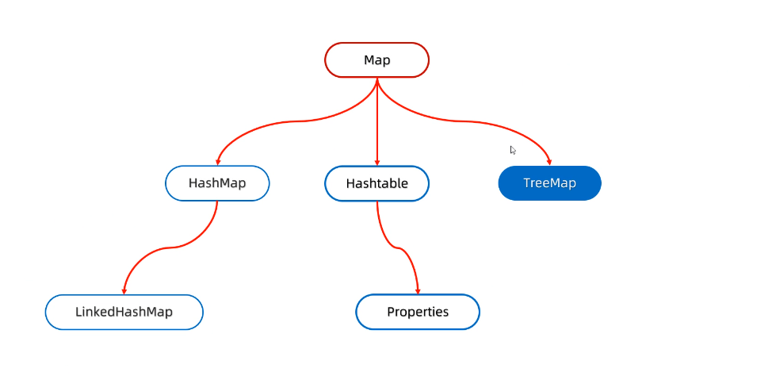
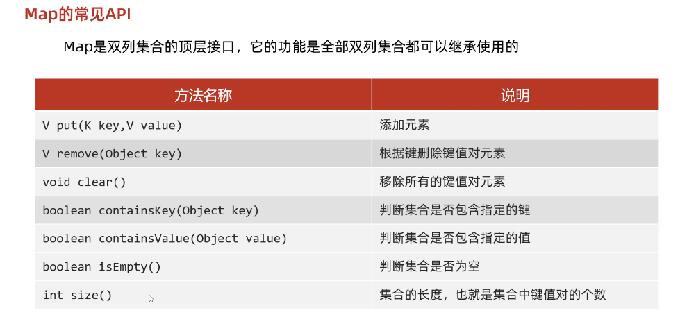

# 03-Map双列集合


双列集合的特点：

1. 数据是成对儿存入的，键值对，一一对应
2. 键不能重复，值可以重复
3. 键值一一对应，每个键只能找到自己对应的值
4. 键+值这个整体，我们称为“键值对”或者“键值对对象”，在Java中叫`Entry`对象

>有点像JavaScript的{}


体系结构：




## Map的常见`API`




各种小细节：

1. put方法是有两个功能的，一：如果添加元素时，如果键不存在，直接把键值对添加进集合中，二：如果添加元素是，如果键存在，则会直接覆盖，**并把覆盖的值返回**


代码示例：

```java
package a04map;

import java.util.HashMap;
import java.util.Map;

public class A01_MapDemo1 {
    public static void main(String[] args) {

        // 1.创建Map集合的对象
        Map<String, String> m = new HashMap<>(); // 多态方式演示


        // 2.添加元素
        m.put("郭靖", "黄蓉");
        m.put("韦小宝", "沐剑屏");
        m.put("钱不二", "111");

        String val1 = m.put("钱不二", "222");

        // 2.1删除元素
//        String result1 = m.remove("钱不二");


        // 2.2清空集合
//        m.clear();

        // 2.3是否包含（key）
        boolean keyResult = m.containsKey("钱不二");
        System.out.println(keyResult);

        // 2.4是否包含指定(value)
        boolean valResult = m.containsValue("黄蓉");
        System.out.println(valResult);


        // 2.5集合长度
        int size = m.size();
        System.out.println(size);

        // 2.5判断集合是否为空
        boolean isEmpty = m.isEmpty();
        System.out.println(isEmpty);

        // 3.打印
        System.out.println(m); // {韦小宝=沐剑屏, 钱不二=222, 郭靖=黄蓉}

        System.out.println(val1); // 111 返回被覆盖的值
    }
}

```


## Map的遍历方式

### 键找值

核心：

1. `keySet`方法，可以将所有键生成一个Set集合
2. 遍历键的集合，获取每一个key
3. `get`方法，可以根据key获取对应的value

代码示例：

```java
package a04map;

import java.util.HashMap;
import java.util.Iterator;
import java.util.Map;
import java.util.Set;

public class A02_MapDemo2 {
    public static void main(String[] args) {

        // 1.创建Map集合的对象
        Map<String, String> m = new HashMap<>(); // 多态方式演示


        // 2.添加元素
        m.put("郭靖", "黄蓉");
        m.put("韦小宝", "沐剑屏");
        m.put("钱不二", "111");


        // 3. 通过键找值
        // 一.创建一个单列集合，把所有键存储进去

        Set<String> keys = m.keySet();

        // 二.遍历每一个单列集合，得到每一个键
        for (String key : keys) {
//            System.out.println(key);
            // 三：利用键去获取每一个值

            String value = m.get(key); // 有一个get方法
            System.out.println(key + ":" + value);
        }
        System.out.println("-----------------");
        // 使用迭代器
        Iterator<String> it = keys.iterator();
        while (it.hasNext()) {
            String key = it.next();
            String value = m.get(key); // 有一个get方法
            System.out.println(key + ":" + value);
        }

        System.out.println("-----------------");
        // 使用Lambda表达式
        keys.forEach((key) -> {
            String value = m.get(key); // 有一个get方法
            System.out.println(key + ":" + value);
        });
    }
}

```


### 键值对

核心：

1. 通过`entrySet`获取每一对儿键值对
2. 通过`getKey`方法获得键
3. `getValue`方法获得值


代码示例：

```java
package a04map;

import java.util.HashMap;
import java.util.Iterator;
import java.util.Map;
import java.util.Set;

public class A03_MapDemo3 {
    public static void main(String[] args) {

        // 1.创建Map集合的对象
        Map<String, String> m = new HashMap<>(); // 多态方式演示


        // 2.添加元素
        m.put("郭靖", "黄蓉");
        m.put("韦小宝", "沐剑屏");
        m.put("钱不二", "111");


        // 3.键值对遍历
        // 3.1通过一个方法获取所有键值对对象，返回一个Set集合
        Set<Map.Entry<String, String>> entries = m.entrySet();

        // 3.2遍历entries集合，得到每一个键值对
        for (Map.Entry<String, String> entry : entries) {
            // 3.3利用entry调用get方法来获取
            String key = entry.getKey();
            String val = entry.getValue();

            System.out.println(key + ":" + val);
        }

        System.out.println("-----------");

        // 利用iterator
        Iterator<Map.Entry<String, String>> it = entries.iterator();
        while (it.hasNext()) {
            Map.Entry<String, String> entry = it.next();
            String key = entry.getKey();
            String val = entry.getValue();

            System.out.println(key + ":" + val);
        }

        System.out.println("----------");

        // 利用Lambda
        entries.forEach((entry) -> {
            String key = entry.getKey();
            String val = entry.getValue();

            System.out.println(key + ":" + val);
        });
    }
}

```


### Lambda表达式

核心：

1. Map自带`forEach`方法
2. 底层其实用的还是`entrySet`方法和增强for


代码示例：

```java
package a04map;

import java.util.HashMap;
import java.util.Map;
import java.util.function.BiConsumer;

public class A04_MapDemo4 {
    public static void main(String[] args) {

        // 1.创建Map集合的对象
        Map<String, String> m = new HashMap<>(); // 多态方式演示


        // 2.添加元素
        m.put("郭靖", "黄蓉");
        m.put("韦小宝", "沐剑屏");
        m.put("钱不二", "111");


        // 3.Lambda遍历
        m.forEach((key, value) -> {
            System.out.println(key + ":" + value);
        });

        System.out.println("-----------");
				// 完整写法
        m.forEach(new BiConsumer<String, String>() {
            @Override
            public void accept(String key, String value) {
                System.out.println(key + ":" + value);
            }
        });
    }
}

```


## `HashMap`

特点：

* `HashMap`时Map里的实现类
* 特点都是由**键**决定的：无序、不重复、无索引
* `HashMap`和`HashSet`一样底层都是哈希表


注意点：

1. 依赖`hashCode`方法和`equals`方法保证键的唯一
2. 如果键存储的是自定义对象需要重写`hashCode`和`equals`方法，如果值存的是自定义对象没什么影响
3. 关键**特点都是针对键的**


### `LinkedHashMap`


特点：

* 由键决定：有序、不重复、无索引

>tips：
>
>有序：指报春存储和取出元素的顺序一致


原理：

底层是哈希表，再加上双向链表（保证存取顺序）


代码示例：

```java
package a02_linkedhashmap;

import java.util.LinkedHashMap;

public class A01_LinkedHashMapDemo1 {
    public static void main(String[] args) {

        /*
            特点：
            由键决定：有序、不重复、无索引

         */

        LinkedHashMap<String, Integer> lhm = new LinkedHashMap<>();

        lhm.put("a", 123);
        lhm.put("b", 456);
        lhm.put("c", 789);


        System.out.println(lhm);
        
				
      	// 遍历
        lhm.forEach((k, v) -> {
            System.out.println(k + "=" + v);
        });
        /*
        		和添加顺序一致：
            a=123
            b=456
            c=789
         */
    }
}

```


## TreeMap


特点：

* 由键决定：不重复、无索引、可排序
* 可排序：针对键


>tips:
>
>默认按照键的从小到大进行排序，也可以自己规定


### 排序规则

和`TreeSet`一致，

一：实现Comparable接口，指定比较规则。

二：创建集合时传递Comparator比较器对象，指定比较规则


小栗子：

```java
package a03_treeMap;

import java.util.Comparator;
import java.util.Map;
import java.util.Set;
import java.util.TreeMap;

public class A03_TreeMapDemo3 {
    public static void main(String[] args) {
        /*
            需求：
            字符串"aababcabcdabcde"
            请统计该字符中，每一个字母吹按的次数，并按照以下格式输出
            输出结果:
            a(5) b(4) c(3) d(2) e(1)
         */


        String str = "aababcabcdabcde";


        TreeMap<Character, Integer> tm = new TreeMap<>(new Comparator<Character>() {
            @Override
            public int compare(Character o1, Character o2) {
                return o1.compareTo(o2);
            }
        });

        for (int i = 0; i < str.length(); i++) {
            char c = str.charAt(i);

            // 判断hm中是否有c
            if(tm.containsKey(c)) {
                int count = tm.get(c);
                count++;
                tm.put(c, count);
            } else {
                tm.put(c, 1);
            }
        }

        System.out.println(tm);


        Set<Map.Entry<Character, Integer>> entries = tm.entrySet();

        for (Map.Entry<Character, Integer> entry : entries) {
            System.out.print(entry.getKey() + "(" + entry.getValue() + ")");
            System.out.print(" ");
        }
    }

}

```


## 几个问题

### 一：`TreeMap`添加元素的时候，键是否需要重写`hasCode`和equals方法？

不需要，重写，应为`TreeMap`完全基于红黑树，根本用不到这两个方法，只有`HashMap`需要当然`HashSet`也需要


### 二：`HashMap`是哈希表结构的，`JDK8`中开始以数组、链表、红黑树组成，那么既然有红黑树，那我们需要实现`Comparable`或比较器`Comparator`吗？


不需要，应为`HashMap`底层，默认使用的哈希值大小关系来创建红黑树的


### 三：`TreeMap`和`HashMap`谁效率更高？

若不考虑概率情况下，最坏情况，例如添加了10个元素，`HashMap`形成了链表结构，当然`TreeMap`效率会更高，

但是，上面的情况微乎其微，正常情况下来说，还是`HashMap`的效率会更高


### 四：你觉得在Map集合中，Java后期会提供一个如果键重复了，不会覆盖的put方法嘛？

源码中是有的，`putIfAbsent`方法


编码思想：

代码逻辑都是有多面性的，如果我们发现一个函数有B面，并且由参数来控制，那么它一定会出现其他面


编码习惯：

参数是boolean类型控制的，一般会有两面（true、false）

参数是int类型控制，最少是有三面（正数、负数、0）


### 五：三种集合该如何选择（`HashMap`、`LinkedHashMap`、`TreeMap`）

默认使用`HashMap`，应为它效率最高

如果需要有存取顺序，请选择`LinkedHashMap`

如果需要排序，请选择`TreeMap`
