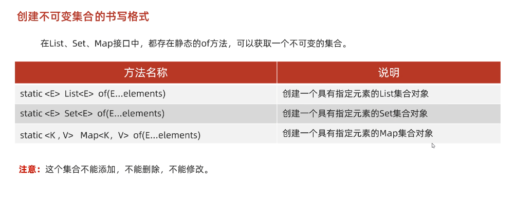

# 不可变集合

## 创建不可变集合的应用常见

* 如果某个数据不能被修改，把它防御性地拷贝到不可变集合中是个很好的实践。

* 当集合对象被不可信的库调用时，不可变形式是安全的。

简单理解：

**不想让别人修改集合中的内容**


## 不可变集合创建方式



### list不可变集合

代码示例：

```java
package a01immutable;

import java.util.List;

public class ImmutableDemo1 {
    public static void main(String[] args) {
        /*

            创建不可变list集合
         */

        // 一旦创建完成，不能修改，只能进行查询操作
        List<String> list = List.of("张三", "李四", "王五", "赵六");


        System.out.println(list.get(0));
        System.out.println(list.get(1));
        System.out.println(list.get(2));
        System.out.println(list.get(3));

        System.out.println("-----------");

        // 遍历操作(增强、lambda、iterator、普通for都行)
        for (String s : list) {
            System.out.println(s);
        }


        // 修改操作
        list.add("钱七"); // 编译直接报错
        list.remove("李四"); // 编译直接报错
        list.set(0, "钱不二"); // 编译直接报错
    }
}

```


### Set不可变集合

细节：

1. 当使用of方法，获取一个不可变Set集合时，**参数一定要保证唯一性**，应为Set是不能重复的


示例：

```java
package a01immutable;

import java.util.Set;

public class ImmutableDemo2 {
    public static void main(String[] args) {
        /*

            创建不可变Set集合：
            细节：
                当使用of方法，获取一个不可变Set集合时，参数一定要保证唯一性，应为Set是不能重复的
         */

        // 一旦创建完成，不能修改，只能进行查询操作
        Set<String> list = Set.of("张三", "李四", "王五", "赵六");

        System.out.println("-----------");

        // 遍历操作(增强、lambda、iterator都行)
        for (String s : list) {
            System.out.println(s);
        }


        // 修改操作
        list.add("钱七"); // 编译直接报错
        list.remove("李四"); // 编译直接报错

    }
}

```


### Map不可变集合

细节：

1. of方法传递的参数中，键不能重复，否则编译直接报错
2. Map里的of方法，参数是有上限的，最多只能传递20个参数，也就是10个键值对
3. 如果要传递多个键值对对象，数量大于10，可以使用Map方法中的ofEntries方法


代码示例：

```java
package a01immutable;

import java.util.Map;
import java.util.Set;

public class ImmutableDemo3 {
    public static void main(String[] args) {
        /*
            创建不可变Map集合
            细节：
                1.of方法传递的参数中，键不能重复，否则编译直接报错
                2.Map里的of方法，参数是有上限的，最多只能传递20个参数，也就是10个键值对
                3.如果要传递多个键值对对象，数量大于10，可以使用Map方法中的ofEntries方法
         */

        Map<String, String> map = Map.of("张三", "南京", "李四", "北京", "王五", "上海");


        // 进行遍历操作
        Set<Map.Entry<String, String>> entries = map.entrySet();
        for (Map.Entry<String, String> entry : entries) {
            System.out.println(entry.getKey() + "-" + entry.getValue());
        }
    }
}
```


当参数键值对大于10个时，使用`Map.ofEntries`方法创建不可变集合：

注意：**还可以用`copyOf`来简化`ofEntries`方法**

>tips：
>
>`copyOf`方法是在`JDK10`中添加的，要注意版本

```java
package a01immutable;

import java.util.HashMap;
import java.util.Map;

public class ImmutableDemo4 {
    public static void main(String[] args) {
        /*
            创建不可变Map集合
            细节：
                1.of方法传递的参数中，键不能重复，否则编译直接报错
                2.Map里的of方法，参数是有上限的，最多只能传递20个参数，也就是10个键值对
                3.如果要传递多个键值对对象，数量大于10，可以使用Map方法中的ofEntries方法
         */


        // 创建Map不可变集合，且参数超过10个
        HashMap<String, String> hm = new HashMap<>();
        hm.put("张三", "南京");
        hm.put("李四", "南京");
        hm.put("王五", "南京");
        hm.put("赵六", "南京");
        hm.put("前七", "南京");
        hm.put("周八", "南京");
        hm.put("吴九", "南京");
        hm.put("郑十", "南京");
        hm.put("刘十一", "南京");
        hm.put("陈十二", "南京");
        hm.put("绕十三", "南京");
        hm.put("马十四", "南京");


//        Set<Map.Entry<String, String>> entries = hm.entrySet();
//        Map.Entry[] arr =new Map.Entry[0];
//        Map.Entry[] arr2 = entries.toArray(arr);
//        /*
//            toArray方法细节：
//                1.如果集合长度 > 创建的数组长度，那么数据在数组中放不下，此时会根据集实际大小，重新创建数组
//                2.如果集合长度 <= 创建数组长度，数据在数组中放得下，直接存入
//         */
//        // 使用ofEntries方法生成不可变Map
//        Map immutableMap = Map.ofEntries(arr2); // 生成了一个不可变的集合

        // 简化写法
        Map<Object, Object> immutableMap = Map.ofEntries(hm.entrySet().toArray(new Map.Entry[0]));
        
        
        
        // 究极简化写法copyOf方法
        Map<String, String> immutableMap2 = Map.copyOf(hm);

        // 不可变Map只能查询，不能修改  
        immutableMap.put("嘻嘻", "111"); // 编译报错
    }
}
```

