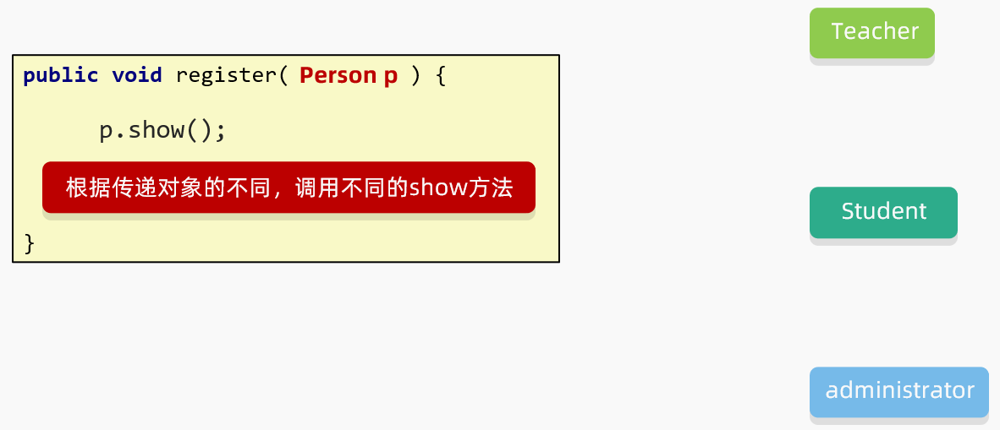

# day14

## 今日内容

- 多态
- 包
- final
- 权限修饰符
- 代码块

## 教学目标

- [ ] 能够说出使用多态的前提条件
- [ ] 理解多态的向上转型
- [ ] 理解多态的向下转型
- [ ] 能够知道多态的使用场景

- [ ] 包的作用
- [ ] public和private权限修饰符的作用
- [ ] 描述final修饰的类的特点
- [ ] 描述final修饰的方法的特点
- [ ] 描述final修饰的变量的特点


# 第一章 多态

## 1.1 多态的形式

**多态是继封装、继承之后，面向对象的第三大特性。**

多态前提：

1. **多态是出现在继承或者实现关系中的**。
2. 有父类引用指向子类对象（`Fu f = new Zi();`）
3. 需要有方法重写

**多态体现的格式**：

```java
父类类型 变量名 = new 子类/实现类构造器;
变量名.方法名();
```

**多态的前提**：有继承关系，子类对象是可以赋值给父类类型的变量。例如Animal是一个动物类型，而Cat是一个猫类型。Cat继承了Animal，Cat对象也是Animal类型，自然可以赋值给父类类型的变量。

## 1.2 多态的使用场景

如果没有多态，在下图中register方法只能传递学生对象，其他的Teacher和administrator对象是无法传递给register方法方法的，在这种情况下，只能定义三个不同的register方法分别接收学生，老师和管理员。


有了多态之后，方法的形参就可以定义为共同的父类Person。

**要注意的是：**

* 当一个方法的形参是一个类，我们可以传递这个类所有的子类对象。
* 当一个方法的形参是一个接口，我们可以传递这个接口所有的实现类对象（后面会学）。
* 而且多态还可以根据传递的不同对象来调用不同类中的方法。



代码示例：

```java
父类：
public class Person {
    private String name;
    private int age;

    空参构造
    带全部参数的构造
    get和set方法

    public void show(){
        System.out.println(name + ", " + age);
    }
}

子类1：
public class Administrator extends Person {
    @Override
    public void show() {
        System.out.println("管理员的信息为：" + getName() + ", " + getAge());
    }
}

子类2：
public class Student extends Person{

    @Override
    public void show() {
        System.out.println("学生的信息为：" + getName() + ", " + getAge());
    }
}

子类3：
public class Teacher extends Person{

    @Override
    public void show() {
        System.out.println("老师的信息为：" + getName() + ", " + getAge());
    }
}

测试类：
public class Test {
    public static void main(String[] args) {
        //创建三个对象，并调用register方法

        Student s = new Student();
        s.setName("张三");
        s.setAge(18);


        Teacher t = new Teacher();
        t.setName("王建国");
        t.setAge(30);

        Administrator admin = new Administrator();
        admin.setName("管理员");
        admin.setAge(35);


        register(s);
        register(t);
        register(admin);


    }


    //这个方法既能接收老师，又能接收学生，还能接收管理员
    //只能把参数写成这三个类型的父类
    public static void register(Person p){
        p.show();
    }
}
```

## 1.3 多态的定义和前提

**多态**： 是指同一行为，具有多个不同表现形式。

从上面案例可以看出，Cat和Dog都是动物，都是吃这一行为，但是出现的效果（表现形式）是不一样的。

 **前提【重点】**

1. 有继承或者实现关系

2. 方法的重写【意义体现：不重写，无意义】

3. 父类引用指向子类对象【格式体现】

   > 父类类型：指子类对象继承的父类类型，或者实现的父接口类型。

## 1.4 多态的运行特点

**调用成员变量时**：编译看左边，运行看左边

编译看左边的意思：再用javac编译代码时，会判断**左边父类**中是否存在当前成员变量，有成功，无失败。

运行看左边的意思：Java运行代码时，实际获取的也是**左边父类**的成员变量


**调用成员方法时**：编译看左边，运行看右边

编译看左边的意思：再用javac编译代码时，会判断**左边父类**中是否存在当前成员方法，有成功，无失败。

运行看左边的意思：Java运行代码时，实际上运行的是**右边子类**的成员方法

代码示例：

```java
// 多态创建对象的方式
Fu f = new Zi()；
//编译看左边的父类中有没有name这个属性，没有就报错
//在实际运行的时候，把父类name属性的值打印出来
System.out.println(f.name);


//编译看左边的父类中有没有show这个方法，没有就报错
//在实际运行的时候，运行的是子类中的show方法
f.show();
```

## 1.5 多态的弊端

我们已经知道多态编译阶段是看左边父类类型的，如果子类有些独有的功能(**指子类拥有，但是父类没有的**)，此时**多态的写法就无法访问子类独有功能了**。

原因：因为编译根本就通过不了，因为编译看左边

```java 
class Animal{
    public  void eat()｛
        System.out.println("动物吃东西！")
    ｝
}
class Cat extends Animal {  
    public void eat() {  
        System.out.println("吃鱼");  
    }  
   	// 这个方法是Cat类特有的
    public void catchMouse() {  
        System.out.println("抓老鼠");  
    }  
}  

class Dog extends Animal {  
    public void eat() {  
        System.out.println("吃骨头");  
    }  
}

// 测试类
class Test{
    public static void main(String[] args){
        Animal a = new Cat();
        a.eat();
        a.catchMouse();//编译报错，编译看左边，Animal没有这个方法
    }
}
```

## 1.6 引用类型转换(弊端的解决方式)

### 1.6.1 为什么要转型

**多态的写法就无法访问子类独有功能了。**

当使用多态方式调用方法时，首先检查父类中是否有该方法，如果没有，则编译错误。也就是说，**不能调用**子类拥有，而父类没有的方法。编译都错误，更别说运行了。这也是多态给我们带来的一点"小麻烦"。所以，想要调用子类特有的方法，必须做向下转型。

回顾基本数据类型转换

- 自动转换: 范围小的赋值给范围大的.自动完成:double d = 5; 
- 强制转换: 范围大的赋值给范围小的,强制转换:int i = (int)3.14 

​     多态的转型分为向上转型（自动转换）与向下转型（强制转换）两种。

### 1.6.2 向上转型（自动转换）

- **向上转型**：多态本身是子类类型向父类类型向上转换（自动转换）的过程，这个过程是默认的。
  当父类引用指向一个子类对象时，便是向上转型。
  使用格式：

```java
父类类型  变量名 = new 子类类型();
如：Animal a = new Cat();
```

**原因是：父类类型相对与子类来说是大范围的类型，Animal是动物类，是父类类型。Cat是猫类，是子类类型。Animal类型的范围当然很大，包含一切动物。**所以子类范围小可以直接自动转型给父类类型的变量。

### 1.6.3 向下转型（强制转换）

- **向下转型**：父类类型向子类类型向下转换的过程，这个过程是强制的。
  一个已经向上转型的子类对象，将父类引用转为子类引用，可以使用强制类型转换的格式，便是向下转型。

使用格式：

```java
子类类型 变量名 = (子类类型) 父类变量名;
如:Aniaml a = new Cat();
   Cat c =(Cat) a;  
```

### 1.6.4 案例演示

当使用多态方式调用方法时，首先检查父类中是否有该方法，如果没有，则编译错误。也就是说，**不能调用**子类拥有，而父类没有的方法。编译都错误，更别说运行了。这也是多态给我们带来的一点"小麻烦"。所以，想要调用子类特有的方法，必须做向下转型。

转型演示，代码如下：

定义类：

```java
abstract class Animal {  
    abstract void eat();  
}  

class Cat extends Animal {  
    public void eat() {  
        System.out.println("吃鱼");  
    }  
    public void catchMouse() {  
        System.out.println("抓老鼠");  
    }  
}  

class Dog extends Animal {  
    public void eat() {  
        System.out.println("吃骨头");  
    }  
    public void watchHouse() {  
        System.out.println("看家");  
    }  
}
```

定义测试类：

```java
public class Test {
    public static void main(String[] args) {
        // 向上转型  
        Animal a = new Cat();  
        a.eat(); 				// 调用的是 Cat 的 eat

        // 向下转型  
        Cat c = (Cat)a;       
        c.catchMouse(); 		// 调用的是 Cat 的 catchMouse
    }  
}
```

### 1.6.5 转型的异常

转型的过程中，一不小心就会遇到这样的问题，请看如下代码：

```java
public class Test {
    public static void main(String[] args) {
        // 向上转型  
        Animal a = new Cat();  
        a.eat();               // 调用的是 Cat 的 eat

        // 向下转型  
        Dog d = (Dog)a;       
        d.watchHouse();        // 调用的是 Dog 的 watchHouse 【运行报错】
    }  
}
```

这段代码可以通过编译，但是运行时，却报出了 `ClassCastException` ，类型转换异常！这是因为，明明创建了Cat类型对象，运行时，当然不能转换成Dog对象的。

关键：**不能乱转**

### 1.6.6 instanceof关键字

为了避免ClassCastException的发生，Java提供了 `instanceof` 关键字，给引用变量做类型的校验，格式如下：

```java
变量名 instanceof 数据类型 
如果变量属于该数据类型或者其子类类型，返回true。
如果变量不属于该数据类型或者其子类类型，返回false。
```

所以，转换前，我们最好先做一个判断，代码如下：

```java
public class Test {
    public static void main(String[] args) {
        // 向上转型  
        Animal a = new Cat();  
        a.eat();               // 调用的是 Cat 的 eat

        // 向下转型  
        if (a instanceof Cat){
            Cat c = (Cat)a;       
            c.catchMouse();        // 调用的是 Cat 的 catchMouse
        } else if (a instanceof Dog){
            Dog d = (Dog)a;       
            d.watchHouse();       // 调用的是 Dog 的 watchHouse
        }
    }  
}
```

### 1.6.7 instanceof新特性 JDK14

JDK14的时候提出了新特性，把判断和强转合并成了一行

```java
//新特性
//先判断a是否为Dog类型，如果是，则强转成Dog类型，转换之后变量名为d
//如果不是，则不强转，结果直接是false
if(a instanceof Dog d){
    d.lookHome();
}else if(a instanceof Cat c){
    c.catchMouse();
}else{
    System.out.println("没有这个类型，无法转换");
}
```

### 1.7 综合练习

```java
需求：根据需求完成代码:
	1.定义狗类
		属性：
			年龄，颜色
		行为:
			eat(String something)(something表示吃的东西)
			看家lookHome方法(无参数)
2.定义猫类
	属性：
		年龄，颜色
	行为:
		eat(String something)方法(something表示吃的东西)
		逮老鼠catchMouse方法(无参数)
3.定义Person类//饲养员
	属性：
		姓名，年龄
	行为：
		keepPet(Dog dog,String something)方法
			功能：喂养宠物狗，something表示喂养的东西
	行为：
		keepPet(Cat cat,String something)方法
			功能：喂养宠物猫，something表示喂养的东西
	生成空参有参构造，set和get方法  
4.定义测试类(完成以下打印效果):
	keepPet(Dog dog,String somethind)方法打印内容如下：
		年龄为30岁的老王养了一只黑颜色的2岁的狗
		2岁的黑颜色的狗两只前腿死死的抱住骨头猛吃
	keepPet(Cat cat,String somethind)方法打印内容如下：
		年龄为25岁的老李养了一只灰颜色的3岁的猫
		3岁的灰颜色的猫眯着眼睛侧着头吃鱼
5.思考：		
	1.Dog和Cat都是Animal的子类，以上案例中针对不同的动物，定义了不同的keepPet方法，过于繁琐，能否简化，并体会简化后的好处？
	2.Dog和Cat虽然都是Animal的子类，但是都有其特有方法，能否想办法在keepPet中调用特有方法？
```
画图分析：


代码示例：

```java
//动物类（父类）
public class Animal {
    private int age;
    private String color;


    public Animal() {
    }

    public Animal(int age, String color) {
        this.age = age;
        this.color = color;
    }

    public int getAge() {
        return age;
    }

    public void setAge(int age) {
        this.age = age;
    }

    public String getColor() {
        return color;
    }

    public void setColor(String color) {
        this.color = color;
    }

    public void eat(String something){
        System.out.println("动物在吃" + something);
    }
}

//猫类（子类）
public class Cat extends Animal {

    public Cat() {
    }

    public Cat(int age, String color) {
        super(age, color);
    }

    @Override
    public void eat(String something) {
        System.out.println(getAge() + "岁的" + getColor() + "颜色的猫眯着眼睛侧着头吃" + something);
    }

    public void catchMouse(){
        System.out.println("猫抓老鼠");
    }

}

//狗类（子类）
public class Dog extends Animal {
    public Dog() {
    }

    public Dog(int age, String color) {
        super(age, color);
    }

    //行为
    //eat(String something)(something表示吃的东西)
    //看家lookHome方法(无参数)
    @Override
    public void eat(String something) {
        System.out.println(getAge() + "岁的" + getColor() + "颜色的狗两只前腿死死的抱住" + something + "猛吃");
    }

    public void lookHome(){
        System.out.println("狗在看家");
    }
}


//饲养员类
public class Person {
    private String name;
    private int age;

    public Person() {
    }

    public Person(String name, int age) {
        this.name = name;
        this.age = age;
    }

    public String getName() {
        return name;
    }

    public void setName(String name) {
        this.name = name;
    }

    public int getAge() {
        return age;
    }

    public void setAge(int age) {
        this.age = age;
    }

    //饲养狗
   /* public void keepPet(Dog dog, String something) {
        System.out.println("年龄为" + age + "岁的" + name + "养了一只" + dog.getColor() + "颜色的" + dog.getAge() + "岁的狗");
        dog.eat(something);
    }

    //饲养猫
    public void keepPet(Cat cat, String something) {
        System.out.println("年龄为" + age + "岁的" + name + "养了一只" + cat.getColor() + "颜色的" + cat.getAge() + "岁的猫");
        cat.eat(something);
    }*/


    //想要一个方法，能接收所有的动物，包括猫，包括狗
    //方法的形参：可以写这些类的父类 Animal
    public void keepPet(Animal a, String something) {
        if(a instanceof Dog d){
            System.out.println("年龄为" + age + "岁的" + name + "养了一只" + a.getColor() + "颜色的" + a.getAge() + "岁的狗");
            d.eat(something);
        }else if(a instanceof Cat c){
            System.out.println("年龄为" + age + "岁的" + name + "养了一只" + c.getColor() + "颜色的" + c.getAge() + "岁的猫");
            c.eat(something);
        }else{
            System.out.println("没有这种动物");
        }
    }
}

//测试类
public class Test {
    public static void main(String[] args) {
        //创建对象并调用方法
       /* Person p1 = new Person("老王",30);
        Dog d = new Dog(2,"黑");
        p1.keepPet(d,"骨头");


        Person p2 = new Person("老李",25);
        Cat c = new Cat(3,"灰");
        p2.keepPet(c,"鱼");*/


        //创建饲养员的对象
        Person p = new Person("老王",30);
        Dog d = new Dog(2,"黑");
        Cat c = new Cat(3,"灰");
        p.keepPet(d,"骨头");
        p.keepPet(c,"鱼");

    }
}
```

