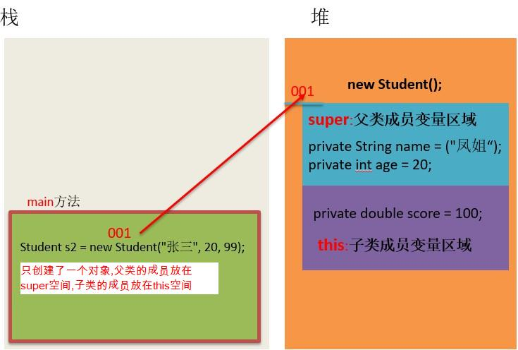

# 第三章 继承 

## 3.1 概述

### 3.1.1 引入
假如我们要定义如下类:
学生类,老师类和工人类，分析如下。

1. 学生类
   属性:姓名,年龄
   行为:吃饭,睡觉

2. 老师类
   属性:姓名,年龄，薪水
   行为:吃饭,睡觉，教书

3. 班主任
   属性:姓名,年龄，薪水
   行为:吃饭,睡觉，管理

如果我们定义了这三个类去开发一个系统，那么这三个类中就存在大量重复的信息（属性:姓名，年龄。行为：吃饭，睡觉）。这样就导致了相同代码大量重复，代码显得很臃肿和冗余，那么如何解决呢？

假如多个类中存在相同属性和行为时，我们可以将这些内容抽取到单独一个类中，那么多个类无需再定义这些属性和行为，只要**继承**那一个类即可。如图所示：


其中，多个类可以称为**子类**，单独被继承的那一个类称为**父类**、**超类（superclass）**或者**基类**。

### 3.1.2 继承的含义

继承描述的是事物之间的所属关系，这种关系是：`is-a` 的关系。例如，兔子属于食草动物，食草动物属于动物。可见，父类更通用，子类更具体。我们通过继承，可以使多种事物之间形成一种关系体系。

**继承**：就是子类继承父类的**属性**和**行为**，使得子类对象可以直接具有与父类相同的属性、相同的行为。子类可以直接访问父类中的**非私有**的属性和行为。

### 3.1.3 继承的好处
1. 提高**代码的复用性**（减少代码冗余，相同代码重复利用）。
2. 使类与类之间产生了关系。

### 3.1.4 继承的使用时机

当类与类之间，存在相同（共性）的内容，并**满足子类是父类的一种**，就可以考虑使用继承，**不能盲目抽离公共内容**


## 3.2 继承的格式
通过 `extends` 关键字，可以声明一个子类继承另外一个父类，定义格式如下：
```java
class 父类 {
	...
}

class 子类 extends 父类 {
	...
}
```

**需要注意：Java是单继承的，一个类只能继承一个直接父类，跟现实世界很像，但是Java中的子类是更加强大的。**

但是：Java中支持多层继承，子类A继承父类B，父类B可以继承父类C（**C是子类A的间接父类**，**B是子类A的直接父类**）

## 3.3 继承案例
### 3.3.1 案例

请使用继承定义以下类:

1. 学生类
   属性:姓名,年龄
   行为:吃饭,睡觉
2. 老师类
   属性:姓名,年龄，薪水
   行为:吃饭,睡觉，教书
3. 班主任
   属性:姓名,年龄，薪水
   行为:吃饭,睡觉，管理

### 3.3.2 案例图解分析

老师类，学生类，还有班主任类，实际上都是属于人类的，我们可以定义一个人类，把他们相同的属性和行为都定义在人类中，然后继承人类即可，子类特有的属性和行为就定义在子类中了。

如下图所示。


### 3.3.3 案例代码实现

**1.父类Human类**

  ```java
 public class Human {
    // 合理隐藏
    private String name ;
    private int age ;
	
    // 合理暴露
    public String getName() {
        return name;
    }

    public void setName(String name) {
        this.name = name;
    }

    public int getAge() {
        return age;
    }

    public void setAge(int age) {
        this.age = age;
    }
 }
  ```

**2.子类Teacher类**

  ```java
public class Teacher extends Human {
    // 工资
    private double salary ;
    
    // 特有方法
    public void teach(){
        System.out.println("老师在认真教技术！")；
    }

    public double getSalary() {
        return salary;
    }

    public void setSalary(double salary) {
        this.salary = salary;
    }
}
  ```

**3.子类Student类**

  ```java
public class Student extends Human{
 
}
  ```

**4.子类BanZhuren类**

```java 
public class Teacher extends Human {
    // 工资
    private double salary ;
    
       // 特有方法
    public void admin(){
        System.out.println("班主任强调纪律问题！")；
    }
    
    public double getSalary() {
        return salary;
    }

    public void setSalary(double salary) {
        this.salary = salary;
    }
}
```


**5.测试类**

  ```java
  public class Test {
      public static void main(String[] args) {
          Teacher dlei = new Teacher();
          dlei.setName("播仔");
          dlei.setAge("31");
          dlei.setSalary(1000.99);
          System.out.println(dlei.getName());
          System.out.println(dlei.getAge());
          System.out.println(dlei.getSalary());
          dlei.teach();
          
          BanZhuRen linTao = new BanZhuRen();
          linTao.setName("灵涛");
          linTao.setAge("28");
          linTao.setSalary(1000.99);
          System.out.println(linTao.getName());
          System.out.println(linTao.getAge());
          System.out.println(linTao.getSalary());
          linTao.admin();

          Student xugan = new Student();
          xugan.setName("播仔");
          xugan.setAge("31");
          //xugan.setSalary(1000.99); // xugan没有薪水属性，报错！
          System.out.println(xugan.getName());
          System.out.println(xugan.getAge());


      }
  }
  ```

### 3.3.4 小结

1.继承实际上是子类相同的属性和行为可以定义在父类中，子类特有的属性和行为由自己定义，这样就实现了相同属性和行为的重复利用，从而提高了代码复用。

2.子类继承父类，就可以直接得到父类的成员变量和方法。是否可以继承所有成分呢？请看下节！

## 3.4 子类不能继承的内容

### 3.4.1 引入

并不是父类的所有内容都可以给子类继承的：

**子类不能继承父类的构造方法。**

**值得注意的是子类可以继承父类的私有成员（成员变量），只是子类无法直接访问而已，可以通过getter/setter方法访问父类的private成员变量。**

继承关系：

| 名称     | 非私有       | 私有(private)          |
| -------- | ------------ | ---------------------- |
| 构造方法 | 不能         | 不能                   |
| 成员变量 | 能           | 能（但是不能直接使用） |
| 成员方法 | 能(虚方法表) | 不能                   |

能被添加到虚方法表中的方法：

1. 被非private修饰的方法
2. 非static修饰的方法
3. 非final修饰的方法


### 3.4.1 演示代码
```java
public class Demo03 {
    public static void main(String[] args) {
        Zi z = new Zi();
        System.out.println(z.num1);
//		System.out.println(z.num2); // 私有的子类无法使用
        // 通过getter/setter方法访问父类的private成员变量
        System.out.println(z.getNum2());

        z.show1();
        // z.show2(); // 私有的子类无法使用
    }
}

class Fu {
    public int num1 = 10;
    private int num2 = 20;

    public void show1() {
        System.out.println("show1");
    }

    private void show2() {
        System.out.println("show2");
    }

    public int getNum2() {
        return num2;
    }

    public void setNum2(int num2) {
        this.num2 = num2;
    }
}

class Zi extends Fu {
}
```

## 3.5 继承后的特点—成员变量

当类之间产生了继承关系后，其中各类中的成员变量，又产生了哪些影响呢？


原则：就近原则，谁离我近就使用谁。


### 3.5.1 成员变量不重名

如果子类父类中出现**不重名**的成员变量，这时的访问是**没有影响的**。代码如下：

```java
class Fu {
	// Fu中的成员变量
	int num = 5;
}
class Zi extends Fu {
	// Zi中的成员变量
	int num2 = 6;
  
	// Zi中的成员方法
	public void show() {
		// 访问父类中的num
		System.out.println("Fu num="+num); // 继承而来，所以直接访问。
		// 访问子类中的num2
		System.out.println("Zi num2="+num2);
	}
}
class Demo04 {
	public static void main(String[] args) {
        // 创建子类对象
		Zi z = new Zi(); 
      	// 调用子类中的show方法
		z.show();  
	}
}

演示结果：
Fu num = 5
Zi num2 = 6
```

### 3.5.2 成员变量重名

如果子类父类中出现**重名**的成员变量，这时的访问是**有影响的**。代码如下：

```java
class Fu1 {
	// Fu中的成员变量。
	int num = 5;
}
class Zi1 extends Fu1 {
	// Zi中的成员变量
	int num = 6;
  
	public void show() {
		// 访问父类中的num
		System.out.println("Fu num=" + num);
		// 访问子类中的num
		System.out.println("Zi num=" + num);
	}
}
class Demo04 {
	public static void main(String[] args) {
      	// 创建子类对象
		Zi1 z = new Zi1(); 
      	// 调用子类中的show方法
		z1.show(); 
	}
}
演示结果：
Fu num = 6
Zi num = 6
```

子父类中出现了同名的成员变量时，子类会优先访问自己对象中的成员变量。如果此时想访问父类成员变量如何解决呢？我们可以使用**super**关键字。

### 3.5.3  super访问父类成员变量

子父类中出现了同名的成员变量时，在子类中需要访问父类中非私有成员变量时，需要使用`super` 关键字，修饰父类成员变量，类似于之前学过的 `this` 。

需要注意的是：**super代表的是父类对象的引用，this代表的是当前对象的引用。**

**使用格式：**

```java
super.父类成员变量名
```

子类方法需要修改，代码如下：

```java
class Fu {
	// Fu中的成员变量。
	int num = 5;
}

class Zi extends Fu {
	// Zi中的成员变量
	int num = 6;
  
	public void show() {
        int num = 1;
      
        // 访问方法中的num
        System.out.println("method num=" + num);
        // 访问子类中的num
        System.out.println("Zi num=" + this.num);
        // 访问父类中的num
        System.out.println("Fu num=" + super.num);
	}
}

class Demo04 {
	public static void main(String[] args) {
      	// 创建子类对象
		Zi1 z = new Zi1(); 
      	// 调用子类中的show方法
		z1.show(); 
	}
}

演示结果：
method num=1
Zi num=6
Fu num=5
```

> 小贴士：Fu 类中的成员变量是非私有的，子类中可以直接访问。若Fu 类中的成员变量私有了，子类是不能直接访问的。通常编码时，我们遵循封装的原则，使用private修饰成员变量，那么如何访问父类的私有成员变量呢？对！可以在父类中提供公共的getXxx方法和setXxx方法。

## 3.6 继承后的特点—成员方法

当类之间产生了关系，其中各类中的成员方法，又产生了哪些影响呢？


在类的继承过程中，会产生一个虚方法表，里面记录着所有相关的方法，当实例去调用方法时，就会在虚方法表中寻找（可以大大提高性能）：

注意：只有父类中的虚方法，才能被子类继承


### 3.6.1 成员方法不重名

如果子类父类中出现**不重名**的成员方法，这时的调用是**没有影响的**。对象调用方法时，会先在子类中查找有没有对应的方法，若子类中存在就会执行子类中的方法，若子类中不存在就会执行父类中相应的方法。代码如下：

```java
class Fu {
	public void show() {
		System.out.println("Fu类中的show方法执行");
	}
}
class Zi extends Fu {
	public void show2() {
		System.out.println("Zi类中的show2方法执行");
	}
}
public  class Demo05 {
	public static void main(String[] args) {
		Zi z = new Zi();
     	//子类中没有show方法，但是可以找到父类方法去执行
		z.show(); 
		z.show2();
	}
}
```

### 3.6.2 成员方法重名

如果子类父类中出现**重名**的成员方法，则创建子类对象调用该方法的时候，子类对象会优先调用自己的方法。

代码如下：

```java
class Fu {
	public void show() {
		System.out.println("Fu show");
	}
}
class Zi extends Fu {
	//子类重写了父类的show方法
	public void show() {
		System.out.println("Zi show");
	}
}
public class ExtendsDemo05{
	public static void main(String[] args) {
		Zi z = new Zi();
     	// 子类中有show方法，只执行重写后的show方法
		z.show();  // Zi show
	}
}
```


### 3.6.3 super访问父类成员方法

也可以直接使用super直接访问父类的成员方法

示例：

```java
class Fu {
	public void show() {
		System.out.println("Fu show");
	}
}
class Zi extends Fu {
	public void showFu() {
    super.show();
		//System.out.println("Zi show");
	}
  
}
public class ExtendsDemo05{
	public static void main(String[] args) {
		Zi z = new Zi();
		z.show();  // Fu show
	}
}
```


## 3.7 方法重写

### 3.7.1 概念

**方法重写** ：子类中出现与父类一模一样的方法时（返回值类型，方法名和参数列表都相同），会出现覆盖效果，也称为重写或者复写。**声明不变，重新实现**。

### 3.7.2 使用场景与案例

发生在子父类之间的关系。
子类继承了父类的方法，但是子类觉得父类的这方法不足以满足自己的需求，子类重新写了一个与父类同名的方法，以便覆盖父类的该方 法。

例如：我们定义了一个动物类代码如下：

```java
public class Animal  {
    public void run(){
        System.out.println("动物跑的很快！");
    }
    public void cry(){
        System.out.println("动物都可以叫~~~");
    }
}
```

然后定义一个猫类，猫可能认为父类cry()方法不能满足自己的需求

代码如下：

```java
public class Cat extends Animal {
    public void cry(){
        System.out.println("我们一起学猫叫，喵喵喵！喵的非常好听！");
    }
}

public class Test {
	public static void main(String[] args) {
      	// 创建子类对象
      	Cat ddm = new Cat()；
        // 调用父类继承而来的方法
        ddm.run();
      	// 调用子类重写的方法
      	ddm.cry();
	}
}
```

### 3.7.2 @Override重写注解

* @Override:注解，重写注解校验！

* 这个注解标记的方法，就说明这个方法必须是重写父类的方法，否则编译阶段报错。

* 建议重写都加上这个注解，一方面可以提高代码的可读性，一方面可以防止重写出错！

  加上后的子类代码形式如下：

  ``` java
  public class Cat extends Animal {
       // 声明不变，重新实现
      // 方法名称与父类全部一样，只是方法体中的功能重写写了！
      @Override
      public void cry(){
          System.out.println("我们一起学猫叫，喵喵喵！喵的非常好听！");
      }
  }
  ```


### 3.7.3 重写的本质

重写的本质，其实就是重写了虚方法表中的方法，一旦重写，就会覆盖**自己的虚方法表**中，重父类继承过来的方法：


### 3.7.4 注意事项

1. 方法重写是发生在子父类之间的关系。
2. 子类方法覆盖父类方法，**必须要保证权限大于等于父类权限**。
3. 子类方法覆盖父类方法，函数名和参数列表都要**一模一样**。
4. 子类重写父类方法时返回值类型子类必须小于等于父类
5. **建议：重写的方法尽量和父类保持一致**
6. 只有被添加到**虚方法表中的方法**才能被重写
7. 最好还要加上@Override注解（必须写我自己写的）


## 3.8 继承后的特点—构造方法

### 3.8.1 引入

当类之间产生了关系，其中各类中的构造方法，又产生了哪些影响呢？
首先我们要回忆两个事情，构造方法的定义格式和作用。

1. 构造方法的名字是与类名一致的。所以子类是无法继承父类构造方法的。
2. 构造方法的作用是初始化对象成员变量数据的。所以子类的初始化过程中，必须先执行父类的初始化动作。子类的构造方法中默认有一个`super()` ，表示调用父类的构造方法，父类成员变量初始化后，才可以给子类使用。（**先有爸爸，才能有儿子**）

**继承后子类构方法器特点:子类所有构造方法的第一行都会默认先调用父类的无参构造方法**

原因：空参构造的作用，一般是用来初始化类中的成员变量，如果子类的构造中，不先调用一下父类的空参构造，那么父类的成员变量就没有初始化呀，子类怎么使用呢？

示例：

```java
public class Zi extends Fu {
  public Zi() {
    super(); // 这个虚拟机会自动加在第一行，你不写也存在，还必须是第一行
  
  	// 如果需要调用有参构造，则需要自己手动调用spuer(...)
  }
}
```


### 3.8.2 案例演示

按如下需求定义类:

1. 人类
   成员变量: 姓名,年龄
   成员方法: 吃饭
2. 学生类
   成员变量: 姓名,年龄,成绩
   成员方法: 吃饭

代码如下：
```java
class Person {
    private String name;
    private int age;

    public Person() {
        System.out.println("父类无参");
    }

    // getter/setter省略
}

class Student extends Person {
    private double score;

    public Student() {
        //super(); // 调用父类无参,默认就存在，可以不写，必须再第一行
        System.out.println("子类无参");
    }
    
     public Student(double score) {
        //super();  // 调用父类无参,默认就存在，可以不写，必须再第一行
        this.score = score;    
        System.out.println("子类有参");
     }

}

public class Demo07 {
    public static void main(String[] args) {
        Student s1 = new Student();
        System.out.println("----------");
        Student s2 = new Student(99.9);
    }
}

输出结果：
父类无参
子类无参
----------
父类无参
子类有参
```

### 3.8.3 小结

* 子类构造方法执行的时候，都会在第一行默认先调用父类无参数构造方法一次。
* 子类构造方法的第一行都隐含了一个**super()**去调用父类无参数构造方法，**super()**可以省略不写。

## 3.9 super(...)和this(...)

this：本质其实就是一个局部变量

super：代表父类的存储空间


### 3.9.1  引入

请看上节中的如下案例：

```java 
class Person {
    private String name;
    private int age;

    public Person() {
        System.out.println("父类无参");
    }

    // getter/setter省略
}

class Student extends Person {
    private double score;

    public Student() {
        //super(); // 调用父类无参构造方法,默认就存在，可以不写，必须再第一行
        System.out.println("子类无参");
    }
    
     public Student(double score) {
        //super();  // 调用父类无参构造方法,默认就存在，可以不写，必须再第一行
        this.score = score;    
        System.out.println("子类有参");
     }
      // getter/setter省略
}

public class Demo07 {
    public static void main(String[] args) {
        // 调用子类有参数构造方法
        Student s2 = new Student(99.9);
        System.out.println(s2.getScore()); // 99.9
        System.out.println(s2.getName()); // 输出 null
        System.out.println(s2.getAge()); // 输出 0
    }
}
```

我们发现，子类有参数构造方法只是初始化了自己对象中的成员变量score，而父类中的成员变量name和age依然是没有数据的，怎么解决这个问题呢，我们可以借助与super(...)去调用父类构造方法，以便初始化继承自父类对象的name和age.

### 3.9.2 super和this的用法格式

super和this完整的用法如下，其中this，super访问成员我们已经接触过了。

```java
this.成员变量    	--    本类的
super.成员变量    	--    父类的

this.成员方法名()  	--    本类的    
super.成员方法名()   --    父类的
```

接下来我们使用调用构造方法格式：

```java
super(...) -- 调用父类的构造方法，根据参数匹配确认
this(...) -- 调用本类的其他构造方法，根据参数匹配确认
```

### 3.9.3 super(....)用法演示

代码如下：

```java
class Person {
    private String name ="凤姐";
    private int age = 20;

    public Person() {
        System.out.println("父类无参");
    }
    
    public Person(String name , int age){
        this.name = name ;
        this.age = age ;
    }

    // getter/setter省略
}

class Student extends Person {
    private double score = 100;

    public Student() {
        //super(); // 调用父类无参构造方法,默认就存在，可以不写，必须再第一行
        System.out.println("子类无参");
    }
    
     public Student(String name ， int age，double score) {
        super(name ,age);// 调用父类有参构造方法Person(String name , int age)初始化name和age
        this.score = score;    
        System.out.println("子类有参");
     }
      // getter/setter省略
}

public class Demo07 {
    public static void main(String[] args) {
        // 调用子类有参数构造方法
        Student s2 = new Student("张三"，20，99);
        System.out.println(s2.getScore()); // 99
        System.out.println(s2.getName()); // 输出 张三
        System.out.println(s2.getAge()); // 输出 20
    }
}
```

**注意：**

**子类的每个构造方法中均有默认的super()，调用父类的空参构造。手动调用父类构造会覆盖默认的super()。**

**super() 和 this() 都必须是在构造方法的第一行，所以不能同时出现。**

super(..)是根据参数去确定调用父类哪个构造方法的。

### 3.9.4 super(...)案例图解

**父类空间优先于子类对象产生**

在每次创建子类对象时，先初始化父类空间，再创建其子类对象本身。目的在于子类对象中包含了其对应的父类空间，便可以包含其父类的成员，如果父类成员非private修饰，则子类可以随意使用父类成员。代码体现在子类的构造七调用时，一定先调用父类的构造方法。理解图解如下：




### 3.9.5 this(...)用法演示

this(...)
 *    默认是去找本类中的其他构造方法，根据参数来确定具体调用哪一个构造方法。
 *    为了借用其他构造方法的功能。
 *    一般都是需要给实例对象初始化一些默认值时会用到

```java
package com.itheima._08this和super调用构造方法;
/**
 * this(...):
 *    默认是去找本类中的其他构造方法，根据参数来确定具体调用哪一个构造方法。
 *    为了借用其他构造方法的功能。
 *
 */
public class ThisDemo01 {
    public static void main(String[] args) {
        Student xuGan = new Student();
        System.out.println(xuGan.getName()); // 输出:徐干
        System.out.println(xuGan.getAge());// 输出:21
        System.out.println(xuGan.getSex());// 输出： 男
    }
}

class Student{
    private String name ;
    private int age ;
    private char sex ;

    public Student() {
  // 很弱，我的兄弟很牛逼啊，我可以调用其他构造方法：Student(String name, int age, char sex)
        this("徐干",21,'男');
    }

    public Student(String name, int age, char sex) {
        this.name = name ;
        this.age = age   ;
        this.sex = sex   ;
    }

    public String getName() {
        return name;
    }

    public void setName(String name) {
        this.name = name;
    }

    public int getAge() {
        return age;
    }

    public void setAge(int age) {
        this.age = age;
    }

    public char getSex() {
        return sex;
    }

    public void setSex(char sex) {
        this.sex = sex;
    }
}
```


示例二：

需求：创建实例时，默认初始化school为海南大学

```java
public class Student {
  String name;
  int age;
  String school;
  
  public Student() {
    // 修改一下空参构造，来帮助我们初始化实例对象
    this(null, 0, "海南大学"); // 注意这个必须要写在第一行
  }
  
  public Student(String name, int age, String schoool) {
    this.name = name;
    this.age = age;
    this.school = school;
  }
}


// 测试类
public class Test {
    public static void main(String[] args) {
        Student q = new Student();
     		q.school; //这里就是海南大学
    }
}
```


### 3.9.6 小结

* **子类的每个构造方法中均有默认的super()，调用父类的空参构造。手动调用父类构造会覆盖默认的super()。**

* **super() 和 this() 都必须是在构造方法的第一行，所以不能同时出现。**

* **super(..)和this(...)是根据参数去确定调用父类哪个构造方法的。**
* super(..)可以调用父类构造方法初始化继承自父类的成员变量的数据。
* this(..)可以调用本类中的其他构造方法。

## 3.10 继承的特点
1. Java只支持单继承，不支持多继承。
  ```java
// 一个类只能有一个父类，不可以有多个父类。
class A {}
class B {}
class C1 extends A {} // ok
// class C2 extends A, B {} // error
  ```

2. 一个类可以有多个子类。
  ```java
// A可以有多个子类
class A {}
class C1 extends A {}
class C2 extends  A {}
  ```

3. 可以多层继承。
  ```java
class A {}
class C1 extends A {}
class D extends C1 {}
  ```
  > 顶层父类是Object类。所有的类默认继承Object，作为父类。

## 4. 关于今天知识的小结：

会写一个继承结构下的标准Javabean即可

需求：

​	猫：属性，姓名，年龄，颜色

​	狗：属性，姓名，年龄，颜色，吼叫

 分享书写技巧：

​        1.在大脑中要区分谁是父，谁是子

​        2.把共性写到父类中，独有的东西写在子类中

​        3.开始编写标准Javabean（从上往下写）

​        4.在测试类中，创建对象并赋值调用


代码示例：

```java
package com.itheima.test4;

public class Animal {
    //姓名，年龄，颜色
    private String name;
    private int age;
    private String color;


    public Animal() {
    }

    public Animal(String name, int age, String color) {
        this.name = name;
        this.age = age;
        this.color = color;
    }

    public String getName() {
        return name;
    }

    public void setName(String name) {
        this.name = name;
    }

    public int getAge() {
        return age;
    }

    public void setAge(int age) {
        this.age = age;
    }

    public String getColor() {
        return color;
    }

    public void setColor(String color) {
        this.color = color;
    }
}


public class Cat extends Animal{
    //因为猫类中没有独有的属性。
    //所以此时不需要写私有的成员变量

    //空参
    public Cat() {
    }

    //需要带子类和父类中所有的属性
    public Cat(String name, int age, String color) {
        super(name,age,color);
    }
}


public class Dog extends Animal{
    //Dog ：吼叫
    private String wang;

    //构造
    public Dog() {
    }

    //带参构造：带子类加父类所有的属性
    public Dog(String name, int age, String color,String wang) {
        //共性的属性交给父类赋值
        super(name,age,color);
        //独有的属性自己赋值
        this.wang = wang;
    }

    public String getWang() {
        return wang;
    }

    public void setWang(String wang) {
        this.wang = wang;
    }
}

public class Demo {
    public static void main(String[] args) {
        //Animal ： 姓名，年龄，颜色
        //Cat :
        //Dog ：吼叫

        //创建狗的对象
        Dog d = new Dog("旺财",2,"黑色","嗷呜~~");
        System.out.println(d.getName()+", " + d.getAge() + ", " + d.getColor() + ", " + d.getWang());

        //创建猫的对象
        Cat c = new Cat("中华田园猫",3,"黄色");
        System.out.println(c.getName() + ", " + c.getAge() + ", " + c.getColor());
    }
}


```


