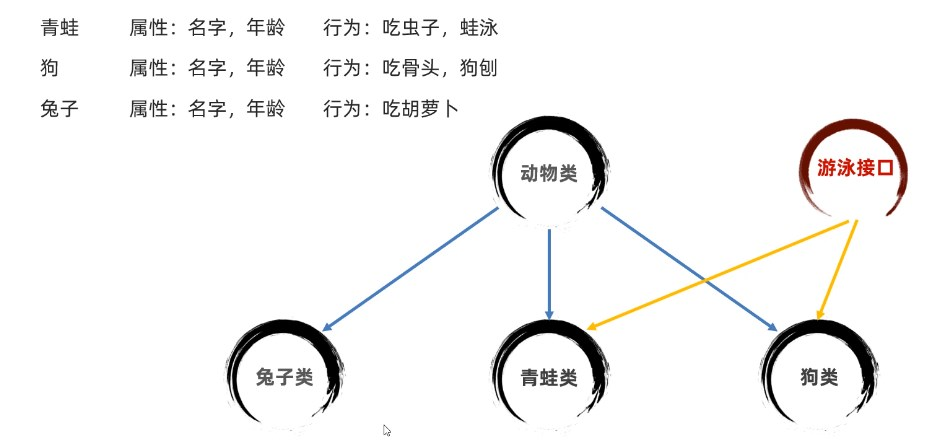
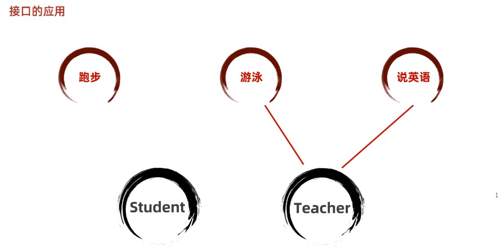
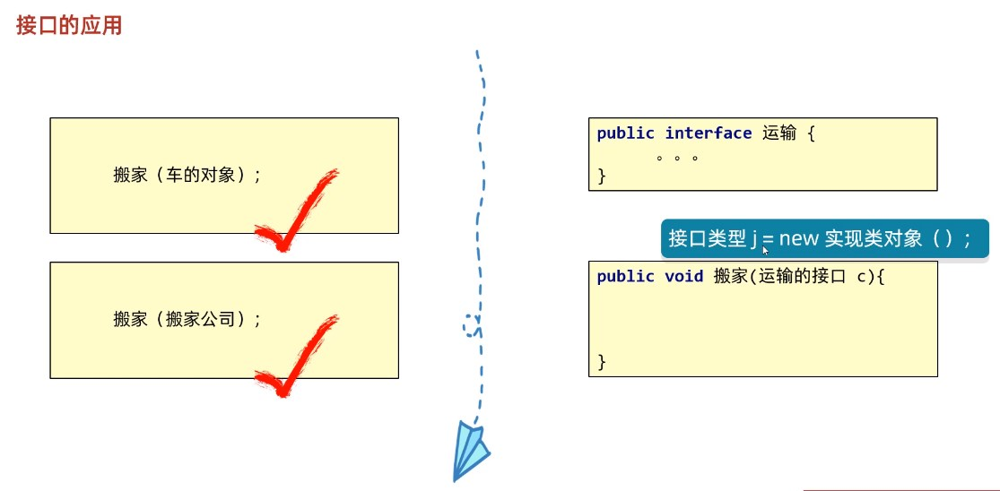

# 接口


## 2.1 概述

我们已经学完了抽象类，抽象类中可以用抽象方法，也可以有普通方法，构造方法，成员变量等。那么什么是接口呢？**接口是更加彻底的抽象，JDK7之前，包括JDK7，接口中全部是抽象方法。接口同样是不能创建对象的**。


接口：**就是一种规则，是对行为的抽象**

看下图：



三个子类都有吃这个方法，所以我们可以把吃抽离出来放到动物类中，当作抽象方法，让子类实现。

但是游泳只有青蛙和狗需要实现，这时再放在父类中就不太合理，这时候就需要`interface`接口来帮忙了，将游泳抽象方法放在游泳接口中，让青蛙和狗去实现即可


## 2.2 定义格式

一般接口也是一个单独的文件

```java
//接口的定义格式：
interface 接口名称{
    // 抽象方法
}

// 接口的声明：interface
// 接口名称：首字母大写，满足“驼峰模式”
```

## 2.3 接口成分的特点

  在`JDK7`，包括`JDK7`之前，接口中的**只有**包含：抽象方法和常量

  `JDK8`新特性：接口中可以定义有方法体的方法

  `JDK9`新特性：接口中可以定义私有方法

### 2.3.1.抽象方法

​       注意：接口中的抽象方法默认会自动加上public abstract修饰程序员无需自己手写！！
​       按照规范：以后接口中的抽象方法建议不要写上public abstract。因为没有必要啊，默认会加上。

示例：

```java
public interface TestInterface {
  void test();
  // 方法不需要加前面的权限修饰符和abstract
  int max();
}
```


### 2.3.2 常量

 在接口中定义的成员变量默认会加上： public static final修饰。也就是说在**接口中定义的成员变量实际上是一个常量**。这里是使用public static final修饰后，变量值就不可被修改，并且是静态化的变量可以直接用接口名访问，所以也叫常量。常量必须要给初始值。常量命名规范建议字母全部大写，多个单词用下划线连接。

示例：

```java
public interface Test {
  int TEST_VALUE = 10;
  // 默认是一个常量，所以建议我们直接用常量的命名规范
}
```


### 2.3.3 案例演示

```java
public interface InterF {
    // 抽象方法！
    //    public abstract void run();
    void run();

    //    public abstract String getName();
    String getName();

    //    public abstract int add(int a , int b);
    int add(int a , int b);


    // 它的最终写法是：
    // public static final int AGE = 12 ;
    int AGE  = 12; //常量
    String SCHOOL_NAME = "黑马程序员";

}
```

## 2.4 基本的实现

### 2.4.1 实现接口的概述

类与接口的关系为实现关系，即**类实现接口**，该类可以称为接口的实现类，也可以称为接口的子类。实现的动作类似继承，格式相仿，只是关键字不同，实现使用 ` implements`关键字。

### 2.4.2 实现接口的格式

```java
/**接口的实现：
    在Java中接口是被实现的，实现接口的类称为实现类。
    实现类的格式:*/
class 类名 implements 接口1,接口2,接口3...{

}
```

从上面格式可以看出，接口是可以被多实现的。大家可以想一想为什么呢？

### 2.4.3 类实现接口的要求和意义

1. 必须**重写实现的全部接口中所有抽象方法**。
2. 如果一个类实现了接口，但是没有重写完全部接口的全部抽象方法，这个类也必须定义成抽象类。
3. **意义：接口体现的是一种规范，接口对实现类是一种强制性的约束，要么全部完成接口申明的功能，要么自己也定义成抽象类。这正是一种强制性的规范。**

### 2.4.4  类与接口基本实现案例

假如我们定义一个运动员的**接口**（规范），代码如下：

```java
/**
   接口：接口体现的是规范。
 * */
public interface SportMan {
    void run(); // 抽象方法，跑步。
    void law(); // 抽象方法，遵守法律。
    String compittion(String project);  // 抽象方法，比赛。
}
```

接下来定义一个乒乓球运动员类，实现接口，实现接口的**实现类**代码如下：

```java
package com.itheima._03接口的实现;
/**
 * 接口的实现：
 *    在Java中接口是被实现的，实现接口的类称为实现类。
 *    实现类的格式:
 *      class 类名 implements 接口1,接口2,接口3...{
 *
 *
 *      }
 * */
public class PingPongMan  implements SportMan {
    @Override
    public void run() {
        System.out.println("乒乓球运动员稍微跑一下！！");
    }

    @Override
    public void law() {
        System.out.println("乒乓球运动员守法！");
    }

    @Override
    public String compittion(String project) {
        return "参加"+project+"得金牌！";
    }
}
```

**测试代码**：

```java
public class TestMain {
    public static void main(String[] args) {
        // 创建实现类对象。
        PingPongMan zjk = new PingPongMan();
        zjk.run();
        zjk.law();
        System.out.println(zjk.compittion("全球乒乓球比赛"));

    }
}
```

### 2.4.5 类与接口的多实现案例

**类与接口之间的关系是多实现的，一个类可以同时实现多个接口。**

首先我们先定义两个接口，代码如下：

```java
/** 法律规范：接口*/
public interface Law {
    void rule();
}

/** 这一个运动员的规范：接口*/
public interface SportMan {
    void run();
}

```

然后定义一个实现类：

```java
/**
 * Java中接口是可以被多实现的：
 *    一个类可以实现多个接口: Law, SportMan
 *
 * */
public class JumpMan implements Law ,SportMan {
    @Override
    public void rule() {
        System.out.println("尊长守法");
    }

    @Override
    public void run() {
        System.out.println("训练跑步！");
    }
}
```

从上面可以看出类与接口之间是可以多实现的，我们可以理解成实现多个规范，这是合理的。

## 2.5 接口与接口的多继承

Java中，接口与接口之间是可以多继承的：也就是一个接口可以同时继承多个接口。大家一定要注意：

**类与类是继承关系，只能单继承不能多继承，可以多层继承**

**类与接口是实现关系**

**接口与接口是继承关系，既可以单继承，也能多继承**

接口继承接口就是把其他接口的抽象方法与本接口进行了合并。

案例演示：

```java 
public interface Abc {
    void go();
    void test();
}

/** 法律规范：接口*/
public interface Law {
    void rule();
    void test();
}

 *
 *  总结：
 *     接口与类之间是多实现的。
 *     接口与接口之间是多继承的。
 * */
public interface SportMan extends Law , Abc {
    void run();
}
```

## 2.6扩展：接口的细节

不需要背，只要当idea报错之后，知道如何修改即可。

关于接口的使用，以下为语法上要注意的细节，虽然条目较多，但若理解了抽象的本质，无需死记硬背。

1. 当两个接口中存在相同抽象方法的时候，该怎么办？

> 只要重写一次即可。此时重写的方法，既表示重写1接口的，也表示重写2接口的。

2. 实现类能不能继承A类的时候，同时实现其他接口呢？

> 继承的父类，就好比是亲爸爸一样
> 实现的接口，就好比是干爹一样
> 可以继承一个类的同时，再实现多个接口，只不过，要把接口里面所有的抽象方法，全部实现。

3. 实现类能不能继承一个抽象类的时候，同时实现其他接口呢？

> 实现类可以继承一个抽象类的同时，再实现其他多个接口，只不过要把里面所有的抽象方法全部重写。

4. 实现类Zi，实现了一个接口，还继承了一个Fu类。假设在接口中有一个方法，父类中也有一个相同的方法。子类如何操作呢？

> 处理办法一：如果父类中的方法体，能满足当前业务的需求，在子类中可以不用重写。
> 处理办法二：如果父类中的方法体，不能满足当前业务的需求，需要在子类中重写。

5. 如果一个接口中，有10个抽象方法，但是我在实现类中，只需要用其中一个，该怎么办?

> 可以在接口跟实现类中间，新建一个中间类（适配器类）
> 让这个适配器类去实现接口，对接口里面的所有的方法做空重写。
> 让子类继承这个适配器类，想要用到哪个方法，就重写哪个方法。
> 因为中间类没有什么实际的意义，所以一般会把中间类定义为抽象的，不让外界创建对象


## 接口的应用(重要)

应用一：

接口代表一种规则，是行为的抽象。想要哪一个类拥有这种行为时，就让这个类去实现对应的接口





应用二：接口的多态

一个方法，如果**参数传递的是一个接口**。**所有实现这个接口的类的实例**，都可以传递进这个方法



## 抽象类和接口的区别

有人分不清抽象类和接口之间的区别，虽然他们都可以说是一种规则

但是奥但是

抽象类，他还是一个类，是代表一种事物，而接口不是，接口仅仅是对**行为进行抽象**

**行为的抽象！**，**行为的抽象！！**，**行为的抽象！！！**，重要的事情说三遍


## `JDK8`接口新特性

`JDK7`既以前时，接口每新加一个方法时，其他实现接口的类都需要去重写一遍这个方法，为了更方便的扩展接口，`JDK8`提供了下面两种新的方法

### 默认方法default

`JDK8`新出了一个默认方法，可以让实现该接口的类不需要强制重写

具体格式如下：

```java
public default 返回值类型 方法名(参数)  {};
```

注意事项：

1. 由于默认方法不是抽象方法，所以不强制重写。但是如果被重写了，重写时需要去掉default关键字
2. 接口声明时，public可以省略，default不能省略
3. 如果实现了多个接口，多个接口中存在相同名字的默认方法，**子类就必须对该方法进行重写**


注意事项1的示例：

实现接口的类：

```java
package interfaceDemo03;

public class InterImpl implements Inter{

    @Override
    public void method1() {
        System.out.println("一定要被重写的抽象方法method1");
    }
		
  	// 这里没重写show方法一样不会报错
}

```

接口：

```java
package interfaceDemo03;

public interface Inter {
    public abstract void method1();
		
  	// 这个默认方法，需要有方法体奥，并且还不是强制重写的
    public default void show() {
        System.out.println("我是JDK8中的默认方法------不一定需要被重写");
    };
}

```


注意事项2的示例：

接口的实现类：

```java
package interfaceDemo03;
// 用的同一个接口
public class InterImpl implements Inter{

    @Override
    public void method1() {
        System.out.println("一定要被重写的抽象方法method1");
    }

    @Override
    // 注意这里，重写时就不能再加default关键字了
    public void show() {
        System.out.println("重写接口中的默认方法show");
    }
}
```


注意事项3的示例：

接口的实现类：

```java
package interfaceDemo03;
// 我们再inter和inter2中都写了一个show的default方法
public class InterImpl implements Inter, Inter2{

    @Override
    public void method1() {
        System.out.println("一定要被重写的抽象方法method1");
    }
		
  	// 注意如果没有重写show方法就会报错
    /*@Override
    public void show() {
        System.out.println("重写接口中的默认方法show");
    }*/
}

```

### 静态方法static

`JDK8`以后接口中允许定义静态方法了，需要用static修饰


接口中静态方法格式：

```java
public static 返回类型 方法名(参数列表) {}
```


注意事项：

1. 静态方法只能通过接口名儿来调用，不能通过实现类名或者对象名调用
2. 声明时，public可以省略，static不能省略
3. 静态方法不需要也不能重写(不是虚方法)


调用示例：

接口：
```java
package interfaceDemo04;

public interface Inter {
    public abstract void method();


    public static void show() {
        System.out.println("Inter中的静态方法");
    }
}

```

测试类：

```java
package interfaceDemo04;

public class Test {
    public static void main(String[] args) {

        // 调用接口中的静态方法
        Inter.show();
    }
}

```


## `JDK9`接口的新特性

在`JDK9`中，接口中可以声明私有方法，这些方法只为当前接口提供服务，不需要外类进行访问

格式：

```java
// 格式1：普通静态方法
private 返回类型 方法名(参数列表){}
private void show() {}

// 格式2：静态的私有方法
private static 返回值类型 方法名(参数列表) {}
private static void method() {}
```


注意事项：

1. private的方法有两种，一种普通的，一种静态的，普通的默认方法使用，静态的给静态方法使用


示例：

```java
package interfaceDemo05;

public interface InterA {
		// 默认
    public default void show1() {
        System.out.println("默认show1方法开始执行");
        show3();
    }

		// 默认
    public default void show2() {
        System.out.println("默认show2方法开始执行");
        show3();
    }

		// 静态方法
    public static void show() {
        System.out.println("静态方法show开始执行");
        show4(); // 这里要使用静态私有方法，否则会报错
    }

    // 抽离公共部分为sho3方法
    private void show3() {
        System.out.println("方法输出日志");
    }

    // 抽离公共部分为静态方法
    private static void show4() {
        System.out.println("方法输出日志");
    }
}

```


## 适配器设计模式

核心：就是添加了一个第三者(●ˇ∀ˇ●)


需求：目前拥有一个接口(Inter)，里面有10个抽象方法，但是目前我只用到接口中的一个方法，怎么解决呢？

解决方式一：直接实现接口Inter，重写10个方法，用到的就些内容，其他的不写内容（目标类过于繁琐，有9个多余的用不到的方法）

解决方式二：适配器开发模式，新建一个抽象的中间类(`xxxAdapter`)，让中间类去实现接口(`Inter`)，然后目标类继承中间类，然后重写想要的那个方法就行了

好处：目标类非常简洁，只有我们要用到的方法

>tips:
>
>如果目标类中有父类怎么半？
>
>让中间类，去继承目标类的父类即可


需求：目前我们只用`method1`方法，利用适配器设计模式解决目标类重复代码

示例：

`Inter`

```java
package interfaceDemo06;

public interface Inter {
    public abstract void method1();
    public abstract void method2();
    public abstract void method3();
    public abstract void method4();
    public abstract void method5();
    public abstract void method6();
    public abstract void method7();
    public abstract void method8();
    public abstract void method9();
    public abstract void method10();
}

```


适配器类`InterAdapter`

```java
package interfaceDemo06;

public abstract class InterAdapter implements Inter{
    @Override
    public void method1() {

    }

    @Override
    public void method2() {

    }

    @Override
    public void method3() {

    }

    @Override
    public void method4() {

    }

    @Override
    public void method5() {

    }

    @Override
    public void method6() {

    }

    @Override
    public void method7() {

    }

    @Override
    public void method8() {

    }

    @Override
    public void method9() {

    }

    @Override
    public void method10() {

    }
}

```

目标类`InterImpl`

```java
package interfaceDemo06;

public class InterImpl extends InterAdapter{
  
  	// 非常简洁，就只有我们要的这一个method1方法
    @Override
    public void method1() {
        System.out.println("只用第一个方法");
    }
}

```

