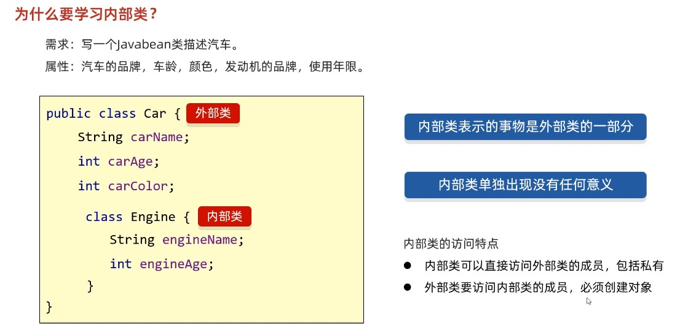

# 内部类


## 3.1 概述

### 3.1.1 什么是内部类

将一个类A定义在另一个类B里面，里面的那个类A就称为**内部类**，B则称为**外部类**。可以把内部类理解成寄生，外部类理解成宿主。





### 3.1.2 什么时候使用内部类

一个事物内部还有一个独立的事物，内部的事物脱离外部的事物无法独立使用

1. 人里面有一颗心脏。
2. 汽车内部有一个发动机。
3. 为了实现更好的封装性。

## 3.2 内部类的分类

按定义的位置来分

1. **成员内部内**，类定义在了成员位置 (类中方法外称为成员位置，无static修饰的内部类)
2. **静态内部类**，类定义在了成员位置 (类中方法外称为成员位置，有static修饰的内部类)
3. **局部内部类**，类定义在方法内
4. **匿名内部类**，没有名字的内部类，可以在方法中，也可以在类中方法外。

## 3.3 成员内部类

**成员内部类特点**：

- 无static修饰的内部类，属于外部类对象的。
- 宿主：外部类对象。

**内部类的使用格式**：

```java
 外部类.内部类。 // 访问内部类的类型都是用 外部类.内部类
```

**获取成员内部类对象的两种方式**：

方式一：外部直接创建成员内部类的对象

```java
外部类.内部类 变量 = new 外部类（）.new 内部类（）;
```

方式二：在外部类中定义一个方法提供内部类的对象（**内部类被`private`关键字修饰了**）

**案例演示**

```java
方式一：
public class Test {
    public static void main(String[] args) {
        //  宿主：外部类对象。
       // Outer out = new Outer();
        // 创建内部类对象。
        Outer.Inner oi = new Outer().new Inner();
        oi.method();
    }
}

class Outer {
    // 成员内部类，属于外部类对象的。
    // 拓展：成员内部类不能定义静态成员。
    public class Inner{
        // 这里面的东西与类是完全一样的。
        public void method(){
            System.out.println("内部类中的方法被调用了");
        }
    }
}


方式二：
public class Outer {
    String name;
    private class Inner{
        static int a = 10;
    }
    public Inner getInstance(){
        return new Inner();
    }
}

public class Test {
    public static void main(String[] args) {
        Outer o = new Outer();
        System.out.println(o.getInstance());


    }
}
```

## 3.4 成员内部类的细节

编写成员内部类的注意点：

1. 成员内部类可以被一些修饰符所修饰，比如： private，默认，protected，public，static等
2. 在成员内部类里面，JDK16之前不能定义静态变量，JDK16开始才可以定义静态变量。
3. 创建内部类对象时，对象中有一个隐含的`Outer.this`记录外部类对象的地址值。（请参见3.6节的内存图）

详解：

​	内部类被private修饰，外界无法直接获取内部类的对象，只能通过3.3节中的方式二获取内部类的对象

​	被其他权限修饰符修饰的内部类一般用3.3节中的方式一直接获取内部类的对象

​	内部类被static修饰是成员内部类中的特殊情况，叫做静态内部类下面单独学习。

​	内部类如果想要访问外部类的成员变量，外部类的变量必须用final修饰，`JDK8`以前必须手动写final，`JDK8`之后不需要手动写，`JDK`默认加上。

## 3.5 成员内部类面试题(内部类获取外部类成员变量)

请在?地方向上相应代码,以达到输出的内容

注意：内部类访问外部类对象的格式是：**外部类名.this**

```java
public class Test {
    public static void main(String[] args) {
        Outer.inner oi = new Outer().new inner();
        oi.method();
    }
}

class Outer {	// 外部类
    private int a = 30;

    // 在成员位置定义一个类
    class inner {
        private int a = 20;

        public void method() {
            int a = 10;
            System.out.println(???);	// 10   答案：a
            System.out.println(???);	// 20	答案：this.a
            System.out.println(???);	// 30	答案：Outer.this.a
        }
    }
}
```


## 3.7 静态内部类

**静态内部类特点**：

* 静态内部类是一种特殊的成员内部类。

- 有static修饰，属于外部类本身的。
- 总结：静态内部类与其他类的用法完全一样。只是访问的时候需要加上外部类.内部类。
- **拓展1**:**静态内部类可以直接访问外部类的静态成员。**
- **拓展2**:静态内部类不可以直接访问外部类的非静态成员，如果要访问需要创建外部类的对象。
- **拓展3**:静态内部类中没有银行的`Outer.this`。

**内部类的使用格式**：

```
外部类.内部类。
```

**静态内部类对象的创建格式**：

```java
外部类.内部类 变量 = new 外部类.内部类构造器;
```

**调用方法的格式：**

* 调用非静态方法的格式：先创建对象，用对象调用
* 调用静态方法的格式：外部类名.内部类名.方法名();

**案例演示**：

```java
// 外部类：Outer01
class Outer01{
    private static  String sc_name = "黑马程序";
    // 内部类: Inner01
    public static class Inner01{
        // 这里面的东西与类是完全一样的。
        private String name;
        public Inner01(String name) {
            this.name = name;
        }
        public void showName(){
            System.out.println(this.name);
            // 拓展:静态内部类可以直接访问外部类的静态成员。
            System.out.println(sc_name);
        }
    }
}

public class InnerClassDemo01 {
    public static void main(String[] args) {
        // 创建静态内部类对象。
        // 外部类.内部类  变量 = new  外部类.内部类构造器;
        Outer01.Inner01 in  = new Outer01.Inner01("张三");
        in.showName();
    }
}
```

## 3.8 局部内部类

- **局部内部类** ：定义在**方法中**的类。

定义格式:

```java
class 外部类名 {
	数据类型 变量名;
	
	修饰符 返回值类型 方法名(参数列表) {
		// …
		class 内部类 {
			// 成员变量
			// 成员方法
		}
	}
}
```


局部内部类注意事项：

1. 局部内部类和类似于方法中的局部变量
2. 外界是无法直接使用局部内部类的，需要在方法内部创建对象并使用
3. 该类可以直接访问外部类的成员，也可以访问方法内的局部变量


## 3.9 匿名内部类【重点】

### 3.9.1 概述

**匿名内部类** ：是内部类的简化写法。他是一个隐含了名字的内部类。开发中，最常用到的内部类就是匿名内部类了。

### 3.9.2 格式

```java
new 类名或者接口名() {
     重写方法;
};
```

包含了：

* **继承**或者**实现关系**

* 方法重写
* 创建对象

所以从语法上来讲，**这个整体其实是匿名内部类对象**

注意：这一整个整体，是一个实例对象！实例对象！！实例对象！！！或者叫实现类对象！(当时接口时就是实现类，是类名是继承的实例对象)


### 3.9.2 什么时候用到匿名内部类 

**实际上，如果我们希望定义一个只要使用一次的类，就可考虑使用匿名内部类。匿名内部类的本质作用**

**是为了简化代码**。 

之前我们使用接口时，似乎得做如下几步操作：

1. 定义子类
2. 重写接口中的方法
3. 创建子类对象
4. 调用重写后的方法

```java
interface Swim {
    public abstract void swimming();
}

// 1. 定义接口的实现类
class Student implements Swim {
    // 2. 重写抽象方法
    @Override
    public void swimming() {
        System.out.println("狗刨式...");
    }
}

public class Test {
    public static void main(String[] args) {
        // 3. 创建实现类对象
        Student s = new Student();
        // 4. 调用方法
        s.swimming();
    }
}
```

我们的目的，最终只是为了调用方法，那么能不能简化一下，把以上四步合成一步呢？匿名内部类就是做这样的快捷方式。

### 3.9.3 匿名内部类前提和格式

匿名内部类必须**继承一个父类**或者**实现一个父接口**。

**匿名内部类格式**

```java
new 父类名或者接口名(){
    // 方法重写
    @Override 
    public void method() {
        // 执行语句
    }
};
```

### 3.9.4 使用方式

以接口为例，匿名内部类的使用，代码如下：

```java
interface Swim {
    public abstract void swimming();
}

public class Demo07 {
    public static void main(String[] args) {
        // 使用匿名内部类
		new Swim() {
			@Override
			public void swimming() {
				System.out.println("自由泳...");
			}
		}.swimming();

        // 接口 变量 = new 实现类(); // 多态,走子类的重写方法
        Swim s2 = new Swim() {
            @Override
            public void swimming() {
                System.out.println("蛙泳...");
            }
        };

        s2.swimming();
        s2.swimming();
    }
}
```

### 3.9.5 匿名内部类的特点

1. 定义一个没有名字的内部类
2. 这个类实现了父类，或者父类接口
3. 匿名内部类会创建这个没有名字的类的对象

### 3.9.6 匿名内部类的使用场景

通常在方法的形式参数是接口或者抽象类时，也可以**将匿名内部类作为参数传递。**代码如下：

```java
interface Swim {
    public abstract void swimming();
}

public class Demo07 {
    public static void main(String[] args) {
        // 普通方式传入对象
        // 创建实现类对象
        Student s = new Student();
        
        goSwimming(s);
        // 匿名内部类使用场景:作为方法参数传递
        Swim s3 = new Swim() {
            @Override
            public void swimming() {
                System.out.println("蝶泳...");
            }
        };
        // 传入匿名内部类
        goSwimming(s3);

        // 完美方案: 一步到位
        goSwimming(new Swim() {
            public void swimming() {
                System.out.println("大学生, 蛙泳...");
            }
        });

        goSwimming(new Swim() {
            public void swimming() {
                System.out.println("小学生, 自由泳...");
            }
        });
    }

    // 定义一个方法,模拟请一些人去游泳
    public static void goSwimming(Swim s) {
        s.swimming();
    }
}
```

