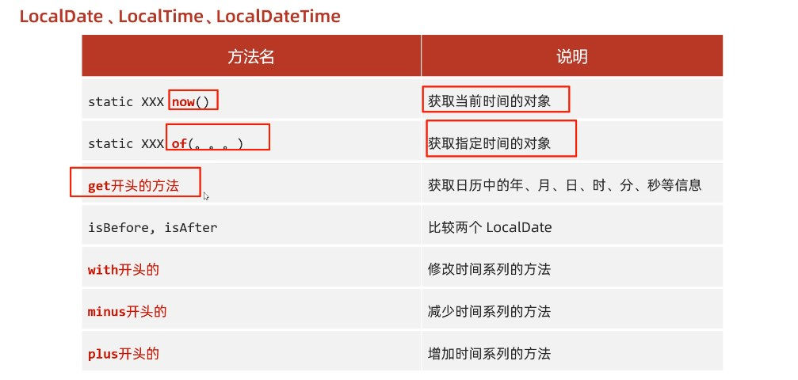
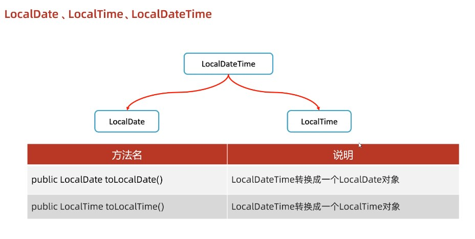

# JDK8的时间相关API

# 第四章 JDK8时间相关类

| JDK8时间类类名    | 作用                   |
| ----------------- | ---------------------- |
| ZoneId            | 时区                   |
| Instant           | 时间戳                 |
| ZoneDateTime      | 带时区的时间           |
| DateTimeFormatter | 用于时间的格式化和解析 |
| LocalDate         | 年、月、日             |
| LocalTime         | 时、分、秒             |
| LocalDateTime     | 年、月、日、时、分、秒 |
| Duration          | 时间间隔（秒，纳，秒） |
| Period            | 时间间隔（年，月，日） |
| ChronoUnit        | 时间间隔（所有单位）   |


注意：

1. JDK8的对于时间处理的相关方法，都是不会影响原对象，如果有修改的操作，都是创建一个新的对象
2. 


## Date类


### ZoneId 时区


| 函数                                     | 功能                     |
| ---------------------------------------- | ------------------------ |
| static Set<string> getAvailableZoneIds() | 获取Java中支持的所有时区 |
| static ZoneId systemDefault()            | 获取系统默认时区         |
| static Zoneld of(string zoneld)          | 获取一个指定时区         |


```java
/*
  static Set<string> getAvailableZoneIds() 获取Java中支持的所有时区
  static ZoneId systemDefault() 获取系统默认时区
  static Zoneld of(string zoneld) 获取一个指定时区
*/

//1.获取所有的时区名称
Set<String> zoneIds = ZoneId.getAvailableZoneIds();
System.out.println(zoneIds.size());//600
System.out.println(zoneIds);// Asia/Shanghai

//2.获取当前系统的默认时区
ZoneId zoneId = ZoneId.systemDefault();
System.out.println(zoneId);//Asia/Shanghai

//3.获取指定的时区
ZoneId zoneId1 = ZoneId.of("Asia/Pontianak");
System.out.println(zoneId1);//Asia/Pontianak
```


### Instant 时间戳

| 函数                                                         | 功能                                                         |
| ------------------------------------------------------------ | ------------------------------------------------------------ |
| **static** Instant now()                                     | 获取当前时间的Instant对象(标准时间不带时区，获取国内时间需要+8小时) |
| **static** Instant ofXxxx(long epochMilli)                   | 根据(秒/毫秒/纳秒)获取Instant对象详情看下面👇                 |
| **static** Instant Instant.ofEpochMilli(long epochMilli)     | 根据(毫秒)获取Instant对象                                    |
| **static** Instant Instant.ofEpochSecond(long epochSecond);  | 根据(秒)获取Instant对象                                      |
| **static** Instant Instant.ofEpochSecond(long epochSecond, long nanoAdjustment); | 根据(秒 + 纳秒)获取Instant对象，第一个参数秒，第二个参数纳秒 |
| ZonedDateTime atZone(ZoneIdzone)                             | 指定时区                                                     |
| boolean isxxx(Instant otherInstant)                          | 判断系列的方法                                               |
| Instant minusXxx(long millisToSubtract)                      | 减少时间系列的方法(返回新的对象)                             |
| Instant plusXxx(long millisToSubtract)                       | 增加时间系列的方法(返回新的对象)                             |


```java
/*
  static Instant now() 获取当前时间的Instant对象(标准时间)
  static Instant ofXxxx(long epochMilli) 根据(秒/毫秒/纳秒)获取Instant对象
  ZonedDateTime atZone(ZoneIdzone) 指定时区
  boolean isxxx(Instant otherInstant) 判断系列的方法
  Instant minusXxx(long millisToSubtract) 减少时间系列的方法
  Instant plusXxx(long millisToSubtract) 增加时间系列的方法
*/


//1.获取当前时间的Instant对象(标准时间)
Instant now = Instant.now();
System.out.println(now);

//2.根据(秒/毫秒/纳秒)获取Instant对象
Instant instant1 = Instant.ofEpochMilli(0L);
System.out.println(instant1);//1970-01-01T00:00:00z

Instant instant2 = Instant.ofEpochSecond(1L);
System.out.println(instant2);//1970-01-01T00:00:01Z

Instant instant3 = Instant.ofEpochSecond(1L, 1000000000L);
System.out.println(instant3);//1970-01-01T00:00:027

//3. 指定时区
ZonedDateTime time = Instant.now().atZone(ZoneId.of("Asia/Shanghai"));
System.out.println(time);


//4.isXxx 判断
Instant instant4=Instant.ofEpochMilli(0L);
Instant instant5 =Instant.ofEpochMilli(1000L);

//5.用于时间的判断
//isBefore:判断调用者代表的时间是否在参数表示时间的前面
boolean result1=instant4.isBefore(instant5);
System.out.println(result1);//true

//isAfter:判断调用者代表的时间是否在参数表示时间的后面
boolean result2 = instant4.isAfter(instant5);
System.out.println(result2);//false

//6.Instant minusXxx(long millisToSubtract) 减少时间系列的方法
Instant instant6 =Instant.ofEpochMilli(3000L); // 减少毫秒
System.out.println(instant6);//1970-01-01T00:00:03Z

Instant instant7 =instant6.minusSeconds(1); // 减少秒
System.out.println(instant7);//1970-01-01T00:00:02Z

```


### ZoneDateTime  带时区的时间


| 函数                                | 功能                                      |
| ----------------------------------- | ----------------------------------------- |
| static ZonedDateTime now()          | 获取当前时间的ZonedDateTime对象（带时区） |
| static ZonedDateTime ofXxxx(。。。) | 获取指定时间的ZonedDateTime对象           |
| ZonedDateTime withXxx(时间)         | 减少时间系列的方法                        |
| ZonedDateTime minusXxx(时间)        | 减少时间系列的方法                        |
| ZonedDateTime plusXxx(时间)         | 增加时间系列的方法                        |

细节：

1. JDK8新增的时间对象都是不可变的，如果我们对原对象进行修改了，都是返回一个全新的（再次强调）

```java
/*
  static ZonedDateTime now() 获取当前时间的ZonedDateTime对象
  static ZonedDateTime ofXxxx(。。。) 获取指定时间的ZonedDateTime对象
  ZonedDateTime withXxx(时间) 修改时间系列的方法
  ZonedDateTime minusXxx(时间) 减少时间系列的方法
  ZonedDateTime plusXxx(时间) 增加时间系列的方法
 */
//1.获取当前时间对象(带时区)
ZonedDateTime now = ZonedDateTime.now();
System.out.println(now);

//2.获取指定的时间对象(带时区)1/年月日时分秒纳秒方式指定
ZonedDateTime time1 = ZonedDateTime.of(2023, 10, 1, 11, 12, 12, 0, ZoneId.of("Asia/Shanghai"));
System.out.println(time1);

//通过Instant + 时区的方式指定获取时间对象
Instant instant = Instant.ofEpochMilli(0L);
ZoneId zoneId = ZoneId.of("Asia/Shanghai");
ZonedDateTime time2 = ZonedDateTime.ofInstant(instant, zoneId);
System.out.println(time2);


//3.withXxx 修改时间系列的方法
ZonedDateTime time3 = time2.withYear(2000);
System.out.println(time3);

//4. 减少时间
ZonedDateTime time4 = time3.minusYears(1);
System.out.println(time4);

//5.增加时间
ZonedDateTime time5 = time4.plusYears(1);
System.out.println(time5);
```


## 日期格式化类SimpleDateFormat


### DateTimeFormatter   用于时间的格式化和解析


| 函数                                     | 功能               |
| ---------------------------------------- | ------------------ |
| static DateTimeFormatter ofPattern(格式) | 获取格式对象       |
| String format(时间对象)                  | 按照指定方式格式化 |
|                                          |                    |


```java
/*
    static DateTimeFormatter ofPattern(格式) 获取格式对象
    String format(时间对象) 按照指定方式格式化
*/
//获取时间对象
ZonedDateTime time = Instant.now().atZone(ZoneId.of("Asia/Shanghai"));

// 解析/格式化器
DateTimeFormatter dtf1=DateTimeFormatter.ofPattern("yyyy-MM-dd HH:mm;ss EE a");
// 格式化
System.out.println(dtf1.format(time));
```


## 日历类Calendar


具体相关API：

with方法类似于JDK7中的set方法




### LocalDate  年、月、日

注意：该方法只能获取到年月日

```java
//1.获取当前时间的日历对象(包含 年月日)
LocalDate nowDate = LocalDate.now();
//System.out.println("今天的日期:" + nowDate);

//2.获取指定的时间的日历对象
LocalDate ldDate = LocalDate.of(2023, 1, 1);
System.out.println("指定日期:" + ldDate);

System.out.println("=============================");


//获取星期
DayOfWeek dayOfWeek = ldDate.getDayOfWeek();
System.out.println(dayOfWeek);
System.out.println(dayOfWeek.getValue());

//is开头的方法表示判断
System.out.println(ldDate.isBefore(ldDate));
System.out.println(ldDate.isAfter(ldDate));

//with开头的方法表示修改，只能修改年月日
LocalDate withLocalDate = ldDate.withYear(2000);
System.out.println(withLocalDate);

//minus开头的方法表示减少，只能减少年月日
LocalDate minusLocalDate = ldDate.minusYears(1);
System.out.println(minusLocalDate);


//plus开头的方法表示增加，只能增加年月日
LocalDate plusLocalDate = ldDate.plusDays(1);
System.out.println(plusLocalDate);
```


获取年：

```java
//3.get系列方法获取日历中的每一个属性值//获取年
int year = ldDate.getYear();
System.out.println("year: " + year);
```

获取月：

```java
//获取月//方式一:
Month m = ldDate.getMonth(); // 注意这里获取的月是一个对象
System.out.println(m);
System.out.println(m.getValue());

//方式二:
int month = ldDate.getMonthValue();
System.out.println("month: " + month);
```

获取日：

```java
//获取日
int day = ldDate.getDayOfMonth();
System.out.println("day:" + day);
```


获取一年中的第几天：

```java
//获取一年的第几天
int dayofYear = ldDate.getDayOfYear();
System.out.println("dayOfYear:" + dayofYear);
```


小栗子：
```java
//-------------
// 判断今天是否是你的生日
LocalDate birDate = LocalDate.of(2000, 1, 1);
LocalDate nowDate1 = LocalDate.now();

// 1.获取生日日期封装为月日对象
MonthDay birMd = MonthDay.of(birDate.getMonthValue(), birDate.getDayOfMonth());
// 2.把今天的时间封装为月日对象
// from方法，把一个实现TemporalAccessor接口的对象变成月日对象
MonthDay nowMd = MonthDay.from(nowDate1);

System.out.println("今天是你的生日吗? " + birMd.equals(nowMd));//今天是你的生日吗?
```


### LocalTime  时、分、秒

注意：

1. 该方法只能获取修改时、分、秒
2. 由于这个类只关注与时分秒所以它比较精确，在一些只关注时分秒且要求精确时间的场景就可以使用这个方法


```java
// 获取本地时间的日历对象。(包含 时分秒)
LocalTime nowTime = LocalTime.now();
System.out.println("今天的时间:" + nowTime);

System.out.println("------------------------------------");
System.out.println(LocalTime.of(8, 20));//时分
System.out.println(LocalTime.of(8, 20, 30));//时分秒
System.out.println(LocalTime.of(8, 20, 30, 150));//时分秒纳秒
LocalTime mTime = LocalTime.of(8, 20, 30, 150);

//is系列的方法
System.out.println(nowTime.isBefore(mTime));
System.out.println(nowTime.isAfter(mTime));

//with系列的方法，只能修改时、分、秒
System.out.println(nowTime.withHour(10));

//plus系列的方法，只能修改时、分、秒
System.out.println(nowTime.plusHours(10));
```


获取时、分、秒、纳秒：

```java
int hour = nowTime.getHour();//时
System.out.println("hour: " + hour);

int minute = nowTime.getMinute();//分
System.out.println("minute: " + minute);

int second = nowTime.getSecond();//秒
System.out.println("second:" + second);

int nano = nowTime.getNano();//纳秒
System.out.println("nano:" + nano);
```


### LocalDateTime  年、月、日、时、分、秒（常用）

注意：

1. LocalDateTime可以转换成LocalTime对象或者LocalDate对象




```java
// 当前时间的的日历对象(包含年月日时分秒)
LocalDateTime nowDateTime = LocalDateTime.now();

System.out.println("今天是:" + nowDateTime);//今天是：
System.out.println(nowDateTime.getYear());//年
System.out.println(nowDateTime.getMonthValue());//月
System.out.println(nowDateTime.getDayOfMonth());//日
System.out.println(nowDateTime.getHour());//时
System.out.println(nowDateTime.getMinute());//分
System.out.println(nowDateTime.getSecond());//秒
System.out.println(nowDateTime.getNano());//纳秒
// 日:当年的第几天
System.out.println("dayofYear:" + nowDateTime.getDayOfYear());
//星期
System.out.println(nowDateTime.getDayOfWeek());
System.out.println(nowDateTime.getDayOfWeek().getValue());
//月份
System.out.println(nowDateTime.getMonth());
System.out.println(nowDateTime.getMonth().getValue());

LocalDate ld = nowDateTime.toLocalDate();
System.out.println(ld);

LocalTime lt = nowDateTime.toLocalTime();
System.out.println(lt.getHour());
System.out.println(lt.getMinute());
System.out.println(lt.getSecond());
```


## 工具类


### Duration  时间间隔（纳秒，毫秒，秒）

```java
// 本地日期时间对象。
LocalDateTime today = LocalDateTime.now();
System.out.println(today);

// 出生的日期时间对象
LocalDateTime birthDate = LocalDateTime.of(2000, 1, 1, 0, 0, 0);
System.out.println(birthDate);

// Duration秒、纳秒、毫秒的相差对象
Duration duration = Duration.between(birthDate, today);//第二个参数减第一个参数
System.out.println("相差的时间间隔对象:" + duration); //PT206410H1M25.3514946S

System.out.println("============================================");
System.out.println(duration.toDays());//两个时间差的天数
System.out.println(duration.toHours());//两个时间差的小时数
System.out.println(duration.toMinutes());//两个时间差的分钟数
System.out.println(duration.toMillis());//两个时间差的毫秒数
System.out.println(duration.toNanos());//两个时间差的纳秒数
```


### Period  时间间隔（年，月，日）


```java
// 当前本地 年月日
LocalDate today = LocalDate.now();
System.out.println(today);

// 生日的 年月日
LocalDate birthDate = LocalDate.of(2000, 1, 1);
System.out.println(birthDate);

// period时间间隔对象
Period period = Period.between(birthDate, today);//第二个参数减第一个参数

System.out.println("相差的时间间隔对象:" + period);
System.out.println(period.getYears()); // 相差年份
System.out.println(period.getMonths()); // 相差月份
System.out.println(period.getDays()); // 相差天数

// 获取时间间隔总共有多少个月
System.out.println(period.toTotalMonths());
```


### ChronoUnit  时间间隔（所有单位）（常用）


**注意:**

1. 这个类计算出出来的数值，是**总数值**
2. between方法接受的参数只要是**JDK8的时间对象**都可以例如LocalDate对象、LocalTime对象、LocalDateTime对象，都行


```java
// 当前时间
LocalDateTime today = LocalDateTime.now();
System.out.println(today);
// 生日时间
LocalDateTime birthDate = LocalDateTime.of(2000, 1, 1,0, 0, 0);
System.out.println(birthDate);


System.out.println("相差的年数:" + ChronoUnit.YEARS.between(birthDate, today));
System.out.println("相差的月数:" + ChronoUnit.MONTHS.between(birthDate, today));
System.out.println("相差的周数:" + ChronoUnit.WEEKS.between(birthDate, today));
System.out.println("相差的天数:" + ChronoUnit.DAYS.between(birthDate, today));
System.out.println("相差的时数:" + ChronoUnit.HOURS.between(birthDate, today));
System.out.println("相差的分数:" + ChronoUnit.MINUTES.between(birthDate, today));
System.out.println("相差的秒数:" + ChronoUnit.SECONDS.between(birthDate, today));
System.out.println("相差的毫秒数:" + ChronoUnit.MILLIS.between(birthDate, today));
System.out.println("相差的微秒数:" + ChronoUnit.MICROS.between(birthDate, today));
System.out.println("相差的纳秒数:" + ChronoUnit.NANOS.between(birthDate, today));
System.out.println("相差的半天数:" + ChronoUnit.HALF_DAYS.between(birthDate, today));
System.out.println("相差的十年数:" + ChronoUnit.DECADES.between(birthDate, today));
System.out.println("相差的世纪(百年)数:" + ChronoUnit.CENTURIES.between(birthDate, today));
System.out.println("相差的千年数:" + ChronoUnit.MILLENNIA.between(birthDate, today));
System.out.println("相差的纪元数:" + ChronoUnit.ERAS.between(birthDate, today));
```


## isLeapYear()判断闰年

示例：

```java
LocalDate ld = LocalDate.of(2001, 3, 1);
//把时间往前减一天
LocalDate ld2 = ld.minusDays(1);
//获取这一天是一个月中的几号
int day2 = ld2.getDayOfMonth();
System.out.println(day2); 

// jdk8自带一个判断闰年平年的方法U•ェ•*U
//true:闰年
//false:平年
System.out.println(ld.isLeapYear());
```


# 第六章：算法小题

## 练习一：

需求：

​	键盘录入一些1~10日之间的整数，并添加到集合中。直到集合中所有数据和超过200为止。

代码示例：

```java
public class Test1 {
    public static void main(String[] args) {
        /*
            键盘录入一些1~10日之间的整数，并添加到集合中。直到集合中所有数据和超过200为止。
        */
        //1.创建一个集合用来添加整数
        ArrayList<Integer> list = new ArrayList<>();
        //2.键盘录入数据添加到集合中
        Scanner sc = new Scanner(System.in);
        while (true) {
            System.out.println("请输入一个整数");
            String numStr = sc.nextLine();
            int num = Integer.parseInt(numStr);//先把异常数据先进行过滤
            if (num < 1 || num > 100){
                System.out.println("当前数字不在1~100的范围当中，请重新输入");
                continue;
            }
            //添加到集合中//细节:
            //num:基本数据类型
            //集合里面的数据是Integer
            //在添加数据的时候触发了自动装箱
            list.add(num);
            //统计集合中所有的数据和
            int sum = getSum(list);
            //对sum进行判断
            if(sum > 200){
            System.out.println("集合中所有的数据和已经满足要求");
            break;
        }
    }

}


    private static int getSum(ArrayList<Integer> list) {
        int sum = 0;
        for (int i = 0; i < list.size(); i++) {
            //i :索引
            //list.get(i);
            int num = list.get(i);
            sum = sum + num;//+=
        }
        return sum;
    }
}

```

## 练习二：

需求：

​	自己实现parseInt方法的效果，将字符串形式的数据转成整数。要求:字符串中只能是数字不能有其他字符最少一位，最多10位日不能开头

代码示例：

```java
public class Test2 {
    public static void main(String[] args) {
        /*
            自己实现parseInt方法的效果，将字符串形式的数据转成整数。要求:
            字符串中只能是数字不能有其他字符最少一位，最多10位日不能开头
        */

        //1.定义一个字符串
        String str = "123";
        //2.校验字符串
        //习惯:会先把异常数据进行过滤，剩下来就是正常的数据。
        if (!str.matches("[1-9]\\d{0,9}")) {
            //错误的数据
            System.out.println("数据格式有误");
        } else {
            //正确的数据
            System.out.println("数据格式正确");
            //3.定义一个变量表示最终的结果
            int number = 0;
            //4.遍历字符串得到里面的每一个字符
            for (int i = 0; i < str.length(); i++) {
                int c = str.charAt(i) - '0';//把每一位数字放到number当中
                number = number * 10 + c;
            }
            System.out.println(number);
            System.out.println(number + 1);
        }
    }
}
```

## 练习三：

需求：

​	定义一个方法自己实现toBinaryString方法的效果，将一个十进制整数转成字符串表示的二进制

代码示例：

```java
package com.itheima.a04test;

public class Test3 {
    public static void main(String[] args) {
        /*

            定义一个方法自己实现toBinaryString方法的效果，将一个十进制整数转成字符串表示的二进制

         */
    }


    public static String tobinarystring(int number) {//6
        //核心逻辑:
        //不断的去除以2，得到余数，一直到商为日就结束。
        //还需要把余数倒着拼接起来

        //定义一个StringBuilder用来拼接余数
        StringBuilder sb = new StringBuilder();
        //利用循环不断的除以2获取余数
        while (true) {
            if (number == 0) {
                break;
            }
            //获取余数 %
            int remaindar = number % 2;//倒着拼接
            sb.insert(0, remaindar);
            //除以2 /
            number = number / 2;
        }
        return sb.toString();
    }
}

```

## 练习四：

需求：

​	请使用代码实现计算你活了多少天，用JDK7和JDK8两种方式完成

代码示例：

```java
public class Test4 {
    public static void main(String[] args) throws ParseException {
        //请使用代码实现计算你活了多少天，用JDK7和JDK8两种方式完成
        //JDK7
        //规则:只要对时间进行计算或者判断，都需要先获取当前时间的毫秒值
        //1.计算出生年月日的毫秒值
        String birthday = "2000年1月1日";
        SimpleDateFormat sdf = new SimpleDateFormat("yyyy年MM月dd日");
        Date date = sdf.parse(birthday);
        long birthdayTime = date.getTime();
        //2.获取当前时间的毫秒值
        long todayTime = System.currentTimeMillis();
        //3.计算间隔多少天
        long time = todayTime - birthdayTime;
        System.out.println(time / 1000 / 60 / 60 / 24);


        //JDK8
        LocalDate ld1 = LocalDate.of(2000, 1, 1);
        LocalDate ld2 = LocalDate.now();
        long days = ChronoUnit.DAYS.between(ld1, ld2);
        System.out.println(days);
    }
}
```

## 练习五：

需求：

​	判断任意的一个年份是闰年还是平年要求:用JDK7和JDK8两种方式判断提示:二月有29天是闰年一年有366天是闰年

代码示例：

```java
public class Test5 {
    public static void main(String[] args) {
        /*
            判断任意的一个年份是闰年还是平年要求:用JDK7和JDK8两种方式判断提示:
            二月有29天是闰年一年有366天是闰年
        */

        //jdk7
        //我们可以把时间设置为2000年3月1日
        Calendar c = Calendar.getInstance();
        c.set(2000, 2, 1);
        //月份的范围:0~11
        //再把日历往前减一天
        c.add(Calendar.DAY_OF_MONTH, -1);
        //看当前的时间是28号还是29号?
        int day = c.get(Calendar.DAY_OF_MONTH);
        System.out.println(day);


        //jdk8
        //月份的范围:1~12
        //设定时间为2000年的3月1日
        LocalDate ld = LocalDate.of(2001, 3, 1);
        //把时间往前减一天
        LocalDate ld2 = ld.minusDays(1);
        //获取这一天是一个月中的几号
        int day2 = ld2.getDayOfMonth();
        System.out.println(day2);
				
      	// jdk8自带一个判断闰年平年的方法U•ェ•*U
        //true:闰年
        //false:平年
        System.out.println(ld.isLeapYear());
    }
}
```

