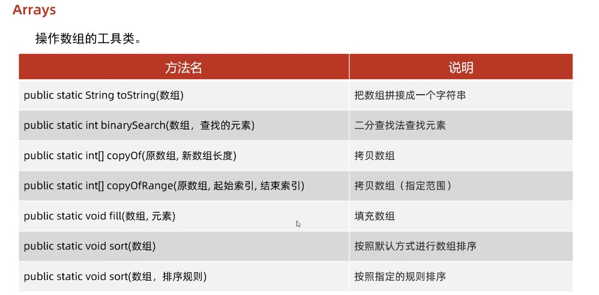

# Arrays工具类

Arrays是JDK中有的一个处理数组的工具类，里面有很多很多好用的方法。





## binarySearch二分查找

作用：

通过二分查找来查找指定元素


注意点：

1. 原数组必须要有序，必须是升序的
2. 如果查找的元素存在，则返回指定索引，若不存在，则返回 `-插入点索引 - 1`（注意插入点索引前面有个负号）

为什么要在`-插入点索引`位置还要减1呢？

如果现在有个数组`arr = {1, 2, 3}`，进行二分查找操作查找的是`0`，那么返回的位置如果没有减1的话就是`-0`，负零还是`0`所以会有问题


代码示例：

```java
package com.itheima.arrays;

import java.util.Arrays;

public class MyArraysDemo2 {
    public static void main(String[] args) {

        int[] arr = {1, 2, 3 ,4 ,5 ,6 ,7 ,8, 9, 10};


        System.out.println(Arrays.binarySearch(arr, 2)); // 1
        System.out.println(Arrays.binarySearch(arr, 10)); // 9
        System.out.println(Arrays.binarySearch(arr, 11)); // 11不存在，则返回的是-11
    }

}
```


## copyOf拷贝数组

功能：

将一个数组拷贝到另一个数组中


注意点：

1. 参数1是老数组，参数2是新数组长度
2. 如果新数组长度大于了老数组长度，则会自动补上默认值
3. 如果新数组长度小于老数组长度，会部分拷贝
4. 如果新旧一样长则完全拷贝


代码示例：

```java
package com.itheima.arrays;

import java.util.Arrays;

public class MyArraysDemo3 {
    public static void main(String[] args) {

        int[] arr = {1, 2, 3 ,4 ,5 ,6 ,7 ,8, 9, 10};


        int[] newArr = Arrays.copyOf(arr, 10);

        System.out.println(Arrays.toString(newArr)); // [1, 2, 3, 4, 5, 6, 7, 8, 9, 10]

        int[] newArr2 = Arrays.copyOf(arr, 20);

        System.out.println(Arrays.toString(newArr2)); // [1, 2, 3, 4, 5, 6, 7, 8, 9, 10, 0, 0, 0, 0, 0, 0, 0, 0, 0, 0]


        int[] newArr3 = Arrays.copyOf(arr, 5);

        System.out.println(Arrays.toString(newArr3)); // [1, 2, 3, 4, 5]
    }

}

```


## copyOfRange部分拷贝

功能：

根据索引值，部分拷贝数组


注意点：

1. 包左不包右


## sort排序

功能：

对数组进行排序，默认情况下是进行升序排序，底层使用快速排序


注意点：

1. 参数1要排序的数组，参数2排序的规则（只有参数1是默认的排序）
2. 如果使用上面这种两个参数的sort方法，**则要求必须是引用数据类型，若为基本数据类型则需要转换成对应的包装类**


底层原理：

```
利用插入排序 + 二分查找方式进行排序的

默认把0索引当作有序序列，1索引到末尾认为是无序序列，
遍历无序序列，得到里面每一个元素，假设现在遍历元素得到的是A元素
把A往有序有序序列中插入，在插入过程中，是利用二分法找到插入点
拿着A元素和插入点元素进行比较，比较的规则就是下面的compare方法
如果方法返回的是负数，则那A继续和前面的数字比较，
如果方法返回的正数，拿着A继续和后面的数据比较，
如果返回值为0，也拿着A跟后面的数据比较
直到能确定A在有序序列中的最终位置
```


简单结论（compare方法）：
	返回：o1 - o2 升序
	返回：o2 - o1 降序


代码示例：

```java
package com.itheima.arrays;

import java.util.Arrays;
import java.util.Comparator;

public class MyArraysDemo4 {
    public static void main(String[] args) {

        /*
            参数1：要配许数组
            参数2：排序的规则

            细节：
                只能给引用数据类型的数组进行排序
                如果为基本类型的数组，需要转换成对应包装类的数组
         */

        Integer[] arr = {2, 3, 1, 5, 8, 6, 7, 9};


        /*
            底层原理：
                利用插入排序 + 二分查找方式进行排序的
                默认把0索引当作有序序列，1索引到末尾认为是无序序列，
                遍历无序序列，得到里面每一个元素，假设现在遍历元素得到的是A元素
                把A往有序有序序列中插入，在插入过程中，是利用二分法找到插入点
                拿着A元素和插入点元素进行比较，比较的规则就是下面的compare方法
                如果方法返回的是负数，则那A继续和前面的数字比较，
                如果方法返回的正数，拿着A继续和后面的数据比较，
                如果返回值为0，也拿着A跟后面的数据比较
                直到能确定A在有序序列中的最终位置


         */


        // 参数二是一个接口，在调用方法时要求传如一个实现该接口的类
        // 但是我们只需要用一次，完全没必要写个类去实现它，我们直接用匿名内部类就行了
        Arrays.sort(arr, new Comparator<Integer>() {
            /*
                参数一o1：是无序序列中，遍历得到的每一个元素
                参数二o2：是有序序列中的元素

                返回值：
                负数：表示当前要插入元素是小的，放在前面
                正数：表示当前要插入元素是大的，放在后面
                0  ：表示当前要插入元素是和现在元素一样大，也会放在后面
				
                简单结论：
                返回：o1 - o2 升序
                返回：o2 - o1 降序
                
                compare每次找一个点的位置有时候会循环多次来确定的
             */
            @Override
            public int compare(Integer o1, Integer o2) {
                return o1 - o2;
            }
        });


        System.out.println(Arrays.toString(arr)); // [1, 2, 3, 5, 6, 7, 8, 9]
    }

}

```

