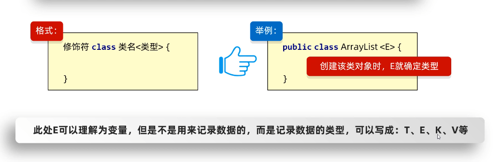
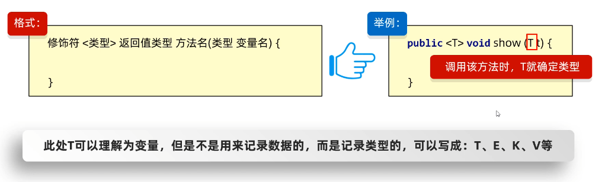
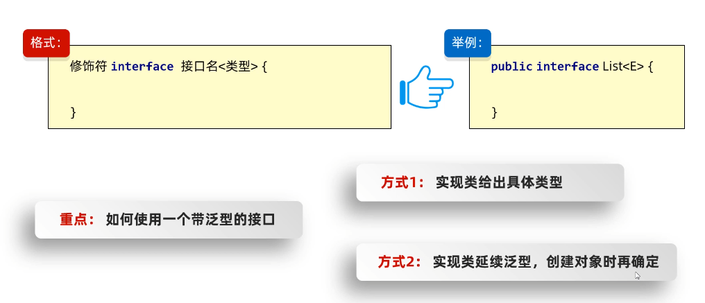

# 泛型(重要)


## 简介

介绍：泛型是`JDK5`中引入的特性，它提供了编译时类型安全检测机制，**可以在编译阶段约束操作的数据类型并进行检查**（**编译阶段！！！**）

泛型的细节：

1. **泛型只能支持引用数据类型**
2. 指定泛型的具体类型后，传递数据时，可以传入该类型或其子类类型
3. 如果不写泛型，默认类型是`Object`

扩展：

Java中的泛型是伪泛型，例如`ArrayList<String> strList`，只会在入口检查你是否是`String`类型，但是存入到`strList`中的数据还是会转成`Object`类型，等取出来时，再根据泛型强转成指定类型


## 泛型带来的好处

1. 同一数据类型，更好操作
2. 把运行时期的问题提前到了编译期间，避免了强制类型转换可能出现的异常，因为在编译阶段就会报错提示了


## 泛型格式


### 一：泛型类

使用时机：当一个类中，某个变量的数据类型不确定时，就可以定义带有泛型的类

格式：

```java
修饰符 class 类名<类型> {
  
}

// 还可以多个
修饰符 class 类名<类型1, 类型2> {
  类型1 name;
  类型2 age;
}
```

图解：




示例：

自己声明一个`ArrayList`

```java
package a01mygenerics;

import java.util.Arrays;

/**
 * @des 如果编写一个类时，有些数据类型不确定，那我们就可以用泛型
 * @param <E>
 */
public class MyArrayList<E> {

    Object[] obj = new Object[10];
    int size;

    /**
     * E 标识一个不缺定的数据类型
     * e 就是形参名
     * @param e
     * @return
     */
    public boolean add(E e) {
        obj[size] = e;
        size++;
        return  true;
    }

    public E get(int index) {
        // 由于返回类型时E，我们强转一下
        return (E)obj[index];
    }

    @Override
    public String toString() {
        return "MyArrayList{" +
                "obj=" + Arrays.toString(obj) +
                ", size=" + size +
                '}';
    }
}

```


使用时：

```java
package a01mygenerics;

public class GenericsDemo1 {
    public static void main(String[] args) {

        // 一个String类型的列表
        MyArrayList<String> strList = new MyArrayList<>();

        strList.add("aaa");
        strList.add("bbb");
        strList.add("ccc");

        System.out.println(strList);


        // 一个Integer类型
        MyArrayList<Integer> list2 = new MyArrayList<>();

        list2.add(1);
        list2.add(2);
        list2.add(3);

        System.out.println(list2);

        // 自动拆箱，java会自动将Integer转换成int，所以可以拿int类型接收
        int i = list2.get(1);
        System.out.println(i);
    }
}

```


### 二：泛型方法

第一种：当方法中形参类型不确定时，我们可以使用类名后面定义的泛型`<E>`

```java
public class MyArrayList<E> {
  public boolean add(E e) {
    xxx
  }
}
```


第二种：当我们类中的方法比较少时，例如就只有一个，那么我们就可以不用在类上，而是直接写一个泛型方法

```java
public class MyArrayList {
  // 直接定义在方法中
  public <E> boolean add(E e) {
    xxx
  }
}
```

当方法中形参类型不确定时会有以下两种解决方式：

1. 使用类名后的泛型
2. **使用泛型方法**


格式图解：




示例：

```java
package a01mygenerics;

import java.util.ArrayList;

public class ListUtil {
    // 由于是个工具类，就私有化构造函数不让外界创建该类实例
    private ListUtil() {}

    // 创建一个addAll方法，用来添加多个集合的元素

    public static <E> void addAll(ArrayList<E> list, E e1, E e2, E e3) {
        // 调用集合身上的add方法
        list.add(e1);
        list.add(e2);
        list.add(e3);
    }
}

```

使用：

```java
package a01mygenerics;

import java.util.ArrayList;

public class GenericsDemo2 {
    public static void main(String[] args) {
        ArrayList<String> list1 = new ArrayList<>();

        // 方法在调用时，就会确定下来类型(list1是一个String类型个集合)
        ListUtil.addAll(list1, "111", "222", "333");
        System.out.println(list1);

        ArrayList<Integer> list2 = new ArrayList<>();

        ListUtil.addAll(list2, 1, 2, 3);
        System.out.println(list2);
    }
}

```


### 三：泛型接口

当一个接口中的类型不确定时，我们就可以写一个泛型

格式图解：




第一种使用方式：

实现类给出具体类型：

```java
// 1.在实现类时，给出具体类型
public class MyArrayList2 implements List<String> {
  ...
}

// 使用时
public static void main(String[] args) {
      // 2.实现类给出具体的类型为String，只能操作String类型
      MyArrayList2 list = new MyArrayList2(); // 类型已经确定过在类中
      list.add("111");
  }
```


第二种：

实现类延续泛型，创建实例时给出

```java
// 1.在实现类中延续类型，到实例创建时再确定类型
public class MyArrayList3<E> implements List<E> {}

// 使用时
public static void main(String[] args) {
  
    // 2.实现类中延续了类型，所以我们创建实例时需要给出类型
    MyArrayList3<String> list = new MyArrayList3<>();

    list.add("222"); // String类型
}
```


### 四：多个泛型的写法

例如：多个泛型的泛型方法

```java
public static <T, E> String fn(<T> a, <E> b) {
  // 其余的类似
}
```


## 泛型的继承和通配符(重要)

泛型不具备基础性，但是数据是具备继承性的


**通配符`?`**

**帮助我们控制传入的泛型的范围**

通配符两种限定方式：

1. `? extends E`：表示可以传递E或者E所有的**子类类型**
2. `? super E`：表示可以传递E或者E所有类型的**父类类型**


应用场景：

1. 如果定义类、方法、接口时，如果类型不确定就可以定义泛型类、泛型方法、泛型接口
2. 如果类型不确定，但是能知道以后只能传递某个继承体系，就可以使用**通配符**


通配符示例：

```java
package a01mygenerics;

import java.util.ArrayList;

public class GenericsDemo5 {
    public static void main(String[] args) {
        
        ArrayList<Ye> list1 = new ArrayList<>();
        ArrayList<Fu> list2 = new ArrayList<>();
        ArrayList<Zi> list3 = new ArrayList<>();
        
        ArrayList<Student> stuList = new ArrayList<>();
        // 这里我们调用fn方法
        
        fn(list1);
        
        fn(list2);
        
        fn(list3);
        
        
        fn(stuList); // student类不在Fu、Zi、Ye的继承体系中，自然过不去编译
        
        
        fn2(list2);
        fn2(list1);
        fn2(list3); // Zi类不是Fu类的父类，会在编译阶段报错
        fn2(stuList); // Student类的集合一样，也会编译阶段报错
     }
    
    // fn方法可以传递Ye和Ye的子类
    public static void fn(ArrayList<? extends  Ye> list) {}
    
    // fn2可以传递Fu和Fu的父类
    public static void fn2(ArrayList<? super Fu> list) {}
}


class Ye {}

class Fu extends Ye{}

class Zi extends Fu {}


class Student {}
```


## 泛型使用时遇到的小问题


### 一：字节码参数如何处理？

注意，泛型是无法帮助我们指定字节码文件参数的，这个需要在方法中，额外加一个参数让调用者把字节码文件传递进来（因为调用者是肯定知道字节码文件的）


示例：

>tips:
>
>以下示例代码，是封装了一个MP中DTO的分页相关的通用处理方法。

```java
package com.itheima.mp.domain.dto;

import cn.hutool.core.bean.BeanUtil;
import cn.hutool.core.collection.CollUtil;
import com.baomidou.mybatisplus.extension.plugins.pagination.Page;
import com.itheima.mp.domain.po.User;
import com.itheima.mp.domain.vo.UserVO;
import io.swagger.annotations.ApiModel;
import io.swagger.annotations.ApiModelProperty;
import lombok.Data;

import java.util.Collections;
import java.util.List;

@Data
@ApiModel(description = "分页结果")
public class PageDTO<T> {
    @ApiModelProperty("总条数")
    private Long total;
    @ApiModelProperty("总页数")
    private Long pages;
    @ApiModelProperty("集合")
    private List<T> list;
		
  	// 关键看形参，参数是有一个字节码文件的
    public static <PO, VO> PageDTO<VO> of(Page<PO> p, Class<VO> clazz) {
        PageDTO<VO> dto = new PageDTO<>();
        // 3.1准备总条数，总页数
        dto.setTotal(p.getTotal());
        dto.setPages(p.getPages());

        // 3.2 当前页数据
        List<PO> records = p.getRecords();
        // 3.3 将查到的list数据PO转换成VO
        if(CollUtil.isNotEmpty(records)) {
            // 这里的字节码需要调用方传递进来，泛型是拿不到字节码的
          	// 使用了hutool的工具函数拷贝list，里面第二个参数就是要传递一个字节码文件
            dto.setList(BeanUtil.copyToList(records, clazz));
        } else {
            // 如果分页数据没查到，就直接放一个空的list即可
            dto.setList(Collections.emptyList());
        }
        // 4.返回
        return dto;
    }
}

```

