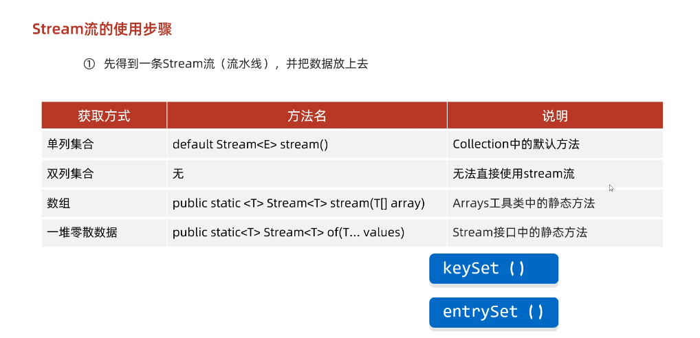

# Stream流

##	简介

作用：结合Lambda表达式，用来简化集合、数组的操作


使用步骤：

1. 先得到一条Stream流，并把数据放上去
2. 使用**中间方法**对流水线上的数据进行操作
3. 使用**终结方法**对流水线上的数据进行操作


##  获取Stream流



>tips：
>
>双列集合不能直接获得Stream流，需要通过keySet或entrySet方法获取Set集合后再获取


代码示例：

```java
package a02stream;

import java.util.ArrayList;
import java.util.Arrays;
import java.util.Collections;
import java.util.HashMap;
import java.util.stream.Stream;

public class A01SteamDemo2 {
    public static void main(String[] args) {

        // 1.单列集合获取Stream流
        ArrayList<String> list = new ArrayList<>();
        Collections.addAll(list,"a", "b", "c");
        // 1.1获取Stream + 调用终结方法forEach
        list.stream().forEach(s -> {
            System.out.println(s);
        });


        // 2.双列集合
        HashMap<String, Integer> hm = new HashMap<>();

        // 2.1添加数据
        hm.put("aaa", 111);
        hm.put("bbb", 222);
        hm.put("ccc", 333);

        // 2.2.获取Stream流
        hm.keySet().stream().forEach(s -> System.out.println(s)); // 所有键

        hm.entrySet().stream().forEach(o -> System.out.println(o)); // 所有键值对对象


        // 3.使用数组来获取Stream
        int[] arr = {1, 2, 3, 4, 5, 6};
        String[] arr2 = {"a", "b", "c"};
        Arrays.stream(arr).forEach(s -> System.out.println(s)); // 基本类型
        Arrays.stream(arr2).forEach(s -> System.out.println(s)); // 引用类型


        // 4.一堆零散的数据（要求：这堆数据的数据类型要一致）
        Stream.of(1, 2, 3, 4, 5).forEach(s -> System.out.println(s)); // 基本类型
        Stream.of("a", "b", "c", "d", "e").forEach(s -> System.out.println(s)); // 引用类型

    }
}

```


## Stream流中间操作方法【应用】

- 概念

  中间操作的意思是,执行完此方法之后,**Stream流依然可以继续执行其他操作**

- 常见方法

  | 方法名                                          | 说明                                                         |
  | ----------------------------------------------- | ------------------------------------------------------------ |
  | Stream<T> filter(Predicate predicate)           | 用于对流中的数据进行过滤                                     |
  | Stream<T> limit(long maxSize)                   | 返回此流中的元素组成的流，截取前指定参数个数的数据           |
  | Stream<T> skip(long n)                          | 跳过指定参数个数的数据，返回由该流的剩余元素组成的流         |
  | static <T> Stream<T> concat(Stream a, Stream b) | 合并a和b两个流为一个流                                       |
  | Stream<T> distinct()                            | 返回由该流的不同元素（根据Object.equals(Object) ）组成的流   |
  | Stream<T>map(new Function<E, T>)                | 循环修改Stream类型，E为数据原来类型，T为要修改为的类型（重要） |
  | Stream<T>sorted(new Comparator<E>)              | 进行排序，默认从小到大，一般都会自定义比较器                 |

- filter代码演示

  ```java
  public class MyStream3 {
      public static void main(String[] args) {
  //        Stream<T> filter(Predicate predicate)：过滤
  //        Predicate接口中的方法	boolean test(T t)：对给定的参数进行判断，返回一个布尔值
  
          ArrayList<String> list = new ArrayList<>();
          list.add("张三丰");
          list.add("张无忌");
          list.add("张翠山");
          list.add("王二麻子");
          list.add("张良");
          list.add("谢广坤");
  
          //filter方法获取流中的 每一个数据.
          //而test方法中的s,就依次表示流中的每一个数据.
          //我们只要在test方法中对s进行判断就可以了.
          //如果判断的结果为true,则当前的数据留下
          //如果判断的结果为false,则当前数据就不要.
  //        list.stream().filter(
  //                new Predicate<String>() {
  //                    @Override
  //                    public boolean test(String s) {
  //                        boolean result = s.startsWith("张");
  //                        return result;
  //                    }
  //                }
  //        ).forEach(s-> System.out.println(s));
  
          //因为Predicate接口中只有一个抽象方法test
          //所以我们可以使用lambda表达式来简化
  //        list.stream().filter(
  //                (String s)->{
  //                    boolean result = s.startsWith("张");
  //                        return result;
  //                }
  //        ).forEach(s-> System.out.println(s));
  
          list.stream().filter(s ->s.startsWith("张")).forEach(s-> System.out.println(s));
  
      }
  }
  ```

- limit&skip代码演示

  ```java
  public class StreamDemo02 {
      public static void main(String[] args) {
          //创建一个集合，存储多个字符串元素
          ArrayList<String> list = new ArrayList<String>();
  
          list.add("林青霞");
          list.add("张曼玉");
          list.add("王祖贤");
          list.add("柳岩");
          list.add("张敏");
          list.add("张无忌");
  
          //需求1：取前3个数据在控制台输出
          list.stream().limit(3).forEach(s-> System.out.println(s));
          System.out.println("--------");
  
          //需求2：跳过3个元素，把剩下的元素在控制台输出
          list.stream().skip(3).forEach(s-> System.out.println(s));
          System.out.println("--------");
  
          //需求3：跳过2个元素，把剩下的元素中前2个在控制台输出
          list.stream().skip(2).limit(2).forEach(s-> System.out.println(s));
      }
  }
  ```

- concat&distinct代码演示

  ```java
  public class StreamDemo03 {
      public static void main(String[] args) {
          //创建一个集合，存储多个字符串元素
          ArrayList<String> list = new ArrayList<String>();
  
          list.add("林青霞");
          list.add("张曼玉");
          list.add("王祖贤");
          list.add("柳岩");
          list.add("张敏");
          list.add("张无忌");
  
          //需求1：取前4个数据组成一个流
          Stream<String> s1 = list.stream().limit(4);
  
          //需求2：跳过2个数据组成一个流
          Stream<String> s2 = list.stream().skip(2);
  
          //需求3：合并需求1和需求2得到的流，并把结果在控制台输出
  //        Stream.concat(s1,s2).forEach(s-> System.out.println(s));
  
          //需求4：合并需求1和需求2得到的流，并把结果在控制台输出，要求字符串元素不能重复
          Stream.concat(s1,s2).distinct().forEach(s-> System.out.println(s));
      }
  }
  ```


* map方法

```java
package a03function;

import java.util.ArrayList;
import java.util.Collections;
import java.util.List;
import java.util.function.Function;
import java.util.stream.Collectors;

public class FunctionDemo4 {
    public static void main(String[] args) {

        /*
            需求：
            集合里存储姓名和年龄，比如：张无忌,15
            需要即将数据封装成Student对象，并收集在List集合中
         */

        ArrayList<String> list = new ArrayList<>();

        Collections.addAll(list, "张无忌,15" , "周芷若,14", "赵敏,13", "张强,20", "张三丰,100", "张翠山,40", "张良,35", "王二麻子,37");

        List<Student> newList = list.stream().map(new Function<String, Student>() {
            @Override
            public Student apply(String s) {
                String name = s.split(",")[0];
                int age = Integer.parseInt(s.split(",")[1]);
                return new Student(name, age);
            }
        }).collect(Collectors.toList());
    }
}


// Student类代码
package a03function;

public class Student {
    private String name;
    private int age;
  	// ....后面我没写，反正就是一个标准JavaBean类
}

```


## Stream流终结操作方法【应用】

- 概念

  终结操作的意思是,执行完此方法之后,<b style="color: red">Stream流将不能再执行其他操作！！！</b>

- 常见方法

  | 方法名                        | 说明                     |
  | ----------------------------- | ------------------------ |
  | void forEach(Consumer action) | 对此流的每个元素执行操作 |
  | long count()                  | 返回此流中的元素数       |

- 代码演示

  ```java
  public class MyStream5 {
      public static void main(String[] args) {
          ArrayList<String> list = new ArrayList<>();
          list.add("张三丰");
          list.add("张无忌");
          list.add("张翠山");
          list.add("王二麻子");
          list.add("张良");
          list.add("谢广坤");
  
          //method1(list);
          
  //        long count()：返回此流中的元素数
          long count = list.stream().count();
          System.out.println(count);
      }
  
      private static void method1(ArrayList<String> list) {
          //  void forEach(Consumer action)：对此流的每个元素执行操作
          //  Consumer接口中的方法void accept(T t)：对给定的参数执行此操作
          //在forEach方法的底层,会循环获取到流中的每一个数据.
          //并循环调用accept方法,并把每一个数据传递给accept方法
          //s就依次表示了流中的每一个数据.
          //所以,我们只要在accept方法中,写上处理的业务逻辑就可以了.
          list.stream().forEach(
                  new Consumer<String>() {
                      @Override
                      public void accept(String s) {
                          System.out.println(s);
                      }
                  }
          );
        
          System.out.println("====================");
          //lambda表达式的简化格式
          //是因为Consumer接口中,只有一个accept方法
          list.stream().forEach(
                  (String s)->{
                      System.out.println(s);
                  }
          );
          System.out.println("====================");
          //lambda表达式还是可以进一步简化的.
          list.stream().forEach(s->System.out.println(s));
      }
  }
  ```


## Stream流的收集操作【应用】

- 概念

  对数据使用Stream流的方式操作完毕后,可以把流中的数据收集到集合中

- 常用方法

  | 方法名                         | 说明               |
  | ------------------------------ | ------------------ |
  | R collect(Collector collector) | 把结果收集到集合中 |

- 工具类**Collectors提供了具体的收集方式**

  | 方法名                                                       | 说明                   |
  | ------------------------------------------------------------ | ---------------------- |
  | public static <T> Collector toList()                         | 把元素收集到List集合中 |
  | public static <T> Collector toSet()                          | 把元素收集到Set集合中  |
  | public static  Collector toMap(Function keyMapper,Function valueMapper) | 把元素收集到Map集合中  |

- 代码演示

  ```java
  // toList和toSet方法演示 
  public class MyStream7 {
      public static void main(String[] args) {
          ArrayList<Integer> list1 = new ArrayList<>();
          for (int i = 1; i <= 10; i++) {
              list1.add(i);
          }
  
          list1.add(10);
          list1.add(10);
          list1.add(10);
          list1.add(10);
          list1.add(10);
  
          //filter负责过滤数据的.
          //collect负责收集数据.
                  //获取流中剩余的数据,但是他不负责创建容器,也不负责把数据添加到容器中.
          //Collectors.toList() : 在底层会创建一个List集合.并把所有的数据添加到List集合中.
          List<Integer> list = list1.stream().filter(number -> number % 2 == 0)
                  .collect(Collectors.toList());
  
          System.out.println(list);
  
      		Set<Integer> set = list1.stream().filter(number -> number % 2 == 0)
              								.collect(Collectors.toSet());
      		System.out.println(set);
  }
  }
  /**
  Stream流的收集方法 toMap方法演示
  创建一个ArrayList集合，并添加以下字符串。字符串中前面是姓名，后面是年龄
  "zhangsan,23"
  "lisi,24"
  "wangwu,25"
  保留年龄大于等于24岁的人，并将结果收集到Map集合中，姓名为键，年龄为值
  */
  public class MyStream8 {
  	public static void main(String[] args) {
        	ArrayList<String> list = new ArrayList<>();
          list.add("zhangsan,23");
          list.add("lisi,24");
          list.add("wangwu,25");
  
          Map<String, Integer> map = list.stream().filter(
                  s -> {
                      String[] split = s.split(",");
                      int age = Integer.parseInt(split[1]);
                      return age >= 24;
                  }
  
           //   collect方法只能获取到流中剩余的每一个数据.
           //在底层不能创建容器,也不能把数据添加到容器当中
  
           //Collectors.toMap 创建一个map集合并将数据添加到集合当中
  
            // s 依次表示流中的每一个数据
  
            //第一个lambda表达式就是如何获取到Map中的键
            //第二个lambda表达式就是如何获取Map中的值
          ).collect(Collectors.toMap(
                  s -> s.split(",")[0],
                  s -> Integer.parseInt(s.split(",")[1]) ));
  
          System.out.println(map);
  	}
  }
  ```

### 
