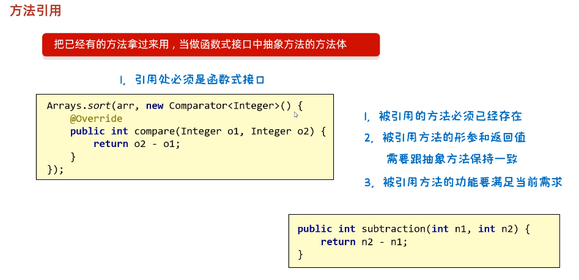

# 方法引用

## 简述

方法引用：把已经有的方法拿过来使用，当作函数式接口中抽象方法的方法体（还能进一步简化Lambda表达式）


**方法引用出现的原因：**

在使用Lambda表达式的时候，我们实际上传递进去的代码就是一种解决方案：拿参数做操作

那么考虑一种情况：如果我们在Lambda中所指定的操作方案，已经有地方存在相同方案，那是否还有必要再写重复逻辑呢？答案肯定是没有必要

那我们又是如何使用已经存在的方案的呢？

这就是我们要讲解的方法引用，我们是通过方法引用来使用已经存在的方案


符号表示：

```java
:: 

//双冒号方法引用符
```


## 注意点

1. 引用处必须是函数接口（看源码中有没有`@FunctionalInterface`注解）
2. 被引用的方法必须是已经存在（方法可以是Java自己已经写好的，也可以是第三方的工具类）
3. 被引用的方法形参和返回值，必须要和抽象方法保持一致
4. 被引用方法的功能，必须要满足当前要求（和抽象方法功能要一致）



>tips:
>
>你可以看见subtraction方法，的返回值，参数，功能都是和重写的compare方法保持一致


简单小栗子：

```java
package a03function;

import java.util.Arrays;

public class FunctionDemo1 {
    public static void main(String[] args) {
        // 需求：创建一个数组，进行倒叙排列
        Integer[] arr = {3, 2, 5, 6, 1, 4};


//        Arrays.sort(arr, new Comparator<Integer>() {
//            @Override
//            public int compare(Integer o1, Integer o2) {
//                return o2 - o1;
//            }
//        });

        // 使用lambda简化操作
//        Arrays.sort(arr, ((o1, o2) -> {
//            return o2 - o1;
//        }));


        // 使用方法引用
        // 1.引用处必须是函数式接口
        // 2.被引用的方法必须存在
        // 3.被引用的方法形参和返回值，必须要和抽象方法保持一致
        // 4.被引用方法的功能，必须要满足当前要求（和抽象一致）

        // 表示引用FunctionDemo1类里面的静态subtraction方法，并把该方法，当作抽象方法方法体
        Arrays.sort(arr, FunctionDemo1::subtraction);


        System.out.println(Arrays.toString(arr));
    }


    public static int subtraction(int num1, int num2) {
        return num2 - num1;
    }
}

```


## 方法引用的分类


### 引用静态方法

格式：`类名::静态方法`

栗子：`Integer::parseInt`


代码示例：

```java
package a03function;

import java.util.ArrayList;
import java.util.Collections;

public class FunctionDemo2 {
    public static void main(String[] args) {
        /*

            需求：
            集合中有以下数字，要求把他们都变成int类型
            "1", "2", "3", "4", "5"
         */


        ArrayList<String> list = new ArrayList<>();
        Collections.addAll(list,"1", "2", "3", "4", "5");


//        list.stream().map(new Function<String, Integer>() {
//            @Override
//            public Integer apply(String s) {
//                return Integer.parseInt(s);
//            }
//        }).forEach(s -> System.out.println(s));


        // 使用方法引用来简化写法
        // 1.需要方法存在
        // 2.引用处为函数接口
        // 3.函数形参和返回值要和抽象方法一致
        // 4.函数功能需要把形参字符串转换成整数（保持和抽象方法功能一致）
        // Integer.parseInt方法刚好满足上面

        list.stream().map(Integer::parseInt).forEach(s -> System.out.println(s));
    }

}

```


### 引用成员方法

格式：`对象::成员方法`

引用成员方法的三种格式：

1. 其他类：`其他类对象::方法名`
2. 本类：`this::方法名`（**非静态方法中**）
3. 父类：`super::方法名`（**非静态方法中**）

#### 一：其他类

其他类：`其他类对象::方法名`

代码示例：

```java
package a03function;

import java.util.ArrayList;
import java.util.Collections;

public class FunctionDemo3 {
    public static void main(String[] args) {
        /*
            修去：
            集合中有一些名字，按照要求过滤数据
            数据："张无忌", "周芷若", "赵明", "张强", "张三丰"
         */


        ArrayList<String> list = new ArrayList<>();

        Collections.addAll(list, "张无忌", "周芷若", "赵明", "张强", "张三丰");


        // 过滤数据：只要张开头，且名字为3个字的
//        list.stream().filter(s -> s.startsWith("张")).filter(s -> s.length() == 3).forEach(s -> System.out.println(s));

        /*
        list.stream().filter(new Predicate<String>() {
            @Override
            public boolean test(String s) {
                return s.startsWith("张") && s.length() == 3;
            }
        }).forEach(s -> System.out.println(s));
        */

        // 使用方法引用：成员方法引用(其他类)
        list.stream().filter(new StringOperation()::stringJudge).forEach(s -> System.out.println(s));


        // 使用方法引用：成员方法引用(本类)，由于我们现在是在静态方法main中，所以不能用this
        list.stream().filter(new FunctionDemo3()::stringJudge).forEach(s -> System.out.println(s));
    }


    // 定义一个要被引用的成员方法
    public boolean stringJudge(String s) {
        return s.startsWith("张") && s.length() == 3;
    }
}

```


`StringOperation`类代码：

```java
package a03function;

public class StringOperation {

    // 定义一个要被引用的成员方法
    public boolean stringJudge(String s) {
        return s.startsWith("张") && s.length() == 3;
    }
}

```


#### 二：本类

格式：`this::方法名`（**非静态方法中**）

引用方法，和被引用处同在一个类中，并且被引用处还不是静态方法

#### 三：父类

格式：`super::方法名`（**非静态方法中**）

引用方法在父类中，被引用处在子类中且被引用处不是静态方法


### 引用构造方法

格式：`类名::new`

范例：`Student::new`


小栗子：

```java
package a03function;

import java.util.ArrayList;
import java.util.Collections;
import java.util.List;
import java.util.stream.Collectors;

public class FunctionDemo4 {
    public static void main(String[] args) {

        /*
            需求：
            集合里存储姓名和年龄，比如：张无忌,15
            需要即将数据封装成Student对象，并收集在List集合中
         */

        ArrayList<String> list = new ArrayList<>();

        Collections.addAll(list, "张无忌,15" , "周芷若,14", "赵敏,13", "张强,20", "张三丰,100", "张翠山,40", "张良,35", "王二麻子,37");

//        List<Student> newList = list.stream().map(new Function<String, Student>() {
//            @Override
//            public Student apply(String s) {
//                String name = s.split(",")[0];
//                int age = Integer.parseInt(s.split(",")[1]);
//                return new Student(name, age);
//            }
//        }).collect(Collectors.toList());


        // 方法引用：构造方法的引用
        List<Student> newList = list.stream().map(Student::new).collect(Collectors.toList());
        System.out.println(newList);
    }
}

```


`Student`类的代码：

```java
package a03function;

public class Student {
    private String name;
    private int age;


    public Student() {

    }

    // 重载一个构造方法，给外面引用(关键在这里)
    public Student(String s) {
        String name = s.split(",")[0];
        int age = Integer.parseInt(s.split(",")[1]);
        this.name = name;
        this.age = age;
    }

    public Student(String name, int age) {
        this.name = name;
        this.age = age;
    }

    /**
     * 获取
     * @return name
     */
    public String getName() {
        return name;
    }

    /**
     * 设置
     * @param name
     */
    public void setName(String name) {
        this.name = name;
    }

    /**
     * 获取
     * @return age
     */
    public int getAge() {
        return age;
    }

    /**
     * 设置
     * @param age
     */
    public void setAge(int age) {
        this.age = age;
    }

    public String toString() {
        return "Student{name = " + name + ", age = " + age + "}";
    }
}

```


### 其他调用方式


#### 一：使用类名引用成员方法（有局限性）

格式：`类名::成员方法`

范例：`String::substring`


方法引用规则（**独有**）：

1. 需要有函数接口
2. 被引用方法必须存在
3. 被引用方法的形参，需要跟抽象方法的第二个形参到最后一个形参保持一致，返回值也需要一致
4. 被引用方法的功能需要满足当前的需求

>tips:
>
>抽象方法形参详解：
>
>第一个参数：表示被引用方法的调用者，决定了可以引用那些类中的方法，在stream流中，第一个参数一般表示流中的数据。（**这里限定了引用方法的类**）
>
>假如流中的数据为**字符串**，那么如果使用当前方式进行方法引用，只能引用**String类**中的方法（简单来说：**第一个参数的类型要和引用处的类一致**）
>
>
>
>第二个参数到最后一个参数：需要跟被引用方法的形参保持一致，如果没有第二个参数，说明被引用的方法，必须是无参的成员方法


**局限性**：

不能引用所有类的成员方法，是跟抽象方法第一个形参有关，**第一个形参什么类型**，就只能引用**对应类的成员方法**


小栗子：

```java
package a03function;

import java.util.ArrayList;
import java.util.Collections;

public class FunctionDemo5 {
    public static void main(String[] args) {
        /*
            方法引用：使用类名引用成员方法


            要求：
                集合里面有一些字符串，要求变成大写后输出


                1. 需要有函数接口
                2. 被引用方法必须存在
                3. 被引用方法的形参，需要跟抽象方法的第二个形参到最后一个形参保持一致，返回值也需要一致
                4. 被引用方法的功能需要满足当前的需求

                >tips:
                >
                >抽象方法形参详解：
                >第一个参数：表示被引用方法的调用者，决定了可以引用那些类中的方法，在stream流中，第一个参数一般表示流中的数据。
                >假如流中的数据为**字符串**，那么如果使用当前方式进行方法引用，只能引用**String类**中的方法
                >
                >第二个参数到最后一个参数：需要跟被引用方法的形参保持一致，如果没有第二个参数，说明被引用的方法，必须是无参的成员方法
         */

        ArrayList<String> list = new ArrayList<>();
        Collections.addAll(list, "aaa", "bbb", "ccc", "ddd");


        // 变成大写然后进行输出(使用map方法，修改内容)
        /*
        list.stream().map(new Function<String, String>() {
            @Override
            public String apply(String s) {
            // 抽象方法中，只有一个形参，所以被引用的方法需要是无参方法
                return s.toUpperCase();
            }
        }).forEach(s -> System.out.println(s));
        */


        // 使用方法引用来简化操作（类名引用成员方法）
        list.stream().map(String::toUpperCase).forEach(s -> System.out.println(s));
    }
}

```


#### 二：引用数组的构造方法(好用)

格式：`数据类型[]::new`

范例：`int[]::new`


**这个方法很好用奥，几乎只要用到`xxx.toArray(new IntFunction<>(...))`的地方，都可以用这个方式来简化代码**


注意点：

1. 数组的类型，要跟流中数据的类型保持一致


小栗子：

```java
package a03function;

import java.util.ArrayList;
import java.util.Arrays;
import java.util.Collections;

public class FunctionDemo6 {
    public static void main(String[] args) {
        /*
            集合中，存储一些整数，收集到数组中


            细节：
            数组类型，需要跟六种的数据类型保持一致
         */


        ArrayList<Integer> list = new ArrayList<>();
        Collections.addAll(list, 1, 2, 3, 4, 5);

        // 收集到数组中（指定类型的数组）
        /*
        Integer[] arr = list.stream().toArray(new IntFunction<Integer[]>() {
            @Override
            public Integer[] apply(int value) {
                return new Integer[value];
            }
        });

         */

        // 使用数组的引用方法来简化上面代码
        Integer[] arr = list.stream().toArray(Integer[]::new);

        System.out.println(Arrays.toString(arr));
    }
}

```


## 方法引用小技巧

使用方法引用时按照以下步骤思考即可：

1. 首先思考有没有一个方法满足当前需求
2. 如果有这样的方法，看这个方法是否满足规则（如果没有，我们考虑要不要自己写一个）
3. 如果满足规则，看该方法是什么方法
   1. 静态方法：`类名::方法名`
   2. 其他类：`对象名::方法名`
   3. 本类：`this::方法名`
   4. 构造方法：`类名::new`
   5. 其他方式