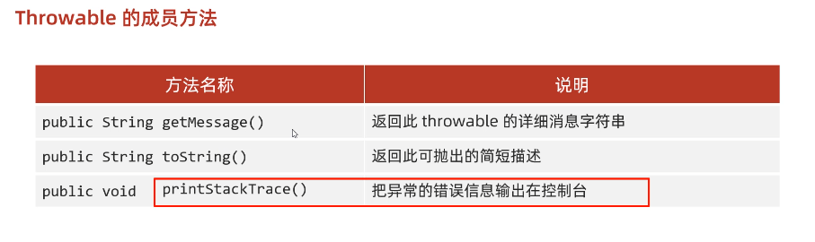

# 异常

## 异常概念

异常，就是不正常的意思。在生活中:医生说,你的身体某个部位有异常,该部位和正常相比有点不同,该部位的功能将受影响.在程序中的意思就是：

* **异常** ：指的是程序在执行过程中，出现的非正常的情况，最终会导致`JVM`的非正常停止。

在Java等面向对象的编程语言中，异常本身是一个类，产生异常就是创建异常对象并抛出了一个异常对象。Java处理异常的方式是中断处理。

> 异常指的并不是语法错误,语法错了,编译不通过,不会产生字节码文件,根本不能运行.


## 异常体系

异常机制其实是帮助我们**找到**程序中的问题，异常的根类是`java.lang.Throwable`，其下有两个子类：`java.lang.Error`与`java.lang.Exception`，平常所说的异常指`java.lang.Exception`。


**`Throwable`体系：**

* **Error**:严重错误Error(系统级别的错误)，无法通过处理的错误，只能事先避免，好比绝症。
* **Exception**:表示异常，异常产生后程序员可以通过代码的方式纠正，使程序继续运行，是必须要处理的。好比感冒、阑尾炎。

**`Throwable`中的常用方法：**

* `public void printStackTrace()`:打印异常的详细信息。

  *包含了异常的类型,异常的原因,还包括异常出现的位置,在开发和调试阶段,都得使用`printStackTrace`。*

* `public String getMessage()`:获取发生异常的原因。

  *提示给用户的时候,就提示错误原因。*

* `public String toString()`:获取异常的类型和异常描述信息(不用)。

***出现异常,不要紧张,把异常的简单类名,拷贝到API文档中去查。***


**异常体系的顶层父类：Exception**


## 异常分类

我们平常说的异常就是指Exception，因为这类异常一旦出现，我们就要对代码进行更正，修复程序。

**异常(Exception)的分类**:根据在编译时期还是运行时期去检查异常?

* **编译时期异常**:checked异常。在编译时期,就会检查，如果没有处理异常,则编译失败。(如日期格式化异常)
* **运行时期异常**:runtime异常。在运行时期,检查异常，在编译时期,运行异常不会编译器检测(不报错)。(如数学异常)


## 异常作用

1. 异常可以用来查询bug的关键参考信息
2. 异常可以作为方法内部的一种特殊返回值，以便通知调用者底层的执行情况（可以在方法出抛出异常）


## 异常处理方式

### 一：`JVM`默认的处理方式

表现形式：

* 会把异常的名称，异常的原因以及异常出现的位置等信息输出在控制台上
* 程序停止执行，异常下面的代码不会执行


示例：

```java
package a01exception;

public class ExceptionDemo1 {
    public static void main(String[] args) {


        System.out.println("猫猫猫猫");

        System.out.println(2/0);   // 这里出现算术异常，下面代码不会执行

        System.out.println("狗狗狗狗狗");
        System.out.println("以嘻嘻嘻嘻");
    }
}


// 并且控制台会有红色字体异常打印提示
```


### 二：自己处理(捕获异常`try...catch...`)

格式：

```java
try {
  // 可能出现的异常代码
} catch(异常类名 变量名) {
  // 异常处理代码
} finally {
  // 一定会执行的代码，除非虚拟机停止了
}
```

作用：当代码异常出现时，如果自己处理了，可以让程序继续往下执行


小栗子：

```java
package a01exception;

public class ExceptionDemo2 {
    public static void main(String[] args) {


        int[] arr = {1, 2, 3, 4, 5};


        try {
            System.out.println(arr[10]);
            // 如果此处出现了异常，程序就会在此创建一个ArrayIndexOutOfBoundsException对象
            // new ArrayIndexOutOfBoundsException()
            // 会拿这个创建的对象，和catch小括号中的参数对比
            // 如果能被接受，就表示该异常被捕获，执行catch里对应的代码
            // 当try...catch整个代码块代码执行结束，继续往下执行代码
        } catch (ArrayIndexOutOfBoundsException e) {
            // 如果出现了ArrayIndexOutOfBoundsException该如何处理
            System.out.println("索引越界了");
        }


        System.out.println("我执行了嘛"); // 这里会接着执行
    }
}

```


#### try...catch的灵魂四问

**第一问：如果try中代码没有遇到问题，该怎么执行？**

会将try中代码全部执行完毕如果没有异常，**不会执行catch中的代码**

>tips:
>
>只有try中出现了异常，才会执行catch中的代码


**第二问：如果try中遇到了多个问题，怎么执行？**

遇到第一个异常出现时，就会直接去执行catch（若有多个catch会从第一个开始找，找到一个对应的）


>tips：
>
>一般这种情况的处理方式：
>
>如果try中代码会有多个异常，那我们一般也会与之对应写多个catch代码块来捕获，出现异常后，会直接跳转入catch部分，并从第一个catch一直比较到最后一个


注意：

如果我们要捕获多个异常时，这些异常的存在着父子关系，**那么父类一定要写在下面**

小栗子：

```java
package a01exception;

public class ExceptionDemo4 {
    public static void main(String[] args) {


        int[] arr = {1, 2, 3, 4, 5};


        try {
            System.out.println(arr[10]); // ArrayIndexOutOfBoundsException
            System.out.println(2 / 0); // ArithmeticException
        } catch (ArrayIndexOutOfBoundsException e) {
            System.out.println("索引越界了");
        } catch (ArithmeticException e) {
            System.out.println("除数不能为0");
        } catch (Exception e) {
            System.out.println("Exception"); // Exception是上面这些异常的父类，就要写在最下面
        }
      
      
      // JDK7后新添加了一种语法，可以将两种异常写在一个catch中
      try {
        System.out.println(arr[10]); // ArrayIndexOutOfBoundsException
        System.out.println(2 / 0); // ArithmeticException
      } catch(ArrayIndexOutOfBoundsException | ArithmeticException) {
        // 出现处理方式
      }


        System.out.println("我执行了嘛");
    }
}


```


**第三问：如果try中遇到的问题没有被捕获，怎么执行？**

就是`try...catch`整体的代码没有效果，会采取虚拟机`JVM`默认的处理方式


**第四问：如果try中遇到了问题，那么try下面的其他代码还会执行嘛？**

不会执行，遇到问题，直接就跳转到catch部分了


### 三：交给调用者处理

#### throws

作用：写在方法定义处，表示声明一个异常，告诉调用者，使用本方法可能会有那些异常


格式：

```java
修饰符 返回值类型 方法名(参数) throws 异常类名1,异常类名2…{   }	
```


注意点：

* <b style="color:red;">编译时期异常：</b>必须要写
* <b style="color:red;">运行时异常：</b>可以不写


---

#### throw

作用：**写在方法内**，结束方法。手动抛出异常，交给调用者方法中下面代码不会再执行


格式：

```java
public void 方法() {
  throw new 异常类名(参数);
}
```


小栗子：

```java
package a01exception;

public class ExceptionDemo8 {
    public static void main(String[] args) {


//        int[] arr = {1, 2, 3, 4, 5};

        int[] arr = {};
				// int[] arr = null;
        int max = 0;
        try {
          	// 这里可能会出现异常为了保证代码继续执行，我们用try...catch裹一下
            max = getMax(arr);
        } catch (NullPointerException|ArrayIndexOutOfBoundsException e) {
            // JDK7的写法
            e.printStackTrace();
        }
        System.out.println("我会执行嘛");
        System.out.println(max);
    }

    // 运行时异常throws可以省略不写（NullPointerException，ArrayIndexOutOfBoundsException都是RuntimeException的子类）
    public static int getMax(int[] arr)/* throws NullPointerException,ArrayIndexOutOfBoundsException*/{

        // 异常处理
        if(arr == null) {
            // 手动创建一个异常对象，并把异常抛给方法调用者
            throw new NullPointerException();
            // 此时，方法会直接结束，不会执行下面代码
        }

        // 处理长度为0的异常情况
        if(arr.length == 0) {
            throw new ArrayIndexOutOfBoundsException();
        }
        System.out.println("我会执行嘛");
        int max = arr[0];
        for (int i = 0; i < arr.length; i++) {
            if(arr[i] > max) {
                max = arr[i];
            }
        }

        return max;
    }
}

```


## 异常中常见的方法

是定义在顶级类中的：常用的是第三个方法



代码示例：

```java
package a01exception;

public class ExceptionDemo7 {
    public static void main(String[] args) {


        int[] arr = {1, 2, 3, 4, 5};


        try {
            System.out.println(arr[10]);
        } catch (ArrayIndexOutOfBoundsException e) {

//            String message = e.getMessage(); // 返回异常的简短描述
//            System.out.println(message);


            String str = e.toString();
            System.out.println(str);

            //e.printStackTrace(); // 打印异常信息,不会停止JVM(常用)
        }


        System.out.println("我执行了嘛"); // 这里会接着执行
    }
}

```


## 自定义异常

作用：有时候，官方自己定义的异常不能很好的表达我们自己编码时出现的异常状况，这时我们就可以自定义异常，**让控制台的报错信息更加的见名知意**


步骤：

1. 定义异常类
2. 写继承关系（运行时异常继承：`RuntimeException` 编译时异常继承：`Exception`）
3. 空参构造
4. 带参构造


示例：

自定义`NameFormatException`运行时异常：

```java
package Test2;

public class NameFormatException extends RuntimeException{
    // 1.起名技巧：
    // NameFormat：当前异常的名字，表示姓名格式化
    // Exception： 表示当前类是一个异常类


    // 2.继承
    // 运行时：RuntimeException
    // 编译时：Exception


    // 3.空参构造、有参构造

    public NameFormatException() {
    }

    public NameFormatException(String message) {
        super(message);
    }
}

```


使用时：

```java
// 我们在一个方法中抛出异常
public void setName(String name) {
        int len = name.length();
        if(len < 3 || len > 10) {
            // 抛出我们自定义的异常
            throw new NameFormatException(name + "格式有误，长度应该为3~10");
        }
        this.name = name;
    }
public void setAge(int age) {
        if(age < 18 || age > 40) {
            throw new AgeOutOfBoundsException(age + "超出范围");
        }
        this.age = age;
    }
```


`try...catch`中捕获异常：

```java
try {
    // 接收姓名
    System.out.println("请输入姓名:");
    String name = sc.nextLine();
    gf.setName(name);

    // 接受年龄
    System.out.println("请输入年龄:");
    String ageStr = sc.nextLine();
    int age = Integer.parseInt(ageStr);
    gf.setAge(age);
    // 如果所有数据正确，则跳出循环
    break;
} catch (NumberFormatException e) {
    System.out.println("年龄格式有误");
    continue;
} catch (NameFormatException e) {

    e.printStackTrace();
}  catch (AgeOutOfBoundsException e) {
    e.printStackTrace();
}
```


