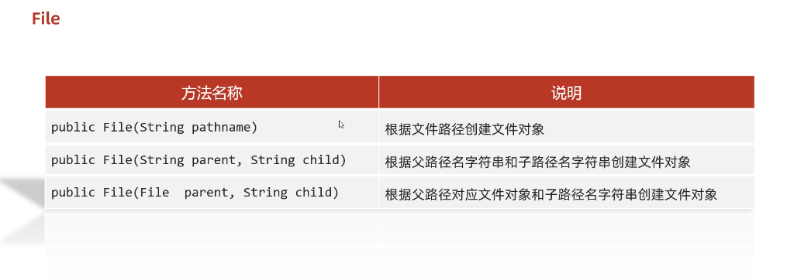
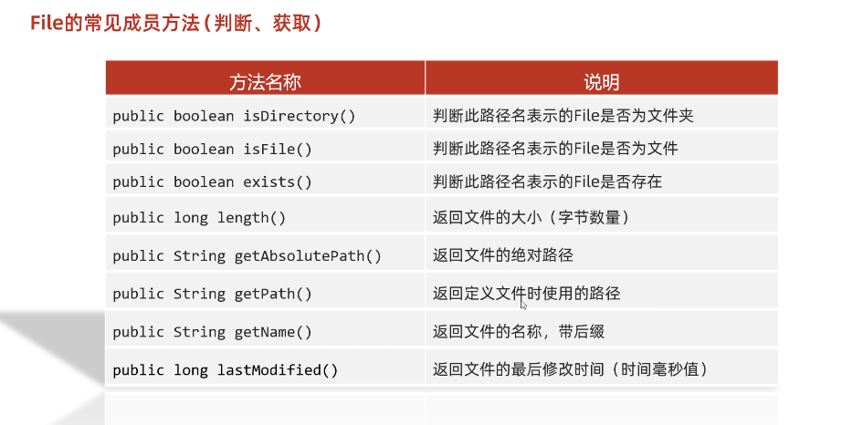
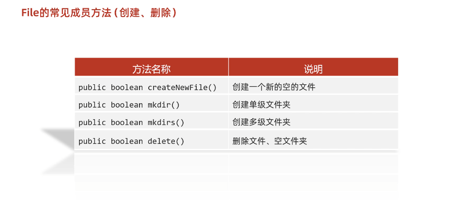
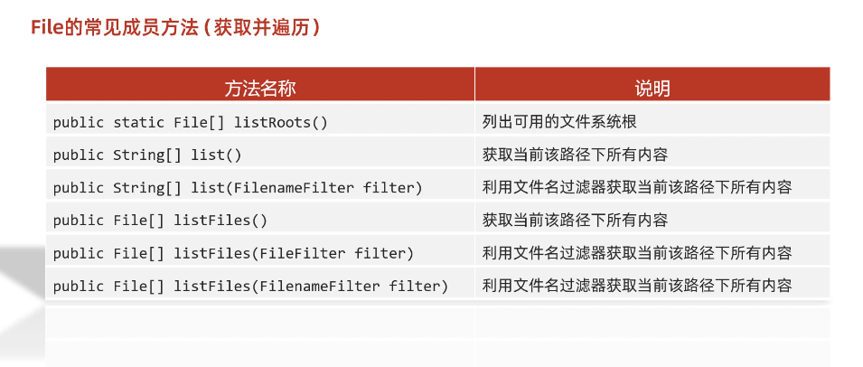

# File类

## 概述

`java.io.File` 类是文件和目录路径名的抽象表示，主要用于文件和目录的创建、查找和删除等操作。

## 构造方法



- `public File(String pathname) ` ：通过将给定的**路径名字符串**转换为抽象路径名来创建新的 File实例。  
- `public File(String parent, String child) ` ：从**父路径名字符串和子路径名字符串**创建新的 File实例。
- `public File(File parent, String child)` ：从**父抽象路径名和子路径名字符串**创建新的 File实例。  


构造举例，代码如下：

```java
package a02file;

import java.io.File;

public class FileDemo1 {
    public static void main(String[] args) {

        // 1.更具字符串表示的路径，变成File对象
        String str = "C:\\Users\\alienware\\Desktop\\a.text";
        File f1 = new File(str); // 这样一个字符串就和路径产生了联系
        System.out.println(f1); // C:\Users\alienware\Desktop\a.text

        System.out.println("----------");

        // 2.父路径字符串+子路径字符串
        // 以上面的路径为例：
        // 父级路径：C:\\Users\\alienware\\Desktop
        // 子集路径：a.text
        String parent = "C:\\Users\\alienware\\Desktop";
        String child = "a.text";
        File f2 = new File(parent, child);
        System.out.println(f2); // C:\Users\alienware\Desktop\a.text


        System.out.println("-----------");

        // 3.父文件对象+子文件路径
        String parent2 = "C:\\Users\\alienware\\Desktop";
        File p = new File(parent2); // 先生成一个父路径File对象
        String child2 = "a.text";
        File f3 = new File(p, child2);
        System.out.println(f3); // C:\Users\alienware\Desktop\a.text
    }
}

```

> 小贴士：
>
> 1. 一个File对象代表硬盘中实际存在的一个文件或者目录。
> 2. 无论该路径下是否存在文件或者目录，都不影响File对象的创建。

## 常用方法


### 常见判断、获取方法




**判断方法：**

- `public boolean exists()` ：此File表示的文件或目录是否实际存在。
- `public boolean isDirectory()` ：此File表示的是否为目录。
- `public boolean isFile()` ：此File表示的是否为文件。

代码示例：

```java
package a02file;

import java.io.File;

public class FileDemo2 {
    public static void main(String[] args) {
        /*
            public boolean exists()` ：此File表示的文件或目录是否实际存在。
            public boolean isDirectory()` ：此File表示的是否为目录。
            public boolean isFile()` ：此File表示的是否为文件。
         */


        // 1.对一个文件的路径进行判断
        File f1 = new File("D:\\aaa\\ddd.txt");
        System.out.println(f1.isDirectory()); // false
        System.out.println(f1.isFile()); // true
        System.out.println(f1.exists()); // true

        System.out.println("----------");

        // 2.对一个文件夹进行判断
        File f2 = new File("D:\\aaa");
        System.out.println(f2.isDirectory()); // true
        System.out.println(f2.isFile()); // false
        System.out.println(f2.exists()); // true

        System.out.println("-----------");

        // 3.对一个不存在的路径进行判断
        File f3 = new File("D:\\abcde");
        System.out.println(f3.isDirectory()); // false
        System.out.println(f3.isFile()); // false
        System.out.println(f3.exists()); // false
    }
}

```


**获取功能的方法**

- `public String getAbsolutePath() ` ：返回此File的绝对路径名字符串。

- ` public String getPath() ` ：将此File转换为路径名字符串。 

- `public String getName()`  ：返回由此File表示的文件或目录的名称。  

- `public long length()`  ：返回由此File表示的文件的长度。 

- `public long lastModified` : 返回最近一次修改文件的日期（单位毫秒）

  方法演示，代码如下：

  ```java
  package a02file;
  
  import java.io.File;
  import java.time.Instant;
  import java.time.ZoneId;
  import java.time.ZonedDateTime;
  import java.time.format.DateTimeFormatter;
  
  public class FileDemo3 {
      public static void main(String[] args) {
  
          // 1.length 返回文件大小(字节数量)
          // 细节1：该方法只能获取文件的大小，单位是字节，如果单位是M,G需要自行转换 除1024
          // 细节2：该方法无法获取文件夹的大小
          // 如果我们就要获取文件夹大小怎么办？需要子集把这个文件夹里所有文件自行累加
          File f1 = new File("D:\\aaa\\ddd.txt");
          long len = f1.length();
          System.out.println(len);
  
          File f2 = new File("D:\\aaa"); // aaa是一个文件夹
          long len2 = f2.length();
          System.out.println(len2); // 0
  
  
          // 2.getAbsolutePath 返回文件的绝对路径
          File f3 = new File("day27-code\\src\\a02file\\fileDemo03.java"); // 这里使用相对路径
          String path3 = f3.getAbsolutePath(); // 可以获取绝对路径
          System.out.println(path3); // C:\Users\10854\IdeaProjects\basic-code\day27-code\src\a02file\fileDemo03.java
  
  
          // 3.getPath 返回定义文件时使用的路径
          File f4 = new File("day27-code\\src\\a02file\\fileDemo03.java"); // 这里使用相对路径
          String path4 = f4.getPath(); // 定义文件对象时的路径
          System.out.println(path4); // day27-code\src\a02file\fileDemo03.java
  
  
  
          // 4.getName 获取名字
          // 细节1：如果调用者是一个文件，会返回文件名.文件类型，如果调用者是一个文件夹，则返回文件夹名字
          File f5 = new File("D:\\aaa\\ddd.txt");
          String name = f5.getName();
          System.out.println(name); // ddd.txt
  
          File f6 = new File("D:\\aaa");
          String name2 = f6.getName();
          System.out.println(name2); // aaa
  
  
          // 5.lastModified 返回文件的最后修改时间（时间毫秒值）
          File f7 = new File("D:\\aaa\\ddd.txt");
          long time = f7.lastModified();
          System.out.println(time); // 1691564249420
  
          // 获取一个带时区的时间对象
          ZonedDateTime i = Instant.ofEpochMilli(time).atZone(ZoneId.of("Asia/Shanghai"));
          DateTimeFormatter dtf1=DateTimeFormatter.ofPattern("yyyy-MM-dd HH: mm: ss");
  
          System.out.println(dtf1.format(i));
      }
  }
  
  ```

> API中说明：length()，表示文件的长度。但是File对象表示目录，则返回值未指定。

### 绝对路径和相对路径

- **绝对路径**：从盘符开始的路径，这是一个完整的路径。
- **相对路径**：相对于项目目录的路径，这是一个便捷的路径，开发中经常使用。

```java
public class FilePath {
    public static void main(String[] args) {
      	// D盘下的bbb.java文件
        File f = new File("D:\\bbb.java");
        System.out.println(f.getAbsolutePath());
      	
		// 项目下的bbb.java文件
        File f2 = new File("bbb.java");
        System.out.println(f2.getAbsolutePath());
    }
}
输出结果：
D:\bbb.java
D:\idea_project_test4\bbb.java
```


### 创建删除功能的方法



- `public boolean createNewFile()` ：当且仅当具有该名称的文件尚不存在时，创建一个新的空文件。 
- `public boolean delete()` ：删除由此File表示的文件或目录。  
- `public boolean mkdir()` ：创建由此File表示的目录。
- `public boolean mkdirs()` ：创建由此File表示的目录，包括任何必需但不存在的父目录。


注意(重点)：

**delete方法，默认只能删除文件和空文件夹，delete方法直接删除不走回收站**


方法演示，代码如下：

```java
package a02file;

import java.io.File;
import java.io.IOException;

public class FileDemo4 {
    public static void main(String[] args) throws IOException {
        /*
            - `public boolean createNewFile()` ：当且仅当具有该名称的文件尚不存在时，创建一个新的空文件。
            - `public boolean delete()` ：删除由此File表示的文件或目录。
            - `public boolean mkdir()` ：创建由此File表示的目录。
            - `public boolean mkdirs()` ：创建由此File表示的目录，包括任何必需但不存在的父目录。
         */


        // 1.createNewFile 创建新的空的文件
        // 细节1：如果当前路径表示文件不存在，则会创建成功返回true
        //       如果当前路径文件存在则会创建失败，返回false
        // 细节2：如果父级路径不存在，方法会有异常IOException
        // 细节3：createNewFile创建的一定是文件，如果路径没有后缀名则会创建一个无后缀的文件
        File f1 = new File("D:\\aaa\\ccc.txt"); // 注意当前路径下，没有这个ccc.txt
        boolean b = f1.createNewFile(); // 创建成功返回true，否则false
        System.out.println(b); // true 运行完成后，会发现多了一个ccc.txt文件


        // 2.mkdir 创建文件夹
        // 细节1：windows中路径是唯一的，如果当前路径已经存在，则创建失败
        // 细节2：mkdir只能创建单级文件夹，无法创建多级
        File f2 = new File("D:\\aaa\\ddd"); // 创建一个ddd文件夹
        boolean mkdir = f2.mkdir();
        System.out.println(mkdir); // true 会发现在aaa文件夹下多了一个ddd文件夹

        File f3 = new File("D:\\aaa\\ddd\\ccc"); // 创建一个多级的
        boolean mkdir2 = f3.mkdir();
        System.out.println(mkdir2); // false 无法创建


        // 3.mkdirs 创建多级文件夹
        // 细节1：mkdirs既可以创建单级也可以创建多级文件夹
        File f4 = new File("D:\\aaa\\ddd\\ccc");
        boolean mkdirs = f4.mkdirs();
        System.out.println(mkdirs); // true


        // 4.delete 删除文件方法
        // 细节1：如果删除的是文件，则直接删除，不走回收站
        // 细节2：如果删除的是文件夹，文件夹若为空，则直接删除，如果有内容则删除失败
        File f5 = new File("D:\\aaa\\ddd.txt");
        boolean d = f5.delete();
        System.out.println(d); // true 直接把ddd.txt文件给删了

        File f6 = new File("D:\\aaa\\ddd"); // 删除ddd文件夹，注意此时ddd文件夹是有内容的
        boolean d2 = f6.delete();
        System.out.println(d2); // false
    }
}

```


### 目录的遍历(重要!!!)



- `public String[] list()` ：返回一个String数组，表示该File目录中的所有子文件或目录。
- `public File[] listFiles()` ：返回一个File数组，表示该File目录中的**所有的子文件或目录**。  

```java
package a02file;

import java.io.File;

public class FileDemo5 {
    public static void main(String[] args) {

        // 1.创建File对象
        File f = new File("D:\\aaa");

        // 2.listFiles方法
        // 获取当前路径下所有内容(包括文件、文件夹),放到数组中并返回
        File[] files = f.listFiles();

        for (File file : files) {
            // file 会以此表示aaa文件夹下的文件或文件夹
            System.out.println(file);
            // D:\aaa\ccc.txt
            // D:\aaa\ddd
        }
    }
}

```

> 小贴士：
>
> 一：调用`listFiles`方法的File对象，表示的必须是实际存在的**目录**(文件不行)，否则返回null，无法进行遍历。
>
> 二：调用者File表示的路径如果是一个空文件夹，则返回一个长度为0的数组
>
> 三：调用者File表示的路径如果是有内容的文件夹时，将里面所有文件和文件夹路径放在File数组中返回
>
> 四：调用者File表示的路径中如果有隐藏文件夹时，也会被放进数组中返回(●ˇ∀ˇ●)
>
> 五：当调用者File表示的路径是需要权限才能访问的文件夹时，会返回null


## 常用套路

如果有些业务，需要找文件夹中内容，包括子文件夹，那么就可以用下面这个套路

套路：

1. 进入文件夹
2. 遍历数组
3. 判断（业务）
4. 判断（是否需要递归）


小栗子：

```java
package Test3;

import java.io.File;

public class Test3 {
    public static void main(String[] args) {
        // 需求：找到电脑中C盘里所有以avi结尾的电影(需要考虑子文件夹)

        /*
            查找文件夹内容的套路

            套路：
                1.进入文件夹
                2.遍历数组
                3.判断
                4.判断
         */

        File src = new File("C:\\");
        findAvi(src);
    }

    public static void findAvi(File src) {
        // 1.进入文件夹
        File[] files = src.listFiles();
        // 注意这里还有个bug，如果路径是需要权限的，则listFiles会返回null
        if(files == null) {
            return;
        }

        // 2.遍历数组
        for (File file : files) {
            // 3.判断
            if(file.isFile()) {
                // 如果是文件，走题目逻辑
                if(file.getName().endsWith(".avi")) {
                    // 打印avi文件
                    System.out.println(file);
                }
            } else {
                // 4.判断
                // 如果是文件夹，继续递归
                findAvi(file);
            }
        }
    }
}

```


## 综合练习

#### 练习1：创建文件夹

​	在当前模块下的aaa文件夹中创建一个a.txt文件

代码实现：

```java
public class Test1 {
    public static void main(String[] args) throws IOException {
        //需求：在当前模块下的aaa文件夹中创建一个a.txt文件

        //1.创建a.txt的父级路径
        File file = new File("myfile\\aaa");
        //2.创建父级路径
        //如果aaa是存在的，那么此时创建失败的。
        //如果aaa是不存在的，那么此时创建成功的。
        file.mkdirs();
        //3.拼接父级路径和子级路径
        File src = new File(file,"a.txt");
        boolean b = src.createNewFile();
        if(b){
            System.out.println("创建成功");
        }else{
            System.out.println("创建失败");
        }
    }
}
```

#### 练习2：查找文件（不考虑子文件夹）

​	定义一个方法找某一个文件夹中，是否有以avi结尾的电影（暂时不需要考虑子文件夹）

代码示例：

```java
public class Test2 {
    public static void main(String[] args) {
        /*需求：
             定义一个方法找某一个文件夹中，是否有以avi结尾的电影。
	        （暂时不需要考虑子文件夹）
        */

        File file = new File("D:\\aaa\\bbb");
        boolean b = haveAVI(file);
        System.out.println(b);
    }
    /*
    * 作用：用来找某一个文件夹中，是否有以avi结尾的电影
    * 形参：要查找的文件夹
    * 返回值：查找的结果  存在true  不存在false
    * */
    public static boolean haveAVI(File file){// D:\\aaa
        //1.进入aaa文件夹，而且要获取里面所有的内容
        File[] files = file.listFiles();
        //2.遍历数组获取里面的每一个元素
        for (File f : files) {
            //f：依次表示aaa文件夹里面每一个文件或者文件夹的路径
            if(f.isFile() && f.getName().endsWith(".avi")){
                return true;
            }
        }
        //3.如果循环结束之后还没有找到，直接返回false
        return false;
    }
}
```

### 练习3：（考虑子文件夹）

​	找到电脑中所有以avi结尾的电影。（需要考虑子文件夹）

代码示例：

```java
public class Test3 {
    public static void main(String[] args) {
        /* 需求：
        找到电脑中所有以avi结尾的电影。（需要考虑子文件夹）


        套路：
            1，进入文件夹
            2，遍历数组
            3，判断
            4，判断

        */

        findAVI();

    }

    public static void findAVI(){
        //获取本地所有的盘符
        File[] arr = File.listRoots();
        for (File f : arr) {
            findAVI(f);
        }
    }

    public static void findAVI(File src){//"C:\\
        //1.进入文件夹src
        File[] files = src.listFiles();
        //2.遍历数组,依次得到src里面每一个文件或者文件夹
        if(files != null){
            for (File file : files) {
                if(file.isFile()){
                    //3，判断，如果是文件，就可以执行题目的业务逻辑
                    String name = file.getName();
                    if(name.endsWith(".avi")){
                        System.out.println(file);
                    }
                }else{
                    //4，判断，如果是文件夹，就可以递归
                    //细节：再次调用本方法的时候，参数一定要是src的次一级路径
                    findAVI(file);
                }
            }
        }
    }
}
```

### 练习4：删除多级文件夹

需求： 如果我们要删除一个有内容的文件夹
	   1.先删除文件夹里面所有的内容
           2.再删除自己

代码示例：

```java
public class Test4 {
    public static void main(String[] args) {
        /*
           删除一个多级文件夹
           如果我们要删除一个有内容的文件夹
           1.先删除文件夹里面所有的内容
           2.再删除自己
        */

        File file = new File("D:\\aaa\\src");
        delete(file);

    }

    /*
    * 作用：删除src文件夹
    * 参数：要删除的文件夹
    * */
    public static void delete(File src){
        //1.先删除文件夹里面所有的内容
        //进入src
        File[] files = src.listFiles();
        //遍历
        for (File file : files) {
            //判断,如果是文件，删除
            if(file.isFile()){
                file.delete();
            }else {
                //判断,如果是文件夹，就递归
                delete(file);
            }
        }
        //2.再删除自己
        src.delete();
    }
}
```

### 练习5：统计大小

​	需求：统计一个文件夹的总大小

代码示例：

```java
public class Test5 {
    public static void main(String[] args) {
       /*需求：
            统计一个文件夹的总大小
      */


        File file = new File("D:\\aaa\\src");

        long len = getLen(file);
        System.out.println(len);//4919189
    }

    /*
    * 作用：
    *       统计一个文件夹的总大小
    * 参数：
    *       表示要统计的那个文件夹
    * 返回值：
    *       统计之后的结果
    *
    * 文件夹的总大小：
    *       说白了，文件夹里面所有文件的大小
    * */
    public static long getLen(File src){
        //1.定义变量进行累加
        long len = 0;
        //2.进入src文件夹
        File[] files = src.listFiles();
        //3.遍历数组
        for (File file : files) {
            //4.判断
            if(file.isFile()){
                //我们就把当前文件的大小累加到len当中
                len = len + file.length();
            }else{
                //判断，如果是文件夹就递归
                len = len + getLen(file);
            }
        }
        return len;
    }
}
```

### 练习6：统计文件个数

  需求：统计一个文件夹中每种文件的个数并打印。（考虑子文件夹）
            打印格式如下：
            txt:3个
            doc:4个
            jpg:6个

代码示例：

```java
public class Test6 {
    public static void main(String[] args) throws IOException {
        /*
            需求：统计一个文件夹中每种文件的个数并打印。（考虑子文件夹）
            打印格式如下：
            txt:3个
            doc:4个
            jpg:6个
        */
        File file = new File("D:\\aaa\\src");
        HashMap<String, Integer> hm = getCount(file);
        System.out.println(hm);
    }

    /*
    * 作用：
    *       统计一个文件夹中每种文件的个数
    * 参数：
    *       要统计的那个文件夹
    * 返回值：
    *       用来统计map集合
    *       键：后缀名 值：次数
    *
    *       a.txt
    *       a.a.txt
    *       aaa（不需要统计的）
    *
    *
    * */
    public static HashMap<String,Integer> getCount(File src){
        //1.定义集合用来统计
        HashMap<String,Integer> hm = new HashMap<>();
        //2.进入src文件夹
        File[] files = src.listFiles();
        //3.遍历数组
        for (File file : files) {
            //4.判断，如果是文件，统计
            if(file.isFile()){
                //a.txt
                String name = file.getName();
                String[] arr = name.split("\\.");
                if(arr.length >= 2){
                    String endName = arr[arr.length - 1];
                    if(hm.containsKey(endName)){
                        //存在
                        int count = hm.get(endName);
                        count++;
                        hm.put(endName,count);
                    }else{
                        //不存在
                        hm.put(endName,1);
                    }
                }
            }else{
                //5.判断，如果是文件夹，递归
                //sonMap里面是子文件中每一种文件的个数
                HashMap<String, Integer> sonMap = getCount(file);
                //hm:  txt=1  jpg=2  doc=3
                //sonMap: txt=3 jpg=1
                //遍历sonMap把里面的值累加到hm当中
                Set<Map.Entry<String, Integer>> entries = sonMap.entrySet();
                for (Map.Entry<String, Integer> entry : entries) {
                    String key = entry.getKey();
                    int value = entry.getValue();
                    if(hm.containsKey(key)){
                        //存在
                        int count = hm.get(key);
                        count = count + value;
                        hm.put(key,count);
                    }else{
                        //不存在
                        hm.put(key,value);
                    }
                }
            }
        }
        return hm;
    }
}
```


