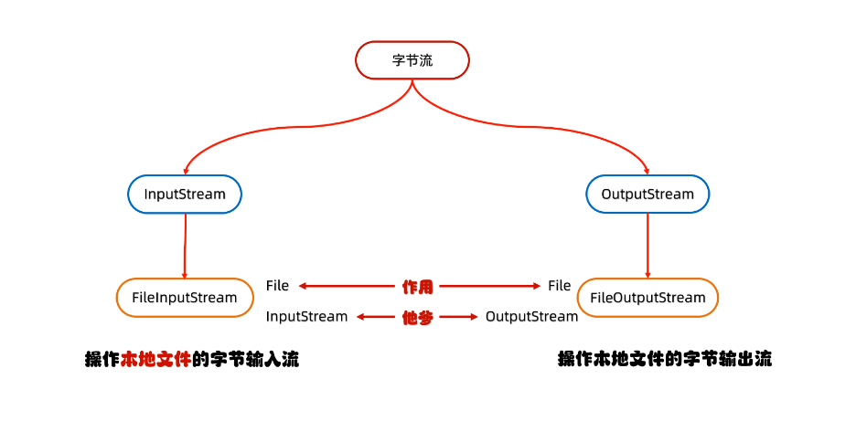
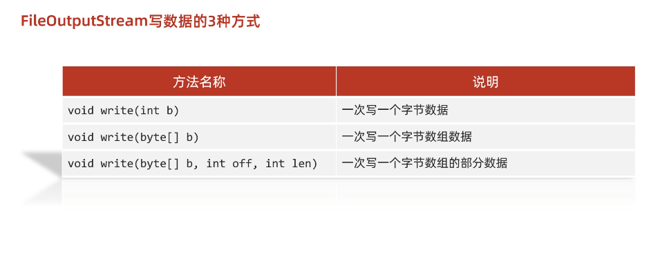

# IO流

## 什么是IO

生活中，你肯定经历过这样的场景。当你编辑一个文本文件，忘记了`ctrl+s` ，可能文件就白白编辑了。当你电脑上插入一个U盘，可以把一个视频，拷贝到你的电脑硬盘里。那么数据都是在哪些设备上的呢？键盘、内存、硬盘、外接设备等等。

我们把这种数据的传输，可以看做是一种**数据的流动**，按照流动的方向，以内存为基准，分为`输入input` 和`输出output` ，即流向内存是输入流，流出内存的输出流。

Java中I/O操作主要是指使用`java.io`包下的内容，进行输入、输出操作。**输入**也叫做**读取**数据，**输出**也叫做作**写出**数据。


**IO流：存取和读取数据的解决方案**


作用？：用于读写数据(本地文件、网络)


## IO的分类

根据数据的流向分为：**输入流**和**输出流**。

* **输入流** ：把数据从`其他设备`上读取到`内存`中的流。 
* **输出流** ：把数据从`内存` 中写出到`其他设备`上的流。

>tips：
>
>程序是跑在内存上的哟~

格局数据的类型分为：**字节流**和**字符流**。

* **字节流** ：以字节为单位，读写数据的流。
* **字符流** ：以字符为单位，读写数据的流。

图例：


>tips：
>
>纯文本文件：例如`.txt`、`.md`、`.xml`等等都是纯文本文件
>
>鉴别方案，在windows系统中，如果你能用**记事本**打开这个文件并且能看懂(不是乱码)，就是个文本文件(●'◡'●)


## IO的流向


## 字节流和字符流使用场景

**字节流：**

1. 可以拷贝任意类型的文件（所以拷贝我们选择字节流）


**字符流：**

1. 读取纯文本文件中的数据
2. 往纯文本文件中写出数据


## 字节流




### 字节输出流【`OutputStream`】

`java.io.OutputStream `抽象类是表示字节输出流的所有类的超类，将指定的字节信息写出到目的地。它定义了字节输出流的基本共性功能方法。

* `public void close()` ：关闭此输出流并释放与此流相关联的任何系统资源。  
* `public void flush() ` ：刷新此输出流并强制任何缓冲的输出字节被写出。  
* `public void write(byte[] b)`：将 b.length字节从指定的字节数组写入此输出流。  
* `public void write(byte[] b, int off, int len)` ：从指定的字节数组写入 len字节，从偏移量 off开始输出到此输出流。  
* `public abstract void write(int b)` ：将指定的字节输出流。

> 小贴士：
>
> close方法，当完成流的操作时，必须调用此方法，释放系统资源。

### `FileOutputStream`类

`OutputStream`有很多子类，我们从最简单的一个子类开始。

`java.io.FileOutputStream `类是文件输出流，**用于将数据写出到文件**。

书写步骤：

1. 创建字节输出流对象（字符串路径或者File对象）
2. 写数据
3. 释放资源


#### 构造方法

* `public FileOutputStream(File file)`：创建文件输出流以写入由指定的 File对象表示的文件。 
* `public FileOutputStream(String name)`： 创建文件输出流以指定的名称写入文件。  

小细节：

1. 当你创建一个流对象时，必须传入一个文件路径。（字符串或者File对象）
2. 该路径下，如果没有这个文件，会创建该文件。（**必须保证父路径存在**）
3. 如果有这个文件，会**清空**这个文件的数据。


* 构造举例，代码如下：

```java
public class FileOutputStreamConstructor throws IOException {
    public static void main(String[] args) {
   	 	// 使用File对象创建流对象
        File file = new File("a.txt");
        FileOutputStream fos = new FileOutputStream(file);
      
        // 使用文件名称创建流对象
        FileOutputStream fos = new FileOutputStream("b.txt");
    }
}
```


#### 写出字节数据




1. **写出字节**：`write(int b)` 方法，每次可以写出一个字节数据，代码使用演示：

```java
public class FOSWrite {
    public static void main(String[] args) throws IOException {
        // 使用文件名称创建流对象
        FileOutputStream fos = new FileOutputStream("fos.txt");     
      	// 写出数据
      	fos.write(97); // 写出第1个字节
      	fos.write(98); // 写出第2个字节
      	fos.write(99); // 写出第3个字节
      	// 关闭资源
        fos.close();
    }
}
输出结果：
abc
```

> 小贴士：
>
> 1. 虽然参数为int类型四个字节，但是只会保留一个字节的信息写出。
> 2. 流操作完毕后，**必须释放系统资源**，调用close方法，千万记得。


2. **写出字节数组**：`write(byte[] b)`，每次可以写出数组中的数据，代码使用演示：

```java
public class FOSWrite {
    public static void main(String[] args) throws IOException {
        // 使用文件名称创建流对象
        FileOutputStream fos = new FileOutputStream("fos.txt");     
      	// 字符串转换为字节数组
      	byte[] b = "黑马程序员".getBytes();
      	
      	// byte[] bytes = {97, 98, 99, 100, 101};
      	// fos.write(bytes);
      	// 写出字节数组数据
      	fos.write(b);
      	// 关闭资源
        fos.close();
    }
}
输出结果：
黑马程序员
```

3. **写出指定长度字节数组**：`write(byte[] b, int off, int len)` ,每次写出从off索引开始，len个字节，代码使用演示：

```java
public class FOSWrite {
    public static void main(String[] args) throws IOException {
        // 使用文件名称创建流对象
        FileOutputStream fos = new FileOutputStream("fos.txt");     
      	// 字符串转换为字节数组
      	byte[] b = "abcde".getBytes();
		// 写出从索引2开始，2个字节。索引2是c，两个字节，也就是cd。
        fos.write(b,2,2);
      	// 关闭资源
        fos.close();
    }
}
输出结果：
cd
```


#### 数据追加续写

经过以上的演示，每次程序运行，创建输出流对象，都会清空目标文件中的数据。如何保留目标文件中数据，还能继续添加新数据呢？

- `public FileOutputStream(File file, boolean append)`： 创建文件输出流以写入由指定的 File对象表示的文件。  
- `public FileOutputStream(String name, boolean append)`： 创建文件输出流以指定的名称写入文件。  

其实`FileOutputStream`类的这两个构造方法，参数中都需要传入一个boolean类型的值，**`true` 表示追加数据，`false` 表示清空原有数据**。这样创建的输出流对象，就可以指定是否追加续写了，代码使用演示：

```java
public class FOSWrite {
    public static void main(String[] args) throws IOException {
        // 使用文件名称创建流对象
        FileOutputStream fos = new FileOutputStream("fos.txt"，true);     
      	// 字符串转换为字节数组
      	byte[] b = "abcde".getBytes();
		// 写出从索引2开始，2个字节。索引2是c，两个字节，也就是cd。
        fos.write(b);
      	// 关闭资源
        fos.close();
    }
}
文件操作前：cd
文件操作后：cdabcde
```


#### 写出换行

Windows系统里，换行符号是`\r\n` 。把

以指定是否追加续写了，代码使用演示：

```java
package a01mybytestream;

import java.io.FileOutputStream;
import java.io.IOException;
import java.nio.charset.StandardCharsets;

public class ByteStreamDemo3 {
    public static void main(String[] args) throws IOException {

        /*

            换行写：


            续写：

         */

        // 1.创建对象
        FileOutputStream fos = new FileOutputStream("day28-code\\a.txt");

        // 2.写出数据
        // 写入字节数组
        byte[] bytes1 = "砂狼白子".getBytes(StandardCharsets.UTF_8);
        fos.write(bytes1);

        // 写出一个换行符(windows中换行是\r\n)
        byte[] bytes2 = "\r\n".getBytes(StandardCharsets.UTF_8);
        fos.write(bytes2);

        byte[] bytes3 = "156cm".getBytes(StandardCharsets.UTF_8);
        fos.write(bytes3);


        // 3.释放资源
        fos.close();
    }
}

// 输出结果:
砂狼白子
156cm
```

> * 回车符`\r`和换行符`\n` ：
>   * 回车符：回到一行的开头（return）。
>   * 换行符：下一行（newline）。
> * 系统中的换行：
>   * Windows系统里，每行结尾是 `回车+换行` ，即`\r\n`；
>   * Unix系统里，每行结尾只有 `换行` ，即`\n`；
>   * Mac系统里，每行结尾是 `回车` ，即`\r`。从 Mac OS X开始与Linux统一。


---

## 字节输入流【`InputStream`】

`java.io.InputStream `抽象类是表示字节输入流的所有类的超类，可以读取字节信息到内存中。它定义了字节输入流的基本共性功能方法。

- `public void close()` ：关闭此输入流并释放与此流相关联的任何系统资源。    
- `public abstract int read()`： 从输入流读取数据的下一个字节。 
- `public int read(byte[] b)`： 从输入流中读取一些字节数，并将它们存储到字节数组 b中 。

> 小贴士：
>
> close方法，当完成流的操作时，必须调用此方法，释放系统资源。

## `FileInputStream`类

`java.io.FileInputStream `类是文件输入流，从文件中读取字节。


操作步骤：

1. 创捷字节输入流对象
2. 读数据
3. 释放资源


#### 构造方法

* `FileInputStream(File file)`： 通过打开与实际文件的连接来创建一个 `FileInputStream `，该文件由文件系统中的 File对象 file命名。 
* `FileInputStream(String name)`： 通过打开与实际文件的连接来创建一个 `FileInputStream` ，该文件由文件系统中的路径名 name命名。  

当你创建一个流对象时，必须传入一个文件路径。该路径下，如果没有该文件,会抛出`FileNotFoundException` 。

- 构造举例，代码如下：

```java
public class FileInputStreamConstructor throws IOException{
    public static void main(String[] args) {
   	 	// 使用File对象创建流对象
        File file = new File("a.txt");
        FileInputStream fos = new FileInputStream(file);
      
        // 使用文件名称创建流对象
        FileInputStream fos = new FileInputStream("b.txt");
    }
}
```


#### 读取字节数据

1. **读取字节**：`read`方法，每次可以读取一个字节的数据（对应ASCII上的数字），提升为int类型，**读取到文件末尾，返回`-1`**，代码使用演示：

```java
public class FISRead {
    public static void main(String[] args) throws IOException{
      	// 使用文件名称创建流对象
       	FileInputStream fis = new FileInputStream("read.txt");
      	// 读取数据，返回一个字节
        int read = fis.read();
        System.out.println((char) read);
        read = fis.read();
        System.out.println((char) read);
        read = fis.read();
        System.out.println((char) read);
        read = fis.read();
        System.out.println((char) read);
        read = fis.read();
        System.out.println((char) read);
      	// 读取到末尾,返回-1
       	read = fis.read();
        System.out.println( read);
		// 关闭资源
        fis.close();
    }
}
输出结果：
a
b
c
d
e
-1
```

循环改进读取方式，代码使用演示：

```java
public class FISRead {
    public static void main(String[] args) throws IOException{
      	// 使用文件名称创建流对象
       	FileInputStream fis = new FileInputStream("read.txt");
      	// 定义变量，保存数据
        int b ；
        // 循环读取
        while ((b = fis.read())!=-1) {
            System.out.println((char)b);
        }
		// 关闭资源
        fis.close();
    }
}
输出结果：
a
b
c
d
e
```

> 小贴士：
>
> 1. 虽然读取了一个字节，但是会自动提升为int类型。
> 2. 流操作完毕后，必须释放系统资源，调用close方法，千万记得。

2. **使用字节数组读取**：`read(byte[] buffer)`，每次读取`buffer`的长度个字节到数组中，返回读取到的有效字节个数，读取到末尾时，返回`-1` ，代码使用演示：

注意:

1. 一次读取一个字节数组的数据，每次读取都会尽可能把数组装满
2. 建议创建存储数组时是**1024的整数倍**

```java
public class FISRead {
    public static void main(String[] args) throws IOException{
      	// 使用文件名称创建流对象.
       	FileInputStream fis = new FileInputStream("read.txt"); // 文件中为abcde
      	// 定义变量，作为有效个数
        int len ；
        // 定义字节数组，作为装字节数据的容器   
        byte[] b = new byte[2];
        // 循环读取
        while (( len= fis.read(b))!=-1) {
           	// 每次读取后,把数组变成字符串打印
            System.out.println(new String(b));
        }
		// 关闭资源
        fis.close();
    }
}

输出结果：
ab
cd
ed
```

错误数据`d`，是由于最后一次读取时，只读取一个字节`e`，数组中，上次读取的数据没有被完全替换，所以要通过`len` ，获取有效的字节。

**改进版代码使用演示**：

```java
public class FISRead {
    public static void main(String[] args) throws IOException{
      	// 使用文件名称创建流对象.
       	FileInputStream fis = new FileInputStream("read.txt"); // 文件中为abcde
      	// 定义变量，作为有效个数
        int len ；
        // 定义字节数组，作为装字节数据的容器   
        byte[] b = new byte[2];
        // 循环读取
        while (( len= fis.read(b))!=-1) {
           	// 每次读取后,把数组的有效字节部分，变成字符串打印
          	// String的构造方法还可以这样传递参数
            System.out.println(new String(b，0，len));//  len 每次读取的有效字节个数
        }
		// 关闭资源
        fis.close();
    }
}

输出结果：
ab
cd
e
```

> 小贴士：
>
> 使用数组读取，每次读取多个字节，减少了系统间的IO操作次数，从而提高了读写的效率，建议开发中使用。


## 小栗子

栗子一：复制小文件使用普通read方法

复制图片文件，代码使用演示：

```java
package a02mybytestream2;

import java.io.FileInputStream;
import java.io.FileOutputStream;
import java.io.IOException;

public class ByteStreamDemo3 {
    public static void main(String[] args) throws IOException {
        /*
            拷贝文件
         */


        // 1.创建对象
        // 读出数据
        FileInputStream fis =  new FileInputStream("day28-code\\a.txt");

        // 写入数据
        FileOutputStream fos = new FileOutputStream("day28-code\\copy.txt");


        // 2.拷贝 边读边写
        int b;
        while ((b = fis.read()) != -1) {
            fos.write(b);
        }

        // 3.释放资源（先开的最后再关闭）

        fos.close();
        fis.close();
    }
}


```

> 小贴士：
>
> 流的关闭原则：先开后关，后开先关。


**栗子二：复制大文件**

使用`read(byte[] buffer)`，每次读取对应字节数组大小

代码示例：

```java
package a02mybytestream2;

import java.io.FileInputStream;
import java.io.FileOutputStream;
import java.io.IOException;

public class ByteStreamDemo5 {
    public static void main(String[] args) throws IOException {
        /*
            需求：
            拷贝一个比较大的文件
         */


        long start = System.currentTimeMillis();

        FileInputStream fis = new FileInputStream("D:\\动漫电影\\视频\\day28-IO（字节流&字符流）\\IO流-01-IO流的概述.mp4");
        FileOutputStream fos = new FileOutputStream("day28-code\\copyVideo.mp4");
        // 创建一个字节数组
        byte[] bytes = new byte[1024 * 1024]; // 一次读取1mb
        /*
            一次读取多个数据，数据长度和传入的数组长度有关，数据直接存在数组中
            返回值：本次读取了多少个字节数据
         */
        int len;

        while ((len = fis.read(bytes)) > 0) {
            // write方法也可以这样，每次都写入截取的大小
            fos.write(bytes, 0, len);
        }

        long end = System.currentTimeMillis();


        // 先开的后关
        fos.close();
        fis.close();

        System.out.println("花费时间" + (end - start));
    }
}
```


## IO中异常处理

了解一下


## GBK字符集


## Unicode字符集(UTF8编码方式)


## 为什么会产生乱码？

根本是截取字节时没截够，或者编码解码时使用的不是同一个码表

例如，如果使用字节流读取文本文件，字节流一次读取一个字节，但是汉字GBK编码时2个字节，Unicode的`UTF8`编码又是三个字节，很容易就读了一半儿，解析的时候自然就对不上了


**如何解决呢？**

1. 最好**不要使用字节流去读文本文件**
2. 编码解码时使用同样的码表


## 编码与解码

编码和解码的相关方法：


代码示例：

```java
package a03charset;

import java.io.UnsupportedEncodingException;
import java.nio.charset.StandardCharsets;

public class CharSetDemo1 {
    public static void main(String[] args) throws UnsupportedEncodingException {

        // 1.编码
        String str = "ai你呦";

        byte[] bytes = str.getBytes(StandardCharsets.UTF_8); // idea默认UTF-8

        /*
            UTF-8编码，汉字3个字节，英文1个字节
         */
        System.out.println(bytes.length);


        byte[] gbks = str.getBytes("GBK");
        /*
            GBK编码：英文1个字节，中文2个字节
         */
        System.out.println(gbks.length);


        // 2.解码
        String str2 = new String(bytes); // 默认UTF-8解码
        System.out.println("str2 = " + str2);

        String str3 = new String(gbks, "GBK"); // 使用GBK来解码
        System.out.println("gbks = " + str3);
    }
}

```


## 字符流

当使用字节流读取文本文件时，可能会有一个小问题。**就是遇到中文字符时，可能不会显示完整的字符**，那是因为一个中文字符可能占用多个字节存储。所以Java提供一些字符流类，以字符为单位读写数据，专门用于处理文本文件。


底层其实还是字节流：字符流 = 字节流 + 字符集


**特点：**

输入流：一次读一个字节，遇到中文时，一次读取多个字节(到底读取多少个和字符集有关)

输出流：底层会把数据按照指定的编码方式进行编码，变成字节再写到文件中


**使用场景：**

非常适合纯文本文件的读写操作


### 字符输入流【Reader】

`java.io.Reader`抽象类是表示用于读取字符流的所有类的超类，可以读取字符信息到内存中。它定义了字符输入流的基本共性功能方法。

- `public void close()` ：关闭此流并释放与此流相关联的任何系统资源。    
- `public int read()`： 从输入流读取一个字符。 
- `public int read(char[] cbuf)`： 从输入流中读取一些字符，并将它们存储到字符数组 cbuf中 。


#### `FileReader`类  

`java.io.FileReader `类是读取字符文件的便利类。构造时使用系统默认的字符编码和默认字节缓冲区。

> 小贴士：
>
> 1. 字符编码：字节与字符的对应规则。Windows系统的中文编码默认是GBK编码表。
>
>    idea中UTF-8
>
> 2. 字节缓冲区：一个字节数组，用来临时存储字节数据。


#### 构造方法

- `FileReader(File file)`： 创建一个新的 `FileReader `，给定要读取的File对象。   
- `FileReader(String fileName)`： 创建一个新的` FileReader `，给定要读取的文件的名称。  

当你创建一个流对象时，必须传入一个文件路径（**路径不存在报错**）。类似于`FileInputStream` 。

- 构造举例，代码如下：

```java
public class FileReaderConstructor throws IOException{
    public static void main(String[] args) {
   	 	// 使用File对象创建流对象
        File file = new File("a.txt");
        FileReader fr = new FileReader(file);
      
        // 使用文件名称创建流对象
        FileReader fr = new FileReader("b.txt");
    }
}
```


#### 读取字符数据


1. **读取字符**：`read`方法，每次可以读取一个字符的数据，提升为int类型，读取到文件末尾，返回`-1`，循环读取，代码使用演示：

```java
package a04mycharstream;

import java.io.FileReader;
import java.io.IOException;

public class CharStreamDemo1 {
    public static void main(String[] args) throws IOException {


        // 1.创建对象
        FileReader fr = new FileReader("day28-code\\a.txt");


        // 2.读取数据 read
        // 字符流底层也是字节流，一次会读取一个字节，但是遇到中文会一次读取3个字节(UTF8编码下)
        // read()方法底层细节：
        // 读取后底层还是会转换成转换成十进制，遇到英文截取一个字节然后转换成十进制
        // 遇到中文时，更具不同编码来进行对应解码，再转换成十进制
        int ch;
        while ((ch = fr.read()) != -1) {
            System.out.print((char)ch);
        }

        // 3.释放资源
        fr.close();
    }
}

```

> 小贴士：虽然读取了一个字符，但是会自动提升为int类型。

2. **使用字符数组读取**：`read(char[] buffer)`，每次读取b的长度个字符到数组中，返回读取到的有效字符个数，读取到末尾时，返回`-1` ，代码使用演示：

>tips:
>
>read(char[] buffer)方法，是把读取数据，解码，强转三步合并，把强转后的内容放到数组当中

```java
public class FRRead {
    public static void main(String[] args) throws IOException {
      	// 使用文件名称创建流对象
       	FileReader fr = new FileReader("read.txt");
      	// 定义变量，保存有效字符个数
        int len ；
        // 定义字符数组，作为装字符数据的容器
         char[] cbuf = new char[2];
        // 循环读取
        while ((len = fr.read(cbuf))!=-1) {
            System.out.println(new String(cbuf));
        }
		// 关闭资源
        fr.close();
    }
}
输出结果：
黑马
程序
员序
```

获取有效的字符改进，代码使用演示：

```java
public class FISRead {
    public static void main(String[] args) throws IOException {
      	// 使用文件名称创建流对象
       	FileReader fr = new FileReader("read.txt");
      	// 定义变量，保存有效字符个数
        int len ；
        // 定义字符数组，作为装字符数据的容器
        char[] cbuf = new char[2];
        // 循环读取
        while ((len = fr.read(cbuf))!=-1) {
            System.out.println(new String(cbuf,0,len));
        }
    	// 关闭资源
        fr.close();
    }
}

输出结果：
黑马
程序
员
```


### 字符输出流【Writer】

小猪一点：

**字符流是有缓冲区的**


`java.io.Writer `抽象类是表示用于写出字符流的所有类的超类，将指定的字符信息写出到目的地。它定义了字节输出流的基本共性功能方法。

- `void write(int c)` 写入单个字符。
- `void write(char[] cbuf) `写入字符数组。 
- `abstract  void write(char[] cbuf, int off, int len) `写入字符数组的某一部分,off数组的开始索引,len写的字符个数。 
- `void write(String str) `写入字符串。 
- `void write(String str, int off, int len)` 写入字符串的某一部分,off字符串的开始索引,len写的字符个数。
- `void flush() `刷新该流的缓冲。  
- `void close()` 关闭此流，但要先刷新它。 


#### `FileWriter`类

`java.io.FileWriter `类是写出字符到文件的便利类。构造时使用系统默认的字符编码和默认字节缓冲区。


#### 构造方法


- `FileWriter(File file)`： 创建一个新的 `FileWriter`，给定要读取的File对象。   
- `FileWriter(String fileName)`： 创建一个新的` FileWriter`，给定要读取的文件的名称。  

当你创建一个流对象时，必须传入一个文件路径，类似于`FileOutputStream`。

- 构造举例，代码如下：

```java
public class FileWriterConstructor {
    public static void main(String[] args) throws IOException {
   	 	// 使用File对象创建流对象
        File file = new File("a.txt");
        FileWriter fw = new FileWriter(file);
      
        // 使用文件名称创建流对象
        FileWriter fw = new FileWriter("b.txt");
    }
}
```


#### 基本写出数据(成员方法)


小细节：

1. 参数是字符串或者File对象
2. 文件不存在会创建一个新的文件，但是要保证父级路径存在
3. 文件如果存在，则会被清空，如果不想被清空，请打开续写开关
4. 如果write方法参数是整数，实际上写道本地文件中的是整数在字符集上对应的字符，例如a是97，所以write(97)实际写入a字母


**写出字符**：`write(int b)` 方法，每次可以写出一个字符数据，代码使用演示：

```java
public class FWWrite {
    public static void main(String[] args) throws IOException {
        // 使用文件名称创建流对象
        FileWriter fw = new FileWriter("fw.txt");     
      	
      	// write会根据编码表，找出对应字符，然后写入
      
      	// 写出数据
      	fw.write(97); // 写出第1个字符
      	fw.write("b"); // 写出第2个字符
      	fw.write("c"); // 写出第3个字符
      	fw.write(30000); // 写出第4个字符，中文编码表中30000对应一个汉字。
      
      	/*
        【注意】关闭资源时,与FileOutputStream不同。
      	 如果不关闭,数据只是保存到缓冲区，并未保存到文件。
        */
        // fw.close();
    }
}
输出结果：
abC田
```

> 小贴士：
>
> 1. 虽然参数为int类型四个字节，但是只会保留一个字符的信息写出。
> 2. 未调用close方法，数据只是保存到了缓冲区，并未写出到文件中。


#### 关闭和刷新


因为内置缓冲区的原因，如果不关闭输出流，无法写出字符到文件中。但是关闭的流对象，是无法继续写出数据的。如果我们既想写出数据，又想继续使用流，就需要`flush` 方法了。

* `flush` ：刷新缓冲区，流对象可以继续使用。
* `close `:先刷新缓冲区，然后通知系统释放资源。流对象不可以再被使用了。

代码使用演示：

```java
public class FWWrite {
    public static void main(String[] args) throws IOException {
        // 使用文件名称创建流对象
        FileWriter fw = new FileWriter("fw.txt");
        // 写出数据，通过flush
        fw.write('刷'); // 写出第1个字符
        fw.flush();
        fw.write('新'); // 继续写出第2个字符，写出成功
        fw.flush();
      
      	// 写出数据，通过close
        fw.write('关'); // 写出第1个字符
        fw.close();
        fw.write('闭'); // 继续写出第2个字符,【报错】java.io.IOException: Stream closed
        fw.close();
    }
}
```

> 小贴士：即便是flush方法写出了数据，操作的最后还是要调用close方法，释放系统资源。


#### 写出其他数据

1. **写出字符数组** ：`write(char[] cbuf)` 和 `write(char[] cbuf, int off, int len)` ，每次可以写出字符数组中的数据，用法类似FileOutputStream，代码使用演示：

```java
public class FWWrite {
    public static void main(String[] args) throws IOException {
        // 使用文件名称创建流对象
        FileWriter fw = new FileWriter("fw.txt");     
      	// 字符串转换为字节数组
      	char[] chars = "黑马程序员".toCharArray();
      
      	// 写出字符数组
      	fw.write(chars); // 黑马程序员
        
		// 写出从索引2开始，2个字节。索引2是'程'，两个字节，也就是'程序'。
        fw.write(b,2,2); // 程序
      
      	// 关闭资源
        fos.close();
    }
}
```

2. **写出字符串**：`write(String str)` 和 `write(String str, int off, int len)` ，每次可以写出字符串中的数据，更为方便，代码使用演示：

```java
public class FWWrite {
    public static void main(String[] args) throws IOException {
        // 使用文件名称创建流对象
        FileWriter fw = new FileWriter("fw.txt");     
      	// 字符串
      	String msg = "黑马程序员";
      
      	// 写出字符数组
      	fw.write(msg); //黑马程序员
      
		// 写出从索引2开始，2个字节。索引2是'程'，两个字节，也就是'程序'。
        fw.write(msg,2,2);	// 程序
      	
        // 关闭资源
        fos.close();
    }
}
```

3. **续写和换行**：操作类似于FileOutputStream。

```java
public class FWWrite {
    public static void main(String[] args) throws IOException {
        // 使用文件名称创建流对象，可以续写数据
        FileWriter fw = new FileWriter("fw.txt"，true);     
      	// 写出字符串
        fw.write("黑马");
      	// 写出换行
      	fw.write("\r\n");
      	// 写出字符串
  			fw.write("程序员");
      	// 关闭资源
        fw.close();
    }
}
输出结果:
黑马
程序员
```

> 小贴士：字符流，只能操作文本文件，不能操作图片，视频等非文本文件。
>
> 当我们单纯读或者写文本文件时  使用字符流 其他情况使用字节流

---


### 字符流底层原理

**字符输入流的底层：**


# 小案例

## 拷贝文件夹

代码示例：

```java
package test;

import java.io.*;

public class test1 {
    public static void main(String[] args) throws IOException {
        // 拷贝一个文件夹（包括子文件夹）

        // 拷贝源路径
        File src = new File("D:\\aaa");
        // 拷贝目标路径
        File target = new File("D:\\aaaa");

        copyFolder(src, target);
    }

    /**
     * 作用：
     *      拷贝文件夹
     * @param source 数据源路径
     * @param target 目标路径
     * @throws IOException
     */
    public static void copyFolder(File source, File target) throws IOException {
      	// 这里也可以直接写 target.mkdirs();不需要下面的判断
        if(!target.exists()) {
            // 如果目标路径不存在，则创建
            target.mkdirs();
        }

        /*
            套路：
                1.进入文件夹
                2.遍历数组
                3.判断
                4.判断
         */

        File[] files = source.listFiles();
      	// 这里如果要拷贝带权限的文件夹，可以给files做一下非空判断
      
        for (File file : files) {

            if(file.isFile()) {
                // 如果是个文件
                // 1.获取文件名
                String fileName = file.getName();
                // 2.获取拷贝路径
                File copyPath = new File(target, fileName);


                // 3.进行拷贝，使用字节流
                byte[] bytes = new byte[1024 * 1024]; // 1次拷贝1mb

                FileInputStream fis = new FileInputStream(file);
                FileOutputStream fos = new FileOutputStream(copyPath);

                int len;
                while ((len = fis.read(bytes)) != -1) {
                    fos.write(bytes, 0, len);
                }

                // 4.关闭
                // 注意：先开的流，后关闭
                fos.close();
                fis.close();
            } else {
                // 如果是文件夹，递归
                // 1.先创建出拷贝目标文件夹路径
                String folderName = file.getName();
                File targetPath = new File(target, folderName);
                copyFolder(file, targetPath);
            }
        }
    }
}

```

