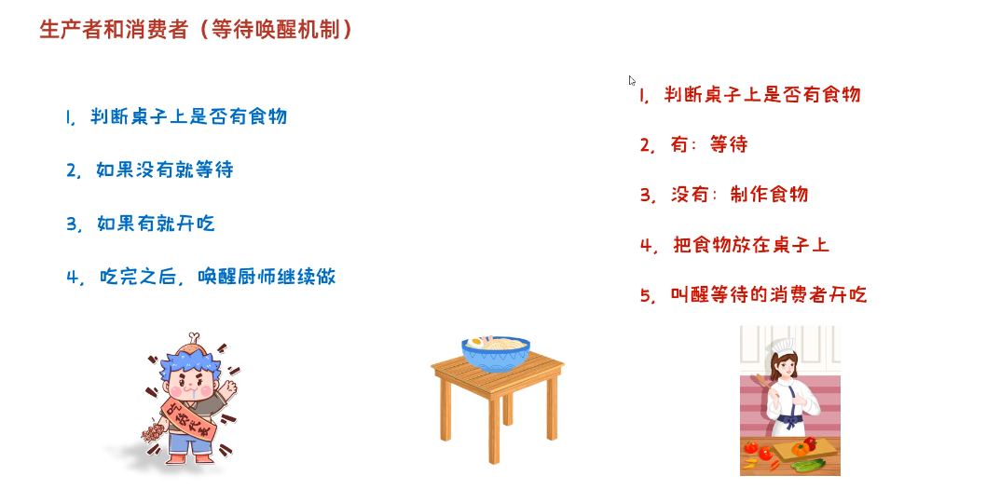

# 多线程


## 线程

线程：线程是操作系统能够进行运算的调度的最小单位。它被包含在**进程**之中，是进程中的实际运作单位。


### 进程和线程【理解】

- 进程：是正在运行的程序

  独立性：进程是一个能独立运行的基本单位，同时也是系统分配资源和调度的独立单位
  动态性：进程的实质是程序的一次执行过程，进程是动态产生，动态消亡的
  并发性：任何进程都可以同其他进程一起并发执行

  

- 线程：是进程中的单个顺序控制流，是一条执行路径

  单线程：一个进程如果只有一条执行路径，则称为单线程程序

  **多线程**：一个进程如果有多条执行路径，则称为多线程程序


简单理解一下：


从上面示例图中，我们可以把**360软件运行**这个看作是一个进程，然后里面**木马查杀、电脑清理、系统修复、优化加速**等，看作是线程

### 并发和并行【理解】

+ 并行：在同一时刻，有多个指令在多个CPU上**同时执行**。


+ 并发：在同一时刻，有多个指令在单个CPU上**交替执行**。


## 多线程实现方式

### 实现多线程方式一：继承Thread类【应用】

- 方法介绍

  | 方法名       | 说明                                        |
  | ------------ | ------------------------------------------- |
  | void run()   | 在线程开启后，此方法将被调用执行            |
  | void start() | 使此线程开始执行，Java虚拟机会调用run方法() |

- 实现步骤

  - 定义一个类MyThread继承Thread类
  - 在MyThread类中重写run()方法
  - 创建MyThread类的对象
  - 启动线程

- 代码演示

  ```java
  package a01threadadcases1;
  
  public class ThreadDemo1 {
      public static void main(String[] args) {
          /*
              多线程的第一种启动方式
  
              1.定义子类继承Thread类
              2.重写父类Thread类中的run方法
              3.创建子类对象，启动线程
           */
  
  
          // 1.创建子类对象
          MyThread mt1 = new MyThread();
          MyThread mt2 = new MyThread();
  
          // 给线程起个名字
          mt1.setName("线程1");
          mt2.setName("线程2");
  
  
          // 2.start方法来开启线程（JVM会调用run方法）
          mt1.start();
          mt2.start();
      }
  }
  
  ```

- 两个小问题

  - 为什么要重写run()方法？

    因为run()是用来封装被线程执行的代码

  - run()方法和start()方法的区别？

    run()：封装线程执行的代码，直接调用，相当于普通方法的调用

    start()：启动线程；然后由JVM调用此线程的run()方法


### 实现多线程方式二：实现Runnable接口【应用】

我们可以简单理解：把实现`Runnable`接口类创建的实例对象，当作是一个任务，将要下发给一个线程，这个线程需要你自己`new Thread`来创建


- Thread构造方法

  | 方法名                               | 说明                   |
  | ------------------------------------ | ---------------------- |
  | Thread(Runnable target)              | 分配一个新的Thread对象 |
  | Thread(Runnable target, String name) | 分配一个新的Thread对象 |

- 实现步骤

  - 定义一个类MyRunnable实现Runnable接口
  - 在MyRunnable类中重写run()方法
  - 创建MyRunnable类的对象
  - 创建Thread类的对象，把MyRunnable对象作为构造方法的参数
  - 启动线程

- 代码演示

  ```java
  public class MyRunnable implements Runnable {
      @Override
      public void run() {
          for(int i=0; i<100; i++) {
            	// Thread.currentThread()获取当前正在运行的线程对象
              System.out.println(Thread.currentThread().getName()+":"+i);
          }
      }
  }
  public class MyRunnableDemo {
      public static void main(String[] args) {
          //创建MyRunnable类的对象
          MyRunnable my = new MyRunnable();
  
          //创建Thread类的对象，把MyRunnable对象作为构造方法的参数
          //Thread(Runnable target)
  //        Thread t1 = new Thread(my);
  //        Thread t2 = new Thread(my);
        	// t1.setName("线程1");
          //Thread(Runnable target, String name)
          Thread t1 = new Thread(my,"坦克");
          Thread t2 = new Thread(my,"飞机");
  
          //启动线程
          t1.start();
          t2.start();
      }
  }
  ```


### 实现多线程方式三: 实现Callable接口【应用】

方法介绍

| 方法名                             | 说明                                                 |
| ---------------------------------- | ---------------------------------------------------- |
| V call()                           | 计算结果，如果无法计算结果，则抛出一个异常           |
| `FutureTask`(Callable<V> callable) | 创建一个 `FutureTask`，一旦运行就执行给定的 Callable |
| V get()                            | 如有必要，等待计算完成，然后获取其结果               |


**特点：**

能够获取到多线程运行的结果


实现步骤

+ 定义一个类MyCallable实现Callable接口
+ 在MyCallable类中重写call()方法(call方法有返回值，表示运行结果)
+ 创建MyCallable类的对象（表示多线程要执行的结果）
+ 创建Future的实现类`FutureTask`对象，把MyCallable对象作为构造方法的参数（作用管理多线程运行的结果）
+ 创建Thread类的对象，把`FutureTask`对象作为构造方法的参数
+ 启动线程
+ 再调用get方法，就可以获取线程结束之后的结果。

+ 代码演示

  ```java
  
  // 这里Callable后面的泛型，就代表着运行返回结果的类型
  public class MyCallable implements Callable<String> {
      @Override
      public String call() throws Exception {
          for (int i = 0; i < 100; i++) {
              System.out.println("跟女孩表白" + i);
          }
          //返回值就表示线程运行完毕之后的结果
          return "答应";
      }
  }
  
  
  public class Demo {
      public static void main(String[] args) throws ExecutionException, InterruptedException {
          //线程开启之后需要执行里面的call方法
          MyCallable mc = new MyCallable();
  
          //Thread t1 = new Thread(mc);
  
          //可以获取线程执行完毕之后的结果.也可以作为参数传递给Thread对象
          FutureTask<String> ft = new FutureTask<>(mc);
  				
        	/*
        		注意这里：如果有多个线程，那么我们可以创建多个ft，多个线程执行结果对应通过对应ft.get来拿到
        		例如：
        		FutureTask<String> ft1 = new FutureTask<>(mc);
        		FutureTask<String> ft2 = new FutureTask<>(mc);
        		
        		Thread t1 = new Thread(ft1);
        		Thread t2 = new Thread(ft2);
        		
        		t1.start();
        		t2.start();
        		
        		ft1.get(); //线程1的执行结果
        		ft2.get(); //线程2的执行结果
        	*/
        
        
          //创建线程对象
          Thread t1 = new Thread(ft);
  
          String s = ft.get();
          //开启线程
          t1.start();
  
          //String s = ft.get();
          System.out.println(s);
      }
  }
  ```
  
  

### 三种实现方式的对比

**对比一：**

实现Runnable、Callable接口

+ 好处: 扩展性强，实现该接口的同时还可以继承其他的类
+ 缺点: 编程相对复杂，不能直接使用Thread类中的方法

继承Thread类

+ 好处: 编程比较简单，可以直接使用Thread类中的方法
+ 缺点: 可以扩展性较差，不能再继承其他的类


**对比二：**

* 继承`Thread`类和实现`Runnable`接口，都不能获取多线程运行的结果
* 实现`Callable`接口，是可以获取多线程执行的结果


## Thread常见的成员方法


### 设置和获取线程名称

方法介绍

| 方法名                           | 说明                               |
| -------------------------------- | ---------------------------------- |
| `void  setName(String name)`     | 将此线程的名称更改为等于参数name   |
| `String  getName()`              | 返回此线程的名称                   |
| `static Thread  currentThread()` | 返回对当前正在执行的线程对象的引用 |

小细节：

1. 如果没有调用`setName`给线程设置名字，会有默认名字`Thread-X`(`x`从0开始的序号，例如：Thread-0)
2. 当`JVM`虚拟机启动后，会自动启动多条线程，其中有一条线程叫做main


代码演示

```java
public class MyThread extends Thread {
    public MyThread() {}
    public MyThread(String name) {
        super(name);
    }

    @Override
    public void run() {
        for (int i = 0; i < 100; i++) {
            System.out.println(getName()+":"+i);
        }
    }
}
public class MyThreadDemo {
    public static void main(String[] args) {
        MyThread my1 = new MyThread();
        MyThread my2 = new MyThread();

        //void setName(String name)：将此线程的名称更改为等于参数 name
        my1.setName("高铁");
        my2.setName("飞机");

        //Thread(String name)
        MyThread my1 = new MyThread("高铁");
        MyThread my2 = new MyThread("飞机");

        my1.start();
        my2.start();

        //static Thread currentThread() 返回对当前正在执行的线程对象的引用
        System.out.println(Thread.currentThread().getName());
    }
}
```

### 线程休眠

相关方法

| 方法名                         | 说明                                             |
| ------------------------------ | ------------------------------------------------ |
| static void sleep(long millis) | 使当前正在执行的线程停留（暂停执行）指定的毫秒数 |


小细节：

1. 那条线程执行到这个方法，那个线程就会休眠(停顿)对应时间
2. 当休眠时间到达之后，该线程会**自动苏醒并执行后续代码**


代码演示

```java
public class MyRunnable implements Runnable {
    @Override
    public void run() {
        for (int i = 0; i < 100; i++) {
            try {
                Thread.sleep(100);
            } catch (InterruptedException e) {
                e.printStackTrace();
            }

            System.out.println(Thread.currentThread().getName() + "---" + i);
        }
    }
}
public class Demo {
    public static void main(String[] args) throws InterruptedException {
        /*System.out.println("睡觉前");
        Thread.sleep(3000);
        System.out.println("睡醒了");*/

        MyRunnable mr = new MyRunnable();

        Thread t1 = new Thread(mr);
        Thread t2 = new Thread(mr);

        t1.start();
        t2.start();
    }
}
```


### 线程优先级

线程调度

- 两种调度方式

  - 分时调度模型：所有线程轮流使用 CPU 的使用权，平均分配每个线程占用 CPU 的时间片
  - 抢占式调度模型：优先让优先级高的线程使用 CPU，如果线程的优先级相同，那么会随机选择一个，优先级高的线程获取的 CPU 时间片相对多一些

- Java使用的是**抢占式调度模型**

- **随机性**

  假如计算机只有一个 CPU，那么 CPU 在某一个时刻只能执行一条指令，线程只有得到CPU时间片，也就是使用权，才可以执行指令。所以说多线程程序的执行是有随机性，因为谁抢到CPU的使用权是不一定的

  

优先级相关方法

| 方法名                                    | 说明                                                         |
| ----------------------------------------- | ------------------------------------------------------------ |
| `final int getPriority()`                 | 返回此线程的优先级                                           |
| `final void setPriority(int newPriority)` | 更改此线程的优先级线程默认优先级是5；线程优先级的范围是：1-10 |

代码演示

```java
package a04threadmethod2.a04threadmethod;

public class MyThread extends Thread{
    @Override
    public void run() {
        for (int i = 0; i <= 1000; i++) {
            System.out.println(getName() + "线程执行中" + i);
        }
    }
}


package a04threadmethod2.a04threadmethod;

public class ThreadDemo {
    public static void main(String[] args) throws InterruptedException {
      
        MyThread t1 = new MyThread();
        MyThread t2 = new MyThread();

        t1.setName("小狗");
        t2.setName("小猫");

        // 设置优先级
        t1.setPriority(5);
        t2.setPriority(10); // 优先级越高，说明能抢占到CPU的概率越高

        t1.start();
        t2.start();

        System.out.println("小狗线程优先级" + t1.getPriority());
        System.out.println("小猫线程优先级" + t2.getPriority());
//
//
//        // main线程的优先级也是默认值5
//        System.out.println(Thread.currentThread().getPriority());
    }
}

```

### 守护线程

相关方法

| 方法名                       | 说明                                                         |
| ---------------------------- | ------------------------------------------------------------ |
| `void setDaemon(boolean on)` | 将此线程标记为守护线程，当运行的线程都是守护线程时，Java虚拟机将退出 |

通俗易懂：

**当非守护线程执行完毕后，守护线程也会结束**


代码演示

```java
public class MyThread1 extends Thread {
    @Override
    public void run() {
        for (int i = 0; i < 10; i++) {
            System.out.println(getName() + "---" + i);
        }
    }
}
public class MyThread2 extends Thread {
    @Override
    public void run() {
        for (int i = 0; i < 100; i++) {
            System.out.println(getName() + "---" + i);
        }
    }
}
public class Demo {
    public static void main(String[] args) {
        MyThread1 t1 = new MyThread1();
        MyThread2 t2 = new MyThread2();

        t1.setName("女神");
        t2.setName("备胎");

        //把第二个线程设置为守护线程
        //当普通线程执行完之后,那么守护线程也没有继续运行下去的必要了.
        t2.setDaemon(true);

        t1.start();
        t2.start();
    }
}
```


### 出让线程/插入线程

相关方法

| 方法名                     | 说明     |
| -------------------------- | -------- |
| `public static void yield` | 出让线程 |
| `public final void join`   | 插入线程 |


出让线程`yield`方法代码示例：

```java
package a06threadmethod;

public class MyThread extends Thread{
    @Override
    public void run() {
        for (int i = 1; i <= 100; i++) {
            System.out.println(getName() + "@" + i);
            Thread.yield(); // 出让当前CPU执行权（线程执行到此后，就会将CPU让给别人）
        }
    }
}


package a06threadmethod;

public class ThreadDemo {
    public static void main(String[] args) {

        MyThread t1 = new MyThread();
        MyThread t2 = new MyThread();


        t1.setName("小狗");
        t2.setName("小猫");

        t1.start();
        t2.start();
    }
}

```


插入线程`join`方法示例代码：

```java
package a07threadmethod;

public class ThreadDemo {
    public static void main(String[] args) throws InterruptedException {

        MyThread t = new MyThread(); // MyThread类和上面yield方法的一致
        t.setName("小狗");
        t.start();

        // 表示把t插入到当前线程之前（当前线程就是main因为main线程中运行的t.join）
        t.join();
        // 结果：t线程会先执行完毕，之后main中的线程才执行完


        // 以下代码执行在main线程中
        for (int i = 0; i < 10; i++) {
            System.out.println("main线程" + i);
        }
    }
}

```


## 线程的生命周期

流程图：


## 线程的安全问题

线程在执行时，它并不一定能将代码执行完，而是随机被抢走执行权，这就会导致一些数据问题（执行顺序有问题）


## 2.线程同步

### 2.1卖票【应用】

案例需求

某电影院目前正在上映国产大片，共有100张票，而它有3个窗口卖票，请设计一个程序模拟该电影院卖票


核心：

就是将三个窗口，我们看作是三个线程，我们直接创建三个线程出来帮我们买票即可


代码实现：

```java
package test1;

public class MyThread extends Thread{


    private static int ticked = 0; // 0~99

    // 锁对象：一定保证要是唯一的(我们用static修饰以下，就能做到，无论多少个MyThread实例，都用的同一个obj)_
    private static Object obj = new Object();


    @Override
    public void run () {
        while (true) {
            if(ticked < 100) {
                try {
                    Thread.sleep(100);
                    ticked++;
                    System.out.println(getName() + "正在卖第" + ticked + "张票");
                } catch (InterruptedException e) {
                    e.printStackTrace();
                }
            } else {
                break;
            }
        }
    }
}


public class SellTicketDemo {
    public static void main(String[] args) {
        //创建SellTicket类的对象
        SellTicket st = new SellTicket();

        //创建三个Thread类的对象，把SellTicket对象作为构造方法的参数，并给出对应的窗口名称
        Thread t1 = new Thread(st,"窗口1");
        Thread t2 = new Thread(st,"窗口2");
        Thread t3 = new Thread(st,"窗口3");

        //启动线程
        t1.start();
        t2.start();
        t3.start();
    }
}
```


### 2.2卖票案例的问题【理解】

卖票出现了问题

- 相同的票出现了多次

- 还会出现额外的票（例如101，102等）

问题产生原因

* 线程执行的随机性导致的,可能在卖票过程中丢失cpu的执行权,导致出现问题


### 2.3同步代码块解决数据安全问题【应用】

套路：

1. 循环
2. 同步代码块（同步方法）
3. 判断共享数据是否到达末尾(到了末尾)
4. 判断共享数据是否到达末尾(未到达末尾，执行核心逻辑)


安全问题出现的条件

- 是多线程环境

- 有共享数据

- 有多条语句操作共享数据


如何解决多线程安全问题呢?

- 基本思想：让程序没有安全问题的环境


怎么实现呢?

- 把多条语句操作共享数据的代码给锁起来，让任意时刻只能有一个线程执行即可

- Java提供了同步代码块的方式来解决


同步代码块格式：

```java
// 注意：任意对象一定要保持唯一
synchronized(任意对象) { 
	//多条语句操作共享数据的代码 
}
```

`synchronized(任意对象)`：就相当于给代码加锁了，任意对象就可以看成是一把锁（**任意对象一定要唯一！！！**）

>tips：
>
>为什么任意对象一定要唯一？
>
>首先上面说了，任意对象相当于是一把锁，假如线程1过来，看的锁(任意对象)，线程2再过来时，看到的是另外一把锁(任意对象)，那么这个锁还有意义嘛？锁不住啊


**特点：**

1. 锁默认打开，有一个线程进入后，自动关闭
2. 里面代码执行完毕后，线程出来，锁自动打开


同步的好处和弊端  

- 好处：解决了多线程的数据安全问题

- 弊端：当线程很多时，因为每个线程都会去判断同步上的锁，这是**很耗费资源的**，无形中会降低程序的运行效率


代码演示

```java
package test1;

public class MyThread extends Thread{


    private static int ticked = 0; // 0~99

    // 锁对象：一定保证要是唯一的(我们用static修饰以下，就能做到，无论多少个MyThread实例，都用的同一个obj)
    private static Object obj = new Object();


    @Override
    public void run () {
        while (true) {

            // 同步代码块
          	// 锁住后，代码块里的代码，在执行时资源不会被抢走
          	// 通常这样写synchronized(MyThread.class) 当前文件的这个class对象肯定是唯一的
            synchronized (obj) {
                if(ticked < 100) {
                    try {
                        Thread.sleep(100);
                        ticked++;
                        System.out.println(getName() + "正在卖第" + ticked + "张票");
                    } catch (InterruptedException e) {
                        e.printStackTrace();
                    }
                } else {
                    break;
                }
            }
        }
    }
}

```

### 2.4同步方法解决数据安全问题【应用】

**同步方法**的格式：

就是把synchronized关键字加到方法上

```java
修饰符 synchronized 返回值类型 方法名(方法参数) { 
	方法体；
}
```


**特点：**

1. **同步方法是锁住方法里面所有的代码块**
2. 锁对象不能自己指定

>tips：
>
>同步方法中，锁对象，Java会自己指定
>
>非静态方法：this
>
>静态方法：当前类的字节码文件对象(文件名/类名.class)


**静态同步方法**

同步静态方法：就是把synchronized关键字加到静态方法上

```java
修饰符 static synchronized 返回值类型 方法名(方法参数) { 
	方法体；
}
```


>tips：
>
>写同步方法的小套路，可以先写同步代码块儿，然后再把同步代码块儿中的代码抽离成一个方法，然后再改造成同步方法即可

代码示例：（还是上面那个卖票的案例）

```java
package test2;

public class MyRunnable implements Runnable {
    int ticket = 0;  // 这里不用创建为静态了

    @Override
    public void run() {
        // 1.循环
        // 2.同步代码块（同步方法）
        // 3.判断共享数据是否到了末尾，如果到了末尾
        // 4.判断共享数据是否到了末尾，如果没有到末尾
        while (true) {
            // 同步代码块儿写法
//            synchronized (MyRunnable.class) {
//                if (ticket == 100) {
//                    break;
//                } else {
//                    try {
//                        Thread.sleep(10);
//                    } catch (InterruptedException e) {
//                        e.printStackTrace();
//                    }
//                    ticket++;
//                    System.out.println(Thread.currentThread().getName() + "正在卖第" + ticket + "张票。");
//                }
//            }

          
            // 将同步代码块内容抽离成方法，变成同步方法
            if (saleTicked()) break;

        }
    }
    
    // 同步方法（锁对象用的是this）
    private synchronized boolean saleTicked() {
        if (ticket == 100) {
            return true;
        } else {
            try {
                Thread.sleep(10);
            } catch (InterruptedException e) {
                e.printStackTrace();
            }
            ticket++;
            System.out.println(Thread.currentThread().getName() + "正在卖第" + ticket + "张票。");
        }
        return false;
    }

}


// main方法中的内容
package test2;

public class ThreadDemo {
    public static void main(String[] args) {
        /*
            需求：
                某电影院目前正在上映国产大片，共有100张票，而它有3个窗口卖票，请设计一个程序模拟该电影院卖票

            三个窗口：可以看作3个线程
         */

        MyRunnable task = new MyRunnable();

        // 创建三个窗口
        Thread t1 = new Thread(task, "窗口1");
        Thread t2 = new Thread(task, "窗口2");
        Thread t3 = new Thread(task, "窗口3");


        // 启动线程
        t1.start();
        t3.start();
        t2.start();
    }
}

```


### 2.5 `Lock`锁【应用】

虽然我们可以理解同步代码块和同步方法的锁对象问题，但是我们并没有直接看到在哪里加上了锁，在哪里释放了锁，为了更清晰的表达如何加锁和释放锁，JDK5以后提供了一个新的锁对象Lock支持我们**自己手动上锁和释放锁**


Lock是接口不能直接实例化，这里采用它的实现类`ReentrantLock`来实例化

`ReentrantLock`构造方法

| 方法名            | 说明                          |
| ----------------- | ----------------------------- |
| `ReentrantLock()` | 创建一个`ReentrantLock`的实例 |


加锁解锁方法

| 方法名        | 说明   |
| ------------- | ------ |
| void lock()   | 获得锁 |
| void unlock() | 释放锁 |


小猪一点：

1. lock对象一定要保证唯一，lock也是锁对象
2. unlock方法一定要执行，否则会导致锁无法释放，标准写法：就是在lock()方法后面的代码用try...catch...finally包裹并在finally中调用**unlock方法**


代码演示：

  ```java
package test3;

import java.util.concurrent.locks.Lock;
import java.util.concurrent.locks.ReentrantLock;

public class MyRunnable implements Runnable {
    int ticket = 0;  // 这里不用创建为静态了

    // 修改为Lock方式
    // 注意：lock对象也必须要唯一
    Lock lock = new ReentrantLock();

    @Override
    public void run() {
        while (true) {
            // 同步代码块儿写法
//            synchronized (MyRunnable.class) {
//                if (ticket == 100) {
//                    break;
//                } else {
//                    try {
//                        Thread.sleep(10);
//                    } catch (InterruptedException e) {
//                        e.printStackTrace();
//                    }
//                    ticket++;
//                    System.out.println(Thread.currentThread().getName() + "正在卖第" + ticket + "张票。");
//                }
//            }

            // 手动lock和unlock写法
            lock.lock(); // 手动加锁
          
          	// 注意：标准写法就是这样，把lock()方法后面的内容用try...catch..finally裹一下
            try {
                if (ticket == 100) {
                    break;
                } else {
                    Thread.sleep(10);
                    ticket++;
                    System.out.println(Thread.currentThread().getName() + "正在卖第" + ticket + "张票。");
                }
            } catch (InterruptedException e) {
                e.printStackTrace();
            } finally {
                // 为很么要写在finally？ 为了防止锁不释放，finally中的代码，最后总会执行
                lock.unlock(); // 释放锁
            }

        }
    }

}

// main中的内容
package test3;

public class ThreadDemo {
    public static void main(String[] args) {
        /*
            需求：
                某电影院目前正在上映国产大片，共有100张票，而它有3个窗口卖票，请设计一个程序模拟该电影院卖票

            三个窗口：可以看作3个线程
         */

        MyRunnable task = new MyRunnable();

        // 创建三个窗口
        Thread t1 = new Thread(task, "窗口1");
        Thread t2 = new Thread(task, "窗口2");
        Thread t3 = new Thread(task, "窗口3");


        // 启动线程
        t1.start();
        t3.start();
        t2.start();
    }
}

  ```


### 2.6死锁【理解】

概述

线程死锁是指由于两个或者多个线程互相持有对方所需要的资源，导致这些线程处于等待状态，无法前往执行


什么情况下会产生死锁？

1. 资源有限
2. **同步嵌套**


代码演示：

```java
public class Demo {
    public static void main(String[] args) {
      	// 定义两把锁对象
        Object objA = new Object();
        Object objB = new Object();

        new Thread(()->{
            while(true){
                synchronized (objA){
                    //线程一
                    synchronized (objB){
                        System.out.println("小康同学正在走路");
                    }
                }
            }
        }).start();
				
      	// 两个线程都拿到了
      
        new Thread(()->{
            while(true){
                synchronized (objB){
                    //线程二
                    synchronized (objA){
                        System.out.println("小薇同学正在走路");
                    }
                }
            }
        }).start();
    }
}
```


## 3.生产者消费者

### 3.1生产者和消费者模式概述【应用】

- 概述

  生产者消费者模式是一个十分经典的多线程协作的模式，弄懂生产者消费者问题能够让我们对多线程编程的理解更加深刻。

  所谓生产者消费者问题，实际上主要是包含了两类线程：

  ​	一类是生产者线程用于生产数据

  ​	一类是消费者线程用于消费数据

  为了解耦生产者和消费者的关系，通常会采用共享的数据区域，就像是一个仓库

  生产者生产数据之后直接放置在共享数据区中，并不需要关心消费者的行为

  消费者只需要从共享数据区中去获取数据，并不需要关心生产者的行为

- Object类的等待和唤醒方法

  | 方法名             | 说明                                                         |
  | ------------------ | ------------------------------------------------------------ |
  | `void wait()`      | 导致当前线程等待，直到另一个线程调用该对象的 notify()方法或 `notifyAll()`方法 |
  | `void notify()`    | 唤醒正在等待对象监视器的**单个线程**                         |
  | `void notifyAll()` | 唤醒正在等待对象监视器的**所有线程**(常用)                   |


小栗子示例图：



>tips：
>
>桌子是控制生产者线程和消费者线程的核心


### 3.2生产者和消费者案例(基本写法)

案例需求

+ 桌子类(Desk)：定义表示面条数量的变量,定义锁对象变量,定义标记面条上有无面条的变量

+ 生产者类(Cooker)：实现Runnable接口，重写run()方法，设置线程任务

  1.判断是否有面条,决定当前线程是否执行

  2.如果有面条,就进入等待状态,如果没有面条,继续执行,生产面条

  3.生产面条之后,更新桌子上面条状态,唤醒消费者消费面条

+ 消费者类(Foodie)：实现Runnable接口，重写run()方法，设置线程任务

  1.判断是否有面条,决定当前线程是否执行

  2.如果没有面条,就进入等待状态,如果有面条,就消费面条

  3.消费面条后,更新桌子上面条状态,唤醒生产者生产面条

+ 测试类(Demo)：里面有main方法，main方法中的代码步骤如下

  创建生产者线程和消费者线程对象

  分别开启两个线程


套路：

1. 循环
2. 同步代码块（同步方法）
3. 判断共享数据是否到达末尾(到了末尾)
4. 判断共享数据是否到达末尾(未到达末尾，执行核心逻辑)


Desk桌子：

```java
package a08waitandnotify;

public class Desk {
    /**
     * 作用：控制生产者和消费者的执行
     */

    // 是否有面条 0：没有 1：有
    public static int foodFlag = 0;

    // 总个数（共享数据）
    public static int count = 10;

    // 锁对象
    public static Object lock = new Object();
}

```


Cook厨师类(生产者)：

```java
package a08waitandnotify;

public class Cook extends Thread{
    /**
     * 作用：生产者
     */

    @Override
    public void run() {
        /*
            套路：

                1. 循环
                2. 同步代码块（同步方法）
                3. 判断共享数据是否到达末尾(到了末尾)
                4. 判断共享数据是否到达末尾(未到达末尾，执行核心逻辑)
         */


        while (true) {
            synchronized (Desk.lock) {
                if(Desk.count == 0) {
                    break;
                } else {
                    // 共享数据还未到达末尾

                    if(Desk.foodFlag == 1) {
                        // 如果有需要等待
                        try {
                            Desk.lock.wait();
                        } catch (InterruptedException e) {
                            e.printStackTrace();
                        }
                    } else {
                        // 如果没有，则制作食物
                        System.out.println("厨师做了一碗面条");
                        // 修改桌子状态
                        Desk.foodFlag = 1;
                        // 叫醒吃货来吃

                        Desk.lock.notifyAll();
                    }
                }
            }
        }
    }
}

```


Foodie吃货类（消费者）：

```java
package a08waitandnotify;

public class Foodie extends Thread{
    /**
     * 作用：消费者
     */

    @Override
    public void run() {
        /*
            套路：

                1. 循环
                2. 同步代码块（同步方法）
                3. 判断共享数据是否到达末尾(到了末尾)
                4. 判断共享数据是否到达末尾(未到达末尾，执行核心逻辑)
         */

        while (true) {
            synchronized (Desk.lock) {
                if(Desk.count == 0) {
                    // 如果总数是0了，就需要跳出循环了
                    break;
                } else {

                    // 判断桌子上是否有面条
                    if(Desk.foodFlag == 0) {
                        // 如果没有，就等待
                        try {
                            Desk.lock.wait(); // 注意这里要用锁对象的wait方法，来让线程和锁绑定在一起
                        } catch (InterruptedException e) {
                            e.printStackTrace();
                        }
                    } else {
                        // 如果有
                        // 总数减1
                        Desk.count--;

                        // 消费面条，开吃！
                        System.out.println("吃货正在吃面条，还能继续吃" + Desk.count + "碗");

                        // 吃完后，通知厨师继续做面条
                        Desk.lock.notifyAll();

                        // 修改桌子状态
                        Desk.foodFlag = 0;
                    }
                }
            }
        }

    }
}

```


ThreadDemo类，main方法：

```java
package a08waitandnotify;

public class ThreadDemo {
    public static void main(String[] args) {
        /*
            需求：完成生产者/消费者模型
         */

        // 创建线程对象
        Cook c = new Cook();
        Foodie f = new Foodie();


        // 给线程添加名字
        c.setName("厨师");
        f.setName("吃货");


        // 启动线程
        c.start();
        f.start();
    }
}

```


### 3.3阻塞队列基本使用(Queue)

阻塞队列继承结构


常见BlockingQueue:

* ArrayBlockingQueue: 底层是数组,有界

* LinkedBlockingQueue: 底层是链表,无界.但不是真正的无界,最大为int的最大值


`BlockingQueue`的核心方法:

* `put(anObject): `将参数放入队列,如果放不进去会阻塞

* `take():`取出第一个数据,取不到会阻塞


>tips：
>
>注意put，take方法底层就自带锁了，我们使用时就不需要再手动加锁了，如果再加就会形成锁的嵌套从而导致死锁问题出现了


代码示例

```java
public class Demo02 {
    public static void main(String[] args) throws Exception {
        // 创建阻塞队列的对象,容量为 1
        ArrayBlockingQueue<String> arrayBlockingQueue = new ArrayBlockingQueue<>(1);

        // 存储元素
        arrayBlockingQueue.put("汉堡包");

        // 取元素
        System.out.println(arrayBlockingQueue.take());
        System.out.println(arrayBlockingQueue.take()); // 取不到会阻塞

        System.out.println("程序结束了");
    }
}
```


### 3.4阻塞队列实现等待唤醒机制

案例需求

+ 生产者类(Cooker)：实现Runnable接口，重写run()方法，设置线程任务

  1.构造方法中接收一个阻塞队列对象

  2.在run方法中循环向阻塞队列中添加包子

  3.打印添加结果

+ 消费者类(Foodie)：实现Runnable接口，重写run()方法，设置线程任务

  1.构造方法中接收一个阻塞队列对象

  2.在run方法中循环获取阻塞队列中的包子

  3.打印获取结果

+ 测试类(Demo)：里面有main方法，main方法中的代码步骤如下

  创建阻塞队列对象

  创建生产者线程和消费者线程对象,构造方法中传入阻塞队列对象

  分别开启两个线程

代码实现：(没有完全和上面的要求一致，我们用的继承Thread方法写的多线程)


Cook类（生产者）：

```java
package a09waitandnotify;

import java.util.concurrent.ArrayBlockingQueue;

public class Cook extends Thread{

    ArrayBlockingQueue<String> queue;

    public Cook(ArrayBlockingQueue<String> queue) {
        this.queue = queue;
    }

    @Override
    public void run() {
        while (true) {
            // 不断的往阻塞队列中放入面条

            try {
                // 这里我们不需要再写锁了，put方法底层自带锁
                queue.put("面条");
//                System.out.println("厨师放了一碗面条");
            } catch (InterruptedException e) {
                e.printStackTrace();
            }
        }
    }
}

```


Foodie类（消费者）：

```java
package a09waitandnotify;

import java.util.concurrent.ArrayBlockingQueue;

public class Foodie extends Thread{

    ArrayBlockingQueue<String> queue;

    public Foodie(ArrayBlockingQueue<String> queue) {
        this.queue = queue;
    }

    @Override
    public void run() {
        /**
         * 套路：
         *  1.循环
         *  2.同步代码块
         *  3.公共数据条件判断，满足情况时
         *  4.公共数据条件判断，不满足情况时
         */

        while (true) {
            // 不断的从阻塞队列中消费面条，开吃！
            try {
                // take方法底层也自带锁，不用我们自己添加锁了
                String food = queue.take();
//                System.out.println(food);
            } catch (InterruptedException e) {
                e.printStackTrace();
            }
        }
    }
}

```


main方法：

```java
package a09waitandnotify;

import java.util.concurrent.ArrayBlockingQueue;

public class ThreadDemo {
    public static void main(String[] args) {
        /**
         *
         * 需求：利用阻塞队列完成生产者和消费者（等待唤醒机制）的代码
         *
         * 细节：
         *      生产者和消费者必须要使用同一个阻塞队列
         */

				
      	// 注意：我们为了保证队列的唯一，在这里创建，通过构造传递给生产者和消费者

        // 1.创建阻塞队列的对象
        ArrayBlockingQueue<String> queue = new ArrayBlockingQueue<>(1);


        // 2。创建线程对象，并将公共的阻塞队列对象放入
        Cook c = new Cook(queue);
        Foodie f = new Foodie(queue);


        // 3.开启线程
        c.start();
        f.start();
    }
}

```

