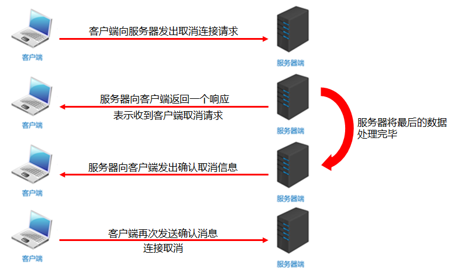

# Java网络编程

##  网络编程入门

### 1.1 网络编程概述

- 计算机网络

  是指将地理位置不同的具有独立功能的多台计算机及其外部设备，通过通信线路连接起来，在网络操作系统，网络管理软件及网络通信协议的管理和协调下，实现资源共享和信息传递的计算机系统

- 网络编程

  在网络通信协议下，不同计算机上运行的程序，可以进行数据传输

### 1.2 网络编程三要素

- IP地址

  要想让网络中的计算机能够互相通信，必须为每台计算机指定一个标识号，通过这个标识号来指定要接收数据的计算机和识别发送的计算机，而`IP`地址就是这个标识号。也就是设备的标识

  简述：**设备在网络中的地址，是唯一标识**

- 端口

  网络的通信，本质上是两个应用程序的通信。每台计算机都有很多的应用程序，那么在网络通信时，如何区分这些应用程序呢？如果说`IP`地址可以唯一标识网络中的设备，那么端口号就可以唯一标识设备中的应用程序了。也就是应用程序的标识

  简述：**应用程序在设备中的唯一标识**

- 协议

  通过计算机网络可以使多台计算机实现连接，位于同一个网络中的计算机在进行连接和通信时需要遵守一定的规则，这就好比在道路中行驶的汽车一定要遵守交通规则一样。在计算机网络中，这些连接和通信的规则被称为网络通信协议，它对数据的传输格式、传输速率、传输步骤等做了统一规定，通信双方必须同时遵守才能完成数据交换。常见的协议有`UDP`协议和`TCP`协议

  简述：**数据在网络中传输的规则**

### 1.3 IP地址

IP地址：是网络中设备的唯一标识

- IP地址分为两大类
  - IPv4：是给每个连接在网络上的主机分配一个32bit地址。按照TCP/IP规定，IP地址用二进制来表示，每个IP地址长32bit，也就是4个字节。例如一个采用二进制形式的IP地址是“11000000 10101000 00000001 01000010”，这么长的地址，处理起来也太费劲了。为了方便使用，IP地址经常被写成十进制的形式，中间使用符号“.”分隔不同的字节。于是，上面的IP地址可以表示为“192.168.1.66”。IP地址的这种表示法叫做“点分十进制表示法”，这显然比1和0容易记忆得多
  - IPv6：由于互联网的蓬勃发展，IP地址的需求量愈来愈大，但是网络地址资源有限，使得IP的分配越发紧张。为了扩大地址空间，通过IPv6重新定义地址空间，采用128位地址长度，每16个字节一组，分成8组十六进制数，这样就解决了网络地址资源数量不够的问题，(**可以用”冒号分十六进制表示法“，如果由16进制中有多个0就会替代为::**)
- DOS常用命令：
  - ipconfig：查看本机IP地址
  - ping IP地址：检查网络是否连通
- 特殊IP地址：
  - 127.0.0.1：是回送地址，可以代表本机地址，一般用来测试使用(可以ping)


多学亿点：

如今`ipv4`已经分配完了，为什么还能够继续用呢？

IPV4地址分为公有地址（万维网使用）和私有地址(局域网使用)，192.168开头的都是私有地址，范围是192.168.0.0~192.168.255.255，专门为组织机构等内部使用，用来节省`ip`

>tips：
>
>共享操作一般都是，一个组织或机构(例如网吧)，这里会使用一个公网IP，然后由路由器分配局域网IP，这样就能够解约公网IP了


### 1.4 `InetAddress`

InetAddress：此类表示Internet协议（IP）地址

- 相关方法

  | 方法名                                      | 说明                                                         |
  | ------------------------------------------- | ------------------------------------------------------------ |
  | `static InetAddress getByName(String host)` | 确定主机名称的IP地址。主机名称可以是机器名称，也可以是IP地址 |
  | `String getHostName()`                      | 获取此IP地址的主机名                                         |
  | `String getHostAddress()`                   | 返回文本显示中的IP地址字符串                                 |

- 代码演示

  ```java
  public class InetAddressDemo {
      public static void main(String[] args) throws UnknownHostException {
  		//InetAddress address = InetAddress.getByName("itheima");
          InetAddress address = InetAddress.getByName("192.168.1.66");
  
          //public String getHostName()：获取此IP地址的主机名
          String name = address.getHostName();
          //public String getHostAddress()：返回文本显示中的IP地址字符串
          String ip = address.getHostAddress();
  
          System.out.println("主机名：" + name);
          System.out.println("IP地址：" + ip);
      }
  }
  ```

### 1.5 端口和协议

- 端口

  - 设备上应用程序的唯一标识
- 端口号

  - 用两个字节表示的整数，它的取值范围是0~65535。其中，0~1023之间的端口号用于一些知名的网络服务和应用，**普通的应用程序需要使用1024以上的端口号**。如果端口号被另外一个服务或应用所占用，会导致当前程序启动失败。**一个应用程序只能使用一个端口号**


**协议：**

概述：计算机网络中，连接和通信的规则被称为网络通信协议


**`UDP`协议：用户数据报协议(User Datagram Protocol)**

UDP是**无连接通信协议**，即在数据传输时，数据的发送端和接收端不建立逻辑连接。简单来说，当一台计算机向另外一台计算机发送数据时，发送端不会确认接收端是否存在，就会发出数据，同样接收端在收到数据时，也不会向发送端反馈是否收到数据。


**特点：**

速度快，有大小限制最多一次发送`64k`，数据不安全，容易丢失数据


应用场景：

由于使用UDP协议消耗系统资源小，通信效率高，所以通常都会用于音频、视频和普通数据的传输。

例如视频会议通常采用UDP协议，因为这种情况即使偶尔丢失一两个数据包，也不会对接收结果产生太大影响。但是在使用UDP协议传送数据时，由于UDP的面向无连接性，不能保证数据的完整性，因此在传输重要数据时不建议使用UDP协议


**TCP协议：传输控制协议 (Transmission Control Protocol)**

**TCP协议是面向连接的通信协议**，即传输数据之前，在发送端和接收端建立逻辑连接，然后再传输数据，它提供了两台计算机之间可靠无差错的数据传输。在TCP连接中必须要明确客户端与服务器端，由客户端向服务端发出连接请求，每次连接的创建都需要经过“三次握手”


**特点：**

速度慢，没有大小限制，数据安全


三次握手：TCP协议中，在发送数据的准备阶段，客户端与服务器之间的三次交互，以保证连接的可靠

第一次握手，客户端向服务器端发出连接请求，等待服务器确认

第二次握手，服务器端向客户端回送一个响应，通知客户端收到了连接请求

第三次握手，客户端再次向服务器端发送确认信息，确认连接


应用场景：

完成三次握手，连接建立后，客户端和服务器就可以开始进行数据传输了。由于这种面向连接的特性，TCP协议可以保证传输数据的安全，所以应用十分广泛。例如上传文件、**下载文件**、**浏览网页**等


## 2.`UDP`通信程序

### 2.1` UDP`发送数据

Java中的`UDP`通信

- UDP协议是一种不可靠的网络协议，它在通信的两端各建立一个Socket对象，但是这两个Socket只是发送，接收数据的对象，因此对于基于UDP协议的通信双方而言，没有所谓的客户端和服务器的概念
- Java提供了DatagramSocket类作为基于UDP协议的Socket


构造方法

| 方法名                                                      | 说明                                                 |
| ----------------------------------------------------------- | ---------------------------------------------------- |
| DatagramSocket()                                            | 创建数据报套接字并将其绑定到本机地址上的任何可用端口 |
| DatagramPacket(byte[] buf,int len,InetAddress add,int port) | 创建数据包,发送长度为len的数据包到指定主机的指定端口 |


相关方法

| 方法名                         | 说明                   |
| ------------------------------ | ---------------------- |
| void send(DatagramPacket p)    | 发送数据报包           |
| void close()                   | 关闭数据报套接字       |
| void receive(DatagramPacket p) | 从此套接字接受数据报包 |


发送数据的步骤

- 创建发送端的Socket对象(DatagramSocket)
- 创建数据，并把数据打包
- 调用DatagramSocket对象的方法发送数据
- 关闭发送端

代码演示

```java
package a02udpdemo;

import java.io.IOException;
import java.net.*;
import java.nio.charset.StandardCharsets;

public class SendMessageDemo {
    public static void main(String[] args) throws IOException {
        // 发送数据


        // 1.创建对象
        /*
            细节：
                绑定端口，以后往外发送数据就是通过该端口发送
                空参：所有可用端口中随机一个进行使用
                有参：指定端口号发送
         */
        DatagramSocket ds = new DatagramSocket();


        // 2.打包数据
        String str = "Hello World";
        byte[] bytes = str.getBytes(StandardCharsets.UTF_8); // 指定数据
        InetAddress address = InetAddress.getByName("127.0.0.1"); // 本机地址
        int port = 10086; // 发送数据到那个端口号

        DatagramPacket dp = new DatagramPacket(bytes, bytes.length,address, port);

        // 3.发送数据
        ds.send(dp);


        // 4.释放资源
        ds.close();
    }
}

```

### 2.2UDP接收数据

接收数据的步骤

- 创建接收端的Socket对象(DatagramSocket)
- 创建一个数据包，用于接收数据
- 调用DatagramSocket对象的方法接收数据
- 解析数据包，并把数据在控制台显示
- 关闭接收端


构造方法

| 方法名                              | 说明                                            |
| ----------------------------------- | ----------------------------------------------- |
| DatagramPacket(byte[] buf, int len) | 创建一个DatagramPacket用于接收长度为len的数据包 |


相关方法

| 方法名            | 说明                                     |
| ----------------- | ---------------------------------------- |
| byte[]  getData() | 返回数据缓冲区                           |
| int  getLength()  | 返回要发送的数据的长度或接收的数据的长度 |


示例代码

```java
package a02udpdemo;

import java.io.IOException;
import java.net.DatagramPacket;
import java.net.DatagramSocket;
import java.net.InetAddress;

public class ReceiveMessageDemo {
    public static void main(String[] args) throws IOException {
        // 接受数据


        // 1.创建对象
        /*
            细节：
                接受时一定要绑定端口
                并且绑定的端口必须要和发送端发送到的端口保持一致
         */
        DatagramSocket ds = new DatagramSocket(10086);


        // 2.接受数据包
        byte[] bytes = new byte[1024];
        DatagramPacket dp = new DatagramPacket(bytes, bytes.length); // 接受数据的箱子
        ds.receive(dp);


        // 3.解析数据包
        byte[] data = dp.getData();
        int length = dp.getLength();
        InetAddress address = dp.getAddress();
        int port = dp.getPort();

        System.out.println("接收到数据"+ new String(data, 0, length));
        System.out.println("该数据是从" + address + "这台电脑中的"  + port + "端口发出的");

        // 4.释放资源
        ds.close();
    }
}

```

### 2.3UDP通信程序练习

- 案例需求

  UDP发送数据：数据来自于键盘录入，直到输入的数据是886，发送数据结束

  UDP接收数据：因为接收端不知道发送端什么时候停止发送，故采用死循环接收

- 代码实现

  ```java
  /*
      UDP发送数据：
          数据来自于键盘录入，直到输入的数据是886，发送数据结束
   */
  public class SendDemo {
      public static void main(String[] args) throws IOException {
          //创建发送端的Socket对象(DatagramSocket)
          DatagramSocket ds = new DatagramSocket();
          //键盘录入数据
          Scanner sc = new Scanner(System.in);
          while (true) {
            	String s = sc.nextLine();
              //输入的数据是886，发送数据结束
              if ("886".equals(s)) {
                  break;
              }
              //创建数据，并把数据打包
              byte[] bys = s.getBytes();
              DatagramPacket dp = new DatagramPacket(bys, bys.length, InetAddress.getByName("192.168.1.66"), 12345);
  
              //调用DatagramSocket对象的方法发送数据
              ds.send(dp);
          }
          //关闭发送端
          ds.close();
      }
  }
  
  /*
      UDP接收数据：
          因为接收端不知道发送端什么时候停止发送，故采用死循环接收
   */
  public class ReceiveDemo {
      public static void main(String[] args) throws IOException {
          //创建接收端的Socket对象(DatagramSocket)
          DatagramSocket ds = new DatagramSocket(12345);
          while (true) {
              //创建一个数据包，用于接收数据
              byte[] bys = new byte[1024];
              DatagramPacket dp = new DatagramPacket(bys, bys.length);
              //调用DatagramSocket对象的方法接收数据
              ds.receive(dp);
              //解析数据包，并把数据在控制台显示
              System.out.println("数据是：" + new String(dp.getData(), 0, dp.getLength()));
          }
          //关闭接收端
  //        ds.close();
      }
  }
  ```

### 2.4UDP三种通讯方式

- 单播

  单播用于两个主机之间的端对端通信（**一对一**）

- 组播

  组播用于对一组特定的主机进行通信（**一对多**）

- 广播

  广播用于一个主机对整个局域网上所有主机上的数据通信（**多对多**）


### 2.5UDP组播实现

>tips：
>
>组播地址：224.0.0.0 ~ 239.255.255.255
>
>其中224.0.0.0 ~ 225.0.0.255 为预留的组播地址


实现步骤

- 发送端
  1. 创建发送端的Socket对象(MulticastSocket)
  2. 创建数据，并把数据打包(DatagramPacket)
  3. 调用DatagramSocket对象的方法发送数据(在单播中,这里是发给指定IP的电脑但是在组播当中,这里是发给组播地址)
  4. 释放资源
- 接收端
  1. 创建接收端Socket对象(MulticastSocket)
  2. 创建一个箱子,用于接收数据
  3. 把当前计算机绑定一个组播地址
  4. 将数据接收到箱子中
  5. 解析数据包,并打印数据
  6. 释放资源


代码实现

```java
// 发送端
public class ClinetDemo {
    public static void main(String[] args) throws IOException {
        // 1. 创建发送端的Socket对象(MulticastSocket)
        MulticastSocket ms = new MulticastSocket();
        String s = "hello 组播";
        byte[] bytes = s.getBytes();
        InetAddress address = InetAddress.getByName("224.0.1.0");
        int port = 10000;
        // 2. 创建数据，并把数据打包(DatagramPacket)
        DatagramPacket dp = new DatagramPacket(bytes,bytes.length,address,port);
        // 3. 调用DatagramSocket对象的方法发送数据(在单播中,这里是发给指定IP的电脑但是在组播当中,这里是发给组播地址)
        ms.send(dp);
        // 4. 释放资源
        ms.close();
    }
}


// 接收端
public class ServerDemo {
    public static void main(String[] args) throws IOException {
        // 1. 创建接收端Socket对象(MulticastSocket)
        MulticastSocket ms = new MulticastSocket(10000);
        // 2. 创建一个箱子,用于接收数据
        DatagramPacket dp = new DatagramPacket(new byte[1024],1024);
        // 3. 把当前计算机绑定一个组播地址,表示添加到这一组中.
        ms.joinGroup(InetAddress.getByName("224.0.1.0"));
        // 4. 将数据接收到箱子中
        ms.receive(dp);
        // 5. 解析数据包,并打印数据
        byte[] data = dp.getData();
        int length = dp.getLength();
        System.out.println(new String(data,0,length));
        // 6. 释放资源
        ms.close();
    }
}
```

### 2.6UDP广播实现

>tips：
>
>广播地址：255.255.255.255，局域网内所有电脑都能收到


实现步骤

- 发送端
  1. 创建发送端Socket对象(DatagramSocket)
  2. 创建存储数据的箱子,将广播地址封装进去
  3. 发送数据
  4. 释放资源
- 接收端
  1. 创建接收端的Socket对象(DatagramSocket)
  2. 创建一个数据包，用于接收数据
  3. 调用DatagramSocket对象的方法接收数据
  4. 解析数据包，并把数据在控制台显示
  5. 关闭接收端


代码实现

```java
// 发送端
public class ClientDemo {
    public static void main(String[] args) throws IOException {
      	// 1. 创建发送端Socket对象(DatagramSocket)
        DatagramSocket ds = new DatagramSocket();
		// 2. 创建存储数据的箱子,将广播地址封装进去
        String s = "广播 hello";
        byte[] bytes = s.getBytes();
        InetAddress address = InetAddress.getByName("255.255.255.255");
        int port = 10000;
        DatagramPacket dp = new DatagramPacket(bytes,bytes.length,address,port);
		// 3. 发送数据
        ds.send(dp);
		// 4. 释放资源
        ds.close();
    }
}

// 接收端
public class ServerDemo {
    public static void main(String[] args) throws IOException {
        // 1. 创建接收端的Socket对象(DatagramSocket)
        DatagramSocket ds = new DatagramSocket(10000);
        // 2. 创建一个数据包，用于接收数据
        DatagramPacket dp = new DatagramPacket(new byte[1024],1024);
        // 3. 调用DatagramSocket对象的方法接收数据
        ds.receive(dp);
        // 4. 解析数据包，并把数据在控制台显示
        byte[] data = dp.getData();
        int length = dp.getLength();
        System.out.println(new String(data,0,length));
        // 5. 关闭接收端
        ds.close();
    }
}
```

## 3. TCP通信程序


通信示例图：


>tips：
>
>注意TCP中使用的是IO流，客户端和服务端，使用的流不一致
>
>核心：是建立起来的通道，输出流和输入流都是从通道中获取的


### 3.1TCP发送数据

Java中的TCP通信

- Java对基于TCP协议的的网络提供了良好的封装，使用Socket对象来代表两端的通信端口，并通过Socket产生**IO流**来进行网络通信。
- Java为客户端提供了Socket类，为服务器端提供了ServerSocket类


构造方法

| 方法名                               | 说明                                           |
| ------------------------------------ | ---------------------------------------------- |
| Socket(InetAddress address,int port) | 创建流套接字并将其连接到指定IP指定端口号       |
| Socket(String host, int port)        | 创建流套接字并将其连接到指定主机上的指定端口号 |


相关方法

| 方法名                         | 说明                 |
| ------------------------------ | -------------------- |
| InputStream  getInputStream()  | 返回此套接字的输入流 |
| OutputStream getOutputStream() | 返回此套接字的输出流 |


示例代码：客户端

```java
package a04tcpdemo1;

import java.io.IOException;
import java.io.OutputStream;
import java.net.Socket;
import java.nio.charset.StandardCharsets;

public class Client {
    public static void main(String[] args) throws IOException {
        // 客户端
        // TCP协议发送数据

        // 1.创建socket对象
        // 细节：
        //      在创建对象时会连接服务器，如果链接不上，代码会报错

        Socket socket = new Socket("127.0.0.1", 10086);


        // 2.可以从链接通道中，直接获取输出流
        OutputStream os = socket.getOutputStream();

        // 写出数据
        os.write("砂狼白子".getBytes(StandardCharsets.UTF_8));


        // 3.释放资源
        socket.close();
    }
}

```


### 3.2TCP接收数据

构造方法

| 方法名                 | 说明                             |
| ---------------------- | -------------------------------- |
| ServerSocket(int port) | 创建绑定到指定端口的服务器套接字 |


相关方法

| 方法名          | 说明                           |
| --------------- | ------------------------------ |
| Socket accept() | 监听要连接到此的套接字并接受它 |

注意事项

1. accept方法是阻塞的,作用就是等待客户端连接
2. 客户端创建对象并连接服务器,此时是通过三次握手协议,保证跟服务器之间的连接
3. 针对客户端来讲,是往外写的,所以是输出流
   针对服务器来讲,是往里读的,所以是输入流
4. read方法也是阻塞的
5. 客户端在关流的时候,还多了一个往服务器写结束标记的动作
6. 最后一步断开连接,通过四次挥手协议保证连接终止


**三次握手和四次挥手：**

- 三次握手

  

- 四次挥手

  


示例代码

```java
package a04tcpdemo1;

import java.io.BufferedReader;
import java.io.IOException;
import java.io.InputStream;
import java.io.InputStreamReader;
import java.net.ServerSocket;
import java.net.Socket;

public class Server {
    public static void main(String[] args) throws IOException {
        // 服务端
        // TCP协议，接受数据


        // 1.创建对象
        ServerSocket ss = new ServerSocket(10086);


        // 2.监听客户端连接
        Socket socket = ss.accept();


        // 3.如果监听到，可以从连接通道中，获取输入流获取数据
        InputStream is = socket.getInputStream();
        // 由于要传中文，我们使用转换流，将字节流转一下
        InputStreamReader isr = new InputStreamReader(is);
        // 如果我们还想提高数据，还能用缓冲流
        BufferedReader br = new BufferedReader(isr);
      
        String str;
        while ((str = br.readLine()) != null) {
            System.out.println(str);
        }

        // 4.释放资源
        socket.close(); // 断开和客户端的连接
        ss.close(); // 关闭服务器

    }
}

```

### 3.3TCP程序练习（传输中文）

发送端：

```java
public class Client {
    public static void main(String[] args) throws IOException {
        //TCP协议，发送数据

        //1.创建Socket对象
        //细节：在创建对象的同时会连接服务端
        //      如果连接不上，代码会报错
        Socket socket = new Socket("127.0.0.1",10000);


        //2.可以从连接通道中获取输出流
        OutputStream os = socket.getOutputStream();
        //写出数据
        os.write("你好你好".getBytes());//12字节

        //3.释放资源
        os.close();
        socket.close();

    }
}

```

接收端：

```java
public class Server {
    public static void main(String[] args) throws IOException {
        //TCP协议，接收数据

        //1.创建对象ServerSocker
        ServerSocket ss = new ServerSocket(10000);

        //2.监听客户端的链接
        Socket socket = ss.accept();

        //3.从连接通道中获取输入流读取数据
        InputStream is = socket.getInputStream();
        InputStreamReader isr = new InputStreamReader(is);
        BufferedReader br = new BufferedReader(isr);

        // BufferedReader br = new BufferedReader(new InputStreamReader(socket.getInputStream()));

        int b;
        while ((b = br.read()) != -1){
            System.out.print((char) b);
        }

        //4.释放资源
        socket.close();
        ss.close();

    }
}
```

## 