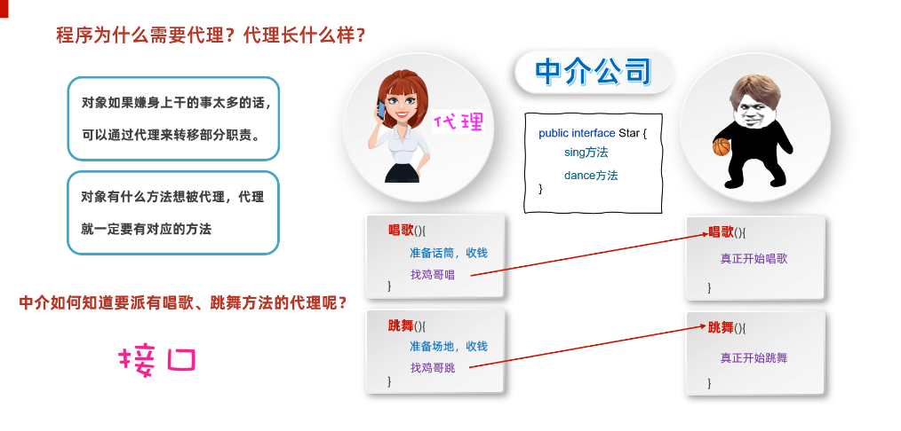

# 动态代理与反射

# 1. 动态代理

概念图：




## 1.1 好处：

​	无侵入式的给方法增强功能

>tips：
>
>无侵入式：指的是，不会在原有代码上进行修改，例如一个方法中，不会在往方法中写入新的代码，但是可以实现新添加的功能


调用者 ---> 代理 ---> 对象

>tips：
>
>不会直接调用对象方法，而是调用代理的方法，代理再调用对象方法(代理会进行一些操作)


## 1.2 动态代理三要素：

1，真正干活的对象

2，代理对象

3，利用代理调用方法

切记一点：代理可以增强或者拦截的方法都在接口中，接口需要写在newProxyInstance的第二个参数里。


示例图：


## 1.3 代码实现：

`ProxyUtil`类：

```java
package a01proxydemo1;

import java.lang.reflect.InvocationHandler;
import java.lang.reflect.Method;
import java.lang.reflect.Proxy;

/**
 * 作用：
 *  创建一个代理
 */
public class ProxyUtil {

    /**
     * 作用：
     *  给一个明星对象创建一个代理
     * @param bigStar 被代理的明星对象
     * @return 给明星的代理
     */
    public static Star createProxy(BigStar bigStar) {

        Star star = (Star) Proxy.newProxyInstance(
                ProxyUtil.class.getClassLoader(), // 参数一：用于指定用那个类加载器，去加载生成的代理类
                new Class[]{Star.class}, // 参数二：指定接口，这些接口用户指定代理张什么样子，如果多个接口，可以写在数组中

                // 参数三：用来指定生成的代理对象要干什么事情
                new InvocationHandler() {
                    /**
                     *
                     * @param proxy 代理的对象
                     * @param method 调用者要调用的方法
                     * @param args 调用者调用方法时传递的参数
                     * @return
                     * @throws Throwable
                     */
                    @Override
                    public Object invoke(Object proxy, Method method, Object[] args) throws Throwable {

                        // 代理做的前置操作
                        if("sing".equals(method)) {
                            // 如果运行的是sing唱歌方法
                            System.out.println("准备话筒，收钱");
                        } else if("dance".equals(method)) {
                            System.out.println("准备场地，收钱");
                        }

                        // 找真正的大明星(被代理对象),去唱歌跳舞(调用被代理对象身上的方法) 通过反射调用
                        return method.invoke(bigStar, args);
                    }
                }
        );


        return star;
    }
}

```


`Star`接口(定义要代理的方法)：

```java
public interface Star {
    //我们可以把所有想要被代理的方法定义在接口当中
    //唱歌
    public abstract String sing(String name);
    //跳舞
    public abstract void dance();
}
```


`BigStart`创建大明星的类：

```java
package a01proxydemo1;

public class BigStar implements Star{
    private String name;


    public BigStar() {
    }

    public BigStar(String name) {
        this.name = name;
    }


    // 唱
    @Override
    public String sing(String name) {
        System.out.println(this.name + "鸡哥正在唱" + name);
        return "谢谢";
    }

    // 跳
    @Override
    public void dance() {
        System.out.println(this.name + "正在跳舞");
    }


    /**
     * 获取
     * @return name
     */
    public String getName() {
        return name;
    }

    /**
     * 设置
     * @param name
     */
    public void setName(String name) {
        this.name = name;
    }

    public String toString() {
        return "BigStar{name = " + name + "}";
    }
}

```


`Test`类，里面有main主方法来运行：

```java
package a01proxydemo1;

public class Test {
    public static void main(String[] args) {
        /*
            需求：
                外界人想要找大明星唱一首歌
                1.获取代理的对象
                    代理对象 = ProxyUtil.createProxy(大明星对象);
                2.再调用代理对象的唱歌方法
                    代理对象.唱歌的方法("只因你太美~")
         */

        // 1.创建代理对象
        BigStar bigStar = new BigStar("鸡哥");
        Star proxy = ProxyUtil.createProxy(bigStar);


        // 2.调用代理对象的唱歌方法
        String result = proxy.sing("只因你太美");
        System.out.println(result);


        // 3.调用跳舞的方法
        proxy.dance();
    }
}

```


## 1.4 额外扩展

动态代理，还可以拦截方法

比如：

​	在这个故事中，经济人作为代理，如果别人让邀请大明星去唱歌，打篮球，经纪人就增强功能。

​	但是如果别人让大明星去扫厕所，经纪人就要拦截，不会去调用大明星的方法。

```java
/*
* 类的作用：
*       创建一个代理
* */
public class ProxyUtil {
    public static Star createProxy(BigStar bigStar){
        public static Object newProxyInstance(ClassLoader loader, Class<?>[] interfaces, InvocationHandler h)
        Star star = (Star) Proxy.newProxyInstance(
                ProxyUtil.class.getClassLoader(),
                new Class[]{Star.class},
                new InvocationHandler() {
                    @Override
                    public Object invoke(Object proxy, Method method, Object[] args) throws Throwable {
                        if("cleanWC".equals(method.getName())){
                            System.out.println("拦截，不调用大明星的方法");
                            return null;
                        }
                        //如果是其他方法，正常执行
                        return method.invoke(bigStar,args);
                    }
                }
        );
        return star;
    }
}
```

## 1.5 动态代理的练习

​	 对add方法进行增强，对remove方法进行拦截，对其他方法不拦截也不增强

```java
public class MyProxyDemo1 {
    public static void main(String[] args) {
        //动态代码可以增强也可以拦截
        //1.创建真正干活的人
        ArrayList<String> list = new ArrayList<>();

        //2.创建代理对象
        //参数一：类加载器。当前类名.class.getClassLoader()
        //                 找到是谁，把当前的类，加载到内存中了，我再麻烦他帮我干一件事情，把后面的代理类，也加载到内存

        //参数二：是一个数组，在数组里面写接口的字节码文件对象。
        //                  如果写了List，那么表示代理，可以代理List接口里面所有的方法，对这些方法可以增强或者拦截
        //                  但是，一定要写ArrayList真实实现的接口
        //                  假设在第二个参数中，写了MyInter接口，那么是错误的。
        //                  因为ArrayList并没有实现这个接口，那么就无法对这个接口里面的方法，进行增强或拦截
        //参数三：用来创建代理对象的匿名内部类
        List proxyList = (List) Proxy.newProxyInstance(
                //参数一：类加载器
                MyProxyDemo1.class.getClassLoader(),
                //参数二：是一个数组，表示代理对象能代理的方法范围
                new Class[]{List.class},
                //参数三：本质就是代理对象
                new InvocationHandler() {
                    @Override
                    //invoke方法参数的意义
                    //参数一：表示代理对象，一般不用（了解）
                    //参数二：就是方法名，我们可以对方法名进行判断，是增强还是拦截
                    //参数三：就是下面第三步调用方法时，传递的参数。
                    //举例1：
                    //list.add("阿玮好帅");
                    //此时参数二就是add这个方法名
                    //此时参数三 args[0] 就是 阿玮好帅
                    //举例2：
                    //list.set(1, "aaa");
                    //此时参数二就是set这个方法名
                    //此时参数三  args[0] 就是 1  args[1]"aaa"
                    public Object invoke(Object proxy, Method method, Object[] args) throws Throwable {
                        //对add方法做一个增强，统计耗时时间
                        if (method.getName().equals("add")) {
                            long start = System.currentTimeMillis();
                            //调用集合的方法，真正的添加数据
                            method.invoke(list, args);
                            long end = System.currentTimeMillis();
                            System.out.println("耗时时间：" + (end - start));
                            //需要进行返回，返回值要跟真正增强或者拦截的方法保持一致
                            return true;
                        }else if(method.getName().equals("remove") && args[0] instanceof Integer){
                            System.out.println("拦截了按照索引删除的方法");
                            return null;
                        }else if(method.getName().equals("remove")){
                            System.out.println("拦截了按照对象删除的方法");
                            return false;
                        }else{
                            //如果当前调用的是其他方法,我们既不增强，也不拦截
                            method.invoke(list,args);
                            return null;
                        }
                    }
                }
        );

        //3.调用方法
        //如果调用者是list，就好比绕过了第二步的代码，直接添加元素
        //如果调用者是代理对象，此时代理才能帮我们增强或者拦截

        //每次调用方法的时候，都不会直接操作集合
        //而是先调用代理里面的invoke，在invoke方法中进行判断，可以增强或者拦截
        proxyList.add("aaa");
        proxyList.add("bbb");
        proxyList.add("ccc");
        proxyList.add("ddd");

        proxyList.remove(0);
        proxyList.remove("aaa");


        //打印集合
        System.out.println(list);
    }
}
```


# 2. 反射

## 2.1 反射的概述：

​	简述：**反射允许对成员变量，成员方法和构造方法的信息进行编程访问**

​	

**专业的解释（了解一下）：**

​       是在运行状态中，对于任意一个类，都能够知道这个类的所有属性和方法；

​       对于任意一个对象，都能够调用它的任意属性和方法；

​       这种动态获取信息以及动态调用对象方法的功能称为Java语言的反射机制。


**通俗的理解：（掌握）**

* 利用**反射**创建的对象**可以无视修饰符**调用类里面的内容

* 可以跟**配置文件结合起来使用**，把要创建的对象信息和方法写在配置文件中。

  读取到什么类，就创建什么类的对象

  读取到什么方法，就调用什么方法

  此时当需求变更的时候不需要修改代码，只要修改配置文件即可。


## 2.2 反射的作用

示例图：


可以简单理解：

1. 有了反射，任何类的内容我都能拿到，而且拿到的东西很全很全

2. 结合配置文件就能够动态创建对象


## 2.3 学习反射到底学什么？

反射都是从class字节码文件中获取的内容。

* 如何获取class字节码文件的对象
* 利用反射如何获取构造方法（创建对象）
* 利用反射如何获取成员变量（赋值，获取值）
* 利用反射如何获取成员方法（运行）

## 2.4 获取字节码文件对象的三种方式

**什么时字节码文件和字节码文件对象？**

`java`文件：就是我们自己编写的`java`代码。

字节码文件：就是通过`java`文件编译之后的class文件（是在硬盘上真实存在的，用眼睛能看到的）

字节码文件对象：**当class文件加载到内存之后，虚拟机自动创建出来的对象。**

这个对象里面至少包含了：构造方法，成员变量，成员方法。


而我们的反射获取的是什么？**字节码文件对象，这个对象在内存中是唯一的。**


**获取字节码文件对象三种方式：**

1. Class这个类里面的静态方法`forName`（“全类名”）**（最常用）**

```
Class.forName("全类名")
```

2. 通过class属性获取  

```
类名.class
```

3. 通过对象获取字节码文件对象

```
对象.getClass
```


代码示例：

```java
package a02myreflect1;

public class MyReflectDemo1 {
    public static void main(String[] args) throws ClassNotFoundException {
        /**
         * 获取Class对象的三种方式
         *  1. Class.forName("全类名")
         *  2. 类名.class
         *  3. 对象.getClass
         */


        // 1.方式一获取Student的字节码对象
        // 全类名：包名 + 类名
      	// 最为常用
        Class clazz = Class.forName("a02myreflect1.Student");

        System.out.println(clazz);


        // 2.方式二
      	// 常常当作参数进行使用
        Class clazz2 = Student.class;
        System.out.println(clazz2);

        // 3.方式三
      	// 当已经有该类对象时，才能使用
        Student s = new Student();
        Class clazz3 = s.getClass();
        System.out.println(clazz3);
    }
}

```


>tips：
>
>方式一的配合idea一起使用
>
>输入全类名时：
>
>1.选中类名，然后选中copy -> copy reference，然后再复制过来就行
>
>


## 2.5 获取构造方法

规则：

​	get表示获取

​	Declared表示私有

​	最后的s表示所有，复数形式

​	如果当前获取到的是私有的，必须要临时修改访问权限，否则无法使用


| 方法名                                                       | 说明                              |
| ------------------------------------------------------------ | --------------------------------- |
| `Constructor<?>[] getConstructors()`                         | 获得所有的构造（只能public修饰）  |
| `Constructor<?>[] getDeclaredConstructors()`                 | 获得所有的构造（包含private修饰） |
| `Constructor<T> getConstructor(Class<?>... parameterTypes)`  | 获取指定构造（只能public修饰）    |
| `Constructor<T> getDeclaredConstructor(Class<?>... parameterTypes)` | 获取指定构造（包含private修饰）   |


代码示例：

```java
package a02myreflect2;

import java.lang.reflect.Constructor;

public class MyReflectDemo {

    public static void main(String[] args) throws ClassNotFoundException, NoSuchMethodException {


        // 1.先获取class字节码文件对象
        Class clazz = Class.forName("a02myreflect2.Student");

        // 2.获取构造方法
        // 获取所有构造(不包括private关键字)
        Constructor[] cons = clazz.getConstructors();

        for (Constructor con : cons) {
//            System.out.println(con);
        }

        // 获取所有构造(包含private关键字的)
        Constructor[] cons2 = clazz.getDeclaredConstructors();

        for (Constructor con : cons2) {
//            System.out.println(con);
        }


        // 获取单个构造（包含private的）
        // 没有写参数表示获取没有参数的那个构造
        Constructor con3 = clazz.getDeclaredConstructor();
//        System.out.println(con3);


        // 获取单个构造（包含private的）
        // 注意：这里的参数要和字节码文件对象中的构造对应起来（对应参数的字节码对象）
        Constructor con4 = clazz.getDeclaredConstructor(String.class);
//        System.out.println(con4);


        // 获取单个构造（这个方法只能获取public的）
        Constructor con5 = clazz.getConstructor();
//        System.out.println(con5);


        // 获取多个参数的
        Constructor con6 = clazz.getDeclaredConstructor(String.class, int.class);
        System.out.println(con6);


        // 获取权限修饰符
        int modifiers = con6.getModifiers();
        System.out.println(modifiers);
    }
}

```


**获取构造方法的修饰符：**

通过上面的方法获取到构造方法后，可以调用`getModifiers()`方法返回修饰符，返回的是一个整数

反射常量字段值:(可以去`JDK`说明文档李查，常量字符值)

| 修饰符   | int值 |
| -------- | ----- |
| ABSTRACT | 1024  |
| FINAL    | 16    |
| PRIVATE  | 2     |
| PUBLIC   | 1     |
| STATIC   | 2048  |

代码示例：

```java
// 获取构造函数
Constructor con6 = clazz.getDeclaredConstructor(String.class, int.class);

// 获取权限修饰符
int modifiers = con6.getModifiers();
System.out.println(modifiers);
```


**获取构造对应的所有参数：**

通过getParameters方法获取，还有很多关于参数的方法就不一一解释了

代码示例：

```java
// 获取多个参数的
Constructor con6 = clazz.getDeclaredConstructor(String.class, int.class);
System.out.println(con6);

// 获取构造所有参数
Parameter[] parameters = con6.getParameters();
System.out.println(Arrays.toString(parameters));
```


## 2.6 获取构造方法并创建对象

涉及到的方法：`newInstance()`

获取到对应的构造后，我们就可以通过`newInstance`方法来创建对象

代码示例：

```java
package a02myreflect2;

import java.lang.reflect.Constructor;
import java.lang.reflect.InvocationTargetException;
import java.lang.reflect.Parameter;
import java.util.Arrays;

public class MyReflectDemo {

    public static void main(String[] args) throws ClassNotFoundException, NoSuchMethodException, InvocationTargetException, InstantiationException, IllegalAccessException {
		
        // 1.先获取class字节码文件对象
        Class clazz = Class.forName("a02myreflect2.Student");
        // 获取多个参数的构造
        Constructor con6 = clazz.getDeclaredConstructor(String.class, int.class);
        
        // 注意由于我们获取到的构造是一个私有的，不能在外面使用，所以要加一行代码
        con6.setAccessible(true); // 临时取消修饰符private的校验
        Student stu = (Student) con6.newInstance("嘻嘻", 18);
        System.out.println(stu);
    }
}

```


`Student`类的代码：

```java
package a02myreflect2;

public class Student {
    private String name;
    private int age;

    public Student() {
    }

    public Student(String name) {
        this.name = name;
    }

    protected Student(int age) {
        this.age = age;
    }

    private Student(String name, int age) {
        this.name = name;
        this.age = age;
    }

    /**
     * 获取
     * @return name
     */
    public String getName() {
        return name;
    }

    /**
     * 设置
     * @param name
     */
    public void setName(String name) {
        this.name = name;
    }

    /**
     * 获取
     * @return age
     */
    public int getAge() {
        return age;
    }

    /**
     * 设置
     * @param age
     */
    public void setAge(int age) {
        this.age = age;
    }

    public String toString() {
        return "Student{name = " + name + ", age = " + age + "}";
    }
}

```


## 2.7 获取成员变量

规则：

​	get表示获取

​	Declared表示私有

​	最后的s表示所有，复数形式

​	如果当前获取到的是私有的，必须要临时修改访问权限，否则无法使用


方法名：

| 方法名                                | 说明                                         |
| ------------------------------------- | -------------------------------------------- |
| `Field[] getFields()`                 | 返回所有成员变量对象的数组（只能拿public的） |
| `Field[] getDeclaredFields()`         | 返回所有成员变量对象的数组，存在就能拿到     |
| `Field getField(String name)`         | 返回单个成员变量对象（只能拿public的）       |
| `Field getDeclaredField(String name)` | 返回单个成员变量对象，存在就能拿到           |


代码示例：

```java
package a03myreflect3;

import java.lang.reflect.Field;

public class MyReflectDemo {

    public static void main(String[] args) throws ClassNotFoundException, NoSuchFieldException, IllegalAccessException {


        // 1.先获取Class字节码文件对象
        Class clazz = Class.forName("a03myreflect3.Student");


        // 2.获取成员变量
        // 获取所有(只包含public的)
        Field[] fields = clazz.getFields();
        for (Field field : fields) {
//            System.out.println(field);
        }


        // 获取所有(包括private的)
        Field[] fields2 = clazz.getDeclaredFields();
        for (Field field : fields2) {
//            System.out.println(field);
        }

        // 获取单个(只能获取public的) gender
        Field gender = clazz.getField("gender");
        System.out.println(gender);

        // 获取单个包括private的
        Field name = clazz.getDeclaredField("name");
        System.out.println(name);


        // 获取修饰符
        int modifiers = name.getModifiers();
        System.out.println(modifiers);

        // 获取成员变量名字
        String n = name.getName();
        System.out.println(n);

        // 获取成会员变量数据类型
        Class<?> type = name.getType();
        System.out.println(type);


        // 获取成员变量中记录的值
        Student stu = new Student("张三", 18, "男");
        name.setAccessible(true); // 由于name属性时private的我们临时取消一下权限
        Object value = name.get(stu);
        System.out.println(value);


        // 还能修改成员变量中的值
        System.out.println("修改前" + stu);
        name.set(stu, "李四");
        System.out.println("修改后" +stu);
    }
}

```


`Student`类的代码：

```java
package a03myreflect3;

public class Student {
    private String name;
    private int age;
    public String gender;


    public Student() {
    }

    public Student(String name, int age, String gender) {
        this.name = name;
        this.age = age;
        this.gender = gender;
    }

    /**
     * 获取
     * @return name
     */
    public String getName() {
        return name;
    }

    /**
     * 设置
     * @param name
     */
    public void setName(String name) {
        this.name = name;
    }

    /**
     * 获取
     * @return age
     */
    public int getAge() {
        return age;
    }

    /**
     * 设置
     * @param age
     */
    public void setAge(int age) {
        this.age = age;
    }

    /**
     * 获取
     * @return gender
     */
    public String getGender() {
        return gender;
    }

    /**
     * 设置
     * @param gender
     */
    public void setGender(String gender) {
        this.gender = gender;
    }

    public String toString() {
        return "Student{name = " + name + ", age = " + age + ", gender = " + gender + "}";
    }
}

```


## 2.8 获取成员变量并获取值和修改值

| 方法                                | 说明   |
| ----------------------------------- | ------ |
| void set(Object obj, Object value） | 赋值   |
| Object get(Object obj)              | 获取值 |

代码示例：(**`Student`类和上面的一样**)

```java
public class ReflectDemo5 {
    public static void main(String[] args) throws ClassNotFoundException, NoSuchFieldException, IllegalAccessException {
        Student s = new Student("zhangsan",23,"广州");
        Student ss = new Student("lisi",24,"北京");

        //需求：
        //利用反射获取成员变量并获取值和修改值

        //1.获取class对象
        Class clazz = Class.forName("com.itheima.reflectdemo.Student");

        //2.获取name成员变量
        //field就表示name这个属性的对象
        Field field = clazz.getDeclaredField("name");
        //临时修饰他的访问权限
        field.setAccessible(true);

        //3.设置(修改)name的值
        //参数一：表示要修改哪个对象的name？
        //参数二：表示要修改为多少？
        field.set(s,"wangwu");

        //3.获取name的值
        //表示我要获取这个对象的name的值
        String result = (String)field.get(s);

        //4.打印结果
        System.out.println(result);

        System.out.println(s);
        System.out.println(ss);

    }
}

```

## 2.9 获取成员方法(重点)

规则：

​	get表示获取

​	Declared表示私有

​	最后的s表示所有，复数形式

​	如果当前获取到的是私有的，必须要临时修改访问权限，否则无法使用

| 方法名                                                       | 说明                                         |
| ------------------------------------------------------------ | -------------------------------------------- |
| `Method[] getMethods()`                                      | 返回所有成员方法对象的数组（只能拿public的） |
| `Method[] getDeclaredMethods()`                              | 返回所有成员方法对象的数组，存在就能拿到     |
| `Method getMethod(String name, Class<?>... parameterTypes)`  | 返回单个成员方法对象（只能拿public的）       |
| `Method getDeclaredMethod(String name, Class<?>... parameterTypes)` | 返回单个成员方法对象，存在就能拿到           |

代码示例：

```java
package a04myreflect4;

import java.lang.reflect.InvocationTargetException;
import java.lang.reflect.Method;
import java.lang.reflect.Parameter;
import java.util.Arrays;

public class MyReflectDemo {
    public static void main(String[] args) throws ClassNotFoundException, NoSuchMethodException, InvocationTargetException, IllegalAccessException {


        // 1.获取class字节码文件对象
        Class clazz = Class.forName("a04myreflect4.Student");

        // 2.获取里面所有的方法对象(会包含父类中所有的公共方法)
//        Method[] methods = clazz.getMethods();
//        for (Method method : methods) {
//            System.out.println(method);
//        }


        // 获取所有修饰符方法（不能获取父类中的方法）
//        Method[] declaredMethods = clazz.getDeclaredMethods();
//        for (Method declaredMethod : declaredMethods) {
//            System.out.println(declaredMethod);
//        }


        // 获取单个方法
        Method eat = clazz.getDeclaredMethod("eat", String.class);
        System.out.println("eat方法" + eat);


        // 获取方法的修饰符
        int modifiers = eat.getModifiers();
        System.out.println(modifiers); // 2: private

        String name = eat.getName();
        System.out.println(name);


        // 获取方法形参
        Parameter[] parameters = eat.getParameters();
        System.out.println(Arrays.toString(parameters));

        // 获取方法抛出的异常
        Class[] exceptionTypes = eat.getExceptionTypes();
        System.out.println(Arrays.toString(exceptionTypes));


        // 调用获取到的方法
        Student stu = new Student("张三", 18);
        eat.setAccessible(true); // 临时取消private访问限制
        eat.invoke(stu, "米饭");
    }
}

```

## 2.10 获取成员方法并运行(重点)

方法

 Object invoke(Object obj, Object... args) ：运行方法

参数一：用obj对象调用该方法

参数二：调用方法的传递的参数（如果没有就不写）

返回值：方法的返回值（如果没有就不写）

代码示例：

```java
package com.itheima.a02reflectdemo1;

import java.lang.reflect.InvocationTargetException;
import java.lang.reflect.Method;

public class ReflectDemo6 {
    public static void main(String[] args) throws ClassNotFoundException, NoSuchMethodException, InvocationTargetException, IllegalAccessException {
        //1.获取字节码文件对象
        Class clazz = Class.forName("com.itheima.a02reflectdemo1.Student");
		
        //2.获取一个对象
        //需要用这个对象去调用方法
        Student s = new Student();
        
        //3.获取一个指定的方法
        //参数一：方法名
        //参数二：参数列表，如果没有可以不写
        Method eatMethod = clazz.getMethod("eat",String.class);
        
        //运行
        //参数一：表示方法的调用对象
        //参数二：方法在运行时需要的实际参数
        //注意点：如果方法有返回值，那么需要接收invoke的结果
        //如果方法没有返回值，则不需要接收
        String result = (String) eatMethod.invoke(s, "重庆小面");
        System.out.println(result);

    }
}


public class Student {
    private String name;
    private int age;
    public String gender;
    public String address;


    public Student() {

    }

    public Student(String name) {
        this.name = name;
    }

    private Student(String name, int age) {
        this.name = name;
        this.age = age;
    }

    /**
     * 获取
     * @return name
     */
    public String getName() {
        return name;
    }

    /**
     * 设置
     * @param name
     */
    public void setName(String name) {
        this.name = name;
    }

    /**
     * 获取
     * @return age
     */
    public int getAge() {
        return age;
    }

    /**
     * 设置
     * @param age
     */
    public void setAge(int age) {
        this.age = age;
    }

    public String toString() {
        return "Student{name = " + name + ", age = " + age + "}";
    }

    private void study(){
        System.out.println("学生在学习");
    }

    private void sleep(){
        System.out.println("学生在睡觉");
    }

    public String eat(String something){
        System.out.println("学生在吃" + something);
        return "学生已经吃完了，非常happy";
    }
}
```

## 面试题：

​	你觉得反射好不好？好，有两个方向

​	第一个方向：无视修饰符访问类中的内容。但是这种操作在开发中一般不用，都是框架底层来用的。

​	第二个方向：反射可以跟配置文件结合起来使用，动态的创建对象，动态的调用方法。

## 2.11 练习泛型擦除（掌握概念，了解代码）

理解：（掌握）

​	集合中的泛型只在java文件中存在，当编译成class文件之后，就没有泛型了。

代码示例：（了解）

```java
package com.itheima.reflectdemo;

import java.lang.reflect.InvocationTargetException;
import java.lang.reflect.Method;
import java.util.ArrayList;

public class ReflectDemo8 {
    public static void main(String[] args) throws NoSuchMethodException, InvocationTargetException, IllegalAccessException {
        //1.创建集合对象
        ArrayList<Integer> list = new ArrayList<>();
        list.add(123);
//        list.add("aaa");

        //2.利用反射运行add方法去添加字符串
        //因为反射使用的是class字节码文件

        //获取class对象
        Class clazz = list.getClass();

        //获取add方法对象
        Method method = clazz.getMethod("add", Object.class);

        //运行方法
        method.invoke(list,"aaa");

        //打印集合
        System.out.println(list);
    }
}

```

## 2.12 练习：修改字符串的内容（掌握概念，了解代码）

在这个练习中，我需要你掌握的是字符串不能修改的真正原因。

字符串，在底层是一个byte类型的字节数组，名字叫做value

```java
private final byte[] value;
```

真正不能被修改的原因：final和private

final修饰value表示value记录的地址值不能修改。

private修饰value而且没有对外提供getvalue和setvalue的方法。所以，在外界不能获取或修改value记录的地址值。

如果要强行修改可以用反射：

代码示例：（了解）

```java
String s = "abc";
String ss = "abc";
// private final byte[] value= {97,98,99};
// 没有对外提供getvalue和setvalue的方法，不能修改value记录的地址值
// 如果我们利用反射获取了value的地址值。
// 也是可以修改的，final修饰的value
// 真正不可变的value数组的地址值，里面的内容利用反射还是可以修改的，比较危险

//1.获取class对象
Class clazz = s.getClass();

//2.获取value成员变量（private）
Field field = clazz.getDeclaredField("value");
//但是这种操作非常危险
//JDK高版本已经屏蔽了这种操作，低版本还是可以的
//临时修改权限
field.setAccessible(true);

//3.获取value记录的地址值
byte[] bytes = (byte[]) field.get(s);
bytes[0] = 100;

System.out.println(s);//dbc
System.out.println(ss);//dbc
```

## 2.13 练习，反射和配置文件结合动态获取的练习（重点）

需求: 利用反射根据文件中的不同类名和方法名，创建不同的对象并调用方法。

分析:

①通过Properties加载配置文件

②得到类名和方法名

③通过类名反射得到Class对象

④通过Class对象创建一个对象

⑤通过Class对象得到方法

⑥调用方法

代码示例：

```java
package test2;

import java.io.FileInputStream;
import java.io.IOException;
import java.lang.reflect.Constructor;
import java.lang.reflect.InvocationTargetException;
import java.lang.reflect.Method;
import java.util.Properties;

public class MyReflectDemo {
    public static void main(String[] args) throws IOException, ClassNotFoundException, NoSuchMethodException, InvocationTargetException, InstantiationException, IllegalAccessException {
        /*
            反射和配置文件结合的方式，动态创建对象，并调用方法
         */

        // 1.读取配置文件
        Properties prop = new Properties();
        FileInputStream fis = new FileInputStream("day35-code\\src\\test2\\prop.properties");
        prop.load(fis); // 将配置文件信息读取到prop中
        fis.close();
        System.out.println(prop);


        // 2.获取全类名
        String className = (String) prop.get("classname");
        String methodName = (String) prop.get("method");

//        System.out.println(className);
//        System.out.println(methodName);


        // 3.获取字节码文件对象
        Class clazz = Class.forName(className);

        // 4.获取构造方法(空参构造)
        Constructor con = clazz.getDeclaredConstructor();
        con.setAccessible(true); // 暂时取消修饰符限制
        Object o = con.newInstance();
//        System.out.println("配置文件创建出的对象" + o);

        // 5.获取成员方法并允许
        Method method = clazz.getDeclaredMethod(methodName);
        method.setAccessible(true);// 暂时取消修饰符限制

        // 调用成员方法
        method.invoke(o);
			
      	// 直接修改prop.properties文件，修改为Teacher类，输出的就是老师的内容
    }
}

```


`prop.properties`文件内容：

```
classname=test2.Student
method=study
```


`Student`类内容：

```java
package test2;

public class Student {
    private String name;
    private int age;


    public Student() {
    }

    public Student(String name, int age) {
        this.name = name;
        this.age = age;
    }

    public void study() {
        System.out.println("学生正在学习");
    }

    /**
     * 获取
     * @return name
     */
    public String getName() {
        return name;
    }

    /**
     * 设置
     * @param name
     */
    public void setName(String name) {
        this.name = name;
    }

    /**
     * 获取
     * @return age
     */
    public int getAge() {
        return age;
    }

    /**
     * 设置
     * @param age
     */
    public void setAge(int age) {
        this.age = age;
    }

    public String toString() {
        return "Student{name = " + name + ", age = " + age + "}";
    }
}

```


`Teacher`类中内容：

```java
package test2;

public class Teacher {
    private String name;
    private double salary;


    public Teacher() {
    }

    public Teacher(String name, double salary) {
        this.name = name;
        this.salary = salary;
    }

    public void teach() {
        System.out.println("老师正在教书");
    }

    /**
     * 获取
     * @return name
     */
    public String getName() {
        return name;
    }

    /**
     * 设置
     * @param name
     */
    public void setName(String name) {
        this.name = name;
    }

    /**
     * 获取
     * @return salary
     */
    public double getSalary() {
        return salary;
    }

    /**
     * 设置
     * @param salary
     */
    public void setSalary(double salary) {
        this.salary = salary;
    }

    public String toString() {
        return "Teacher{name = " + name + ", salary = " + salary + "}";
    }
}

```


## 2.14 利用发射保存对象中的信息（重点）

```java
package test1;

import java.io.BufferedWriter;
import java.io.FileWriter;
import java.io.IOException;
import java.lang.reflect.Field;

public class Test {
    public static void main(String[] args) throws IllegalAccessException, IOException {

        // 利用反射，将学生对象和老师对象中的成员变量，写入到文件中
        // 写入格式：
        // name=xxx
        // age=xxx
        // ...

        Student stu = new Student("砂狼白子", 18, "女", "骑自行车");
        Teacher t = new Teacher("钱不二", 24);

        saveObj(stu);
    }

    private static void saveObj(Object obj) throws IllegalAccessException, IOException {
        Class clazz = obj.getClass();

        // 获取所有的成员变量
        Field[] fields = clazz.getDeclaredFields();

        BufferedWriter bw = new BufferedWriter(new FileWriter("day35-code\\src\\info.txt"));

        for (Field field : fields) {
            // 暂时取消修饰符限制
            field.setAccessible(true);

            String name = field.getName();
            Object value = field.get(obj);

            bw.write(name + "=" + value);
            bw.newLine();
        }
        // 释放资源
        bw.close();
    }
}

```


`Student`类中的代码：

```java
package test1;

public class Student {
    private String name;
    private int age;
    private String gender;
    private String hobby;


    public Student() {
    }

    public Student(String name, int age, String gender, String hobby) {
        this.name = name;
        this.age = age;
        this.gender = gender;
        this.hobby = hobby;
    }

    /**
     * 获取
     * @return name
     */
    public String getName() {
        return name;
    }

    /**
     * 设置
     * @param name
     */
    public void setName(String name) {
        this.name = name;
    }

    /**
     * 获取
     * @return age
     */
    public int getAge() {
        return age;
    }

    /**
     * 设置
     * @param age
     */
    public void setAge(int age) {
        this.age = age;
    }

    /**
     * 获取
     * @return gender
     */
    public String getGender() {
        return gender;
    }

    /**
     * 设置
     * @param gender
     */
    public void setGender(String gender) {
        this.gender = gender;
    }

    /**
     * 获取
     * @return hobby
     */
    public String getHobby() {
        return hobby;
    }

    /**
     * 设置
     * @param hobby
     */
    public void setHobby(String hobby) {
        this.hobby = hobby;
    }

    public String toString() {
        return "Student{name = " + name + ", age = " + age + ", gender = " + gender + ", hobby = " + hobby + "}";
    }
}

```


`Teacher`类中的代码：

```java
package test1;

public class Teacher {
    private String name;
    private int age;


    public Teacher() {
    }

    public Teacher(String name, int age) {
        this.name = name;
        this.age = age;
    }

    /**
     * 获取
     * @return name
     */
    public String getName() {
        return name;
    }

    /**
     * 设置
     * @param name
     */
    public void setName(String name) {
        this.name = name;
    }

    /**
     * 获取
     * @return age
     */
    public int getAge() {
        return age;
    }

    /**
     * 设置
     * @param age
     */
    public void setAge(int age) {
        this.age = age;
    }

    public String toString() {
        return "Teacher{name = " + name + ", age = " + age + "}";
    }
}

```

