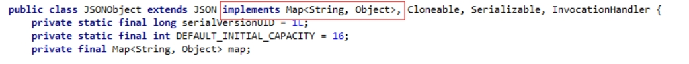
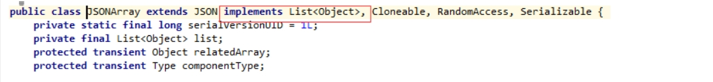

# fastjson

## 简介

Fastjson是一个json处理工具包，包括“序列化”和“反序列化”两部分，它具备如下特征：

1. 速度最快，测试表明，fastjson具有极快的性能，超越任其他的java json parser。包括自称最快的jackson。
2. 功能强大，完全支持java bean、集合、Map、日期、Enum，支持范型，支持自省。
3. 无依赖，能够直接运行在Java SE 5.0以上版本
4. 支持Android。
5. 开源 (Apache 2.0)


自己作为一个前端开发人员，在JavaScript中，json的转换很容易，因为js自带了JSON工具类，里面最常用的两个方法`JSON.stringify()`和`JSON.parse()`，来帮助我们转换成JSON字符串。

**那么在Java中我们可以使用阿里开源的JSON处理工具来帮助我们转换JSON**。

java中，构建JSON字符串可以有下面两种：

1. Java对象 ---> 直接调用转换方法
2. 创建JSON对象 ---> 调用转换方法


**以下内容均来自菜鸟教程，仅仅记录的常用内容，更详细内容请在菜鸟教程中查看**


## 使用

配置maven依赖：

```xml
<dependency>
    <groupId>com.alibaba</groupId>
    <artifactId>fastjson</artifactId>
    <version>x.x.x</version>
</dependency>
```


### 将 Java 对象转换为 JSON 格式

方法：`JSON.toJSONString()`

作用：可以使用 JSON.toJSONString() 将 Java 对象转换换为 JSON 对象


示例：

定义以下 Person JavaBean:

```java
public class Person {
     
    @JSONField(name = "AGE")
    private int age;
 
    @JSONField(name = "FULL NAME")
    private String fullName;
 
    @JSONField(name = "DATE OF BIRTH")
    private Date dateOfBirth;
 
    public Person(int age, String fullName, Date dateOfBirth) {
        super();
        this.age = age;
        this.fullName= fullName;
        this.dateOfBirth = dateOfBirth;
    }
 
    // 标准 getters & setters
}
```


转换：

```java
private List<Person> listOfPersons = new ArrayList<Person>();
 
@Before
public void setUp() {
    listOfPersons.add(new Person(15, "John Doe", new Date()));
    listOfPersons.add(new Person(20, "Janette Doe", new Date()));
}
 
@Test
public void whenJavaList_thanConvertToJsonCorrect() {
    String jsonOutput= JSON.toJSONString(listOfPersons);
}
```


结果：

```java
[  
    {  
        "AGE":15,
        "DATE OF BIRTH":1468962431394,
        "FULL NAME":"John Doe"
    },
    {  
        "AGE":20,
        "DATE OF BIRTH":1468962431394,
        "FULL NAME":"Janette Doe"
    }
]
```

我们还可以自定义输出，并控制字段的排序，日期显示格式，序列化标记等。

接下来我们更新 bean 并添加几个字段：

```java
@JSONField(name="AGE", serialize=false)
private int age;
 
@JSONField(name="LAST NAME", ordinal = 2)
private String lastName;
 
@JSONField(name="FIRST NAME", ordinal = 1)
private String firstName;
 
@JSONField(name="DATE OF BIRTH", format="dd/MM/yyyy", ordinal = 3)
private Date dateOfBirth;
```

以上代码中我们列出了基本参数类别，并使用 @JSONField 注解，以便实现自定义转换：

- **format** 参数用于格式化 *date* 属性。
- 默认情况下， FastJson 库可以序列化 Java bean 实体， 但我们可以使用 **serialize** 指定字段不序列化。
- 使用 **ordinal** 参数指定字段的顺序

这样，以上输出结果为：

```java
[
    {
        "FIRST NAME":"Doe",
        "LAST NAME":"Jhon",
        "DATE OF BIRTH":"19/07/2016"
    },
    {
        "FIRST NAME":"Doe",
        "LAST NAME":"Janette",
        "DATE OF BIRTH":"19/07/2016"
    }
]
```


### JSON 字符串转换为 Java 对象

方法：`JSON.parseObject(指定对象, 指定对象.class)`


示例：

```java
@Test
public void whenJson_thanConvertToObjectCorrect() {
    Person person = new Person(20, "John", "Doe", new Date());
    String jsonObject = JSON.toJSONString(person);
    Person newPerson = JSON.parseObject(jsonObject, Person.class);
     
    assertEquals(newPerson.getAge(), 0); // 如果我们设置系列化为 false
    assertEquals(newPerson.getFullName(), listOfPersons.get(0).getFullName());
}
```

我们可以使用 JSON.parseObject() 将 JSON 字符串转换为 Java 对象。

注意反序列化时为对象时，必须要有默认无参的构造函数，否则会报异常:

```java
com.alibaba.fastjson.JSONException: default constructor not found.
```

以下是简单的实例测试：

```java
Person [age=20, fullName=John Doe, dateOfBirth=Wed Jul 20 08:51:12 WEST 2016]
```


### 创建 JSON 对象

创建 JSON 对象非常简单，只需使用 JSONObject（fastJson提供的json对象） 和 JSONArray（fastJson提供json数组对象） 对象即可。

我们可以把**JSONObject 当成一个 Map<String,Object> 来看**，只是 JSONObject 提供了更为丰富便捷的方法，方便我们对于对象属性的操作。我们看一下源码。



同样我们可以把** JSONArray 当做一个 List<Object>**，可以把 JSONArray 看成 JSONObject 对象的一个集合。




示例：

```java
@Test
public void whenGenerateJson_thanGenerationCorrect() throws ParseException {
    JSONArray jsonArray = new JSONArray();
    for (int i = 0; i < 2; i++) {
        JSONObject jsonObject = new JSONObject();
        jsonObject.put("AGE", 10);
        jsonObject.put("FULL NAME", "Doe " + i);
        jsonObject.put("DATE OF BIRTH", "2016/12/12 12:12:12");
        jsonArray.add(jsonObject);
    }
    String jsonOutput = jsonArray.toJSONString();
}
```


输出结果：

```java
[
   {
      "AGE":"10",
      "DATE OF BIRTH":"2016/12/12 12:12:12",
      "FULL NAME":"Doe 0"
   },
   {
      "AGE":"10",
      "DATE OF BIRTH":"2016/12/12 12:12:12",
      "FULL NAME":"Doe 1"
   }
]
```

