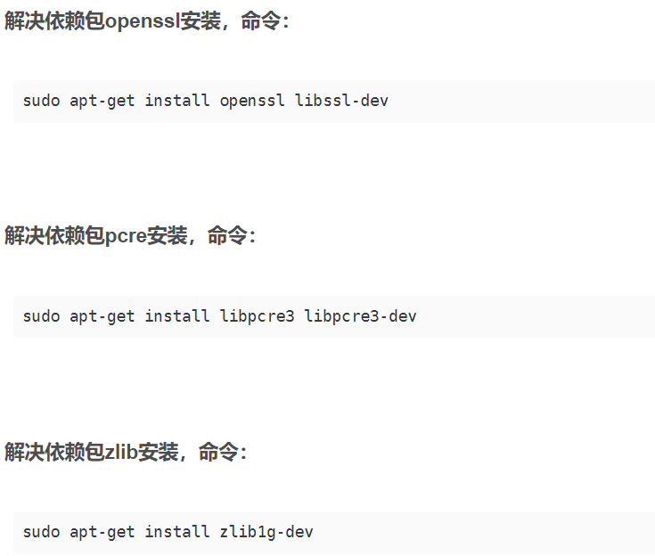
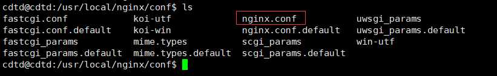
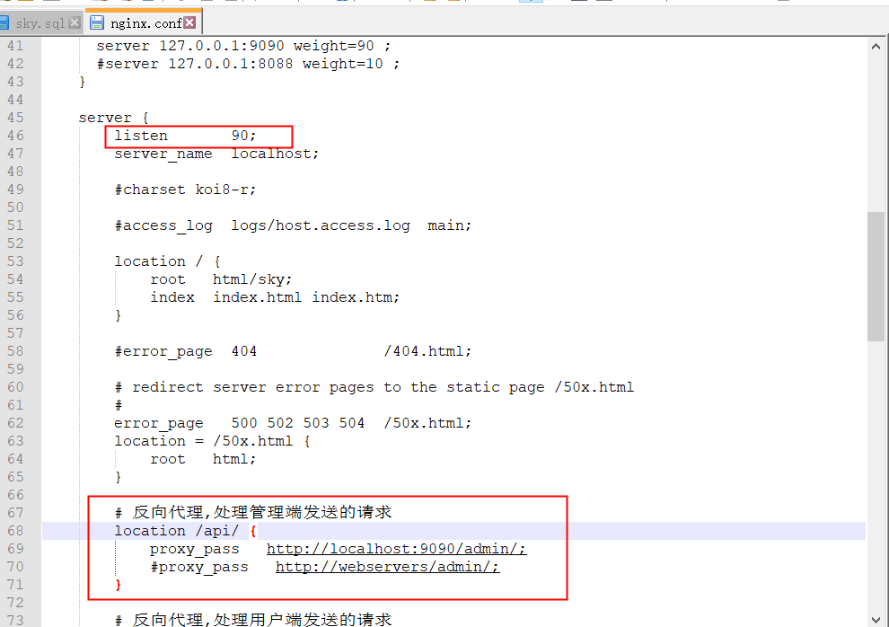
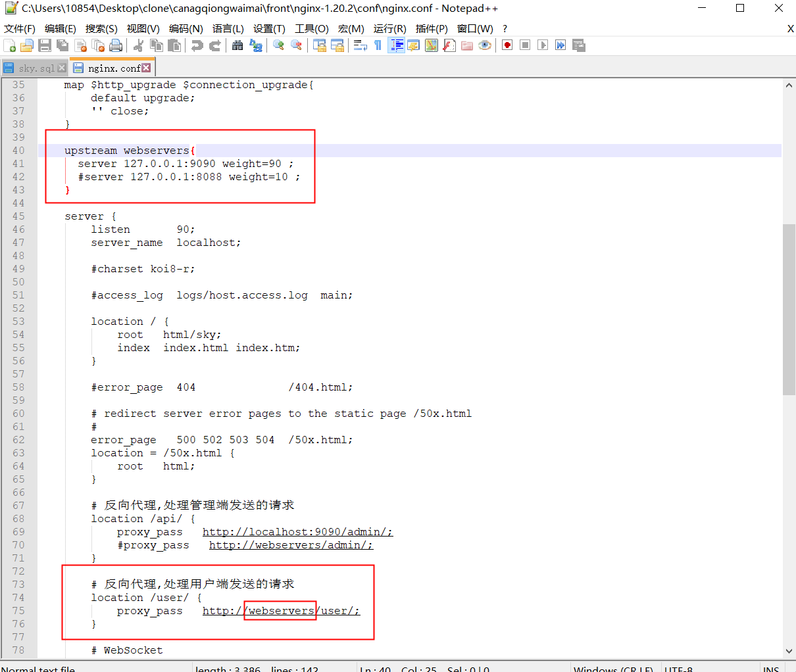
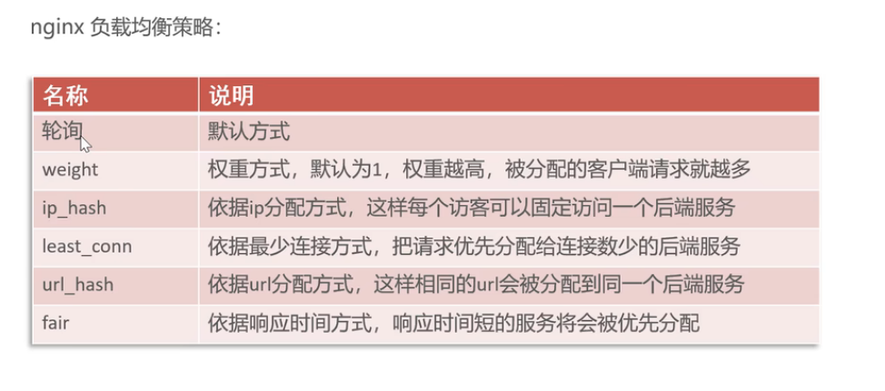

# nginx

nginx需要的软件

1：pcre

PCRE库支持正则表达式。如果我们在配置文件nginx.conf中使用了正则表达式，那么在编译Nginx时就必须把PCRE库编译进Nginx，因为Nginx的HTTP模块需要靠它来解析正则表达式。另外，pcre-devel是使用PCRE做二次开发时所需要的开发库，包括头文件等，这也是编译Nginx所必须使用的

第一步下载并解压pcre

```
tar -jxvf pcre-8.45.tar.bz2
```

第二步：进入解压好的pcre文件夹，运行./configure

```
cd pcre-8.45/

./configure
```

第三步：使用命令make && make install

```
make && make install
```

最后：查看版本号，检查是否安装完毕

```
pcre-config --version
```


如果上述命令失败需要安装一个gcc

```
yum install -y gcc gcc-c++
```

还可以直接删除文件夹重新操作

```
rm -rf 文件夹
```


2：zlib库

zlib库用于对HTTP包的内容做gzip格式的压缩，如果我们在nginx.conf中配置了gzip on，并指定对于某些类型（content-type）的HTTP响应使用gzip来进行压缩以减少网络传输量，则在编译时就必须把zlib编译进Nginx。zlib-devel是二次开发所需要的库

3：OpenSSl库

如果服务器不只是要支持HTTP，还需要在更安全的SSL协议上传输HTTP，那么需要拥有OpenSSL。另外，如果我们想使用MD5、SHA1等散列函数，那么也需要安装它

直接运行

```
yum -y install make zlib zlib-devel gcc-c++ libtool openssl openssl-devel
```

如果是Ubuntu系统




**最后才安装nginx**

第一步解压nginx文件

第二步进入解压好的nginx文件

第三步运行`./configure`

第四步`make && make install`（这一步可以分开）

```
make

make install

如果权限不够 ubuntu系统
sudo make
sudo make install
```


安装完毕后：一般在/usr/local下会有一个nginx文件夹，然后nginx的启动命令在`nginx/sbin`中

```
启动命令
./nginx
```

有时候需要开放端口，防火墙的原因

```
查看开放端口号
firewall-cmd --list-all

设置开开放的端口号
sudo firewall-cmd --add-port=8001/tcp --permanent

重启防火墙
firewall-cmd --reload
```

## nginx的命令

**要运行命令首先要进入`/usr/local/nginx/sbin`目录下**

查看nginx的版本号

```
./nginx -v
```


查看当前nginx进程状态

```
ps -ef | grep nginx
```


启动nginx

```
./nginx
```


关闭nginx

```
./nginx -s stop
```


重新加载nginx（修改配置文件后，重新加载生效）

```
./nginx -s reload
```


指定想要nginx配置文件位置

```
./nginx -c 想要指定的nginx.conf位置
```

如果遇到`nginx: [error] open() ＂/usr/local/nginx/logs/nginx.pid＂ failed`问题就可以使用以上命令指定一下nginx.conf位置


检查配置文件是否出错

```
./nginx -t nginx.conf配置文件位置
```


## nginx 配置文件

nginx的配置文件一般在`/usr/local/nginx/conf/nginx.conf`中（安装成功的前提）




文件中#开头的是注释

**nginx.conf配置文件主要分三部分**

### 第一部分：全局块

从配置文件开始到events块之间的内容，主要会设置一些影响nginx服务器整体运行的配置质量，主要包括配置运行Nginx服务器的用户(组)、允许生产的worker process数，进程PID存放路径、日志存放路径和类型以及配置文件的引入


例如：worker_processes处理并发数量，值越大，nginx处理并发数量越多。


### 第二部分：events块

events块设计的指令主要影响Nginx服务器与用户的网络连接

例如：


表示每个worker process支持的最大连接数为 1024


### **第三部分：http块**

Nginx服务器配置中最频繁的部分，http块内又分为两部分。

#### 1：http全局块

http全局块配置的指令包括文件引入、MIME-TYPE定义、日志自定义、连接超时时间、单连接请求书上限

#### 2：server块（经常修改的）

每个http块可以包含多个server块，而每个server块就相当于一个虚拟主机。

## 反向代理

**正向代理**：在客户端（浏览器）配置代理服务器，通过代理服务器进行互联网访问。

 正向代理隐藏了客户端

**反向代理**：我们只需要将请求发送给代理服务器，由反向代理服务器去选择目标服务器获取数据，再返回给客户端，此时反向代理服务器和目标服务器对外就是一个服务器，暴露的是代理服务器的地址，隐藏真实大的服务器IP地址。

反向代理隐藏了服务器端


两者的区别：正向代理代理的对象是客户端，反向代理代理的对象是服务端


### 反向代理配置

直接上图片：



核心：

1. 是上面的`listen`，是当前nginx服务监听的端口号（90），前端代码发出请求的端口号
2. 是下面的`location /api/`是指定前端发出的那些接口需要被反向代理，这里的意思是，如果接口中包含`/api`就会被反向代理
3. `proxy_pass`用来配置具体到底转发到那个地址上


示例：

例如前端现在发送出一个登录接口为:

```
http://localhost:90/api/employee/login
```

>注意：当前我是在测试，所以nginx和前端代码都是跑在本地的


然后nginx服务就会监听到这个请求，并且发现端口号后面跟着`/api`，就会将请求转发到：

```
http://localhost:9090/admin/employee/login
```

>也就是location中配置的proxy_pass的地址


## 负载均衡

简单来说，就是能够将服务很均匀的发送给多个服务器，一般都是当后端服务访问量较大，会考虑将服务部署在多台服务器上，然后通过nginx代理转发到多台服务器上。

简介：


### 负载均衡配置

直接上图片：




核心：

1. 任然在server模块中配置
2. 使用了上面的反向代理功能
3. 就是配置了多个反向代理的地址而已

**第一步：通过`upstream`配置多个服务器的地址，第二步通过location的proxy_pass进行反向代理即可**


解释：

```
upstream webservers{
  server 127.0.0.1:9090 weight=90 ;
  #server 127.0.0.1:8088 weight=10 ;
}
```

这段代码定多个服务器的地址，和服务器的名称叫`webservers`（可以理解是一个变量）


```
location /user/ {
    proxy_pass   http://webservers/user/;
}
```

这段代码就是反向代理，只不过把接口路径替换成上面的变量罢了


### 负载均衡的策略

有了负载均衡，我们怎样分配请求到多台服务器的方式，就是负载均衡的策略

>配置地点：**就是放在`upstream`中配置的server，跟在最后面就行了**



## 动静分离

