# 01-树


树的基本名词：

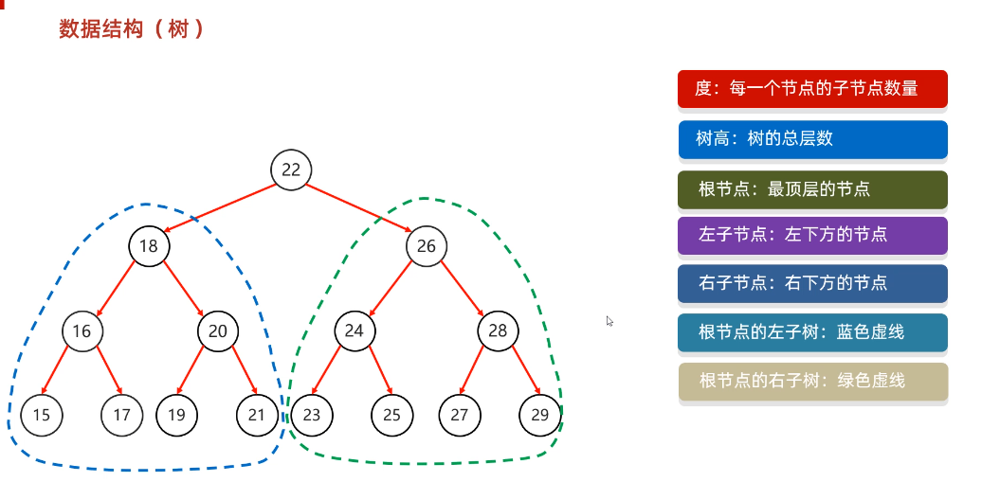

节点: 在树结构中,每一个元素称之为节点


## 二叉树

当一个树的**度**小于等于2时，这就是一颗二叉树

二叉树基本图：

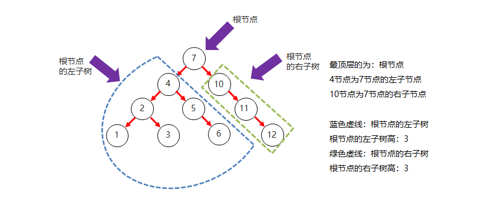

### 二叉树遍历方式


#### 前三种遍历的小技巧

前序：**当前节点**，左子节点，右子节点

中序：左子节点，**当前节点**，右子节点

后续：左子节点，右子节点，**当前节点**


只要记住：**当前节点遍历位置即可**


#### 一：前序遍历

规则：从根节点开始，然后按照**当前节点**，**左子节点**，**右子节点**的顺序进行遍历

>tips:
>
>当左子节点是一个左子节点树时，需要将左子节点树遍历完成后(按照上面规则)，一步一步退回来的


示例：

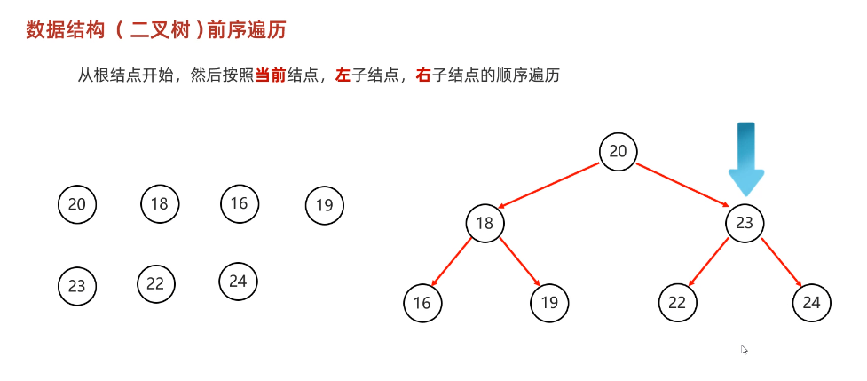


#### 二：中序遍历(常用)

规则：从**最左边子节点开始**，然后按照**左子节点**，**当前节点**，**右子节点**的顺序遍历

>tips：
>
>每一个子树都要按照上面规则遍历

示例：

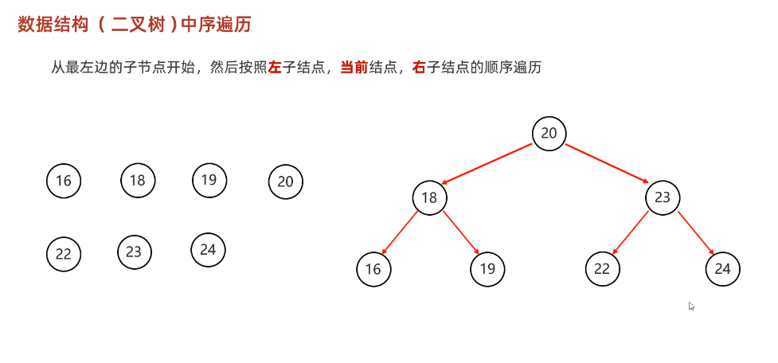

特点：发现没有，遍历出来的数据是从小到大的


#### 三：后续遍历

规则：**从最左边节点开始**，然后按照**左子节点**，**右子节点**，**当前节点**顺序遍历


示例：

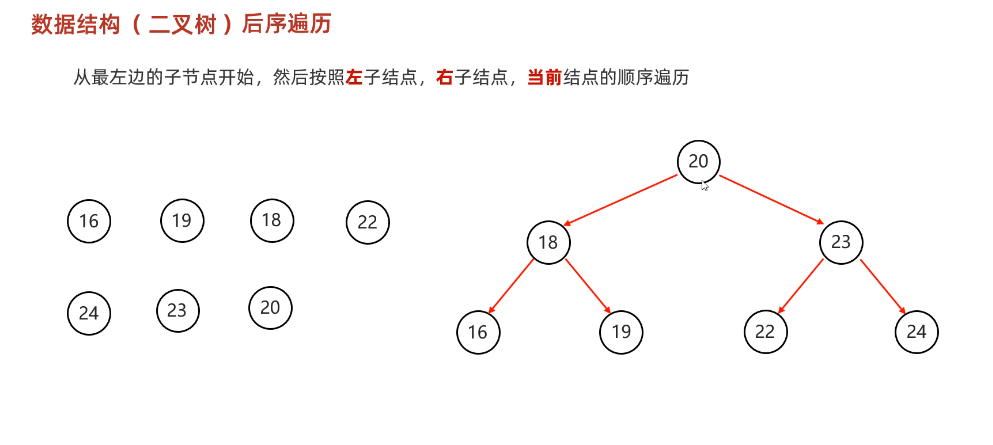

#### 四：层序遍历

规则：从根节点开始一层一层的遍历


示例：

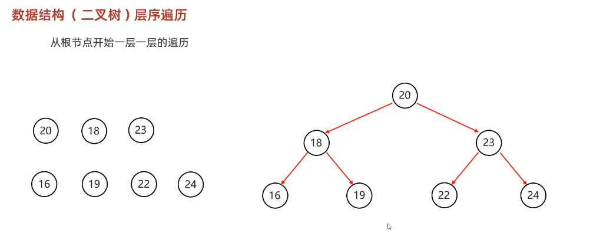


### 二叉查找树【理解】

二叉查找树比普通二叉树的优势，在查找上**效率要高很多**

但是有一个弊端：**容易出现长短腿现象（一边特别长一边特别短，这时候我们就需要下面的平衡二叉树的操作(可以旋转🤭)）**

长短腿的弊端：就让搜索效率直线下降，和一个链表差不多了

**二叉查找树的特点**

+ 二叉查找树,又称二叉排序树或者二叉搜索树
+ 每一个节点上最多有两个子节点
+ **任意节点左子树上所有节点的值都小于根节点的值**
+ **任意节点右子树上所有节点的值都大于根节点的值**

+ 二叉查找树结构图

  

+ 二叉查找树和二叉树对比结构图

  

  

  **二叉查找树的存储规则：**

  1. 小的存左边
  2. 大的存右边
  3. 一样的不存
  4. 如果位置上有节点了在当前节点上再走上面逻辑

  

**二叉查找树的查找规则：**

和上面逻辑一样的，一步一步就能找到


### 平衡二叉树【理解】

由于搜索树/查找树，容易长短腿，这时候就出现平衡二叉树了解决问题了

注意：

**平衡二叉树，本身任然是一颗二叉查找树**


**平衡二叉树的特点：**

+ 二叉树**任意节点**左右两个子树的高度差不超过1
+ **任意节点**的左右两个子树都是一颗平衡二叉树


**平衡二叉树添加节点**

和二叉查找树一样(because 本身就是一颗二叉查找树)，大的放左子节点，小的放右子节点，一样的不存


平衡二叉树是怎么做到平衡的呢？就在下面

**平衡二叉树旋转**

>平衡二叉树的旋转时机：
>
>**当添加一个节点之后,该树不再是一颗平衡二叉树，就会触发旋转，直至成为一个平衡二叉树**


#### 左右旋转

一：**左旋**

就是将根节点的右侧往左拉,原先的右子节点变成新的父节点,并把多余的左子节点出让,给已经降级的根节点当右子节点


二：**右旋**

就是将根节点的左侧往右拉,左子节点变成了新的父节点,并把多余的右子节点出让,给已经降级根节点当左子节点

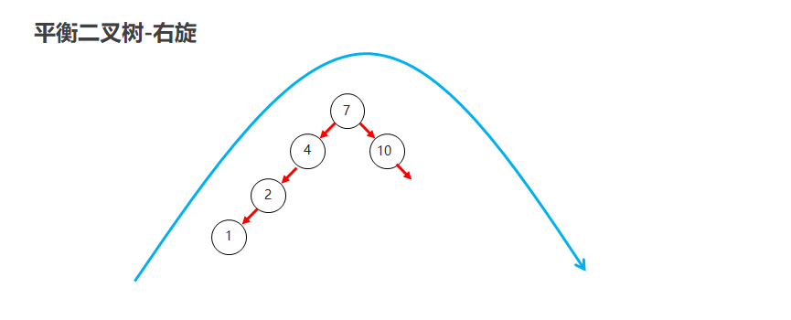


+ 平衡二叉树和二叉查找树对比结构图

  

  

  


#### 旋转步骤

**左旋步骤**

第一步：**确定支点**，从添加的节点开始，不断的往父节点去判断当前父节点下的树是否是一个平衡二叉树，如果不是，则该点为**支点**

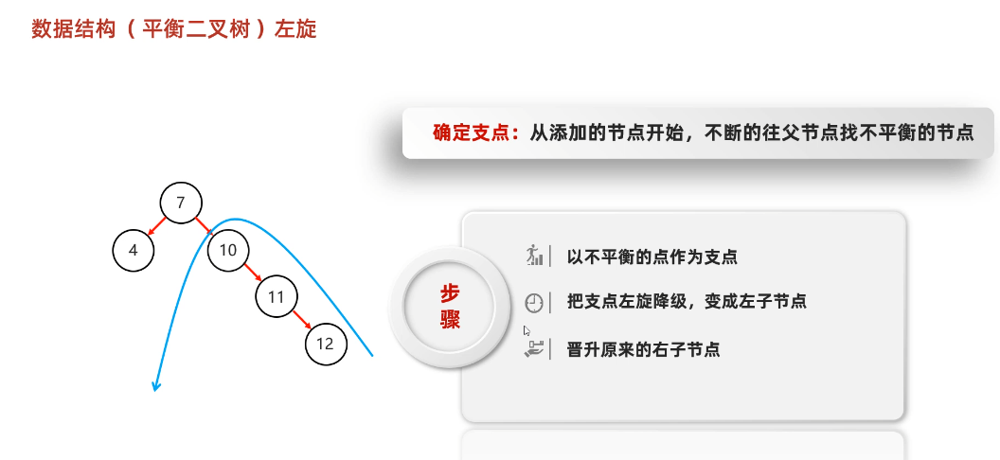

示例图：

我们刚刚添加的节点是`12`，然后一步一步寻找，判断，**找到`10`是支点**


第二步：把支点左旋降级，变成左节点

第三步：晋升原来的右子节点

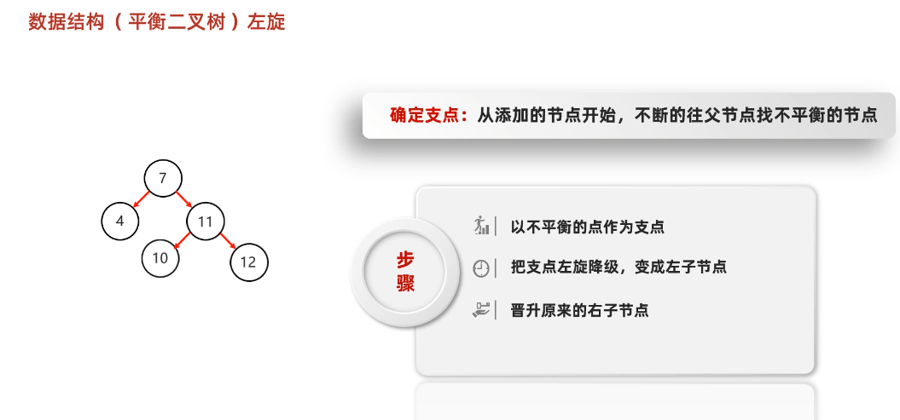

旋转后结果：

`11`由原来的右子节点晋升为父节点，`10`降级为左子节点


**左旋示例1(较复杂的一些)**


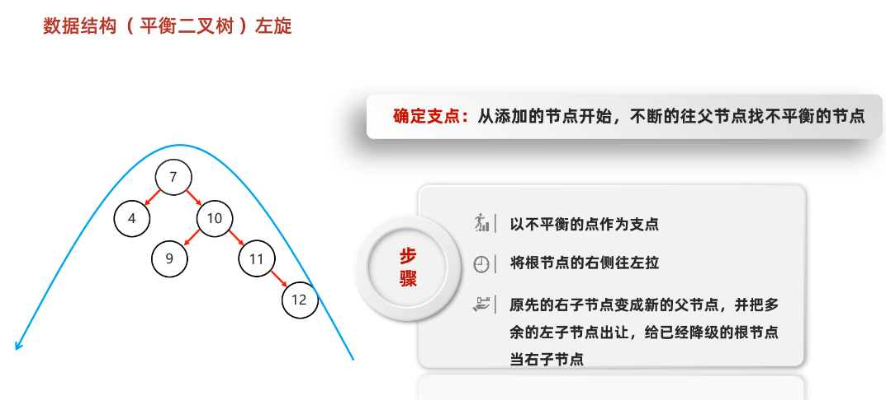

第一步：

我们添加`12`节点进入树中，**找到`7`为支点**


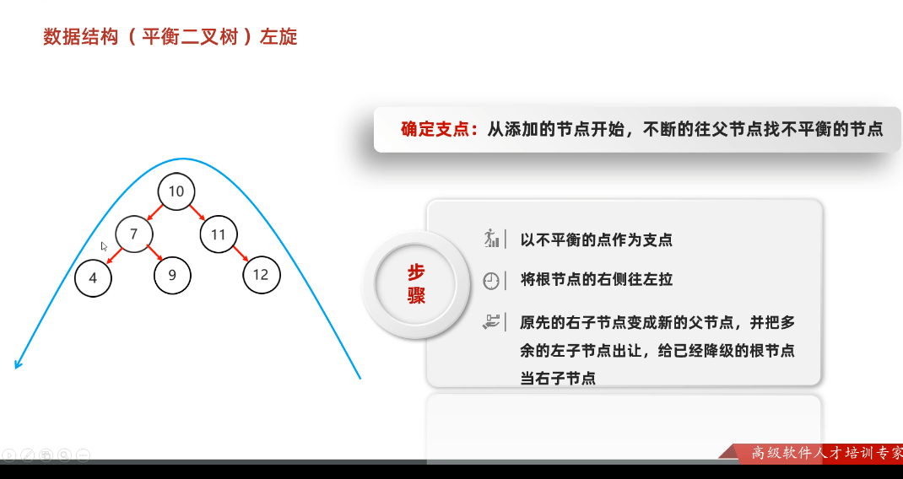

第二、三步：

把根节点`7`整个的右子节点左旋，然后将`10`节点原来的左子节点`9`，给旋转后的`7`节点（已经降级的根节点）的右子节点


**右旋步骤**

就是左旋步骤的反向操作而已，步骤都是一毛一样的


**右旋示例1（简单的题）**

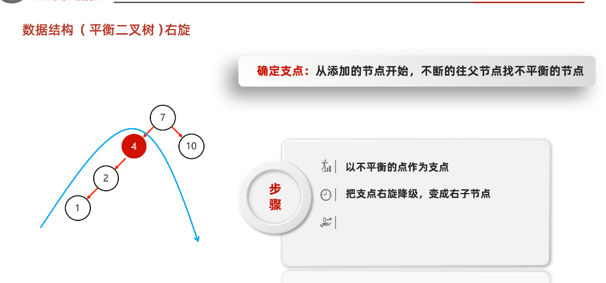

第一步：

找到`4`节点为支点

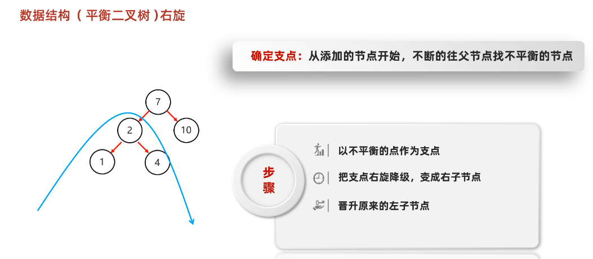

第二、三步：

4降级为右子节点，2晋升为父节点


**右旋示例2（难一点的）**

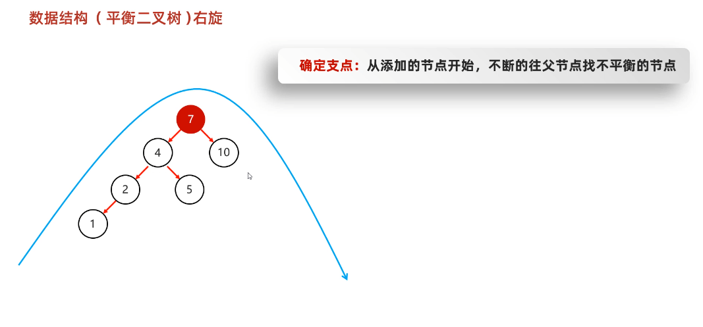

第一步：

添加的是节点为`1`，从`1`开始一步一步找，**找到`7`节点为支点**


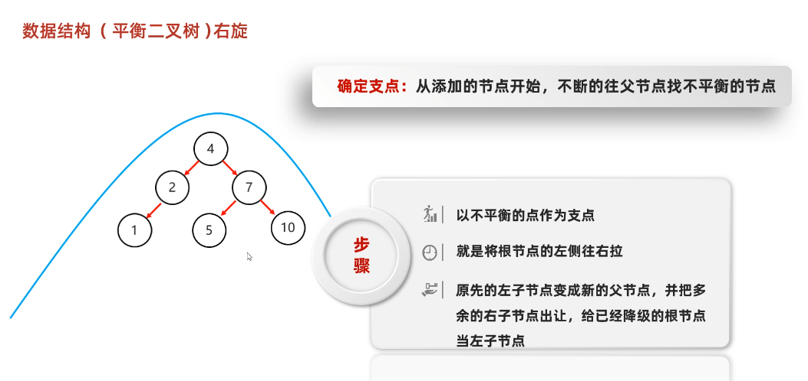

第二、三步：

首先将`7`节点左侧，往右边拉(`4`节点晋升为根节点，`7`降级为右子节点)，这时发现原来`4`节点的右子节点已经给`7`节点了，这时`5`就当作`7`节点的左子节点即可


#### 平衡二叉树旋转的四种情况

**情况一：左左**

+ 左左: 当根节点左子树的左子树有节点插入(**注意是一直是左，添加进来的节点也在左边**),导致二叉树不平衡

+ 如何旋转: **直接对整体进行一次右旋即可**

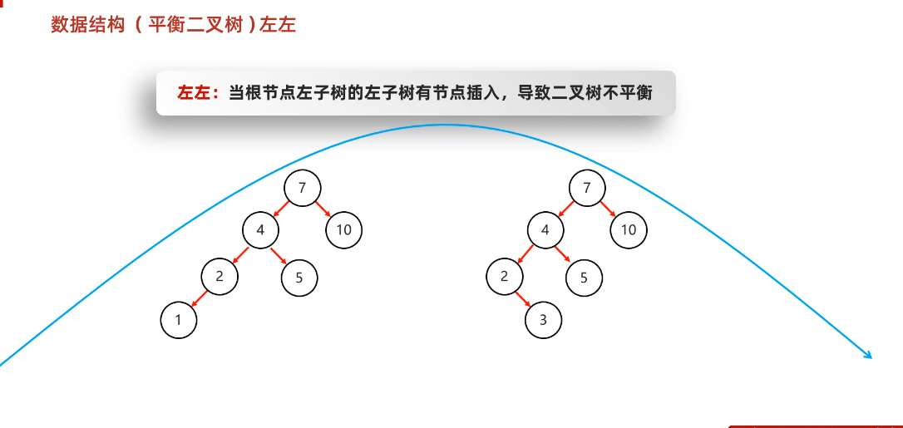

解释：

左侧图添加的节点为`1`，右侧图添加节点为`3`

左旋后的结果：

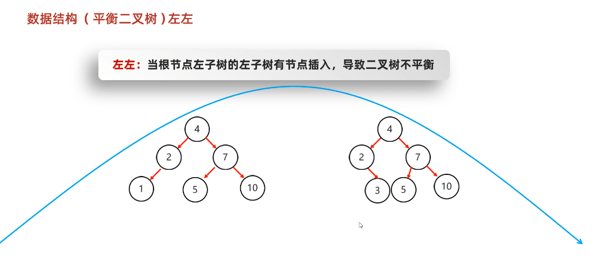


**情况二：左右**

+ 左右: 当根节点左子树的右子树有节点插入,导致二叉树不平衡

+ 如何旋转: 先在左子树对应的节点位置进行左旋,在对整体进行右旋


**左右示例题1：**


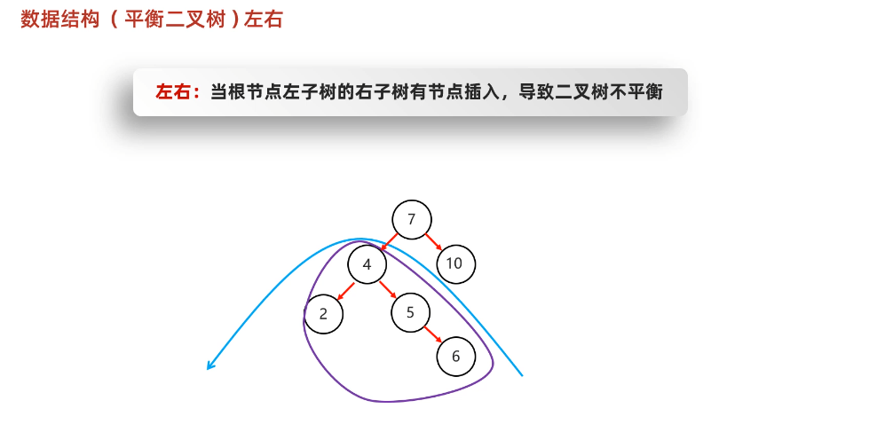

第一步：

先将局部左子树，进行一次左旋，变成**左左**，左旋结果如下图：

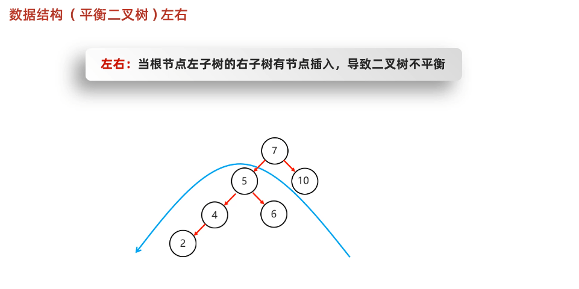

第二步：

进行**左左**的操作，一个整体右旋即可：

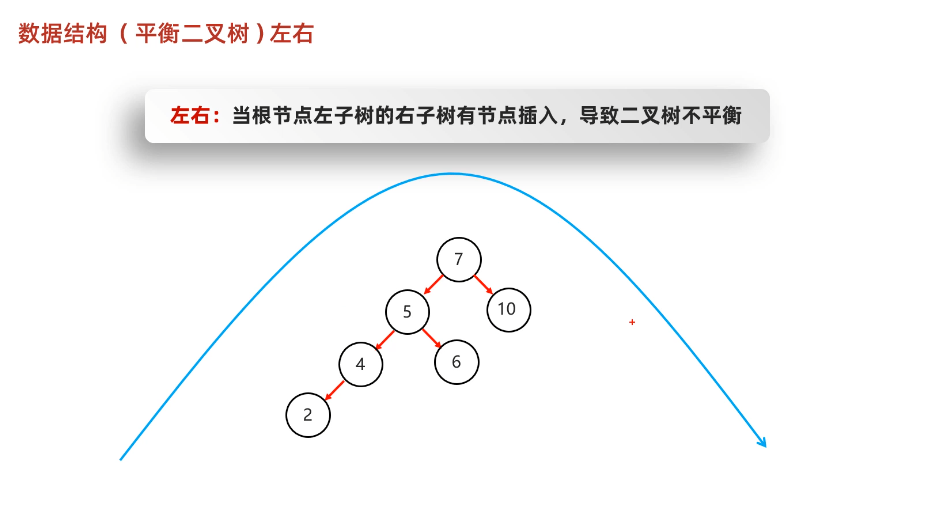

旋转后的结果成功变成平衡二叉树：

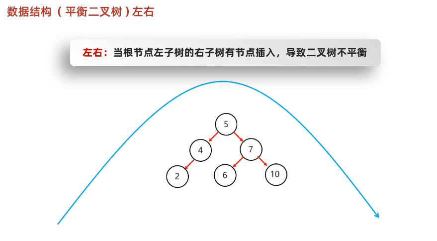

**情况三：右右**

和左左一样，反过来而已

+ 右右: 当根节点右子树的右子树有节点插入,导致二叉树不平衡

+ 如何旋转: 直接对整体进行左旋即可


旋转后结果：

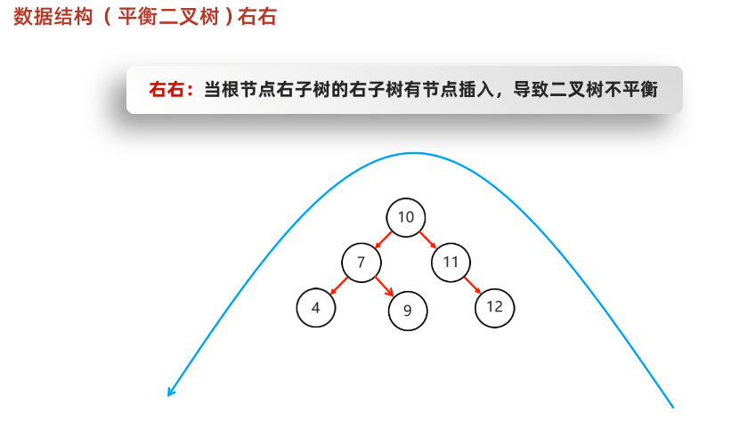


**情况四：右左**

和左右方式一样，反过来操作就ojbk了

+ 右左:当根节点右子树的左子树有节点插入,导致二叉树不平衡

+ 如何旋转: 先在右子树对应的节点位置进行右旋,在对整体进行左旋


**右左示例1：**

第一步：

先将右子树进行一次右旋

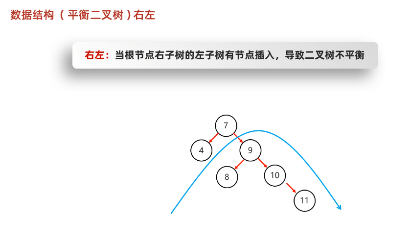

第二步：

第一步走完，就变成**右右**了，直接进行一次左旋，就完成了

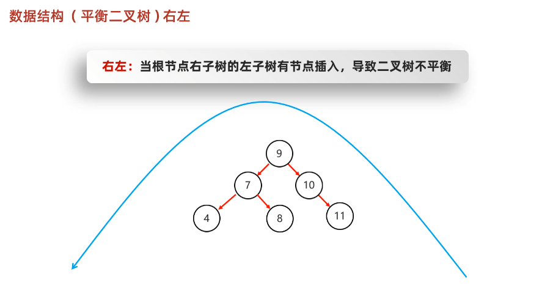


### 4.3红黑树【理解】

- 红黑树的特点

  - 平衡二叉B树
  - 每一个节点可以是红或者黑
  - 红黑树不是高度平衡的,它的平衡是通过"自己的红黑规则"进行实现的

- 红黑树的红黑规则有哪些

  1. 每一个节点或是红色的,或者是黑色的

  2. 根节点必须是黑色

  3. 如果一个节点没有子节点或者父节点,则该节点相应的指针属性值为Nil,这些Nil视为叶节点,每个叶节点(Nil)是黑色的

  4. 如果某一个节点是红色,那么它的子节点必须是黑色(不能出现两个红色节点相连 的情况)

  5. 对每一个节点,从该节点到其所有后代叶节点的简单路径上,均包含相同数目的黑色节点

     

- 红黑树添加节点的默认颜色

  - 添加节点时,默认为红色,效率高

    

- 红黑树添加节点后如何保持红黑规则

  - 根节点位置
    - 直接变为黑色
  - 非根节点位置
    - 父节点为黑色
      - 不需要任何操作,默认红色即可
    - 父节点为红色
      - 叔叔节点为红色
        1. 将"父节点"设为黑色,将"叔叔节点"设为黑色
        2. 将"祖父节点"设为红色
        3. 如果"祖父节点"为根节点,则将根节点再次变成黑色
      - 叔叔节点为黑色
        1. 将"父节点"设为黑色
        2. 将"祖父节点"设为红色
        3. 以"祖父节点"为支点进行旋转

##5.HashSet集合

### 5.1HashSet集合概述和特点【应用】

- 底层数据结构是哈希表
- 存取无序
- 不可以存储重复元素
- 没有索引,不能使用普通for循环遍历

### 5.2HashSet集合的基本应用【应用】

存储字符串并遍历

```java
public class HashSetDemo {
    public static void main(String[] args) {
        //创建集合对象
        HashSet<String> set = new HashSet<String>();

        //添加元素
        set.add("hello");
        set.add("world");
        set.add("java");
        //不包含重复元素的集合
        set.add("world");

        //遍历
        for(String s : set) {
            System.out.println(s);
        }
    }
}
```

### 5.3哈希值【理解】

- 哈希值简介

  ​	是JDK根据对象的地址或者字符串或者数字算出来的int类型的数值

- 如何获取哈希值

  ​	Object类中的public int hashCode()：返回对象的哈希码值

- 哈希值的特点

  - 同一个对象多次调用hashCode()方法返回的哈希值是相同的
  - 默认情况下，不同对象的哈希值是不同的。而重写hashCode()方法，可以实现让不同对象的哈希值相同

### 5.4哈希表结构【理解】

- JDK1.8以前

  ​	数组 + 链表

  

- JDK1.8以后

  - 节点个数少于等于8个

    ​	数组 + 链表

  - 节点个数多于8个

    ​	数组 + 红黑树

  

### 5.5HashSet集合存储学生对象并遍历【应用】

- 案例需求

  - 创建一个存储学生对象的集合，存储多个学生对象，使用程序实现在控制台遍历该集合
  - 要求：学生对象的成员变量值相同，我们就认为是同一个对象

- 代码实现

  学生类

  ```java
  public class Student {
      private String name;
      private int age;
  
      public Student() {
      }
  
      public Student(String name, int age) {
          this.name = name;
          this.age = age;
      }
  
      public String getName() {
          return name;
      }
  
      public void setName(String name) {
          this.name = name;
      }
  
      public int getAge() {
          return age;
      }
  
      public void setAge(int age) {
          this.age = age;
      }
  
      @Override
      public boolean equals(Object o) {
          if (this == o) return true;
          if (o == null || getClass() != o.getClass()) return false;
  
          Student student = (Student) o;
  
          if (age != student.age) return false;
          return name != null ? name.equals(student.name) : student.name == null;
      }
  
      @Override
      public int hashCode() {
          int result = name != null ? name.hashCode() : 0;
          result = 31 * result + age;
          return result;
      }
  }
  ```

  测试类

  ```java
  public class HashSetDemo02 {
      public static void main(String[] args) {
          //创建HashSet集合对象
          HashSet<Student> hs = new HashSet<Student>();
  
          //创建学生对象
          Student s1 = new Student("林青霞", 30);
          Student s2 = new Student("张曼玉", 35);
          Student s3 = new Student("王祖贤", 33);
  
          Student s4 = new Student("王祖贤", 33);
  
          //把学生添加到集合
          hs.add(s1);
          hs.add(s2);
          hs.add(s3);
          hs.add(s4);
  
          //遍历集合(增强for)
          for (Student s : hs) {
              System.out.println(s.getName() + "," + s.getAge());
          }
      }
  }
  ```

- 总结

  ​	HashSet集合存储自定义类型元素,要想实现元素的唯一,要求必须重写hashCode方法和equals方法

