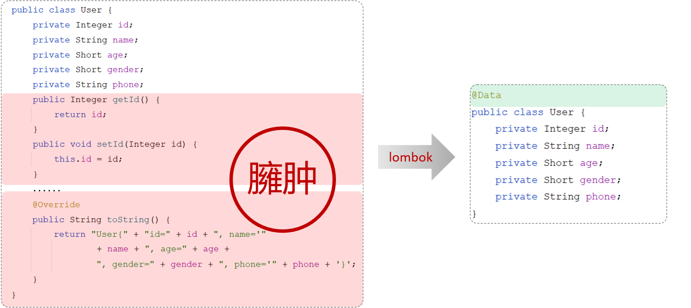

## 4. lombok

### 4.1 介绍

Lombok是一个实用的Java类库，可以通过简单的注解来简化和消除一些必须有但显得很臃肿的Java代码。



> 通过注解的形式自动生成构造器、getter/setter、equals、hashcode、toString等方法，并可以自动化生成日志变量，简化java开发（简化实体类开发直接用注解就可以了）、提高效率。


>红色注解比较**常用**

| **注解**                                     | **作用**                                                     |
| -------------------------------------------- | ------------------------------------------------------------ |
| @Getter/@Setter                              | 为所有的属性提供get/set方法                                  |
| @ToString                                    | 会给类自动生成易阅读的  toString 方法                        |
| @EqualsAndHashCode                           | 根据类所拥有的非静态字段自动重写 equals 方法和  hashCode 方法 |
| <b style="color:red">@Data</b>               | 提供了更综合的生成代码功能（@Getter  + @Setter + @ToString + @EqualsAndHashCode） |
| <b style="color:red">@NoArgsConstructor</b>  | 为实体类生成无参的构造器方法                                 |
| <b style="color:red">@AllArgsConstructor</b> | 为实体类生成除了static修饰的字段之外带有各参数的构造器方法。 |


### 4.2 使用

第1步：在pom.xml文件中引入依赖

```xml
<!-- 在springboot的父工程中，已经集成了lombok并指定了版本号，故当前引入依赖时不需要指定version -->
<dependency>
    <groupId>org.projectlombok</groupId>
    <artifactId>lombok</artifactId>
</dependency>
```

第2步：在实体类上添加注解

```java
import lombok.Data;

@Data
public class User {
    private Integer id;
    private String name;
    private Short age;
    private Short gender;
    private String phone;
}
```

> 在实体类上添加了@Data注解，那么这个类在编译时期，就会生成getter/setter、equals、hashcode、toString等方法。
>
> 

说明：@Data注解中不包含全参构造方法，通常在实体类上，还会添加上：全参构造、无参构造

~~~java
import lombok.Data;

@Data //getter方法、setter方法、toString方法、hashCode方法、equals方法
@NoArgsConstructor //无参构造
@AllArgsConstructor//全参构造
public class User {
    private Integer id;
    private String name;
    private Short age;
    private Short gender;
    private String phone;
}
~~~


Lombok的注意事项：

- Lombok会在编译时，会自动生成对应的java代码
- 在使用lombok时，还需要安装一个lombok的插件（新版本的IDEA中自带）


## 注意点(关于静态方法引用)

在使用Lombok的@Data，@Getter/@Setter注解时，编译后，也会为该类生成和getter和setter同名的**静态方法**，所以我们可以直接通过**类名::静态方法名**来进行方法引用
