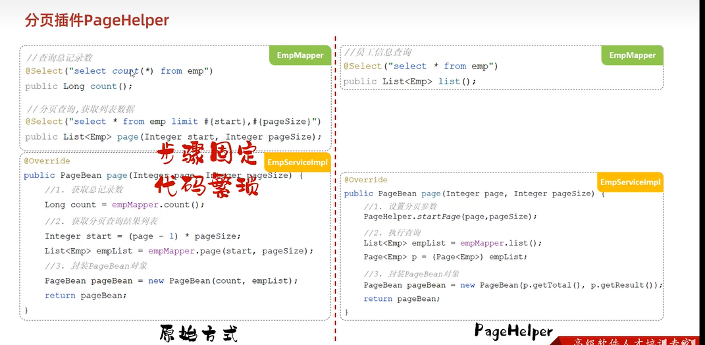

# PageHelper 插件

作用：帮助我们简化固定的分页查询操作





核心：

**跟分页相关的内容，改插件都已经帮我们写好了，我们只需要写查询即可，所以即使是带条件的分页，我们也只需要写条件查询即可**


## 简单使用

一：引入依赖

```xml
<!-- PageHelper分页插件 -->
<dependency>
    <groupId>com.github.pagehelper</groupId>
    <artifactId>pagehelper-spring-boot-starter</artifactId>
    <version>1.4.6</version>
</dependency>
```

>版本号根据自身使用


二：使用

首先，在mapper中定义一个列表查询方法：

```java
package com.itheima.mapper;


import com.itheima.pojo.Emp;
import org.apache.ibatis.annotations.Mapper;
import org.apache.ibatis.annotations.Select;

import java.util.List;

/*
* 员工管理
* */
@Mapper
public interface EmpMapper {
    /**
     * 查询总记录数
     * @return
     */
/*    @Select("select count(*) from emp")
    public Long count();*/


    /**
     * 分页查询，获取列表数据
     * @param start
     * @param pageSize
     * @return
     */
/*    @Select("select * from emp limit #{start}, #{pageSize}")
    public List<Emp> page(Integer start, Integer pageSize);*/

    /**
     * 员工信息查询(PageHelper)
     * @return
     */
    @Select("select * from emp")
    public List<Emp> list();
}

```


然后，在service层使用即可：

```java
package com.itheima.service.impl;

import com.github.pagehelper.Page;
import com.github.pagehelper.PageHelper;
import com.itheima.mapper.EmpMapper;
import com.itheima.pojo.Emp;
import com.itheima.pojo.PageBean;
import com.itheima.service.EmpService;
import lombok.extern.slf4j.Slf4j;
import org.springframework.beans.factory.annotation.Autowired;
import org.springframework.stereotype.Service;

import java.util.List;

@Slf4j
@Service
public class EmpServiceImpl implements EmpService {
    // 需要调用mapper，所以把相应的mapper注入进来
    @Autowired
    private EmpMapper empMapper;

    @Override
    public PageBean page(Integer page, Integer pageSize) {
				
      	// 传统写法：
        /*// 1.获取总记录数
        Long count = empMapper.count();

        // 2.获取分页查询的列表结果
        // 公式计算起始索引index
        Integer start = (page - 1) * pageSize;
        List<Emp> empList = empMapper.page(start, pageSize);

        // 3.分装pageBean
        PageBean pageBean = new PageBean(count, empList);

        // 返回
        return pageBean;*/


        // 使用pageHelper

        // 1.设置分页参数
        PageHelper.startPage(page, pageSize);

        // 2.执行查询
        List<Emp> empList = empMapper.list();

        // 这里需要强转一下，转换成Page<>类型
        Page<Emp> p = (Page<Emp>) empList;

        // 3.分装pageBean
        PageBean pageBean = new PageBean(p.getTotal(), p.getResult());

        // 返回
        return pageBean;
    }
}

```


`PageBean`类：

```java
package com.itheima.pojo;

import lombok.AllArgsConstructor;
import lombok.Data;
import lombok.NoArgsConstructor;

import java.util.List;

/**
 * 分页查询结果的封装类，使用了lombok
 */
@Data
@NoArgsConstructor
@AllArgsConstructor
public class PageBean {
    // 总条数
    private long total;
    // 条数列表
    private List<Emp> rows;
}

```


## 配合分页使用

其实核心内容一样的就是在基础上多加一些查询操作(配合动态SQL查询)


xml文件：

```java
<?xml version="1.0" encoding="UTF-8" ?>
<!DOCTYPE mapper
        PUBLIC "-//mybatis.org//DTD Mapper 3.0//EN"
        "https://mybatis.org/dtd/mybatis-3-mapper.dtd">
<mapper namespace="com.itheima.mapper.EmpMapper">
    <select id="list" resultType="com.itheima.pojo.Emp">
        select * from emp
        <where>
            <if test="name != null and name != ''">
                name like concat('%', #{name}, '%')
            </if>
            <if test="gender != null">
                and gender = #{gender}
            </if>
            <if test="begin != null and end != null">
                and entrydate between #{begin} and #{end}
            </if>
        </where>
        order by update_time desc
    </select>
</mapper>
```


`mapper`层内容：

```java
package com.itheima.mapper;


import com.itheima.pojo.Emp;
import org.apache.ibatis.annotations.Mapper;
import org.apache.ibatis.annotations.Select;

import java.time.LocalDate;
import java.util.List;

/*
* 员工管理
* */
@Mapper
public interface EmpMapper {

    /**
     * 员工信息查询
     * @return
     */
    //@Select("select * from emp")
    public List<Emp> list(String name, Short gender, LocalDate begin, LocalDate end);
}

```


`controller`层代码：

```java
package com.itheima.controller;

/*
* 员工管理controller
* */

import com.itheima.pojo.PageBean;
import com.itheima.pojo.Result;
import com.itheima.service.EmpService;
import lombok.extern.slf4j.Slf4j;
import org.springframework.beans.factory.annotation.Autowired;
import org.springframework.format.annotation.DateTimeFormat;
import org.springframework.web.bind.annotation.GetMapping;
import org.springframework.web.bind.annotation.RequestParam;
import org.springframework.web.bind.annotation.RestController;

import java.time.LocalDate;
import java.time.LocalDateTime;

@Slf4j
@RestController
public class EmpController {

    @Autowired
    private EmpService empService;

    @GetMapping("/emps")
    public Result page(String name, Short gender,
                       @DateTimeFormat(pattern = "yyyy-MM-dd") LocalDate begin,
                       @DateTimeFormat(pattern = "yyyy-MM-dd") LocalDate end,
                       @RequestParam(defaultValue = "1") Integer page,
                       @RequestParam(defaultValue = "10") Integer pageSize) {
            // 通过@RequestParam来设置参数默认值
          log.info("分页查询，参数{}，{}, {}, {}, {}, {}", page, pageSize, name, gender, begin, end); // {}是占位符

        // 调用service分页查询
        PageBean pageBean = empService.page( name, gender, begin, end, page, pageSize);

        return Result.success(pageBean);
    }
}

```


`service`层代码：

```java
package com.itheima.service.impl;

import com.github.pagehelper.Page;
import com.github.pagehelper.PageHelper;
import com.itheima.mapper.EmpMapper;
import com.itheima.pojo.Emp;
import com.itheima.pojo.PageBean;
import com.itheima.service.EmpService;
import lombok.extern.slf4j.Slf4j;
import org.springframework.beans.factory.annotation.Autowired;
import org.springframework.format.annotation.DateTimeFormat;
import org.springframework.stereotype.Service;
import org.springframework.web.bind.annotation.RequestParam;

import java.time.LocalDate;
import java.util.List;

@Slf4j
@Service
public class EmpServiceImpl implements EmpService {
    // 需要调用mapper，所以把相应的mapper注入进来
    @Autowired
    private EmpMapper empMapper;

    @Override
    public PageBean page(String name, Short gender,
                         LocalDate begin,
                         LocalDate end,
                         Integer page,
                         Integer pageSize) {

        /*// 1.获取总记录数
        Long count = empMapper.count();

        // 2.获取分页查询的列表结果
        // 公式计算起始索引index
        Integer start = (page - 1) * pageSize;
        List<Emp> empList = empMapper.page(start, pageSize);

        // 3.分装pageBean
        PageBean pageBean = new PageBean(count, empList);

        // 返回
        return pageBean;*/


        // 使用pageHelper

        // 1.设置分页参数
        PageHelper.startPage(page, pageSize);

        // 2.执行查询
        List<Emp> empList = empMapper.list(name, gender, begin, end);

        // 这里需要强转一下，转换成Page<>类型
        Page<Emp> p = (Page<Emp>) empList;

        // 3.分装pageBean
        PageBean pageBean = new PageBean(p.getTotal(), p.getResult());

        // 返回
        return pageBean;
    }
}

```

