# 文件上传

文件上传是一个合理的项目中，必不可少的内容一般有以下几个小猪一点


前端注意点：

1. 表单中`enctype`属性为`multipart/form-data`
2. 表单提交方式为`post`
3. 表单中`input`标签的type属性值为`file`


服务端：(`spring` 框架中)

1. 需要`MultipartFile`的API


## 1. 文件上传

在我们完成的新增员工功能中，还存在一个问题：没有头像(图片缺失)


上述问题，需要我们通过文件上传技术来解决。下面我们就进入到文件上传技术的学习。

文件上传技术这块我们主要讲解三个方面：首先我们先对文件上传做一个整体的介绍，接着再学习文件上传的本地存储方式，最后学习云存储方式。

接下来我们就先来学习下什么是文件上传。


### 1.1 简介 

文件上传，是指将本地图片、视频、音频等文件上传到服务器，供其他用户浏览或下载的过程。

文件上传在项目中应用非常广泛，我们经常发微博、发微信朋友圈都用到了文件上传功能。


> 在我们的案例中，在新增员工的时候，要上传员工的头像，此时就会涉及到文件上传的功能。在进行文件上传时，我们点击加号或者是点击图片，就可以选择手机或者是电脑本地的图片文件了。当我们选择了某一个图片文件之后，这个文件就会上传到服务器，从而完成文件上传的操作。

想要完成文件上传这个功能需要涉及到两个部分：

1. 前端程序
2. 服务端程序


我们先来看看在前端程序中要完成哪些代码：

```html
<form action="/upload" method="post" enctype="multipart/form-data">
	姓名: <input type="text" name="username"><br>
    年龄: <input type="text" name="age"><br>
    头像: <input type="file" name="image"><br>
    <input type="submit" value="提交">
</form>
```

上传文件的原始form表单，要求表单必须具备以下三点（上传文件页面三要素）：

- 表单必须有file域，用于选择要上传的文件

  > ~~~html
  > <input type="file" name="image"/>
  > ~~~

- 表单提交方式必须为POST

  > 通常上传的文件会比较大，所以需要使用 POST 提交方式

- 表单的编码类型enctype必须要设置为：multipart/form-data

  > 普通默认的编码格式是不适合传输大型的二进制数据的，所以在文件上传时，表单的编码格式必须设置为multipart/form-data


前端页面的3要素我们了解后，接下来我们就来验证下所讲解的文件上传3要素。

在提供的"课程资料"中有一个名叫"文件上传"的文件夹，直接将里的"upload.html"文件，复制到springboot项目工程下的static目录里面。


下面我们来验证：删除form表单中enctype属性值，会是什么情况？

1. 在IDEA中直接使用浏览器打开upload.html页面

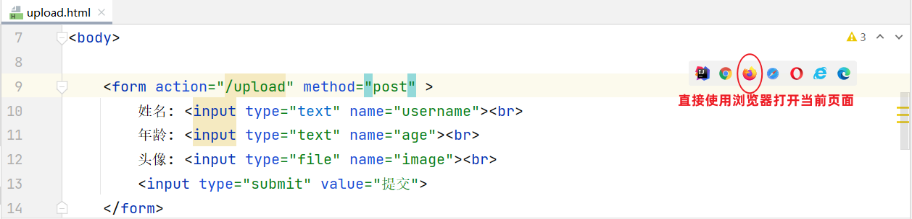


2. 选择要上传的本地文件


3. 点击"提交"按钮，进入到开发者模式观察


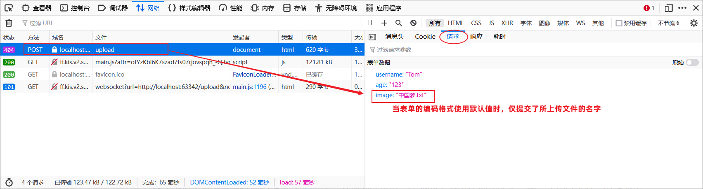


我们再来验证：设置form表单中enctype属性值为multipart/form-data，会是什么情况？

~~~html
 <form action="/upload" method="post" enctype="multipart/form-data">
        姓名: <input type="text" name="username"><br>
        年龄: <input type="text" name="age"><br>
        头像: <input type="file" name="image"><br>
        <input type="submit" value="提交">
    </form>
~~~


知道了前端程序中需要设置上传文件页面三要素，那我们的后端程序又是如何实现的呢？

- 首先在服务端定义这么一个controller，用来进行文件上传，然后在controller当中定义一个方法来处理`/upload` 请求

- 在定义的方法中接收提交过来的数据 （方法中的形参名和请求参数的名字保持一致）

  - 用户名：String  name
  - 年龄： Integer  age
  - 文件： MultipartFile  image

  > Spring中提供了一个API：MultipartFile，使用这个API就可以来接收到上传的文件


> 问题：如果表单项的名字和方法中形参名不一致，该怎么办？
>
> - ~~~javascript
>   public Result upload(String username,
>                        Integer age, 
>                        MultipartFile file) //file形参名和请求参数名image不一致
>   ~~~
>
> 解决：使用@RequestParam注解进行参数绑定
>
> - ~~~java
>   public Result upload(String username,
>                        Integer age, 
>                        @RequestParam("image") MultipartFile file)
>   ~~~


**UploadController代码：**

~~~java
@Slf4j
@RestController
public class UploadController {

    @PostMapping("/upload")
    public Result upload(String username, Integer age, MultipartFile image)  {
        log.info("文件上传：{},{},{}",username,age,image);
        return Result.success();
    }

}
~~~

> 后端程序编写完成之后，打个断点，以debug方式启动SpringBoot项目

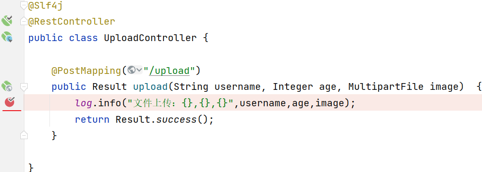

> 打开浏览器输入：http://localhost:8080/upload.html ， 录入数据并提交


通过后端程序控制台可以看到，上传的文件是存放在一个临时目录


> 打开临时目录可以看到以下内容：


> 表单提交的三项数据(姓名、年龄、文件)，分别存储在不同的临时文件中：


> 当我们程序运行完毕之后，这个临时文件会自动删除。 
>
> 所以，我们如果想要实现文件上传，需要将这个临时文件，要转存到我们的磁盘目录中。


### 1.2 本地存储

前面我们已分析了文件上传功能前端和后端的基础代码实现，文件上传时在服务端会产生一个临时文件，请求响应完成之后，这个临时文件被自动删除，并没有进行保存。下面呢，我们就需要完成将上传的文件保存在服务器的本地磁盘上。

代码实现：

1. 在服务器本地磁盘上创建images目录，用来存储上传的文件（例：E盘创建images目录）
2. 使用`MultipartFile`类提供的`API`方法，把临时文件转存到本地磁盘目录下

**`MultipartFile` 常见方法： **

> - `String  getOriginalFilename();`  //获取原始文件名
>- `void  transferTo(File dest);`     //将接收的文件转存到磁盘文件中
> - `long  getSize();`     //获取文件的大小，单位：字节
> - `byte[]  getBytes();`    //获取文件内容的字节数组
> - `InputStream  getInputStream();`    //获取接收到的文件内容的输入流


~~~java
@Slf4j
@RestController
public class UploadController {

    @PostMapping("/upload")
    public Result upload(String username, Integer age, MultipartFile image) throws IOException {
        log.info("文件上传：{},{},{}",username,age,image);

        //获取原始文件名
        String originalFilename = image.getOriginalFilename();

        //将文件存储在服务器的磁盘目录
        image.transferTo(new File("E:/images/"+originalFilename));

        return Result.success();
    }

}
~~~

利用postman测试：

> 注意：请求参数名和controller方法形参名保持一致

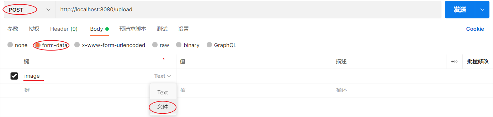


通过postman测试，我们发现文件上传是没有问题的。但是由于我们是使用原始文件名作为所上传文件的存储名字，当我们再次上传一个名为1.jpg文件时，发现会把之前已经上传成功的文件覆盖掉。


解决方案：保证每次上传文件时文件名都唯一的（使用UUID获取随机文件名）

~~~java
@Slf4j
@RestController
public class UploadController {

    @PostMapping("/upload")
    public Result upload(String username, Integer age, MultipartFile image) throws IOException {
        log.info("文件上传：{},{},{}",username,age,image);

        //获取原始文件名
        String originalFilename = image.getOriginalFilename();

        //构建新的文件名
        String extname = originalFilename.substring(originalFilename.lastIndexOf("."));//文件扩展名
        String newFileName = UUID.randomUUID().toString()+extname;//随机名+文件扩展名

        //将文件存储在服务器的磁盘目录
        image.transferTo(new File("E:/images/"+newFileName));

        return Result.success();
    }

}
~~~

在解决了文件名唯一性的问题后，我们再次上传一个较大的文件(超出1M)时发现，后端程序报错：


报错原因呢是因为：在SpringBoot中，文件上传时默认单个文件最大大小为1M

那么如果需要上传大文件，可以在application.properties进行如下配置：

~~~properties
#配置单个文件最大上传大小
spring.servlet.multipart.max-file-size=10MB

#配置单个请求最大上传大小(一次请求可以上传多个文件)
spring.servlet.multipart.max-request-size=100MB
~~~


到时此，我们文件上传的本地存储方式已完成了。但是这种本地存储方式还存在一问题： 

 

如果直接存储在服务器的磁盘目录中，存在以下缺点：

- 不安全：磁盘如果损坏，所有的文件就会丢失
- 容量有限：如果存储大量的图片，磁盘空间有限(磁盘不可能无限制扩容)
- 无法直接访问

为了解决上述问题呢，通常有两种解决方案：

- 自己搭建存储服务器，如：fastDFS 、MinIO
- 使用现成的云服务，如：阿里云，腾讯云，华为云


### 1.3 阿里云`OSS`

#### 1.3.1 准备

阿里云是阿里巴巴集团旗下全球领先的云计算公司，也是国内最大的云服务提供商 。


> 云服务指的就是通过互联网对外提供的各种各样的服务，比如像：语音服务、短信服务、邮件服务、视频直播服务、文字识别服务、对象存储服务等等。
>
> 当我们在项目开发时需要用到某个或某些服务，就不需要自己来开发了，可以直接使用阿里云提供好的这些现成服务就可以了。比如：在项目开发当中，我们要实现一个短信发送的功能，如果我们项目组自己实现，将会非常繁琐，因为你需要和各个运营商进行对接。而此时阿里云完成了和三大运营商对接，并对外提供了一个短信服务。我们项目组只需要调用阿里云提供的短信服务，就可以很方便的来发送短信了。这样就降低了我们项目的开发难度，同时也提高了项目的开发效率。（大白话：别人帮我们实现好了功能，我们只要调用即可）
>
> 云服务提供商给我们提供的软件服务通常是需要收取一部分费用的。

阿里云对象存储OSS（Object Storage Service），是一款海量、安全、低成本、高可靠的云存储服务。使用OSS，您可以通过网络随时存储和调用包括文本、图片、音频和视频等在内的各种文件。

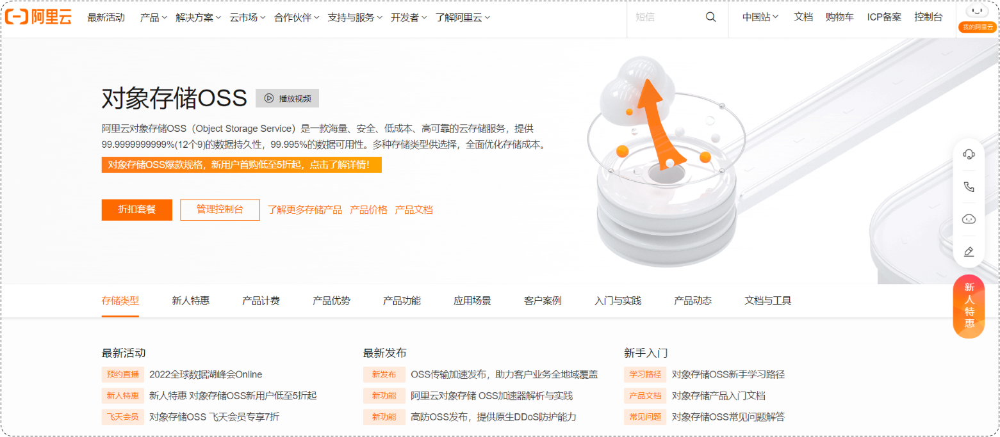 

在我们使用了阿里云OSS对象存储服务之后，我们的项目当中如果涉及到文件上传这样的业务，在前端进行文件上传并请求到服务端时，在服务器本地磁盘当中就不需要再来存储文件了。我们直接将接收到的文件上传到oss，由 oss帮我们存储和管理，同时阿里云的oss存储服务还保障了我们所存储内容的安全可靠。


那我们学习使用这类云服务，我们主要学习什么呢？其实我们主要学习的是如何在项目当中来使用云服务完成具体的业务功能。而无论使用什么样的云服务，阿里云也好，腾讯云、华为云也罢，在使用第三方的服务时，**操作的思路**都是一样的。


> SDK：Software Development Kit 的缩写，软件开发工具包，包括辅助软件开发的依赖（jar包）、代码示例等，都可以叫做SDK。
>
> 简单说，sdk中包含了我们使用第三方云服务时所需要的依赖，以及一些示例代码。我们可以参照sdk所提供的示例代码就可以完成入门程序。

第三方服务使用的通用思路，我们做一个简单介绍之后，接下来我们就来介绍一下我们当前要使用的阿里云oss对象存储服务具体的使用步骤。


> Bucket：存储空间是用户用于存储对象（Object，就是文件）的容器，所有的对象都必须隶属于某个存储空间。

下面我们根据之前介绍的使用步骤，完成准备工作：

1. 注册阿里云账户（注册完成后需要实名认证）
2. 注册完账号之后，就可以登录阿里云

 

3. 通过控制台找到对象存储OSS服务

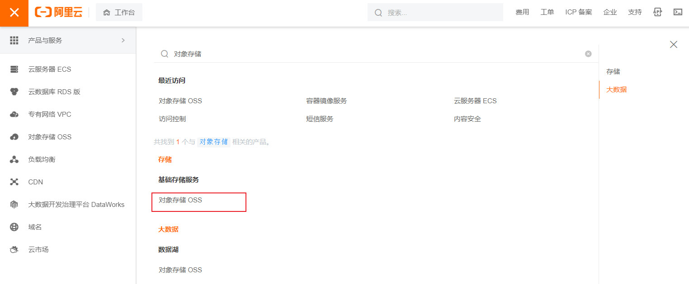 

> 如果是第一次访问，还需要开通对象存储服务OSS

 

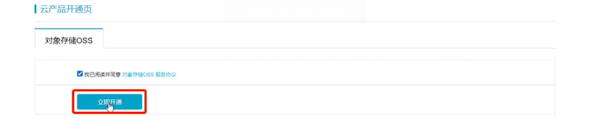 

4. 开通OSS服务之后，就可以进入到阿里云对象存储的控制台

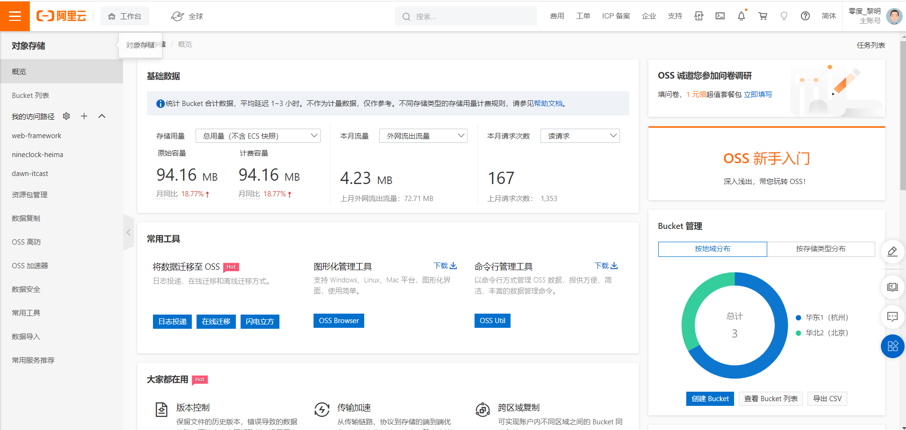 

5. 点击左侧的 "Bucket列表"，创建一个Bucket

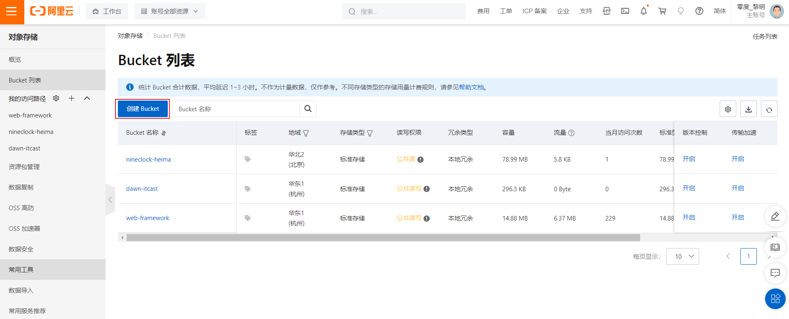 

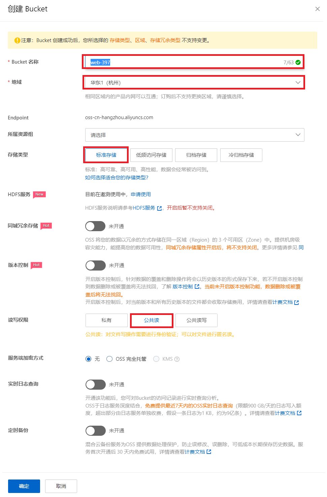

> 大家可以参照"资料\04. 阿里云oss\"中提供的文档，开通阿里云OSS服务。


#### 1.3.2 入门

阿里云oss 对象存储服务的准备工作我们已经完成了，接下来我们就来完成第二步操作：参照官方所提供的sdk示例来编写入门程序。

首先我们需要来打开阿里云OSS的官方文档，在官方文档中找到 SDK 的示例代码：

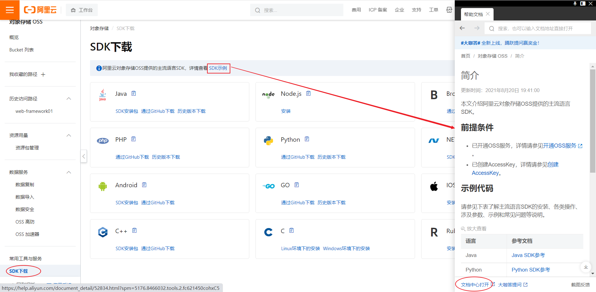

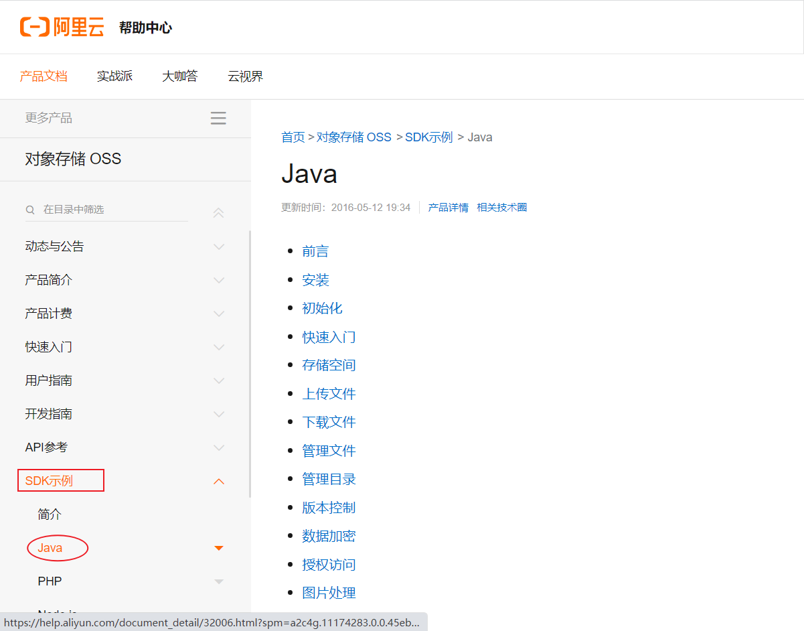

> 如果是在实际开发当中，我们是需要从前往后仔细的去阅读这一份文档的，但是由于现在是教学，我们就只挑重点的去看。有兴趣的同学大家下来也可以自己去看一下这份官方文档。

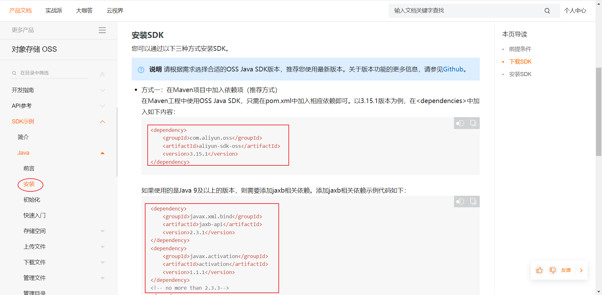

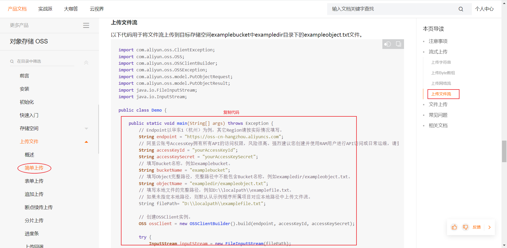

参照官方提供的SDK，改造一下，即可实现文件上传功能：

~~~java
import com.aliyun.oss.ClientException;
import com.aliyun.oss.OSS;
import com.aliyun.oss.OSSClientBuilder;
import com.aliyun.oss.OSSException;
import com.aliyun.oss.model.PutObjectRequest;
import com.aliyun.oss.model.PutObjectResult;

import java.io.FileInputStream;
import java.io.InputStream;

public class AliOssTest {
    public static void main(String[] args) throws Exception {
        // Endpoint以华东1（杭州）为例，其它Region请按实际情况填写。
        String endpoint = "oss-cn-shanghai.aliyuncs.com";
        
        // 阿里云账号AccessKey拥有所有API的访问权限，风险很高。强烈建议您创建并使用RAM用户进行API访问或日常运维，请登录RAM控制台创建RAM用户。
        String accessKeyId = "LTAI5t9MZK8iq5T2Av5GLDxX";
        String accessKeySecret = "C0IrHzKZGKqU8S7YQcevcotD3Zd5Tc";
        
        // 填写Bucket名称，例如examplebucket。
        String bucketName = "web-framework01";
        // 填写Object完整路径，完整路径中不能包含Bucket名称，例如exampledir/exampleobject.txt。
        String objectName = "1.jpg";
        // 填写本地文件的完整路径，例如D:\\localpath\\examplefile.txt。
        // 如果未指定本地路径，则默认从示例程序所属项目对应本地路径中上传文件流。
        String filePath= "C:\\Users\\Administrator\\Pictures\\1.jpg";

        // 创建OSSClient实例。
        OSS ossClient = new OSSClientBuilder().build(endpoint, accessKeyId, accessKeySecret);

        try {
            InputStream inputStream = new FileInputStream(filePath);
            // 创建PutObjectRequest对象。
            PutObjectRequest putObjectRequest = new PutObjectRequest(bucketName, objectName, inputStream);
            // 设置该属性可以返回response。如果不设置，则返回的response为空。
            putObjectRequest.setProcess("true");
            // 创建PutObject请求。
            PutObjectResult result = ossClient.putObject(putObjectRequest);
            // 如果上传成功，则返回200。
            System.out.println(result.getResponse().getStatusCode());
        } catch (OSSException oe) {
            System.out.println("Caught an OSSException, which means your request made it to OSS, "
                    + "but was rejected with an error response for some reason.");
            System.out.println("Error Message:" + oe.getErrorMessage());
            System.out.println("Error Code:" + oe.getErrorCode());
            System.out.println("Request ID:" + oe.getRequestId());
            System.out.println("Host ID:" + oe.getHostId());
        } catch (ClientException ce) {
            System.out.println("Caught an ClientException, which means the client encountered "
                    + "a serious internal problem while trying to communicate with OSS, "
                    + "such as not being able to access the network.");
            System.out.println("Error Message:" + ce.getMessage());
        } finally {
            if (ossClient != null) {
                ossClient.shutdown();
            }
        }
    }
}

~~~

> 在以上代码中，需要替换的内容为：
>
> - accessKeyId：阿里云账号AccessKey
> - accessKeySecret：阿里云账号AccessKey对应的秘钥
> - bucketName：Bucket名称
> - objectName：对象名称，在Bucket中存储的对象的名称
> - filePath：文件路径
>
> AccessKey ：
>
>  

运行以上程序后，会把本地的文件上传到阿里云OSS服务器上：

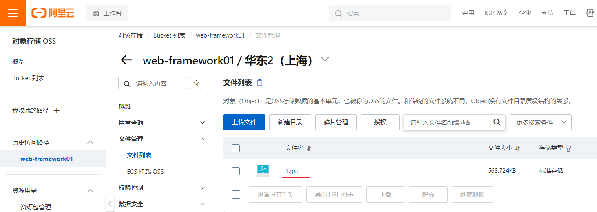


#### 1.3.3 集成

阿里云oss对象存储服务的准备工作以及入门程序我们都已经完成了，接下来我们就需要在案例当中集成oss对象存储服务，来存储和管理案例中上传的图片。


> 在新增员工的时候，上传员工的图像，而之所以需要上传员工的图像，是因为将来我们需要在系统页面当中访问并展示员工的图像。而要想完成这个操作，需要做两件事：
>
> 1. 需要上传员工的图像，并把图像保存起来（存储到阿里云OSS）
> 2. 访问员工图像（**通过图像在阿里云OSS的存储地址访问图像**）
>    - OSS中的每一个文件都会分配一个访问的url，通过这个url就可以访问到存储在阿里云上的图片。所以需要把url返回给前端，这样前端就可以通过url获取到图像。


我们参照接口文档来开发文件上传功能：

- 基本信息

  ~~~
  请求路径：/upload
  
  请求方式：POST
  
  接口描述：上传图片接口
  ~~~

- 请求参数

  参数格式：multipart/form-data

  参数说明：

  | 参数名称 | 参数类型 | 是否必须 | 示例 | 备注 |
  | -------- | -------- | -------- | ---- | ---- |
  | image    | file     | 是       |      |      |

- 响应数据

  参数格式：application/json

  参数说明：

  | 参数名 | 类型   | 是否必须 | 备注                           |
  | ------ | ------ | -------- | ------------------------------ |
  | code   | number | 必须     | 响应码，1 代表成功，0 代表失败 |
  | msg    | string | 非必须   | 提示信息                       |
  | data   | object | 非必须   | 返回的数据，上传图片的访问路径 |

  响应数据样例：

  ~~~json
  {
      "code": 1,
      "msg": "success",
      "data": "https://web-framework.oss-cn-hangzhou.aliyuncs.com/2022-09-02-00-27-0400.jpg"
  }
  ~~~


引入阿里云OSS上传文件工具类（由官方的示例代码改造而来）

~~~java
import com.aliyun.oss.OSS;
import com.aliyun.oss.OSSClientBuilder;
import org.springframework.stereotype.Component;
import org.springframework.web.multipart.MultipartFile;

import java.io.IOException;
import java.io.InputStream;
import java.util.UUID;

@Component // 加上注解，进行控制反转（由于我们是在spring框架中，所以工具类也可以用IOC、DI方式来进行管理）
public class AliOSSUtils {
    private String endpoint = "https://oss-cn-shanghai.aliyuncs.com";
    private String accessKeyId = "LTAI5t9MZK8iq5T2Av5GLDxX";
    private String accessKeySecret = "C0IrHzKZGKqU8S7YQcevcotD3Zd5Tc";
    private String bucketName = "web-framework01";

    /**
     * 实现上传图片到OSS
     */
    public String upload(MultipartFile multipartFile) throws IOException {
        // 获取上传的文件的输入流
        InputStream inputStream = multipartFile.getInputStream();

        // 避免文件覆盖
        String originalFilename = multipartFile.getOriginalFilename();
        String fileName = UUID.randomUUID().toString() + originalFilename.substring(originalFilename.lastIndexOf("."));

        //上传文件到 OSS
        OSS ossClient = new OSSClientBuilder().build(endpoint, accessKeyId, accessKeySecret);
        ossClient.putObject(bucketName, fileName, inputStream);

        //文件访问路径
        String url = endpoint.split("//")[0] + "//" + bucketName + "." + endpoint.split("//")[1] + "/" + fileName;

        // 关闭ossClient
        ossClient.shutdown();
        return url;// 把上传到oss的路径返回
    }
}
~~~

修改UploadController代码：

~~~java
import com.itheima.pojo.Result;
import com.itheima.utils.AliOSSUtils;
import lombok.extern.slf4j.Slf4j;
import org.springframework.beans.factory.annotation.Autowired;
import org.springframework.web.bind.annotation.PostMapping;
import org.springframework.web.bind.annotation.RestController;
import org.springframework.web.multipart.MultipartFile;
import java.io.IOException;

@Slf4j
@RestController
public class UploadController {
		
    @Autowired // 注入工具类实例
    private AliOSSUtils aliOSSUtils;

    @PostMapping("/upload")
    public Result upload(MultipartFile image) throws IOException {
        //调用阿里云OSS工具类，将上传上来的文件存入阿里云
        String url = aliOSSUtils.upload(image);
        //将图片上传完成后的url返回，用于浏览器回显展示
        return Result.success(url);
    }
    
}
~~~

使用postman测试：

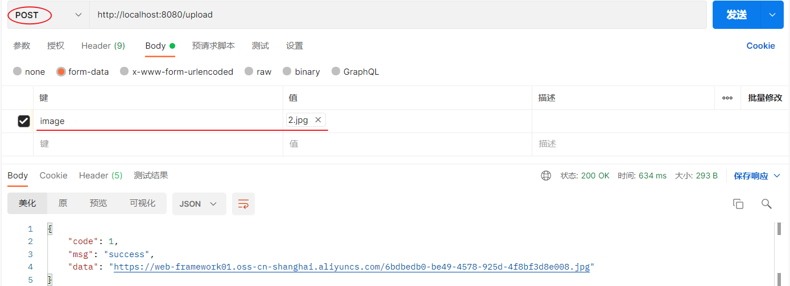

 


## 2. 配置文件

员工管理的增删改查功能我们已开发完成，但在我们所开发的程序中还一些小问题，下面我们就来分析一下当前案例中存在的问题以及如何优化解决。

### 2.1 参数配置化


在我们之前编写的程序中进行文件上传时，需要调用AliOSSUtils工具类，将文件上传到阿里云OSS对象存储服务当中。而在调用工具类进行文件上传时，需要一些参数：

- endpoint       //阿里云OSS域名
- accessKeyID    //用户身份ID
- accessKeySecret   //用户密钥
- bucketName      //存储空间的名字


关于以上的这些阿里云相关配置信息，我们是直接写死在java代码中了(硬编码)，如果我们在做项目时每涉及到一个第三方技术服务，就将其参数硬编码，那么在Java程序中会存在两个问题：

1. 如果这些参数发生变化了，就必须在源程序代码中改动这些参数，然后需要重新进行代码的编译，将Java代码编译成class字节码文件再重新运行程序。（比较繁琐）
2. 如果我们开发的是一个真实的企业级项目， Java类可能会有很多，如果将这些参数分散的定义在各个Java类当中，我们要修改一个参数值，我们就需要在众多的Java代码当中来定位到对应的位置，再来修改参数，修改完毕之后再重新编译再运行。（参数配置过于分散，是不方便集中的管理和维护）


为了解决以上分析的问题，我们可以将参数配置在配置文件中。如下：

~~~properties
#自定义的阿里云OSS配置信息
aliyun.oss.endpoint=https://oss-cn-hangzhou.aliyuncs.com
aliyun.oss.accessKeyId=LTAI4GCH1vX6DKqJWxd6nEuW
aliyun.oss.accessKeySecret=yBshYweHOpqDuhCArrVHwIiBKpyqSL
aliyun.oss.bucketName=web-tlias
~~~


在将阿里云OSS配置参数交给properties配置文件来管理之后，我们的AliOSSUtils工具类就变为以下形式：

~~~java
@Component
public class AliOSSUtils {
    /*以下4个参数没有指定值（默认值：null）*/
    private String endpoint;
    private String accessKeyId;
    private String accessKeySecret;
    private String bucketName;

    //省略其他代码...
}
~~~

> 而此时如果直接调用AliOSSUtils类当中的upload方法进行文件上传时，这4项参数全部为null，原因是因为并没有给它赋值。
>
> 此时我们是不是需要将配置文件当中所配置的属性值读取出来，并分别赋值给AliOSSUtils工具类当中的各个属性呢？那应该怎么做呢？


因为application.properties是springboot项目默认的配置文件，所以springboot程序在启动时会默认读取application.properties配置文件，而我们可以使用一个现成的注解：**@Value，获取配置文件中的数据。**

@Value 注解通常用于外部配置的属性注入，具体用法为： @Value("${配置文件中的key}")

~~~java
@Component
public class AliOSSUtils {
		// 注意别导错包了，是spring框架的，别导成lombok的了	
  
    @Value("${aliyun.oss.endpoint}")
    private String endpoint;
    
    @Value("${aliyun.oss.accessKeyId}")
    private String accessKeyId;
    
    @Value("${aliyun.oss.accessKeySecret}")
    private String accessKeySecret;
    
    @Value("${aliyun.oss.bucketName}")
    private String bucketName;
 	
 	//省略其他代码...
 }   
~~~


使用postman测试：


### 2.2 yml配置文件

前面我们一直使用springboot项目创建完毕后自带的application.properties进行属性的配置，那其实呢，在springboot项目当中是支持多种配置方式的，除了支持properties配置文件以外，还支持另外一种类型的配置文件，就是我们接下来要讲解的yml格式的配置文件。

- application.properties

  ```properties
  server.port=8080
  server.address=127.0.0.1
  ```

- application.yml 

  ```yml
  server:
    port: 8080
    address: 127.0.0.1
  ```

- application.yaml 

  ```yml
  server:
    port: 8080
    address: 127.0.0.1
  ```


> yml 格式的配置文件，后缀名有两种：
>
> - yml （推荐）
> - yaml

常见配置文件格式对比：

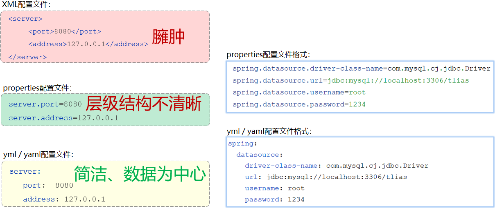

我们可以看到配置同样的数据信息，yml格式的数据有以下特点：

- 容易阅读
- 容易与脚本语言交互
- 以数据为核心，重数据轻格式


简单的了解过springboot所支持的配置文件，以及不同类型配置文件之间的优缺点之后，接下来我们就来了解下yml配置文件的基本语法：

- 大小写敏感
- 数值前边必须有空格，作为分隔符
- 使用缩进表示层级关系，缩进时，不允许使用Tab键，只能用空格（idea中会自动将Tab转换为空格）
- 缩进的空格数目不重要，只要相同层级的元素左侧对齐即可
- `#`表示注释，从这个字符一直到行尾，都会被解析器忽略


了解完yml格式配置文件的基本语法之后，接下来我们再来看下yml文件中常见的数据格式。在这里我们主要介绍最为常见的两类：

1. 定义对象或Map集合
2. 定义数组、list或set集合

对象/Map集合

```yml
user:
  name: zhangsan
  age: 18
  password: 123456
```

数组/List/Set集合

```yml
hobby: 
  - java
  - game
  - sport
```


熟悉完了yml文件的基本语法后，我们修改下之前案例中使用的配置文件，变更为application.yml配置方式：

1. 修改application.properties名字为：`_application.properties`（名字随便更换，只要加载不到即可）
2. 创建新的配置文件： `application.yml`

原有application.properties文件：

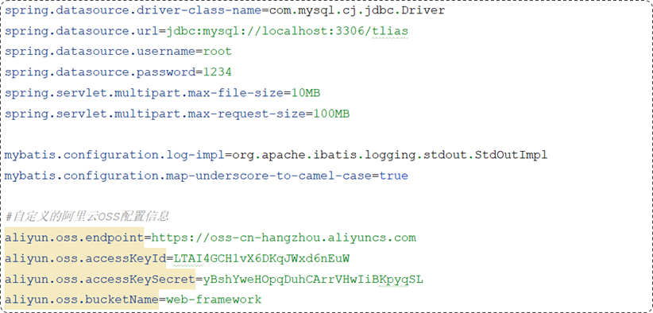

新建的application.yml文件：

~~~yaml
spring:
  datasource:
    driver-class-name: com.mysql.cj.jdbc.Driver
    url: jdbc:mysql://localhost:3306/tlias
    username: root
    password: 1234
  servlet:
    multipart:
      max-file-size: 10MB
      max-request-size: 100MB
      
mybatis:
  configuration:
    log-impl: org.apache.ibatis.logging.stdout.StdOutImpl
    map-underscore-to-camel-case: true
	
aliyun:
  oss:
    endpoint: https://oss-cn-hangzhou.aliyuncs.com
    accessKeyId: LTAI4GCH1vX6DKqJWxd6nEuW
    accessKeySecret: yBshYweHOpqDuhCArrVHwIiBKpyqSL
    bucketName: web-397
~~~


### 2.3 @ConfigurationProperties

讲解完了yml配置文件之后，最后再来介绍一个注解`@ConfigurationProperties`。在介绍注解之前，我们先来看一个场景，分析下代码当中可能存在的问题：


我们在application.properties或者application.yml中配置了阿里云OSS的四项参数之后，如果java程序中需要这四项参数数据，我们直接通过@Value注解来进行注入。这种方式本身没有什么问题问题，但是如果说需要注入的属性较多(例：需要20多个参数数据)，我们写起来就会比较繁琐。

那么有没有一种方式可以简化这些配置参数的注入呢？答案是肯定有，在Spring中给我们提供了一种简化方式，可以直接将配置文件中配置项的值自动的注入到对象的属性中。


Spring提供的简化方式套路：

1. 需要创建一个实现类，且实体类中的属性名和配置文件当中key的名字必须要一致

   > 比如：配置文件当中叫endpoints，实体类当中的属性也得叫endpoints，另外实体类当中的属性还需要提供 getter / setter方法

2. 需要将实体类交给Spring的IOC容器管理，成为IOC容器当中的bean对象

3. 在实体类上添加`@ConfigurationProperties`注解，并通过perfect属性来指定配置参数项的前缀

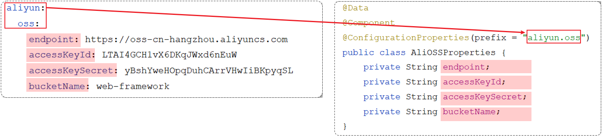


实体类：AliOSSProperties

~~~java
import lombok.Data;
import org.springframework.boot.context.properties.ConfigurationProperties;
import org.springframework.stereotype.Component;

/*阿里云OSS相关配置*/
@Data
@Component
@ConfigurationProperties(prefix = "aliyun.oss")
public class AliOSSProperties {
    //区域
    private String endpoint;
    //身份ID
    private String accessKeyId ;
    //身份密钥
    private String accessKeySecret ;
    //存储空间
    private String bucketName;
}
~~~


AliOSSUtils工具类：

~~~java
import com.aliyun.oss.OSS;
import com.aliyun.oss.OSSClientBuilder;
import org.springframework.beans.factory.annotation.Autowired;
import org.springframework.stereotype.Component;
import org.springframework.web.multipart.MultipartFile;
import java.io.IOException;
import java.io.InputStream;
import java.util.UUID;

@Component //当前类对象由Spring创建和管理
public class AliOSSUtils {

    //注入配置参数实体类对象
    @Autowired
    private AliOSSProperties aliOSSProperties;
   
    
    /**
     * 实现上传图片到OSS
     */
    public String upload(MultipartFile multipartFile) throws IOException {
        // 获取上传的文件的输入流
        InputStream inputStream = multipartFile.getInputStream();

        // 避免文件覆盖
        String originalFilename = multipartFile.getOriginalFilename();
        String fileName = UUID.randomUUID().toString() + originalFilename.substring(originalFilename.lastIndexOf("."));

        //上传文件到 OSS
        OSS ossClient = new OSSClientBuilder().build(aliOSSProperties.getEndpoint(),
                aliOSSProperties.getAccessKeyId(), aliOSSProperties.getAccessKeySecret());
        ossClient.putObject(aliOSSProperties.getBucketName(), fileName, inputStream);

        //文件访问路径
        String url =aliOSSProperties.getEndpoint().split("//")[0] + "//" + aliOSSProperties.getBucketName() + "." + aliOSSProperties.getEndpoint().split("//")[1] + "/" + fileName;

        // 关闭ossClient
        ossClient.shutdown();
        return url;// 把上传到oss的路径返回
    }
}

~~~


在我们添加上注解后，会发现idea窗口上面出现一个红色警告：

 

这个警告提示是告知我们还需要引入一个依赖：

~~~xml
<dependency>
    <groupId>org.springframework.boot</groupId>
    <artifactId>spring-boot-configuration-processor</artifactId>
</dependency>
~~~

当我们在pom.xml文件当中配置了这项依赖之后，我们重新启动服务，大家就会看到在properties或者是yml配置文件当中，就会提示阿里云 OSS 相关的配置项。所以这项依赖它的作用就是会自动的识别被`@Configuration Properties`注解标识的bean对象。


> 刚才的红色警告，已经变成了一个灰色的提示，提示我们需要重新运行springboot服务

@ConfigurationProperties注解我们已经介绍完了，接下来我们就来区分一下@ConfigurationProperties注解以及我们前面所介绍的另外一个@Value注解：

相同点：都是用来注入外部配置的属性的。

不同点：

- @Value注解只能一个一个的进行外部属性的注入。

- @ConfigurationProperties可以批量的将外部的属性配置注入到bean对象的属性中。


如果要注入的属性非常的多，并且还想做到复用，就可以定义这么一个bean对象。通过 configuration properties 批量的将外部的属性配置直接注入到 bin 对象的属性当中。在其他的类当中，我要想获取到注入进来的属性，我直接注入 bin 对象，然后调用 get 方法，就可以获取到对应的属性值了


